# 2024-08-20(수) BootStrap

- Bootstrap
    -Bootstrap 사용 가이드

- Reset CSS
- Bootstrap 활용
    - Typography
    - Colors
    - Component

- Semantic Web
    - Semantic in HTML
    - Semantic in CSS

- 참고
    - CDN 없이 사용하기

---


### `Bootstrap`

- `Bootstrap` : CSS 프론트엔드 프레임워크(Toolkit)
  
    - 미리 만들어진 다양한 디자인 요소들을 제공하여 웹 사이트를 빠르고 쉽게 개발할 수 있도록 함
- [The world most popular front-end open source](https://gitstar-ranking.com/repositories)

#### Bootstrap 사용해보기

1. [Bootstrap 공식 문서 접속](https://getbootstrap.com/)
2. Docs -> Introduction -> Quick start
3. ["Include Bootstrap's CSS and JS" 코드 확인 및 가져오기](https://getbootstrap.com/docs/5.3/getting-started/introduction/#quick-start)
    - head와 body에 bootstrap CDN이 포함된 코드 블록

--- 

### `CDN`

- `CDN(Content Delivery Network)` : 지리적 제약 없이 빠르고 안전하게 콘텐츠를 전송할 수 있는 전송 기술
    - 서버와 사용자 사이의 물리적인 거리를 줄여 콘텐츠 로딩에 소요되는 시간을 최소화(웹 페이지 로드 속도를 높임)
    - 지리적으로 사용자와 가까운 CDN 서버에 콘텐츠를 저장해서 사용자에게 전달

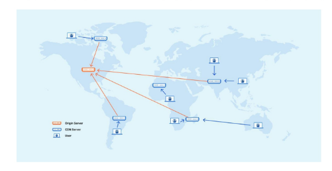

- `Bootstrap CDN`

    1. Bootstrap 홈페이지 - Download - "Complied CSS and JS" 다운로드
    2. CDN을 통해 가져오는 bootstrap css와 js 파일을 확인
    3. bootstrap.css, bootstrap.js 파일 참고
    - 온라인 CDN 서버에 업로드 된 css 및 js 파일을 불러와서 사용하는 것

--- 

### Bootstrap 사용 가이드

```CSS
<p class="mt-5">Hello, world!</p>
```

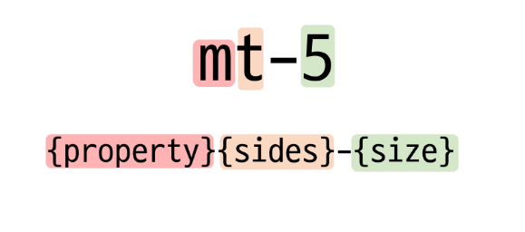

- {property}{sides}-{size}  

####  Bootstrap에서 클래스 이름으로 Spacing을 표현하는 방법

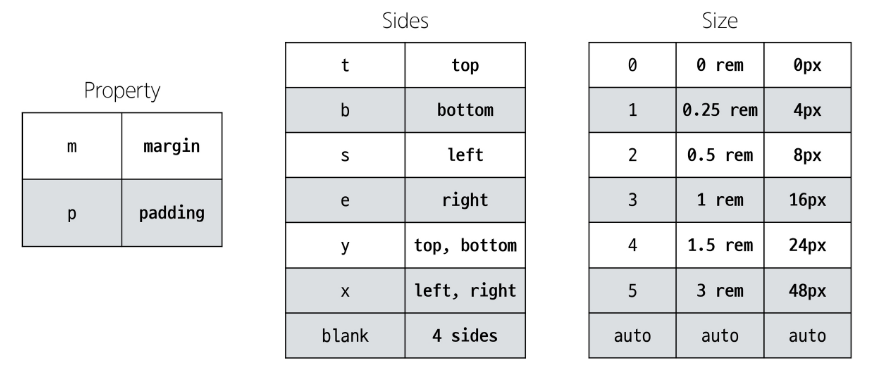

[링크](https://getbootstrap.com/docs/5.3/utilities/spacing/#margin-and-padding)

- **Bootstrap에는 특정한 규칙이 있는 클래스 이름으로 스타일 및 레이아웃이 미리 작성되어 있음**

--- 

### `Reset CSS`

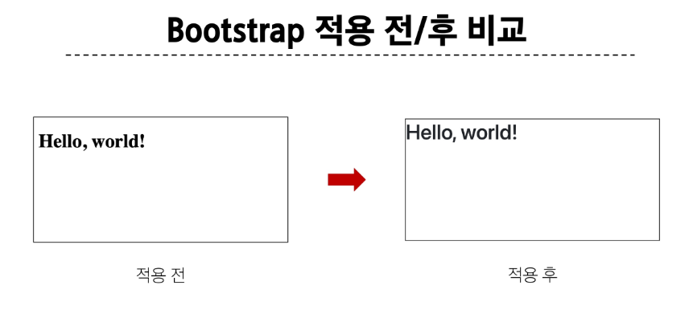


- `Reset CSS` : 모든 HTML 요소 스타일을 일관된 기준으로 재설정하는 간결하고 압축된 규칙 세트    
   - (HTML Element, Table, List등의 요소들에 일관성 있게 스타일을 적용시키는 기본 단계)

### Reset CSS 사용 배경

    - 모든 브라우저는 각자의 'user agent stylesheet'를 가지고 있음
        - 웹사이트를 보다 읽기 편하게 하기 위해
    - 문제는 이 설정이 브라우저마다 상이하다는 것
    - 모든 브라우저에서 웹사이트를 동일하게 보이게 만들어야 하는 개발자에겐 매우 골치 아픈 일
    - 모두 똑같은 스타일 상태로 만들고 스타일 개발을 시작하자!


### User-agent stylesheets

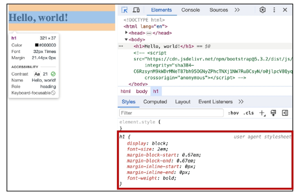

- 모든 문서에 기본 스타일을 제공하는 기본 스타일 시트


### Normalize CSS

    - Reset CSS 방법 중 대표적인 방법
    - 웹 표준 기준으로 브라우저 중 하나가 불일치 한다면 차이가 있는 브라우저를 수정하는 방법
        - 경우에 따라 IE 또는 EDGE 브라우저는 표준에 따라 수정할 수 없는 경우도 있는데, 이 경우에 IE 또는 EDGE의 스타일을 나머지 브라우저에 적용시킴

#### Bootstrap에서의 Reset CSS
    - bootstrap은 bootstrap-reboot.css라는 파일명으로 normalize.css를 자체적으로 커스텀해서 사용하고 있음

---

### `Bootstrap 활용`

#### Typography

- `Typography` : 제목, 본문 텍스트, 목록 등
  
- `Display headings` : 기존 Heading보다 더 눈에 띄는 제목이 필요할 경우(더 크고 약간 다른 스타일)

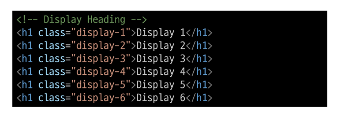

- Inline text elements : HTML inline 요소에 대한 스타일

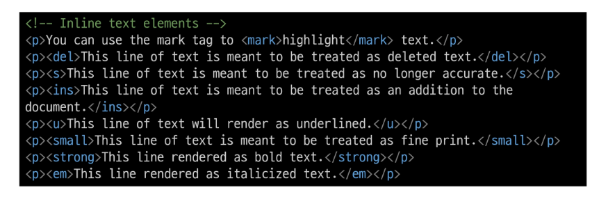

- Lists : HTML list 요소에 대한 스타일

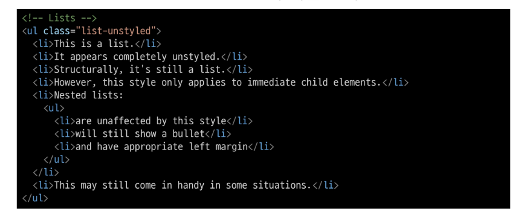

--- 

#### Colors

- `Bootstrap Color system` : Bootstrap이 지정하고 제공하는 색상 시스템

- `Colors` : Text, Border, Background 및 다양한 요소에 사용하는 Bootstrap의 색상 키워드


- Text colors

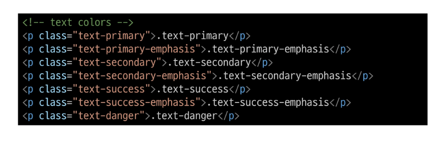

- Background colors

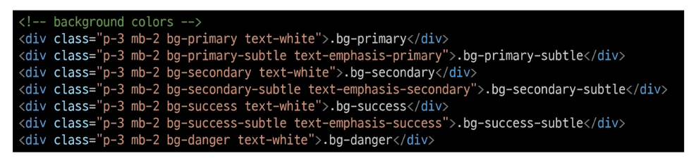

- Bootstrap 실습 : 너비와 높이가 각각 200px인 정사각형 작성하기(너비와 높이를 제외한)


--- 

### `Component`

- `Bootstrap Component` : Bootstrap에서 제공하는 *UI 관련 요소*(**버튼, 네비게이션 바, 카드, 폼, 드롭다운 등**)

- 대표 Component 사용해보기
    - `Alerts`
    - `Badges`
    - `Buttons`
    - **`Cards`**
    - **`Navbar`**

- Component 이점 : 일관된 디자인을 제공하여 웹 사이트의 구성 요소를 구축하는 데 유용하게 활용

--- 

### `Semantic Web`

- `Semantic Web` : 웹 데이터를 의미론적으로 구조화된 형태로 표현하는 방식


--- 

### Semantic in HTML

- HTML 요소가 의미를 가진다는 것
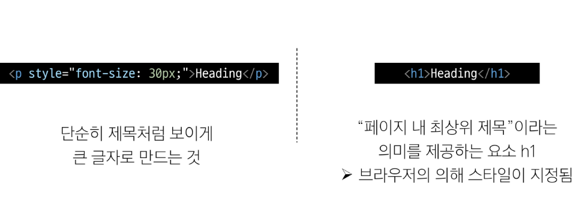

- HTML Semantic Element : 기본적인 모양과 기능 이외에 의미를 가지는 HTML 요소(검색엔진 및 개발자가 웹 페이지 콘텐츠를 이해하기 쉽도록)

- 대표적인 Semantic Element ( == div 기능 똑같음)
    - `header`
    - `nav`
    - `main`
    - `article`
    - `section`
    - `aside`
    - `footer`

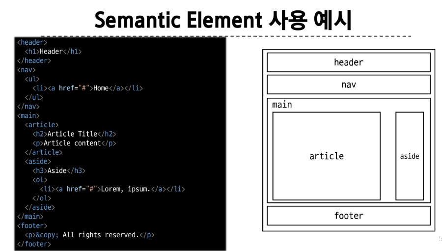

---

### Semantic in CSS

- `CSS 방법론` : CSS를 효율적이고 유지 보수가 용이하게 작성하기 위한 일련의 가이드라인

- OOCSS(Object Oriented CSS) : *객체 지향적 접근법*을 적용하여 CSS를 구성하는 방법론

- OOCSS 기본 원칙

    1. `*구조*와 *스킨*을 분리`

        - 구조와 스킨을 분리함으로써 재사용 가능성을 높임
        - 모든 버튼의 공통 구조를 정의 + 각각의 스킨(배경색과 폰트 색상)을 정의

    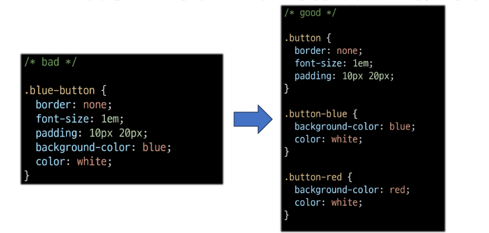

    2. `컨테이너와 콘텐츠를 분리`

        - 객체에 직접 적용하는 대신 객체를 둘러싸는 컨테이너에 스타일을 적용
        - 스타일을 정의할 때 위치에 의존적인 스타일을 사용하지 않도록 함
        - 콘텐츠를 다른 컨테이너로 이동시키거나 재배치할 때 스타일이 깨지는 것을 방지

    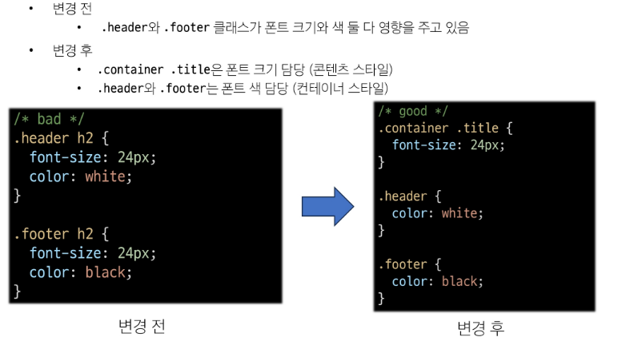


---


### `참고`
- Bootstrap을 사용하는 이유
    - 가장 많이 사용되는 CSS 프레임워크
    - 사전에 디자인된 다양한 컴포넌트 및 기능
        - 빠른 개발과 유지보수
    - 손쉬운 반응형 웹 디자인 구현
    - 커스터마이징(customizing)이 용이
    - 크로스 브라우징(Cross browsing) 지원
        - 모든 주요 브라우저에서 작동하도록 설계되어 있음

### CDN 없이 사용하기

- Bootstrap 코드 파일을 다운받아 활용

    1. Bootstrap 코드 파일 다운로드([링크](https://getbootstrap.com/docs/5.3/getting-started/download/))
    2. bootstrap.css와 bootstrap.bundle.js만 선택
    3. CSS 파일은 HTML head 태그에 가져와서 사용
    4. JS 파일은 HTML body 태그에 가져와서 사용
    - 파일 별 포함된 기능이 다르므로 [공식문서](https://getbootstrap.com/docs/5.3/getting-started/contents/)를 통해 확인

- 책임과 역할

    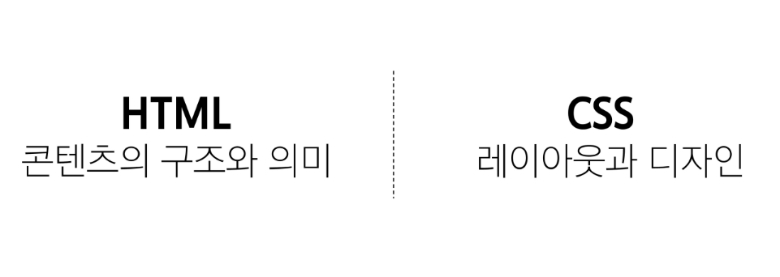

- 의미론적인 마크업이 필요한 이유

    - "검색엔진 최적화(SEO)"
        - 검색 엔진이 해당 웹 사이트를 분석하기 쉽게 만들어 검색 순위에 영향을 줌

    - "웹 접근성(Web Accessibility)"
        - 웹 사이트, 도구, 기술이 고령자나 장애를 가진 사용자들이 사용할 수 있도록 설계 및 개발하는 것
        - ex. 스크린 리더를 통해 전맹 시각장애 사용자에게 웹의 글씨를 읽어줌
        - [https://nuli.navercorp.com/](https://nuli.navercorp.com/)