# 2024년 10월 11일(금) 수업 내용 정리 - Many to one relationship 1

- Many to one relationships

  - 모델 관계
  - 댓글 모델 정의
  - 댓글 생성 연습

- 관계 모델 참조

  - 역참조

- 댓글 구현

  - 댓글 CREATE
  - 댓글 READ
  - 댓글 DELETE

- 참고

  - 데이터 무결성
  - admin site 댓글 등록
  - 댓글 추가 구현

## Many to one relationsiops

### 모델 관계

- Many to one relationships(N : 1 or 1 : N)

  - 한 테이블의 0개 이상의 레코드가 다른 테이블의 레코드 한 개와 관련된 관계

- Comment(N) - Article(1)

  - 0개 이상의 댓글(N)은 1개(1)의 게시글에 작성될 수 있다.

- 테이블 관계

  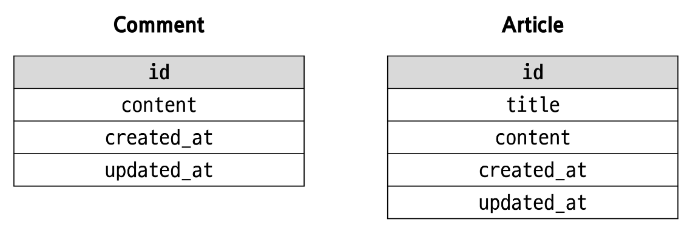

  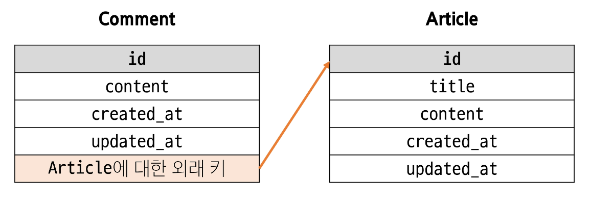

### 댓글 모델 정의

- ForeignKey()

  - 한 모델이 다른 모델을 참조하는 관계를 설정하는 필드

    - N : 1 관계 표현

    - 데이터베이스에서 외래 키로 구현

- 댓글 모델 정의

  - ForeignKey 클래스의 인스턴스는 이름은 참조하는 모델 클래스의 이름의 **단수형**으로 작성하는 것을 권장

  - 외래 키는 ForeignKey 클래스를 작성하는 위치와 관계없이 테이블의 마지막 필드로 생성됨

    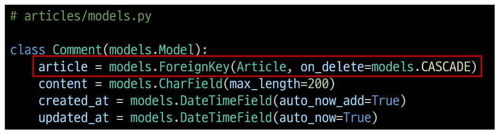

- ForeignKey(to, on_delete)

      - to

        - 참조하는 모델 class 이름

      - on_delete

        - 외래 키가 참조하는 객체(1)가 사라졌을 때,
          외래 키를 가진 객체(N)를 어떻게 처리할 지를 정의하는 설정(데이터 무결성)

- on_delete의 'CASCADE'

      - 참조 된 객체(부모 객체)가 삭제 될 때 이를 참조하는 모든 객체도 삭제되도록 지정

      - 기타 on_delete 설정 값 참고

        - https://docs.djangoproject.com/en/4.2/ref/models/fields/#arguments

- Migration 이후 댓글 테이블 확인

  - 댓글 테이블의 article_id 외래 키 필드 확인

  - 만들어 지는 필드 이름

    - '참조 대상 클래스 이름' + '_' + 'id'

  - 참조하는 클래스 이름의 소문자(단수형)로 작성하는 것이 권장 되었던 이유

    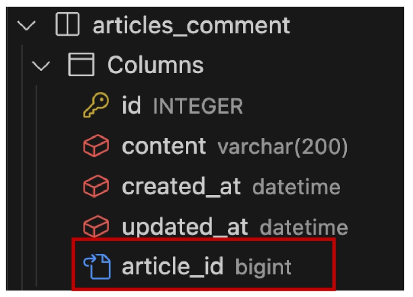

### 댓글 생성 연습

- 댓글 생성 연습

  - shell_plus 실행 및 게시글 작성

    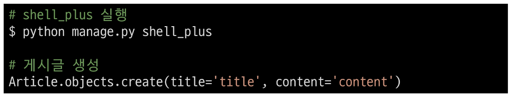

  - 댓글 생성

    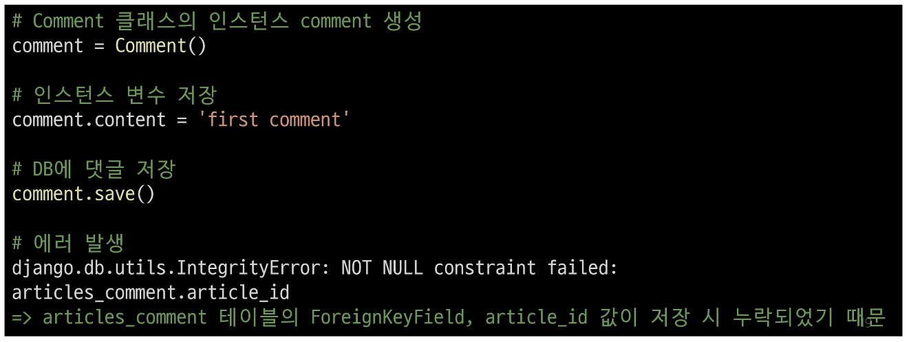

  - shell_plus 실행 및 게시글 작성

    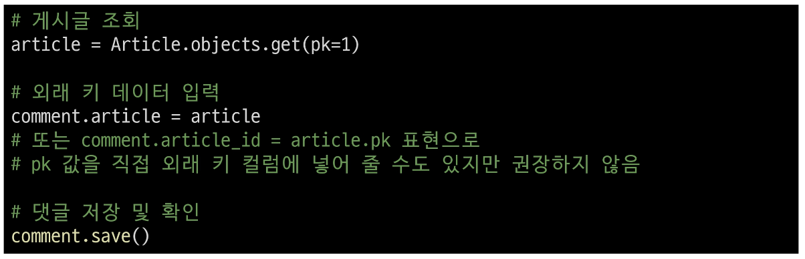

  - comment 인스턴스를 통한 article 값 참조하기

    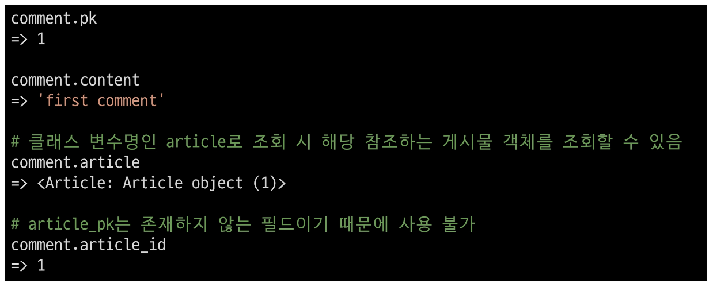

    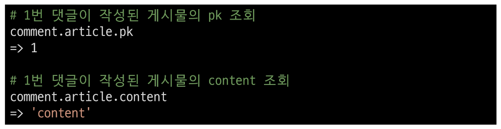

  - 두번째 댓글 생성

    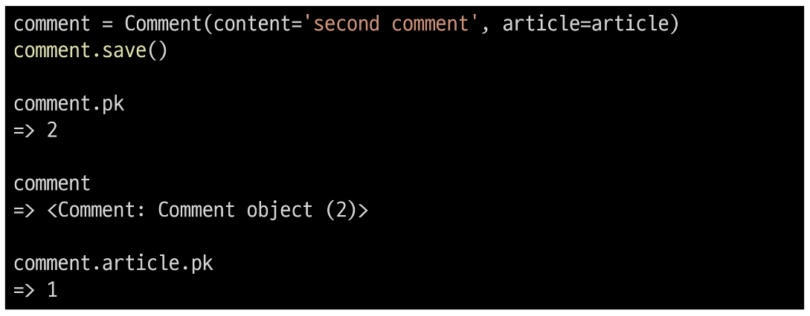

  - 작성된 댓글 데이터 확인

    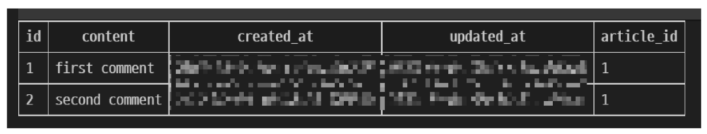

## 관계 모델 참조

### 역참조

- 역참조

      - N : 1 관계에서 1에서 N을 참조하거나 조회하는 것(1 → N)

      - 모델 간의 관계에서 관계를 정의한 모델(댓글)이 아닌,
        관계의 대상이 되는 모델(게시글)에서 연결된 객체들에 접근하는 방식

      ⇨ N은 외래 키를 가지고 있어 물리적으로 참조가 가능하지만,
        1은 N에 대한 참조 방법이 존재하지 않아 별도의 역참조 키워드가 필요

- 역참조 사용 예시

  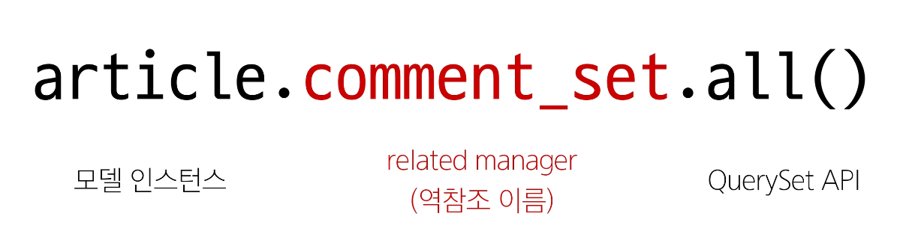

  - 특정 게시글에 작성된 댓글 전체를 조회하는 요청

- related manager

  - N : 1 혹은 M : N 관계에서 역참조 시에 사용하는 매니저

  - 'objects' 매니저를 통해 QuerySet API를 사용했던 것처럼 related manager를 통해 QuerySet API를 사용할 수 있게 됨

- related manager 이름 규칙

      - N : 1 관계에서 생성되는 Related manager의 이름은 "모델명_set" 형태로 자동 생성됨

        - 관계를 직접 정의하지 않은 모델(Article)에서 연결된 객체(Comment)들을 조회할 수 있게 함

      - 특정 댓글의 게시글 참조 (Comment → Article)

        - comment.article

      - 특정 게시글의 댓글 목록 참조 (Article → Comment)

        - article.comment_set.all()

- related manager 연습

  - shell_plus 실행 및 1번 게시글 조회

    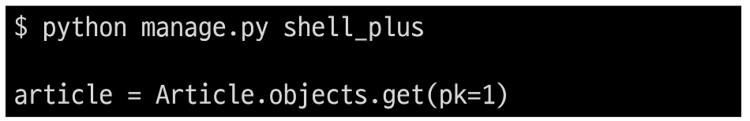

  - 1번 게시글에 작성된 모든 댓글 조회하기 (역참조)

    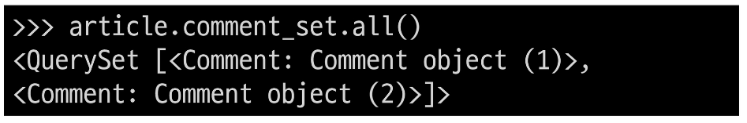

  - 1번 게시글에 작성된 모든 댓글 내용 출력

    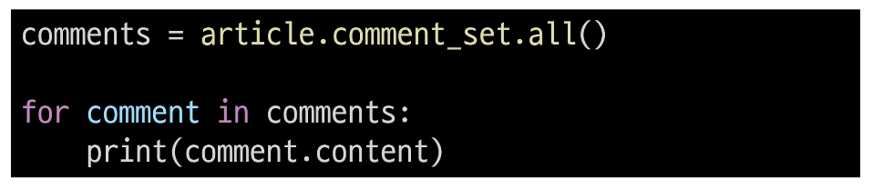

## 댓글 구현

### 댓글 CREATE

- 댓글 CREATE 구현

  - 사용자로부터 댓글 데이터를 입력 받기 위한 CommentForm 정의

    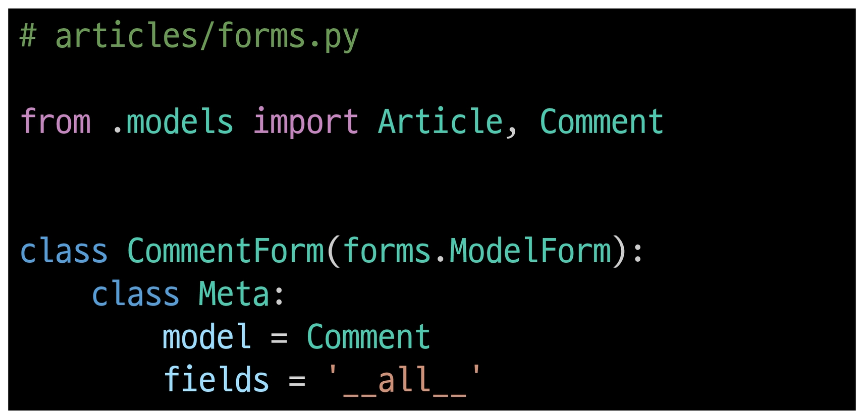

  - detail view 함수에서 CommentForm을 사용하여 detail 페이지에 렌더링

    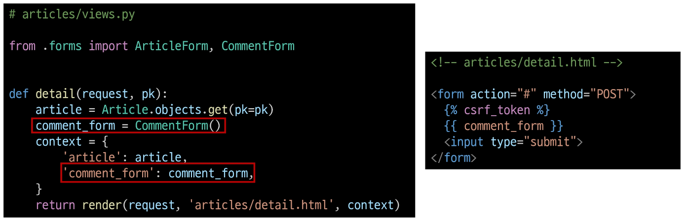

  - Comment 클래스의 외래 키 필드 article 또한 데이터 입력이 필요한 필드이기 때문에 출력되는 것

  - 하지만, 외래 키 필드 데이터는 **사용자로부터 입력 받는 값이 아닌 view 함수 내에서 다른 방법으로 전달 받아 저장**되어야 함

    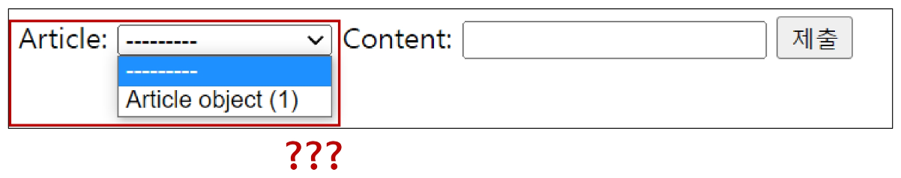

  - CommentForm의 출력 필드 조정하여 외래 키 필드가 출력되지 않도록 함

    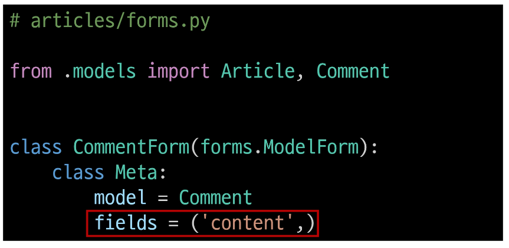

        - 출력에서 제외된 외래 키 데이터는 어디서 받아와야 할까?

        - detail 페이지의 URL을 살펴보면
          path('<int:pk>/', views.detail, name='detail')
          에서 해당 게시글의 pk 값이 사용 되고 있음

        - 댓글의 외래 키 데이터에 필요한 정보가 바로 게시글의 pk 값

  - url 작성 및 action 값 작성

    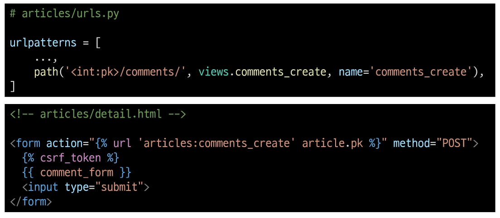

  - comments_create view 함수 정의

    - url로 받은 pk 인자를 게시글을 조회하는 데 사용

    

  - article 객체는 어떻게/언제 저장할 수 있을까?

    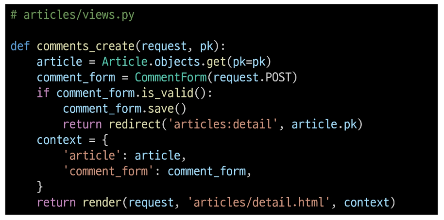

  - save(commit=False)

    - DB에 저장 요청을 보내지 않고 인스턴스만 반환(Create, but don't save the new instance.)

  - save의 commit 인자를 활용해 외래 키 데이터 추가 입력

    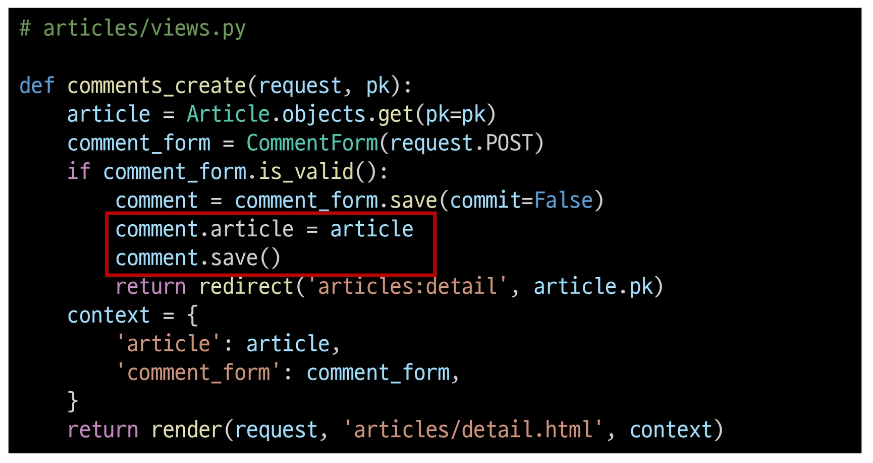

  - 댓글 작성 후 테이블 확인

    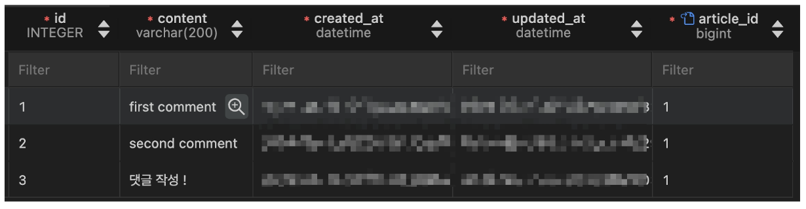

### 댓글 READ

- 댓글 READ 구현

  - detail view 함수에서 전체 댓글 데이터를 조회

    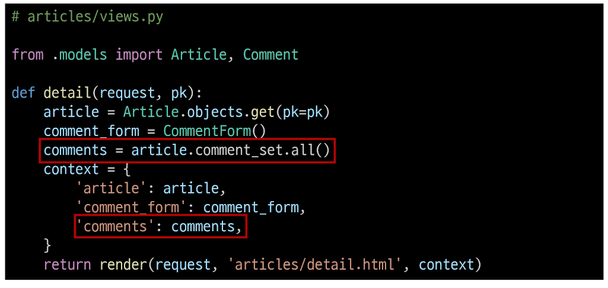

  - 전체 댓글 출력 및 확인

    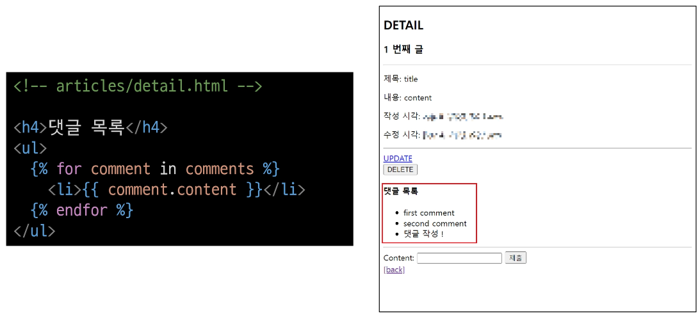

### 댓글 DELETE

- 댓글 DELETE 구현

  - 댓글 삭제 url 작성

    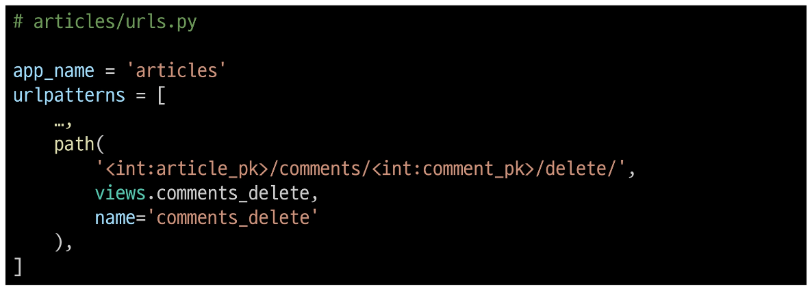

  - 댓글 삭제 view 함수 정의

    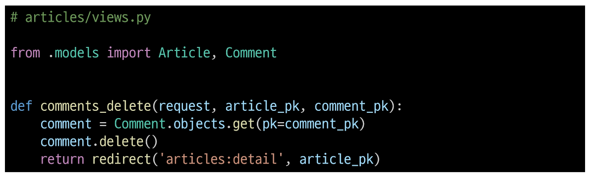

  - 댓글 삭제 버튼 작성

    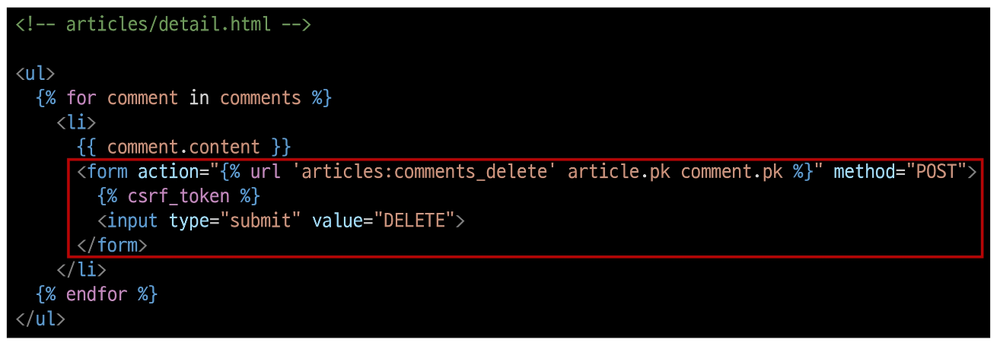

  - 댓글 삭제 버튼 출력 확인 및 삭제 테스트

    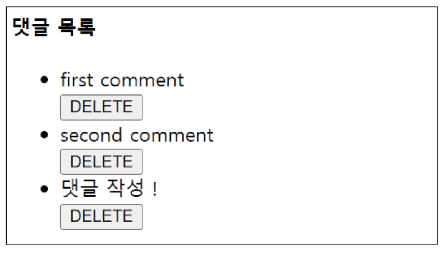

## 참고

### 데이터 무결성

- 데이터 무결성

      - 데이터베이스에 저장된 데이터의 정확성, 일관성, 유효성을 유지하는 것

      - 데이터베이스에 저장된 데이터 값의 정확성을 보장하는 것

      ⇨ 중요성

        1. 데이터의 신뢰성 확보

        2. 시스템 안정성

        3. 보안 강화

### admin site 댓글 등록

- admin site 등록

  - Comment 모델을 admin site에 등록해 CRUD 동작 확인하기

    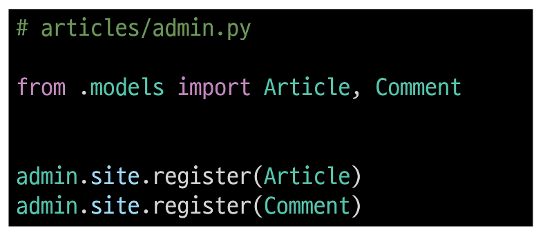

### 댓글 추가 구현

1. 댓글이 없는 경우 대체 콘텐츠 출력

  - DTL의 'for empty' 태그 활용

    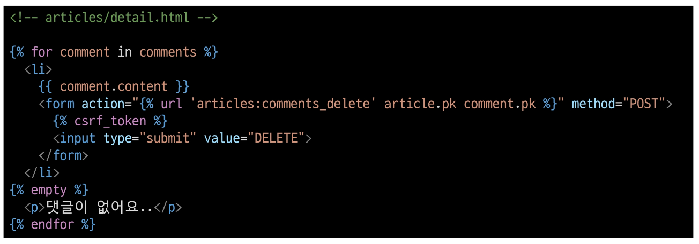

2. 댓글 개수 출력하기

  - DTL filter - 'length' 사용

    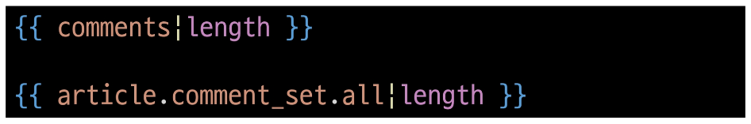

  - QuerySet API - 'count()' 사용

    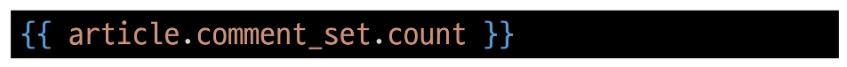