# 2024년 10월 15일(화) 수업 내용 정리 - Many to many relationships 2

- 팔로우 기능 구현

  - 프로필 페이지
  - 모델 관계 설정
  - 기능 구현

- Fixtures

  - dumpdata
  - loaddata

- Improve query

  - 사전 준비
  - annotate
  - select_related
  - prefetch_related
  - select_related & prefetch_related

- 참고

  - 'exists' method
  - 한꺼번에 dump 하기
  - loaddata 인코딩 에러

## 팔로우 기능 구현

### 프로필 페이지

- 프로필 페이지

      - 각 회원의 개인 프로필 페이지에 팔로우 기능을 구현하기 위해
        프로필 페이지를 먼저 구현하기

- 프로필 구현

  - url 작성

    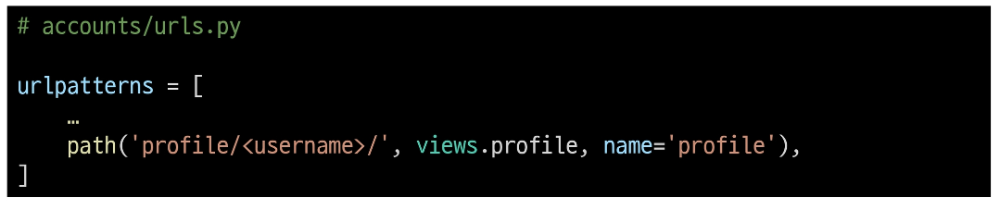

  - view 함수 작성

    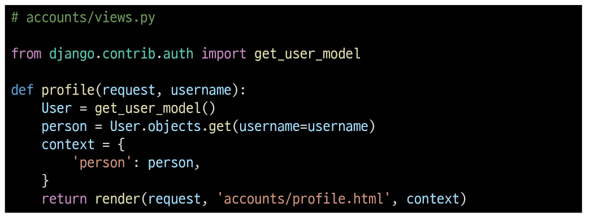

  - profile 템플릿 작성

    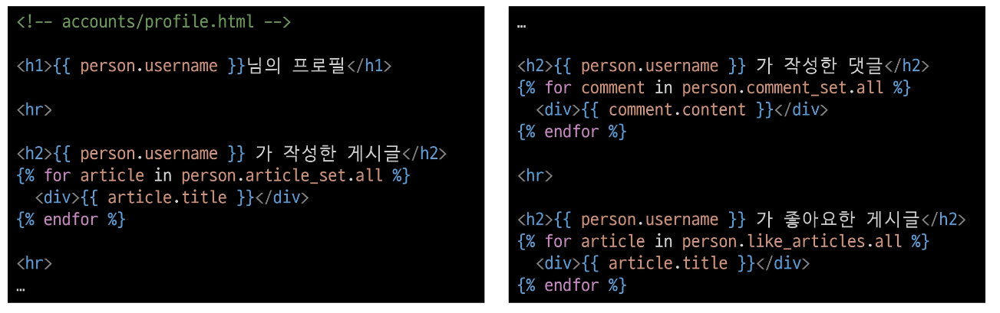

  - 프로필 페이지로 이동할 수 있는 링크 작성

    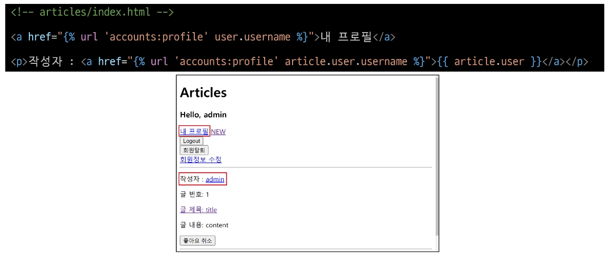

  - 프로필 페이지 결과 확인

    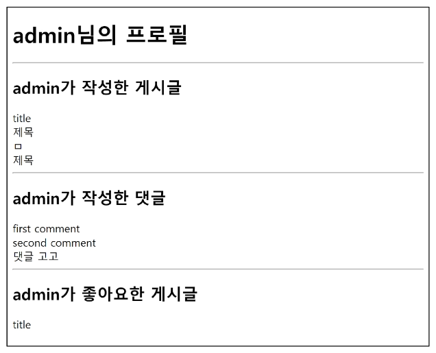

### 모델 관계 설정

- User(M) - User(N)

  - 0명 이상의 회원은 0명 이상의 회원과 관련

  - 회원은 0명 이상의 팔로워를 가질 수 있고, 0명 이상의 다른 회원들을 팔로잉 할 수 있음

- 모델 관계 설정

  - ManyToManyField 작성

    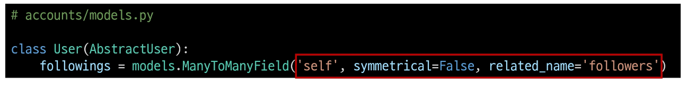

  - 참조

    - 내가 팔로우하는 사람들 (팔로잉, followings)

  - 역참조

    - 상대방 입장에서 나는 팔로워 중 한 명 (팔로워, followers)

  - **바뀌어도 상관 없으나 관계 조회 시 생각하기 편한 방향으로 정한 것**

  - Migrations 진행 후 중개 테이블 확인

    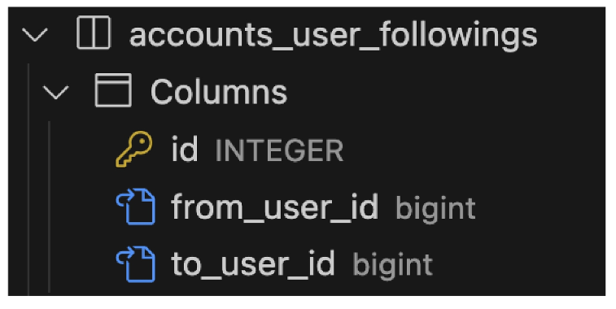

### 기능 구현

- 기능 구현

  - url 작성

    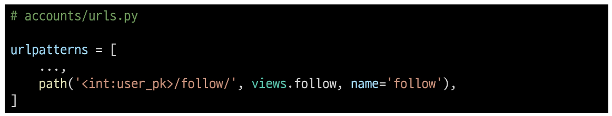

  - view 함수 작성

    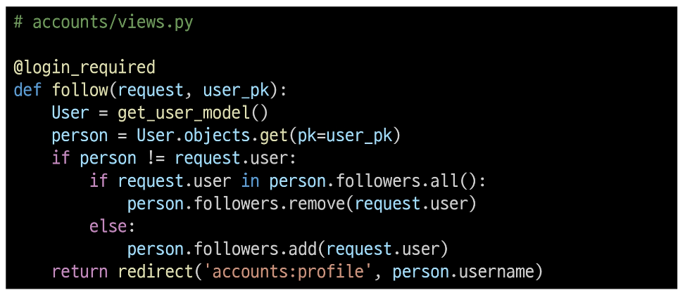

  - 프로필 유저의 팔로잉, 팔로워 수 & 팔로우, 언팔로우 버튼 작성

    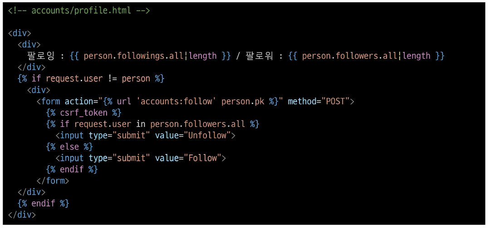

  - 팔로우 버튼 클릭 → 팔로우 버튼 변화 및 중개 테이블 데이터 확인

    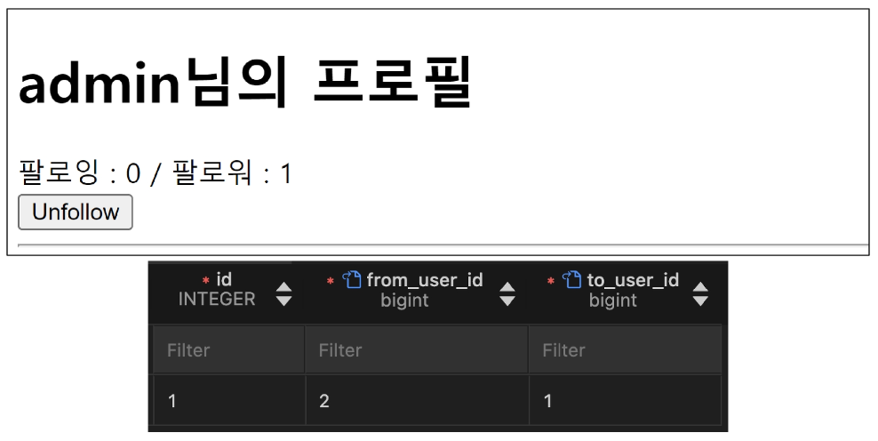

## Fixtures

- Fixtures

  - Django가 데이터베이스로 가져오는 방법을 알고 있는 데이터 모음

  - 데이터는 데이터베이스 구조에 맞추어 작성 되어있음

- 초기 데이터 제공

  - Fixtures의 사용 목적

- 초기 데이터의 필요성

      - 협업하는 유저 A, B가 있다고 생각해보기

        1. A가 먼저 프로젝트를 작업 후 원격 저장소에 push 진행

          - gitignore로 인해 DB는 업로드하지 않기 때문에 A가 생성한 데이터도 업로드 X

        2. B가 원격 저장소에서 A가 push한 프로젝트를 pull (혹은 clone)

          - 결과적으로 B는 DB가 없는 프로젝트를 받게 됨

      - 이처럼 프로젝트의 앱을 처음 설정할 때 동일하게 준비 된 데이터로 데이터베이스를 미리 채우는 것이 필요한 순간이 있음

      ⇨ Django에서는 fixtures를 사용해 앱에 초기 데이터(initial data)를 제공

- 사전 준비

      - M:N 까지 모두 작성된 Django 프로젝트에서 유저, 게시글, 댓글 등 각 데이터를 최소 2~3개 이상 생성해두기

- fixtures 관련 명령어

  |dumpdata|loaddata|
  |:--:|:--:|
  |생성(데이터 추출)|로드(데이터 입력)|
   

### dumpdata

- dumpdata

  - 데이터베이스의 모든 데이터를 추출

  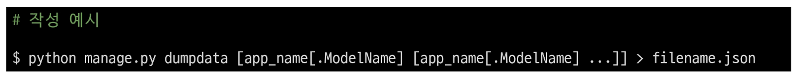

- dumpdata 활용

  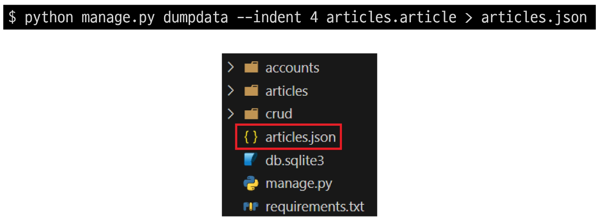

  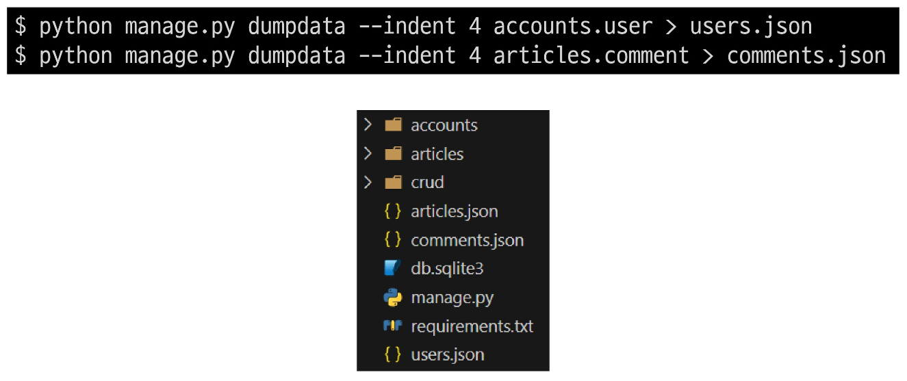

- Fixtures 파일을 직접 만들지 말 것

  - 반드시 dumpdata 명령어를 사용하여 생성

### loaddata

- loaddata

  - Fixtures 데이터를 데이터베이스로 불러오기

- Fixtures 파일 기본 경로

  - app_name/fixtures/

  - Django는 설치된 모든 app의 디렉토리에서 fixtures 폴더 이후의 경로로 fixtures 파일을 찾아 load

- loaddata 활용

  - db.sqlite3 파일 삭제 후 migrate 진행

    

  - load 진행 후 데이터가 잘 입력되었는지 확인

    

- loaddata 순서 주의사항

  - 만약 loaddata를 한번에 실행하지 않고 별도로 실행한다면 모델 관계에 따라 load 순서가 중요할 수 있음

    - comment는 article에 대한 key 및 user에 대한 key가 필요

    - article은 user에 대한 key가 필요

  - 즉, 현재 모델 관계에서는 user → article → comment 순으로 data를 load 해야 오류가 발생하지 않음

    

    

## Improve query

### 사전 준비

- Improve query

  - "query 개선하기"

  - 같은 결과를 얻기 위해 DB 측에 보내는 query 개수를 점차 줄여 조회하기

- 사전 준비

  - fixtures 데이터

    - 게시글 10개 / 댓글 100개 / 유저 5개

  - 모델 관계

    - N:1 - Article:User / Comment:Article / Comment:Article

    - N:M - Article:User

      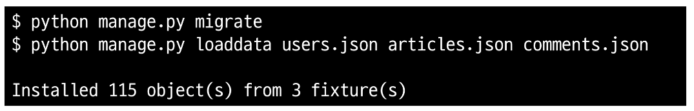

  - 서버 실행 후 확인

    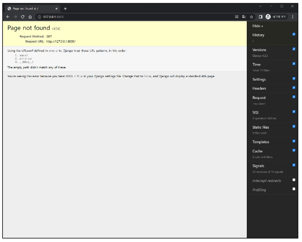

### annotate

- annotate

      - SQL의 GROUP BY를 사용

      - 쿼리셋의 각 객체에 계산된 필드를 추가

      - 집계 함수(Count, Sum 등)와 함께 자주 사용됨

- annotate 예시

  

  - 의미

    - 결과 객체에 'num_authors'라는 새로운 필드를 추가

    - 이 필드는각 책과 연관된 저자의 수를 계산

  - 결과

    - 결과에는 기존 필드와 함께 'num_authors' 필드를 가지게 됨

    - book.num_authors로 해당 책의 저자 수에 접근할 수 있게 됨

- 문제 상황

  - [http://127.0.0.1:8000/articles/index-1](http://127.0.0.1:8000/articles/index-1)

    - "11 queries including 10 similar"

      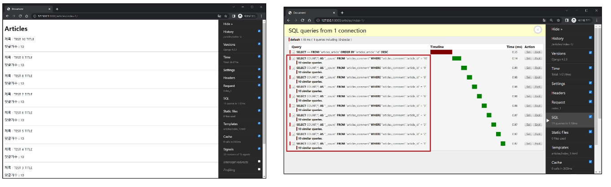

  - 문제 원인

    - 각 게시글마다 댓글 개수를 반복 평가

      

- annotate 적용

  - 문제 해결

    - 게시글을 조회하면서 **댓글 개수까지 한번에 조회**해서 가져오기

      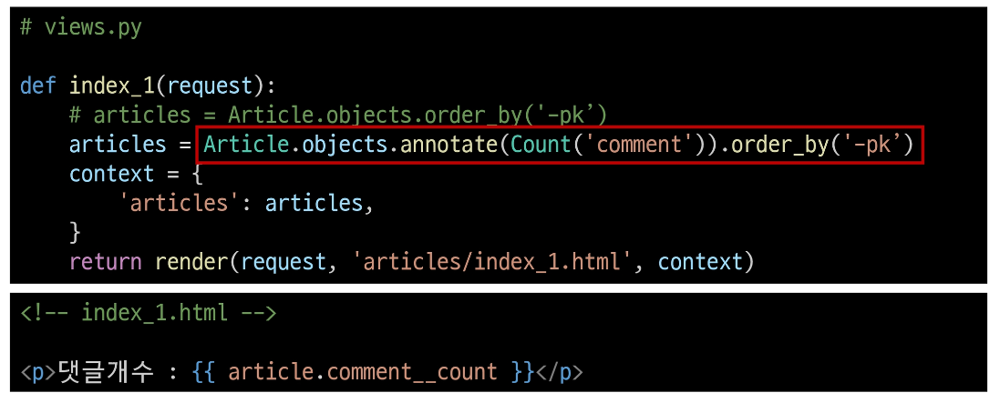

    - "11 queries including 10 similar" → **"1 query"**

      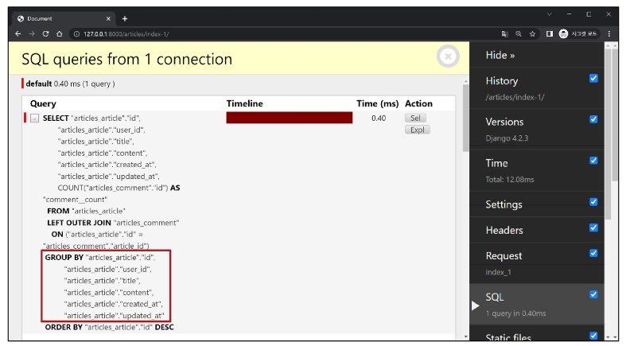

### select_related

- select_related

      - SQL의 INNER JOIN을 사용

      - 1:1 또는 N:1 참조 관계에서 사용

        - ForeignKey나 OneToOneField 관계에 대해 JOIN을 수행

      - 단일 쿼리로 관련 객체를 함께 가져와 성능을 향상

- select_related 예시

  

  - 의미

    - Book 모델과 연관된 Publisher 모델의 데이터를 함께 가져옴

    - ForeignKey 관계인 'publisher'를 JOIN하여 단일 쿼리 만으로 데이터를 조회

  - 결과

    - Book 객체를 조회할 때 연관된 Publisher 정보도 함께 로드

    - book.publisher.name과 같은 접근이 추가적인 데이터베이스 쿼리 없이 가능

- 문제 상황

  - [http://127.0.0.1:8000/articles/index-2/](http://127.0.0.1:8000/articles/index-2/)

    - "11 queries including 10 similar and 8 duplicates"

      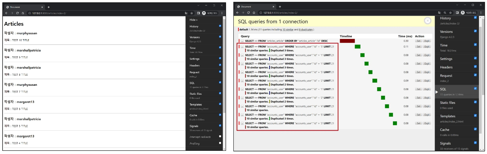

  - 문제 원인

    - 각 게시글마다 작성한 유저명까지 반복 평가

      

- select_related 적용

  - 문제 해결

    - 게시글을 조회하면서 **유저 정보까지 한번에 조회**해서 가져오기

      

    - "11 queries including 10 similar and 8 duplicates" → **"1 query"**

      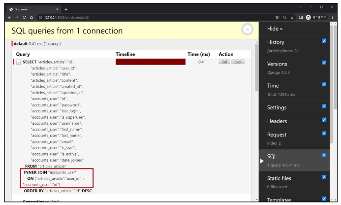
  

### prefetch_related

- prefetch_related

      - SQL이 아닌 Python을 사용한 JOIN을 진행

        - 관련 객체들을 미리 가져와 메모리에 저장하여 성능을 향상

      - M:N 또는 N:1 역참조 관계에서 사용

        - ManyToManyField나 역참조 관계에서 대해 별도의 쿼리를 실행

- prefetch_related 예시

  

  - 의미

    - Book과 Author는 ManyToMany 관계로 가정

    - Book 모델과 연관된 모든 Author 모델의 데이터를 미리 가져옴

    - Django가 별도의 쿼리로 Author 데이터를 가져와 관계를 설정

  - 결과

    - Book 객체들을 조회한 후, 연관된 모든 Author 정보가 미리 로드 됨

    - for author in book.authors.all()와 같은 반복이 추가적인 데이터베이스 쿼리 없이 실행됨

- 문제 상황

  - [http://127.0.0.1:8000/articles/index-3/](http://127.0.0.1:8000/articles/index-3/)

    - "11 queries including 10 similar"

      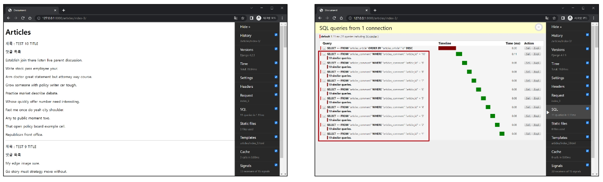

  - 문제 원인

    - 각 게시글 출력 후 게시글의 댓글 목록까지 개별적으로 모두 평가

      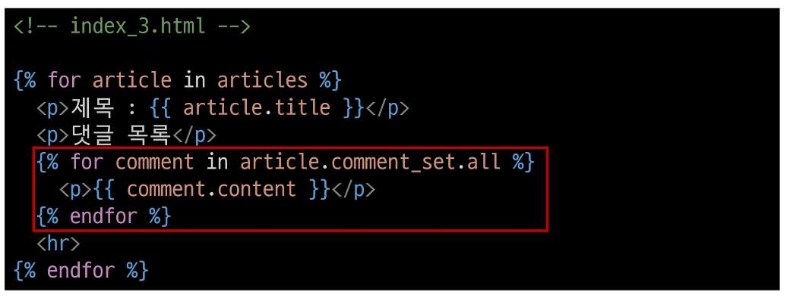

- prefetch_related 적용

  - 문제 해결

    - 게시글을 조회하면서 **참조된 댓글까지 한번에 조회**해서 가져오기

      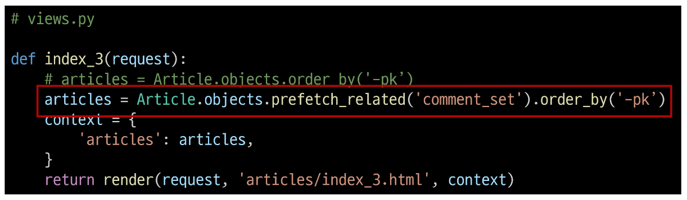

    - "11 queries including 10 similar" → **"2 queries"**

      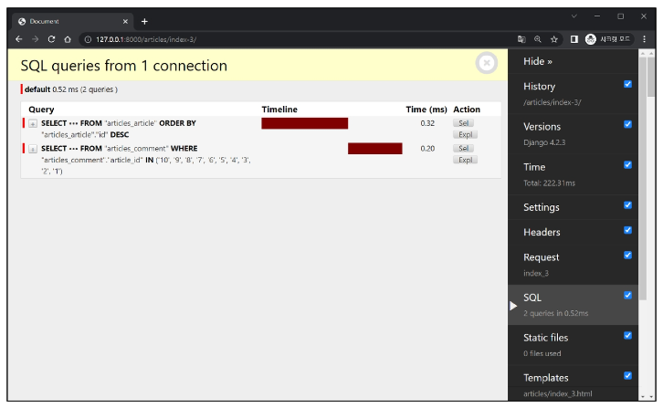

### select_related & prefetch_related

- 문제 상황

  - [http://127.0.0.1:8000/articles/index-4/](http://127.0.0.1:8000/articles/index-4/)

    - "111 queries including 110 similar and 100 duplicates"

      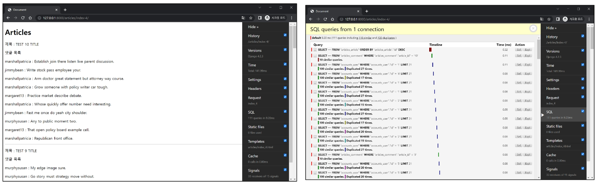

  - 문제 원인

    - "게시글" + "각 게시글의 댓글 목록" + "댓글의 작성자"를 단계적으로 평가

      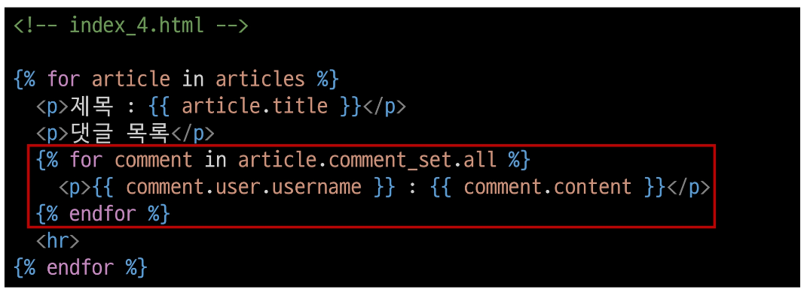

- prefetch_related 적용

  - 문제 해결 1단계

    - 게시글을 조회하면서 참조된 댓글까지 한번에 조회

      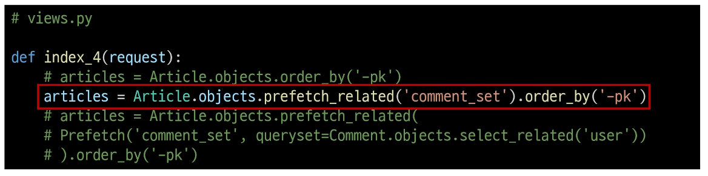

    - "111 queries including 110 similar and 100 duplicates" → **"102 queries including 100 similar and 100 duplicates"**

      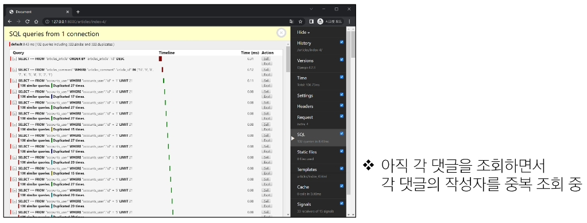

- select_related & prefetch_related 적용

  - 문제 해결 2단계

    - "게시글" + "각 게시글의 댓글 목록" + "댓글의 작성자"를 한번에 조회

      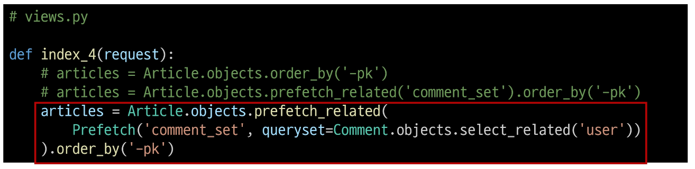

    - "102 queries including 100 similar and 100 duplicates" → **"2 queries"**

      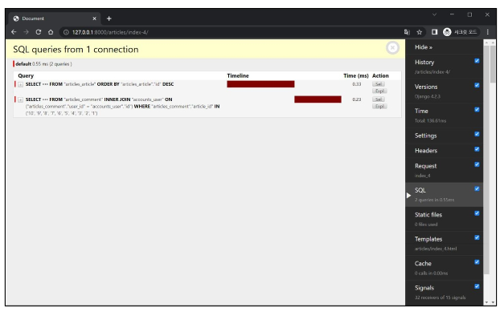

- 섣부른 최적화는 악의 근원

       "작은 효율성에 대해서는,
        말하자면 97% 정도에 대해서는, 잊어버려라.
        섣부른 최적화는 모든 악의 근원이다."
                    - 도널드 커누스(Donald E.Knuth)

## 참고

### 'exists' method

- .exists()

      - QuerySet에 결과가 하나 이상 존재하는지 여부를 확인하는 메서드

      - 결과가 포함되어 있으면 True를 반환하고
        결과가 포함되어 있지 않으면 False를 반환

- .exists() 특징

      - 데이터베이스에 최소한의 쿼리만 실행하여 효율적

      - 전체 QuerySet을 평가하지 않고 결과의 존재 여부만 확인

      ⇨ 대량의 QerySet에 있는 특정 객체 검색에 유용

- exists 적용 예시

  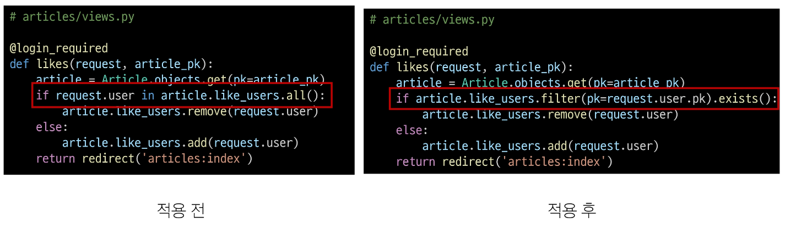

  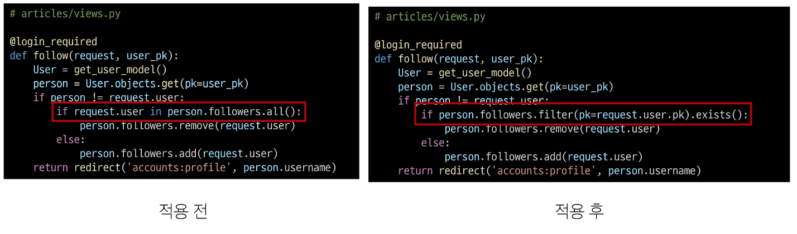

### 한꺼번에 dump 하기

- 모든 모델을 한꺼번에 dump 하기

  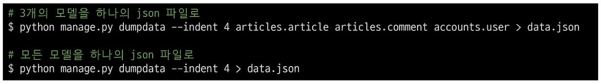
  

### loaddata 인코딩 에러

- loaddata 시 encoding codec 관련 에러가 발생하는 경우

  - 2가지 방법 중 택 1

    1. dumpdata 시 추가 옵션 작성

        

    2. 메모장 활용

        1. 메모장으로 json 파일 열기

        2. "다른 이름으로 저장" 클릭

        3. 인코딩을 UTF8로 선택 후 저장