# 2024년 10월 23일(수) 수업 내용 정리 - References Type 1

- 함수

  - 함수 정의
  - 매개변수
  - Spread syntax
  - 화살표 함수 표현식

- 참고

  - 화살표 함수 심화

## 함수

- Function

  - 참조 자료형에 속하며 모든 함수는 **Function** object

  |원시 자료형 (Primitive type)|참조 자료형 (Reference Type)|
  |:--:|:--:|
  |Number, String, Boolean null, undefined|Objects (Object, Array, Function)|
  |변수에 값이 직접 저장되는 자료형 (불변, 값이 복사)|객체의 주소가 저장되는 자료형 (가변, 주소가 복사)|
   

### 함수 정의

- 함수 구조

  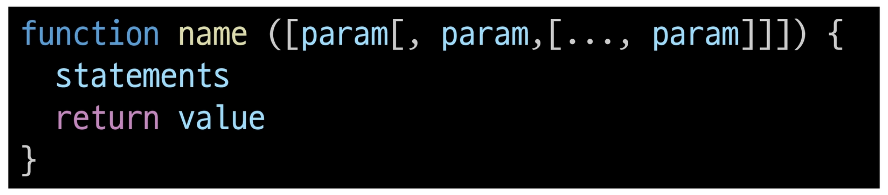

  - function 키워드

  - 함수의 이름

  - 함수의 매개변수

  - 함수의 body를 구성하는 statements

  - return 값이 없다면 undefined를 반환

- 함수 정의 2가지 방법

  |선언식 (function declaration)|표현식 (function expression)|
  |:--:|:--:|
  |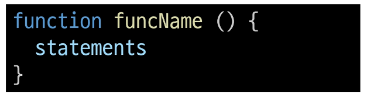|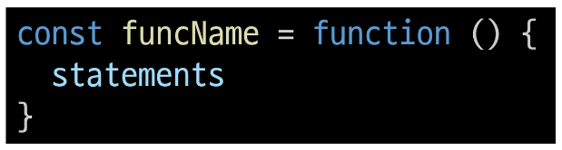|
  |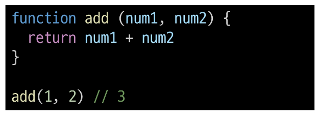|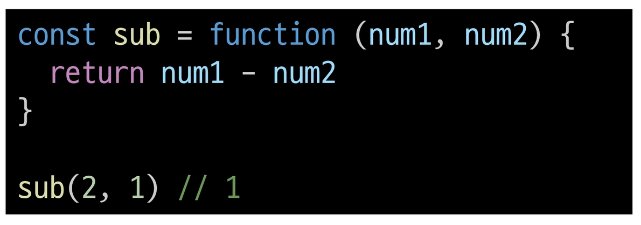|
   

- 함수 선언식 특징

  - 호이스팅 됨
  
  - 코드의 구조와 가독성 면에서 표현식에 비해 장점이 있음

    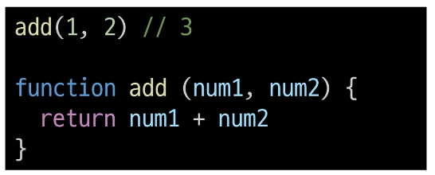

- 함수 표현식 특징

  - 호이스팅 되지 않음

    - 변수 선언만 호이스티오디고 함수 할당은 실행 시점에 이루어짐

  - 함수 이름이 없는 '익명 함수'를 사용할 수 있음

    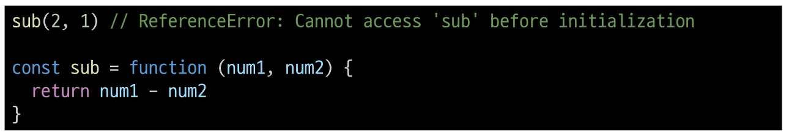

- 함수 표현식 사용을 권장하는 이유

  - 예측 가능성

    - 호이스팅의 영향을 받지 않아 코드의 실행 흐름을 더 명확하게 예측할 수 있음

  - 유연성

    - 변수에 할당되므로 함수를 값으로 다루기 쉬움

  - 스코프 관리

    - 블록 스코프를 가지는 **let**이나 **const**와 함께 사용하여 더 엄격한 스코프 관리가 가능

### 매개변수

- 매개변수 정의 방법

      1. 기본 함수 매개변수

      2. 나머지 매개변수

#### 1. 기본 함수 매개변수 (Default function parameter)

- 전달하지 않은 인자가 없거나 undefined가 전달될 경우 이름 붙은 매개변수를 기본값으로 초기화

  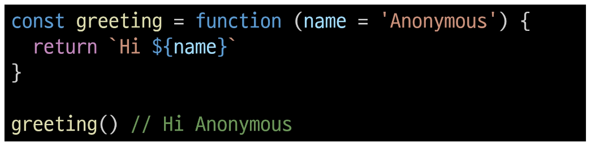

#### 2. 나머지 매개변수

- 임의의 수의 인자를 '배열'로 허용하여 가변 인자를 나타내는 방법

- 작성 규칙

  - 함수 정의 시 나머지 매개변수는 하나만 작성할 수 있음

  - 나머지 매개변수는 함수 정의에서 매개변수 마지막에 위치해야 함

    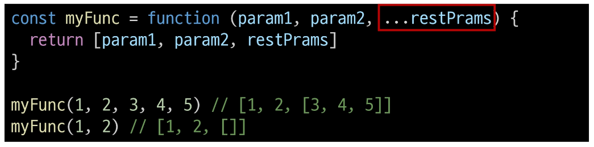

- 매개변수와 인자 개수가 불일치할 때

  - 매개변수 개수 > 인자 개수

  - 누락된 인자는 undefined로 할당

    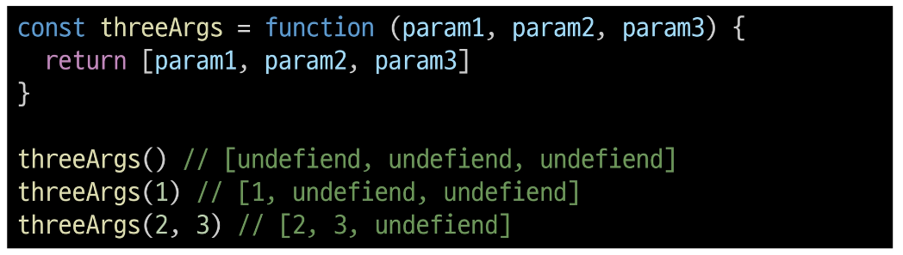

  - 매개변수 개수 < 인자 개수

  - 초과 입력한 인자는 사용하지 않음

    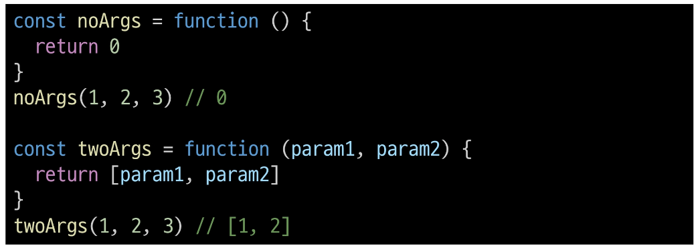

### Spread syntax

- '...' (Spread syntax)

  - 전개 구문

- 전개 구문

  - 배열이나 문자열과 같이 반복 가능한 항목을 펼치는 것 (확장, 전개)

  - 전개 대상에 따라 역할이 다름

    - 배열이나 객체의 요소를 개별적인 값으로 분리하거나 다른 배열이나 객체의 요소를 현재 배열이나 객체에 추가하는 등

- 전개 구문 활용처

  1. 함수와의 사용

      - 함수 호출 시 인자 확장

        - 인자 확장 (함수 호출 시)

          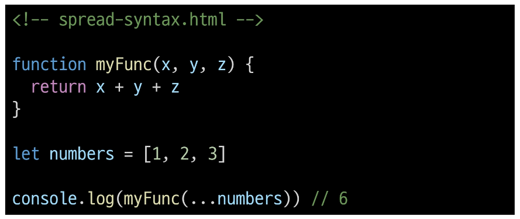

      - 나머지 매개변수 (압축)

        - 함수 선언 시

          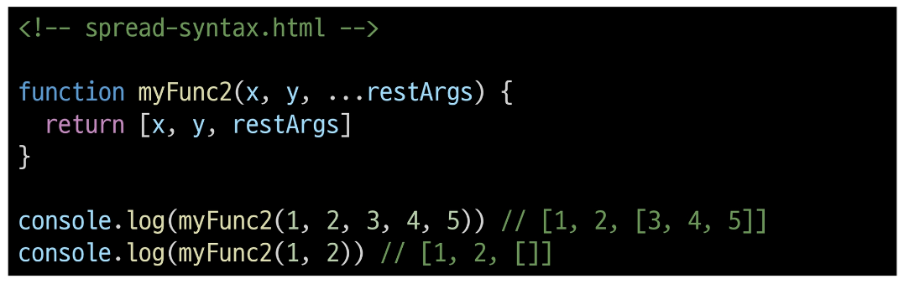

  2. 객체와의 사용 (객체 파트에서 진행)

  3. 배열과의 활용 (배열 파트에서 진행)

### 화살표 함수 표현식

- 화살표 함수 표현식(Arrow function expressions)

  - 함수 표현식의 간결한 표현법

- 화살표 함수로 변경 결과
  
  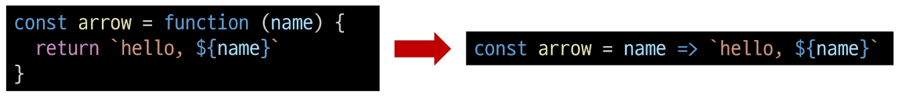

- 화살표 함수 작성 과정

  1. function 키워드 제거 후 매개변수와 중괄호 사이에 화살표(**=>**) 작성

    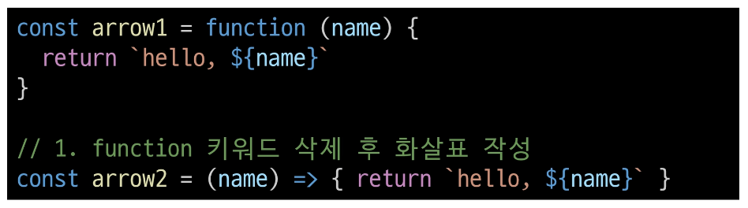

  2. 함수의 매개변수가 하나 뿐이라면, 매개변수의 '**()**' 제거 가능(단, 생략하지 않는 것을 권장)

    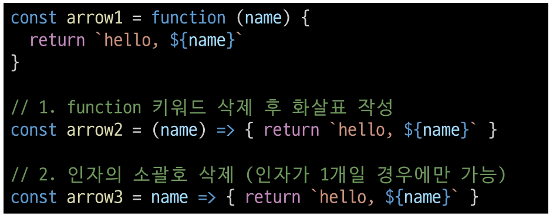

  3. 함수 본문의 표현식이 한 줄이라면, '**{}**'와 '**return** 제거 가능

    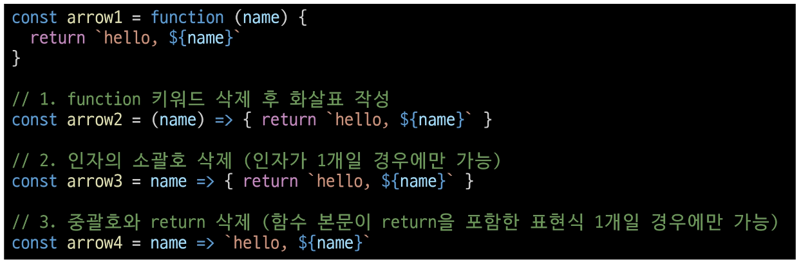

## 참고

### 화살표 함수 심화

- 화살표 함수 심화

  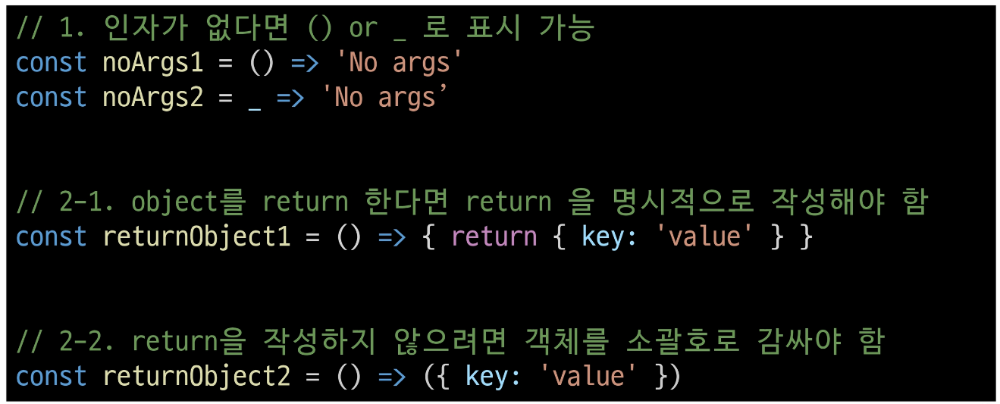