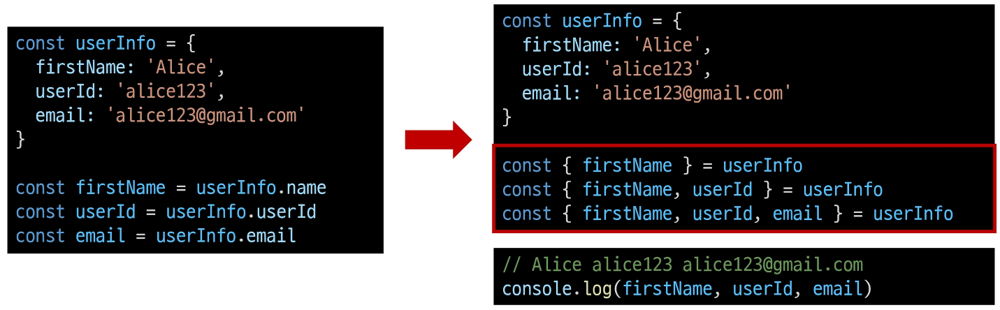

# 2024년 10월 24일(목) 수업 내용 정리 - References Type 2

- 객체

  - 구조 및 속성
  - 메서드
  - this
  - 추가 객체 문법
  - JSON

- 참고

  - 클래스

## 객체

- Object

  - 키로 구분된 데이터 집합(data collection)을 저장하는 자료형

### 구조 및 속성

- 객체 구조

  - 중괄호 ('{}')를 이용해 작성

  - 중괄호 안에는 **key: value** 쌍으로 구성된 속성(property)를 여러 개 작성 가능

  - key는 문자형만 허용

  - value는 모든 자료형 허용

    

- 속성 참조

  - 점('.', chaining operator) 또는 대괄호('[]')로 객체 요소 접근

  - key 이름에 띄어쓰기 같은 구분자가 있으면 대괄호 접근만 가능

    

    

- 'in' 연산자

  - 속성이 객체에 존재하는지 여부를 확인

    

### 메서드

- Method

  - 객체 속성에 정의된 함수

- Method 사용 예시

  - object.method() 방식으로 호출

  - 메서드는 객체를 '행동'할 수 있게 함

    

### this

- Method

  - 객체 속성에 정의된 함수

  - **'this'** 키워드를 사용해 객체에 대한 특정한 작업을 수행할 수 있음

- 'this' keyword

  - 함수나 메서드를 호출한 객체를 가리키는 키워드

  - 함수 내에서 객체의 속성 및 메서드에 접근하기 위해 사용

- Method & this 사용 예시

  

- JavaScript에서 this는 함수를 **호출하는 방법**에 따라 가리키는 대상이 다름

  |호출 방법|대상|
  |:--:|:--:|
  |단순 호출|전역 객체|
  |메서드 호출|메서드를 호출한 객체|
   

1. 단순 호출 시 this

    - 가리키는 대상 ⇒ 전역 객체

      

2. 메서드 호출 시 this

    - 가리키는 대상 ⇒ 메서드를 호출한 객체

      

- 중첩된 함수에서의 this 문제점과 해결책

  

- JavaScript 'this' 정리

  - JavaScript의 함수는 호출될 때 this를 암묵적으로 전달 받음

  - JavaScript에서 this는 함수가 "호출되는 방식"에 따라 결정되는 현재 객체를 나타냄

  - Python의 self와 Java의 this가 선언 시 이미 값이 정해지는 것에 비해 JavaScript의 this는 **함수가 호출되기 전까지 값이 할당되지 않고 호출 시에 결정**됨 (동적 할당)

  - this가 미리 정해지지 않고 호출 방식에 의해 결정되는 것은

  - 장점

    - 함수(메서드)를 하나만 만들어 여러 객체에서 재사용할 수 있다는 것

  - 단점

    - 이런 유연함이 실수로 이어질 수 있다는 것

  - 개발자는 this의 동작 방식을 충분히 이해하고 장점을 취하면서 실수를 피하는 데에 집중

### 추가 객체 문법

1. 단축 속성

    - 키 이름과 값으로 쓰이는 변수의 이름이 같은 경우 단축 구문을 사용할 수 있음

      

2. 단축 메서드

    - 메서드 선언 시 function 키워드 생략 가능

      

3. 계산된 속성(computed property name)

    - 키가 대괄호([])로 둘러싸여 있는 속성

    - 고정된 값이 아닌 변수 값을 사용할 수 있음

      

4. 구조 분해 할당(destructing assignment)

    - 배열 또는 객체를 분해하여 객체 속성을 변수에 쉽게 할당할 수 있는 문법

      

    - 구조 분해 할당 활용

      - '함수의 매개변수'로 객체 구조 분해 할당 활용 가능

        

5. Object with '전개 구문'

    - "객체 복사"

      - 객체 내부에서 객체 전개

    - 얕은 복사에 활용 가능

      

6. 유용한 객체 메서드

    - Object.keys()

    - Object.values()

      

7. Optional chaining ('**?.**')

    - 속성이 없는 중첩 객체를 에러 없이 접근할 수 있는 방법

    - 만약 참조 대상이 null 또는 undefined라면 에러가 발생하는 것 대신 평가를 멈추고 undefined를 반환

      

    - 만약 Optional chaining을 사용하지 않는다면 다음과 같이 '&&' 연산자를 사용해야 함

      

    - 장점

      - 참조가 누락될 가능성이 있는 경우 연결된 속성으로 접근할 때 더 짧고 간단한 표현식을 작성할 수 있음

      - 어떤 속성이 필요한지에 대한 보증이 확실하지 않는 경우에 객체의 내용을 보다 편리하게 탐색할 수 있음

    - 주의 사항

      1. Optional chaining은 존재하지 않아도 괜찮은 대상에만 사용해야 함 (남용 X)

          - 왼쪽 평가대상이 없어도 괜찮은 경우에만 선택적으로 사용

          - 중첩 객체를 에러 없이 접근하는 것이 사용 목적이기 때문

            

      2. Optional chaining 앞의 변수는 반드시 선언되어 있어야 함

          

- Optional chaining 정리

  1. obj?.prop

      - obj가 존재하면 obj.prop을 반환하고, 그렇지 않으면 undefined를 반환

  2. obj?.[prop]

      - obj가 존재하면 obj[prop]을 반환하고, 그렇지 않으면 undefined를 반환

  3. obj?.method()

      - obj가 존재하면 obj.method()를 호출하고, 그렇지 않으면 undefined를 반환

      
### JSON

- JSON

  - "JavaScripot Object Notation"

  - Key-Value 형태로 이루어진 자료 표기법

  - JavaScript의 Object와 유사한 구조를 가지고 있지만 JSON은 형식이 있는 **"문자열"**

  - JavaScript에서 JSON을 사용하기 위해서는 Object 자료형으로 변경해야 함

- Object ↔ JSON 변환하기

  
  

## 참고

### 클래스

- 클래스의 필요성

  - JS에서 객체를 하나 생성한다고 한다면?

    - 하나의 객체를 선언하여 생성

  - 동일한 형태의 객체를 또 만든다면?

    - 또 다른 객체를 선언하여 생성해야 함

  - 불편한데... 좋은 방법이 없을까..?

    

- 클래스

  - 객체를 생성하기 위한 템플릿

  - 객체의 속성, 메서드를 정의하는 청사진 역할

- 클래스 기본 문법

  1. class 키워드

  2. 클래스 이름

  3. 생성자 메서드

      - constructor()

    

- 클래스 특징

  - ES6에서 도입

  - 생성자 함수를 사용하여 객체를 생성하는 이전의 방식을 객체 지향적으로 표현하고자 만들어짐

  - 그래서 클래스는 내부적으로 생성자 함수를 기반으로 동작함

    

- 클래스 활용

  

- 'new' 연산자

  - 클래스나 생성자 함수를 사용하여 새로운 객체를 생성

- 'new' 연산자 특징

  

  - 클래스의 constructor()는 new 연산자에 의해 자동으로 호출되며 특별한 절차 없이 객체를 초기화 할 수 있음

  - new 없이 클래스를 호출하면 TypeError 발생