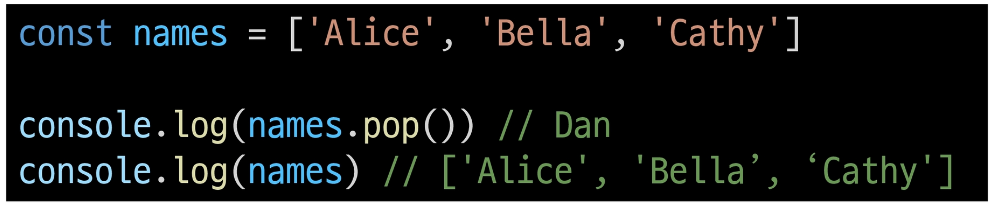
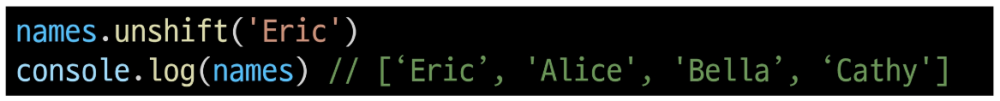
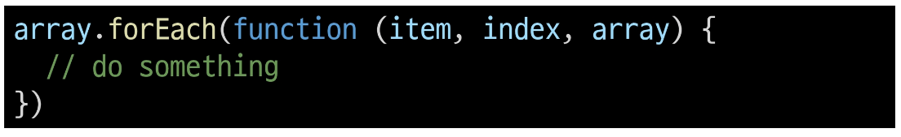
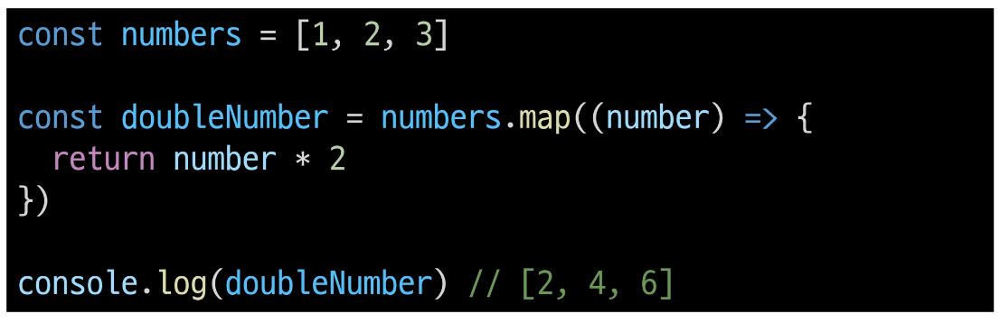
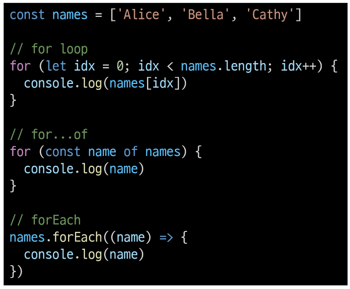
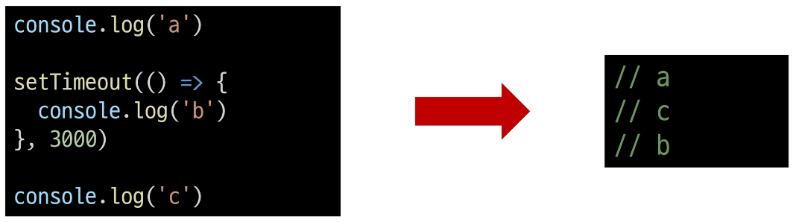
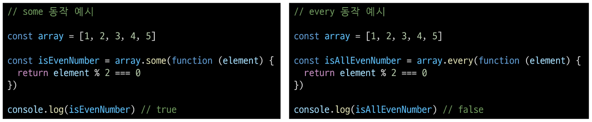
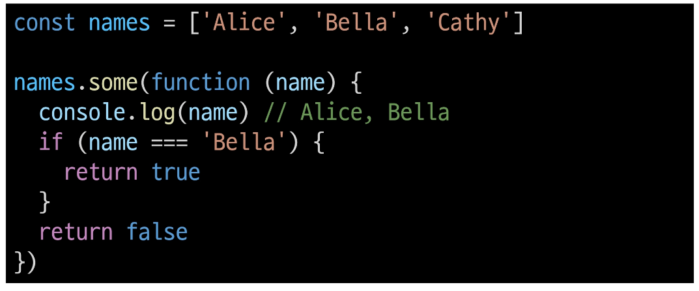
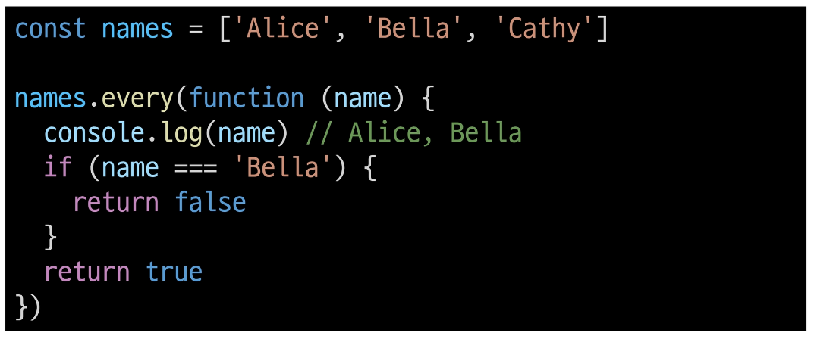
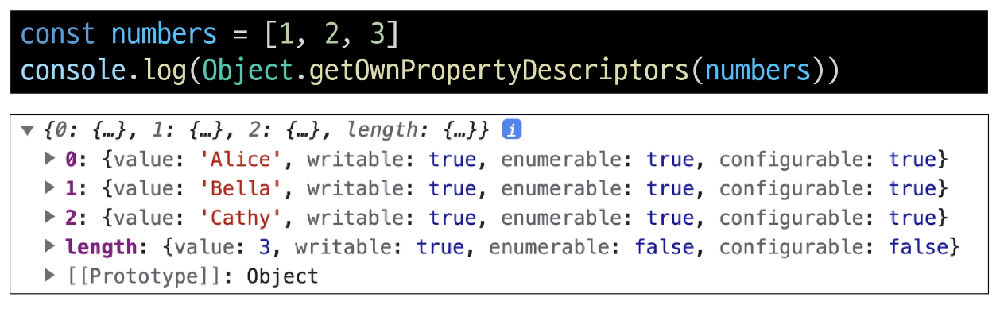

# 2024년 10월 25일(금) 수업 내용 정리 - References Type 3

- 배열

  - 배열 메서드

- Array helper method

  - 콜백 함수
  - forEach
  - map
  - 배열 순회 종합
  - 배열 with '전개 구문'

- 참고

  - 콜백 함수의 이점
  - forEach에서 break 사용하기
  - 배열은 객체다

## 배열

- Object

  - 키로 구분된 데이터 집합(data collection)을 저장하는 자료형

  - 이제는 **순서가 있는 collection**이 필요

- Array

  - 순서가 있는 데이터 집합을 저장하는 자료구조

- 배열 구조

  - 대괄호('[]')를 이용해 작성

  - 요소의 자료형은 제약 없음

  - length 속성을 사용해 배열에 담긴 요소 개수 확인 가능

    

### 배열 메서드

- 주요 메서드

  |메서드|역할|
  |:--:|:--:|
  |push / pop|배열 끝 요소를 추가 / 제거|
  |unshift / shift|배열 끝 요소를 추가 / 제거|
   

- push()

  - 배열 끝에 요소를 추가

    

- pop()

  - 배열 끝 요소를 제거하고, 제거한 요소를 반환

    

- unshift()

  - 배열 앞에 요소를 추가

    

- shift()

  - 배열 앞 요소를 제거하고, 제거한 요소를 반환

    

## Array helper method

- Array Helper Methods

  - 배열 조작을 보다 쉽게 수행할 수 있는 특별한 메서드 모음

- Array Helper Methods

      - ES6에 도입

      - 배열의 각 요소를 순회하며 각 요소에 대해 함수(콜백함수)를 호출

      - 대표 메서드

        - forEach(), map(), filter(), every(), some(), reduce() 등

      - 메서드 호출 시 인자로 함수(콜백함수)를 받는 것이 특징

### 콜백 함수

- 콜백 함수(Callback function)

  - 다른 함수에 인자로 전달되는 함수

  - 외부 함수 내에서 호출되어 일종의 루틴이나 특정 작업을 진행

- 콜백 함수 예시

  

- 주요 Array Helper Methods

  |메서드|역할|
  |:--:|:--|
  |forEach|- 배열 내의 모든 요소 각각에 대해 함수(콜백함수)를 호출 - 반환 값 없음|
  |map|- 배열 내의 모든 요소 각각에 대해 함수(콜백함수)를 호출 - 함수 호출 결과를 모아 새로운 배열을 반환|
   

### forEach

- forEach()

  - 배열의 각 요소를 반복하며 모든 요소에 대해 함수(콜백함수)를 호출

- forEach 구조

  

  

  - 콜백함수는 3가지 매개변수로 구성

    1. item : 처리할 배열의 요소

    2. index : 처리할 배열 요소의 인덱스 (선택 인자)

    3. array : forEach를 호출한 배열 (선택 인자)

  - 반환 값

    - undefined

  
- forEach 예시

  

  - 출력 결과

  

- forEach 활용

  - forEach의 인자를 모두 활용

    

    - 출력 결과

    

### map

- map()

  - 배열의 모든 요소에 대해 함수(콜백함수)를 호출하고, 반환된 호출 결과 값을 모아 **새로운 배열을 반환**

- map 구조

  

  

  - forEach의 매개 변수와 동일

  - 반환 값

    - 배열의 각 요소에 대해 실행한 "callback의 결과를 모은 새로운 배열"

    - forEach 동작 원리와 같지만 forEach와 달리 **새로운 배열을 반환**함

- map 예시

  - 배열을 순회하며 각 객체의 name 속성 값을 추출하기 (for...of 와 비교)

    

- map 활용

  

  

- python에서의 map 함수와 비교

  - python의 map에 square 함수를 인자로 넘겨 numbers 배열의 각 요소를 square 함수의 인자로 사용하였음

    

  - map 메서드에 callBackFunc 함수를 인자로 넘겨 numbers 배열의 각 요소를 callBackFunc 함수의 인자로 사용하였음

    

### 배열 순회 종합

- 배열 순회 종합

  |방식|특징|비고|
  |:--:|:--|:--:|
  |for loop|- 배열의 인덱스를 이용하여 각 요소에 접근 - break, continue 사용 가능||
  |for...of|- 배열 요소에 바로 접근 가능 - break, continue 사용 가능||
  |forEach()|- 간결하고 가독성이 높음 - callback 함수를 이용하여 각 요소를 조작하기 용이 - break, continue 사용 불가|**사용 권장**|
   

  

- 기타 Array Helper Methods

  - MDN 문서를 참고해 사용해보기

    |메서드|역할|
    |:--:|:--:|
    |filter|콜백 함수의 반환 값이 참인 요소들만 모아서 새로운 배열을 반환|
    |find|콜백 함수의 반환 값이 참이면 해당 요소를 반환|
    |some|배열의 요소 중 적어도 하나라도 콜백 함수를 통과하면 true를 반환하며 즉시 배열 순회 중지 반면에 모두 통과하지 못하면 false를 반환|
    |every|배열의 모든 요소가 콜백 함수를 통과하면 true를 반환 반면에 하나라도 통과하지 못하면 즉시 false를 반환하고 배열 순회 중지|
     

### 배열 with '전개 구문'

- 배열 with '전개 구문'

  - "배열 복사"

    

## 참고

### 콜백 함수의 이점

- 콜백 함수 구조를 사용하는 이유

      1. 함수의 재사용성 측면

      2. 비동기적 처리 측면

- 함수의 재사용성 측면

  - 함수를 호출하는 코드에서 콜백 함수의 동작을 자유롭게 변경할 수 있음

  - 예를 들어, map 함수는 콜백 함수를 인자로 받아 배열의 각 요소를 순회하며 콜백 함수를 실행

  - 이때, 콜백 함수는 각 요소를 변환하는 로직을 담당하므로, map 함수를 호출하는 코드는 간결하고 가독성이 높아짐

- 비동기적 측면

  - setTimeout 함수는 콜백 함수를 인자로 받아 일정 시간이 지난 후에 실행됨

  - 이때, setTimeout 함수는 비동기적으로 콜백 함수를 실행하므로, 다른 코드의 실행을 방해하지 않음(비동기 JavaScript에서 자세히 진행 예정)

    

### forEach에서 break 사용하기

- forEach에서 break하는 대안

  - forEach에서는 break 키워드를 사용할 수 없음

  - 대신 some과 every의 특징을 활용해 마치 break를 사용하는 것처럼 활용할 수 있음

    

  - some을 활용한 예시

    - 콜백 함수가 true를 반환하면 즉시 순회를 중단하는 특징을 활용

      

  - every를 활용한 예시

    - 콜백 함수가 false를 반환하면 즉시 순회를 중단하는 특징을 활용

      

### 배열은 객체다

- "배열은 객체다"

  - 배열도 키와 속성들을 담고 있는 참조 타입의 객체

  - 배열의 요소를 대괄호 접근법을 사용해 접근하는 건 객체 문법과 같음

    - 배열의 키는 숫자

  - 숫자형 키를 사용함으로써 배열은 객체 기본 기능 이외에도 "순서가 있는 컬렉션"을 제어하게 해주는 특별한 메서드를 제공하는 것

  - 배열은 인덱스를 키로 가지며 length 속성을 갖는 특수한 객체

    