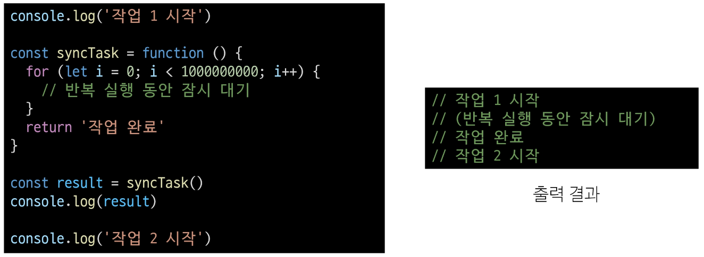
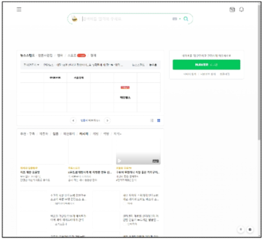
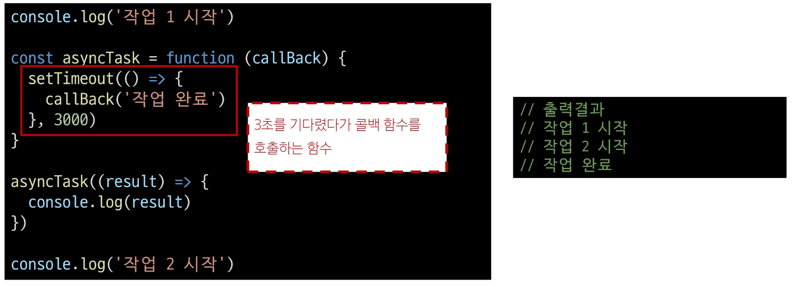
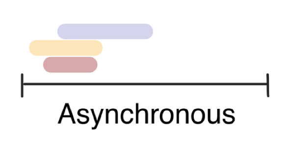
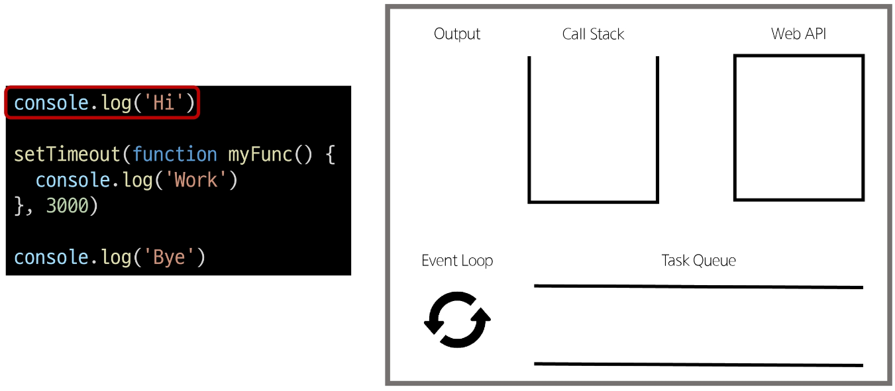

# 2024년 10월 290일(화) 수업 내용 정리 - Asynchronous JavaScript

- 비동기

- JavaScript와 비동기

  - JavaScript Runtime

- Ajax

  - Axios
  - Axios 활용
  - Ajax와 Axios

- Callback과 Promise

  - 비동기 콜백
  - 프로미스

- 참고

  - 비동기 처리와 사용자 경험
  - 비동기 처리 적용 사례
  - 비동기 처리 주의사항

## 비동기

- Synchronous(동기)

  - 프로그램의 실행 흐름이 순차적으로 진행

  - 하나의 작업이 완료된 후에 다음 작업이 실행되는 방식

- Synchronous 예시

  - 카페 커피 주문 예시

      - [손님 1] 아메리카노 한 잔 주세요

      - [바리스타] 아메리카노 하나요. 주문이 완료될 때까지 잠시만 기다려주세요.

      - [손님 1] 네, 감사합니다. (커피가 나올 때까지 대기)

      - [바리스타] 아메리카노 나왔습니다. 감사합니다.

      - [손님 2] 카페라떼 두 잔 주세요/

      - 손님 1의 주문이 완료되어야만 다음 손님의 주문을 진행할 수 있음

  - 반복이 완료될 때까지 다음 작업(작업2)이 시작되지 않음

    

- Asynchronous(비동기)

  - 특정 작업의 실행이 완료될 때까지 기다리지 않고 다음 작업을 즉시 실행하는 방식

  - 작업의 완료 여부를 신경 쓰지 않고 **동시에 다른 작업들을 수행할 수 있음**

- Asynchronous 예시

  1. 카페 커피 주문 예시

      - [손님 1] 아메리카노 한 잔 주세요.
      
      - [바리스타] 아메리카노 하나요. 여기 진동 벨 드리겠습니다.

      - [손님 1] 네, 감사합니다.

      - [바리스타] 안녕하세요. 어떤 거 드릴까요?

      - [손님 2] 카페라떼 두 잔 주세요.

      - 손님 1의 커피가 만들어지는 동안 다음 손님의 주문을 처리할 수 있음

  2. Gmail에서 메일 전송을 누르면 목록 화면으로 전환되지만 실제로 메일을 보내는 작업은 병렬적으로 별도로 처리됨

  3. 브라우저는 웹페이지를 먼저 처리되는 요소부터 그려 나가며 처리가 오래 걸리는 것들은 별도로 처리가 완료 되는대로 병렬적으로 진행

      

      

- Asynchronous 특징

  - 병렬적 수행

  - 당장 처리를 완료할 수 없고 시간이 필요한 작업들은 백그라운드에서 실행되며 빨리 완료되는 작업부터 처리

    

## JavaScript와 비동기

- Single Thread 언어, JavaScript

  - Thread란?

    - 작업을 처리할 때 실제로 작업을 수행하는 주체로, mulit-thread라면 업무를 수행할 수 있는 주체가 여러 개라는 의미

- JavaScript는 한번에 여러 일을 수행할 수 없다.

  - JavaScript는 한 번에 하나의 일만 수행할 수 있는 Single Thread 언어로 동시에 여러 작업을 처리할 수 없음

  - 즉, JavaScript는 하나의 작업을 요청한 순서대로 처리할 수 밖에 없음

  - 그러면 어떻게 Single Thread인 JavaScript가 비동기 처리를 할 수 있을까?

### JavaScript Runtime

- JavaScript Runtime

  - "JavaScript가 동작할 수 있는 환경(Runtime)"

    - "브라우저" 또는 "Node.js"

  - JavaScript는 Single Thread이므로 비동기 처리를 할 수 있도록 도와주는 환경이 필요

- 브라우저 환경에서의 JavaScript 비동기 처리 관련 요소

  1. JavaScript Engine의 ****Call Stack**

  2. **Web API**

  3. **Task Queue**

  4. **Event Loop**

- 런타임의 시각적 표현

  

- 브라우저 환경에서의 JavaScript 비동기 처리 동작 방식

  1. 모든 작업은 **Call Stack**(LIFO)으로 들어간 후 처리된다.

  2. 오래 걸리는 작업이 Call Stack으로 들어오면 **Web API**로 보내 별도로 처리하도록 한다.

  3. Web API에서 처리가 끝난 작업들은 곧바로 Call Stack으로 들어가지 못하고 **Task Queue**(FIFO)에 순서대로 들어간다.

  4. **Event Loop**가 Call Stack이 비어 있는 것을 계속 체크하고 Call Stack이 빈다면 Task Queue에서 가장 오래된(가장 먼저 처리되어 들어온) 작업을 Call Stack으로 보낸다.

- 비동기 처리 동작 요소

      1. Call Stack

        - 요청이 들어올 때마다 순차적으로 처리하는 Stack(LIFO)

        - 기본적인 JavaScript의 Single Thread 작업 처리

      2. Web API

        - JavaScript 엔진이 아닌 브라우저에서 제공하는 runtime 환경

        - 시간이 소요되는 작업을 처리 (setTimeout, DOM Event, 비동기 요청 등)

      3. Task Queue (Callback Queue)

        - 비동기 처리된 Callback 함수가 대기하는 Queue(FIFO)

      4. Event Loop

        - 태스크(작업)가 들어오길 기다렸다가 태스크가 들어오면 이를 처리하고, 처리할 태스크가 없는 경우엔 잠드는, 끊임없이 돌아가는 자바스크립트 내 루프

        - Call Stack과 Task Queue를 지속적으로 모니터링

        - Call Stack이 비어 있는지 확인 후 비어 있다면 Task Queue에서 대기 중인 오래된 작업을 Call Stack으로 Push

- 정리

      - JavaScript는 한 번에 하나의 작업을 수행하는 Single Thread 언어로 동기적 처리를 진행

      - 하지만 브라우저 환경에서는 Web API에서 처리된 작업이 지속적으로 Task Queue를 거쳐 Event Loop에 의해 Call Stack에 들어와 순차적으로 실행됨으로써 비동기 작업이 가능한 환경이 됨

## Ajax

- Ajax(Asynchronous JavaScript and XML)

  - 비동기적인 웹 애플리케이션 개발을 위한 기술

- Ajax 정의

      - XMLHttpRequest 기술을 사용해 복잡하고 동적인 웹 페이지를 구성하는 프로그래밍 방식

      - 브라우저와 서버 간의 데이터를 비동기적으로 교환하는 기술

      - Ajax를 사용하면 페이지 전체를 새로고침 하지 않고도 동적으로 데이터를 불러와 화면을 갱신할 수 있음

      ⇒ Ajax의 'x'는 XML이라는 데이터 타입을 의미하긴 하지만, 요즘은 더 가벼운 용량과 JavaScript의 일부라는 장점 때문에 JSON을 많이 사용

- Ajax 목적

  1. 비동기 통신 

      - 웹 페이지 전체를 새로고침하지 않고 서버와 데이터를 주고받을 수 있음

  2. 부분 업데이트

      - 전체 페이지가 다시 로드되지 않고 HTML 페이지 일부 DOM만 업데이트

      - 페이지의 일부분만 동적으로 갱신할 수 있어 사용자 경험이 향상

  3. 서버 부하 감소

      - 필요한 데이터만 요청하므로 서버의 부하를 줄일 수 있음

### Axios

### Axios 활용

### Ajax와 Axios

## Callback과 Promise

### 비동기 콜백

### 프로미스

## 참고

### 비동기 처리와 사용자 경험

### 비동기 처리 적용 사례

### 비동기 처리 주의사항