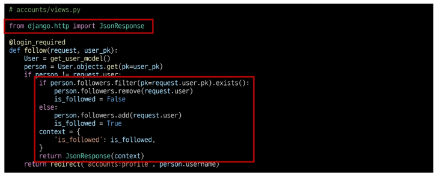
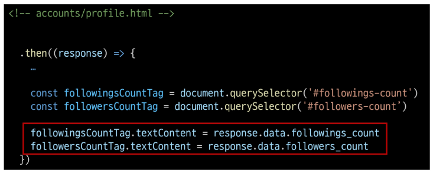
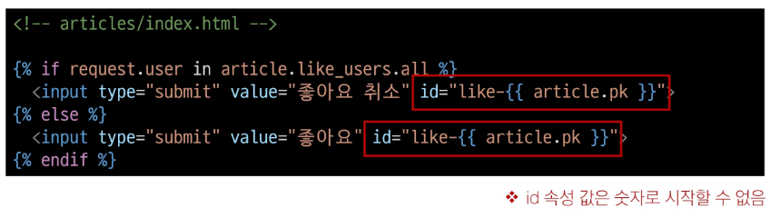

# 2024년 10월 30일(수) 수업 내용 정리 - Ajax with Django

- Ajax와 서버

- Ajax with follow

  - 비동기 팔로우 구현

- Ajax with likes

  - 비동기 좋아요 구현

## Ajax와 서버

- Ajax(Asynchronous JavaScript and XML)

  - 비동기적인 웹 애플리케이션 개발에 사용하는 기술

- Ajax를 활용한 클라이언트 서버 간 동작

  

  - XML 객체 생성 및 요청 → Ajax 요청 처리 → 응답 데이터 생성 → JSON 데이터 응답 → Promise 객체 데이터를 활용해 DOM 조작(웹 페이지의 일부분 만을 다시 로딩)

## Ajax with follow

### 비동기 팔로우 구현

- 사전 준비

  1. M:N까지 진행한 Django 프로젝트 준비

  2. 가상 환경 생성, 활성화 및 패키지 설치

- Ajax 적용

  - 프로필 페이지에 axios CDN 작성

    

  - form 요소 선택을 위해 id 속성 지정 및 선택

  - action과 method 속성은 삭제

    - 요청은 axios로 대체되기 때문

    

  - form 요소에 이벤트 핸들러 할당

  - submit 이벤트의 기본 동작 취소하기

    

  - axios 요청 코드 작성

    1. url 작성에 필요한 user pk는 어떻게 작성해야 할까?

    2. csrftoken은 어떻게 보내야 할까?

    

  - url에 작성할 user pk 가져오기 (HTML ⇒ JavaScript)

    

  - 요청 url 작성 마무리

    

  - 문서상 input hidden 타입으로 존재하는 csrf token 데이터를 이제는 axios로 전송해야 함

    

  - csrf 값을 가진 input 요소를 직접 선택 후 axios에 작성하기

  - [https://docs.djangoproject.com/en/4.2/howto/csrf/](https://docs.djangoproject.com/en/4.2/howto/csrf/)

    

  - 팔로우 버튼을 토글하기 위해서는 현재 팔로우 상태인지 언팔로우 상태인지에 대한 상태 확인이 필요

  - Django의 view 함수에서 팔로우 여부를 파악할 수 있는 변수를 추가로 생성해 JSON 타입으로 응답하기

  - 팔로우 상태 여부를 JavaScript에게 전달할 데이터 작성

  - 응답은 더 이상 HTML 문서가 아닌 JSON 데이터로 응답하도록 변경

    

  - 팔로우 요청 후 Django 서버로 부터 받은 응답 데이터 확인하기

    

  - 응답 데이터 is_followed에 따라 팔로우 버튼을 조작하기

    

  - 클라이언트와 서버 간 XHR 객체를 주고 받는 것을 확인하기

  - 개발자도구 - Network

    

    

  - "팔로잉 수와 팔로워 수 비동기 적용"

  - 해당 요소를 선택할 수 있도록 span 태그와 id 속성 작성

    

  - 각 span 태그를 선택

    

  - Django view 함수에서 팔로워, 팔로잉 인원 수 연산을 진행하여 결과를 응답 데이터로 전달

    

  - 응답 데이터를 받아 각 태그의 인원 수 값 변경에 활용

    

- 'data-*' 속성

  - 사용자 지정 데이터 특성을 만들어 임의의 데이터를 HTML과 DOM 사이에서 교환할 수 있는 방법

- data-* 사용 예시

  

  - 모든 사용자 지정 데이터는 JavaScript에서 **dataset** 속성을 통해 접근

  - 주의 사항

    1. 대소문자 여부에 상관없이 'xml' 문자로 시작 불가

    2. 세미콜론 포함 불가

    3. 대문자 포함 불가

## Ajax with likes

### 비동기 좋아요 구현

- Ajax 좋아요 적용 시 유의 사항

  - 전반적인 Ajax 적용은 팔로우 구현 과정과 모두 동일

  - 단, 팔로우와 달리 좋아요 버튼은 **한 페이지에 여러 개**가 존재

    - 그렇다면 모든 좋아요 버튼에 이벤트 리스너를 할당해야 할까?

- [복습] 버블링

  - 한 요소에 이벤트가 발생하면, 이 요소에 할당된 핸들러가 동작하고, 이어서 부모 요소의 핸들러가 동작하는 현상

  - 가장 최상단의 조상 요소(document)를 만날 때까지 이 과정이 반복되면서 요소 각각에 할당된 핸들러가 동작

- [복습] 버블링이 필요한 이유

  - 만약 다음과 같이 각자 다른 동작을 수행하는 버튼이 여러 개가 있다고 가정

  - 그렇다면 각 버튼마다 이벤트 핸들러를 할당해야 할까?

  - 각 버튼의 **공통 조상인 div 요소에 이벤트 핸들러 단 하나만 할당**하기

    

- Ajax 적용

  - 모든 좋아요 form 요소를 포함하는 최상위 요소 작성

    

  1. 최상위 요소 선택

  2. 이벤트 핸들러 할당

  3. 하위 요소들의 submit 이벤트를 감지하고 submit 기본 이벤트를 취소

    

  - axios 코드 작성

  - url 작성에 필요한 article pk는 어떻게 작성해야 할까?

    

  - 각 좋아요 form에 article.pk를 부여 후 HTML의 article.pk 값을 JavaScript에서 참조하기

    

  - url 완성 후 요청 및 응답 확인

    

  - 좋아요 버튼을 토글하기 위해서는 현재 사용자가 좋아요를 누른 상태인지 좋아요를 누르지 않은 상태인지에 대한 **상태 확인**이 필요

  - Django의 view 함수에서 좋아요 여부를 파악할 수 있는 변수 추가 생성

  - JSON 타입으로 응답하기

  - 좋아요 상태 여부를 JavaScript에게 전달할 데이터 작성 및 JSON 데이터 응답

    

  - 응답 데이터 is_liked를 받아 isLiked 변수에 할당

    

  - isLiked에 따라 좋아요 버튼을 토글하기

    - 그런데 어떤 게시글의 좋아요 버튼을 선택했는지 구분이 필요

    

  - 문자와 article의 pk 값을 혼합하여 각 버튼에 id 속성 값을 설정

    

  - 각 좋아요 버튼을 선택 후 isLiked에 따라 버튼을 토글

    

- 버블링을 활용하지 않은 경우

  1. querySelectorAll()을 사용해 전체 좋아요 버튼을 선택

      - querySelectorAll() 선택을 위한 class 적용

        

  2. forEach()를 사용해 전체 좋아요 버튼을 순회하면서 진행

      

    

- [복습] 'currentTarget' & 'target'

  - 'currentTarget' 속성

    - '현재' 속성

    - 항상 이벤트 핸들러가 연결된 요소만을 참조하는 속성

    - 'this'와 같음

  - 'target' 속성

    - 이벤트가 발생한 가장 안쪽의 요소(target)을 참조하는 속성

    - **실제 이벤트가 시작된 요소**

    - 버블링이 진행되어도 변하지 않음