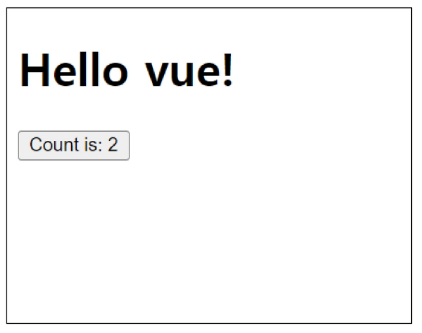

# 2024년 10월 31일(수) 수업 내용 정리 - Introduction of Vue

- Frontend Development

  - Client-side frameworks
  - SPA
  - CSR

- Vue

  - What is Vue
  - Component

- Vue Application

  - Vue Application 생성
  - 반응형 상태
  - Vue 기본 구조

- Template Syntax

- 참고

  - ref 객체
  - Ref Unwrap 주의사항
  - SEO
  - CSR과 SSR

## Frontend Development

- Frontend Development

  - 웹 사이트와 웹 애플리케이션의 사용자 인터페이서(UI)와 사용자 경험(UX)을 만들고 디자인하는 것

  - HTML, CSS, JavaScript 등을 활용하여 사용자가 직접 상호작용하는 부분을 개발

  

### Client-side frameworks

- Client-side frameworks

  - 클라이언트 측에서 UI와 상호작용을 개발하기 위해 사용되는 JavaScript 기반 프레임워크

    

- Client-side frameworks가 필요한 이유 1

  - "웹에서 하는 일이 많아졌다"

  - 단순히 무언가를 읽는 곳에서 → 무언가를 하는 곳으로

  - 사용자는 이제 웹에서 문서만을 읽는 것이 아닌 음악을 스트리밍하고, 영화를 보고, 지구 반대편 사람들과 텍스트 및 영상 채팅을 통해 즉시 통신하고 있음

  - 이처럼 현대적이고 복잡한 대화형 웹 사이트를 **"웹 애플리케이션(web applications)"**이라 부름

  - JavaScript 기반의 Client-side frameworks가 등장함녀서 매우 동적인 대화형 애플리케이션을 훨씬 더 쉽게 구축할 수 있게 됨

- Client-side frameworks가 필요한 이유 2

  - "웹에서 하는 일이 많아졌다"

  - "다루는 데이터가 많아졌다"

  - 만약 친구가 이름을 변경했다면?

  - 친구 목록, 타임라인, 스토리 등 친구의 이름이 출력되는 모든 곳이 함께 변경되어야 함

  - 애플리케이션의 기본 데이터를 안정적으로 추적하고 업데이터(렌더링, 추가, 삭제 등)하는 도구가 필요

  - **애플리케이션의 상태를 변경할 때마다 일치하도록 UI를 업데이트해야 함**

    

- Vanilla JS만으로는 쉽지 않다.

  

- Client-side frameworks의 필요성

  1. 동적이고 반응적인 웹 애플리케이션 개발

      - 실시간 데이터 업데이트

  2. 코드 재사용성 증가

      - 컴포넌트 기반 아키텍처
      
      - 모듈화된 코드 구조

  3. 개발 생산성 향상

      - 강력한 개발 도구 지원

### SPA

- Single Page Application(SPA)

  - 단일 페이지에서 동작하는 웹 애플리케이션

- SPA 작동 원리

  - 최초 로드 시 필요한 모든 리소스 다운로드

  - 이후 페이지 갱신에 대해 필요한 데이터만을 비동기적으로 전달 받아 화면의 필요한 부분만 동적으로 갱신

    - AJAX와 같은 기술을 사용하여 필요한 데이터만 비동기적으로 로드

    - 페이지 전체를 다시 로드할 필요 없이 필요한 데이터만 서버로부터 가져와서 화면에 표시

  - JavaScript를 사용하여 클라이언트 측에서 동적으로 콘텐츠를 생성하고 업데이터

    - CSR 방식

### CSR

- Client-side Rendering(CSR)

  - 클라이언트에서 콘텐츠를 렌더링 하는 방식

- CSR 작동 원리

      1. 사용자가 웹사이트에 요청을 보냄

      2. 서버는 최소한의 HTML과 JavaScript 파일을 클라이언트로 전송

      3. 클라이언트는 HTML과 JavaScript를 다운로드 받음

      4. 브라우저가 JavaScript를 실행하여 동적으로 페이지 콘텐츠를 생성

      5. 필요한 데이터는 API를 통해 서버로부터 비동기적으로 가져옴

  
- CSR 작동 예시

  

  1. 클라이언트는 서버로부터 최소한의 HTML 페이지와 해당 페이지에 필요한 JavaScript 응답 받음

  2. 그런 다음 클라이언트 측에서 JavaScript를 사용하여 DOM을 업데이트하고 페이지를 렌더링

  3. 이후 서버는 더 이상 HTML을 제공하지 않고 요청에 필요한 데이터만 응답

  - Google Maps, Facebook, Instagram 등의 서비스에서 페이지 갱신 시 새로고침이 없는 이유

- SPA와 CSR의 장점

  1. 빠른 페이지 전환

      - 페이지가 처음 로드된 후에는 필요한 데이터만 가져오면 되고 JavaScript는 전체 페이지를 새로 고칠 필요 없이 페이지의 일부를 다시 렌더링할 수 있기 때문

      - 서버로 전송되는 데이터의 양을 최소화 (서버 부하 방지)

  2. 사용자 경험

      - 새로고침이 발생하지 않아 네이티브 앱과 유사한 사용자 경험을 제공

  3. Frontend와 Backend의 명확한 분리

      - Frontend는 UI 렌더링 및 사용자 상호 작용 처리를 담당 & Backend는 데이터 및 API 제공을 담당

      - 대규모 애플리케이션을 더 쉽게 개발하고 유지 관리 가능

- SPA와 CSR의 단점

  1. 느린 초기 로드 속도

      - 전체 페이지를 보기 전에 약간의 지연을 느낄 수 있음

      - JavaScript가 다운로드, 구문 분석 및 실행될 때까지 페이지가 완전히 렌더링 되지 않기 때문

  2. SEO(검색 엔진 최적화) 문제

      - 페이지를 나중에 그려 나가는 것이기 때문에 검색에 잘 노출되지 않을 수 있음

      - 검색엔진 입장에서 HTML을 읽어서 분석해야 하는데 아직 콘텐츠가 모두 존재하지 않기 때문

- SPA vs MPA / CSR vs SSR

      - Multi Page Application (MPA)

        - 여러 개의 HTML 파일이 서버로부터 각각 로드

        - 사용자가 다른 페이지로 이동할 때마다 새로운 HTML 파일이 로드됨

      - Server-side Rendering (SSR)

        - 서버에서 화면을 렌더링 하는 방식

        - 모든 데이터가 담긴 HTML을 서버에서 완성 후 클라이언트에게 전달

## Vue

### What is Vue

  

- 사용자 인터페이스를 구축하기 위한 JavaScript 프레임워크

- What is Vue?

  - Evan You에 의해 발표(2014)

    - 학사 - 미술, 미술사 / 석사 - 디자인 & 테크놀로지 전공
    
    - Angular 개발팀 출신

  - 최신 버전은 "Vue 3" (2024)

    - [https://vuejs.org/](https://vuejs.org/)

  - Vue 2 문서에 접속하지 않도록 주의

- Vue를 학습하는 이유

  1. 낮은 학습 곡선

      - 간결하고 직관적인 문법을 가지고 있어 빠르게 익힐 수 있음

      - 잘 정리된 문서를 기반으로 어렵지 않게 학습할 수 있음

  2. 확장성과 생태계

      - 다양한 플러그인과 라이브러리를 제공하는 높은 확장성

      - 전세계적으로 활성화된 커뮤니티를 기반으로 많은 개발자들이 새로운 기능을 개발하고 공유하고 있음

  3. 유연성 및 성능

      - 작은 규모의 프로젝트부터 대규모의 애플리케이션까지 다양한 프로젝트에 적합

  4. 가장 주목받는 Client-side framework

      

- SSAFY에서의 Vue

  - Vue는 React나 Angular 대비 간결하고 직관적인 문법을 가지고 있어 학습이 상대적으로 원활

    - 짧은 시간 내에 효율적으로 결과물을 만들어 낼 수 있음

  - 거대하고 활발한 커뮤니티를 가지고 있어 풍부한 문서, 튜토리얼, 예제 및 다양한 리소스를 공유 받을 수 있음

    - 최신 업데이트 및 트렌드를 공유함으로써 지속적인 학습을 촉진

- Vue 체험하기

  

  - 결과

  

- Vue의 2가지 핵심 기능

  1. 선언적 렌더링 (Declarative Rendering)

      - 표준 HTML을 확장하는 Vue "템플릿 구문"을 사용하여 JavaScript 상태(데이터)를 기반으로 화면에 출력될 HTML을 선언적으로 작성

  2. 반응성 (Reactivity)

      - JavaScript 상태 변경을 추적하고, 변경사항이 발생하면 자동으로 DOM을 업데이트

- Vue의 주요 특징 정리

  1. 반응형 데이터 바인딩

      - 데이터 변경 시 자동 UI 업데이트

  2. 컴포넌트 기반 아키텍처

      - 재사용 가능한 UI 조각

  3. 간결한 문법과 직관적인 API

      - 낮은 학습 곡선

      - 높은 가독성

  4. 유연한 스케일링

      - 작은 프로젝트부터 대규모 애플리케이션까지 적합

### Component

- Component

  - 재사용 가능한 코드 블록

- Component 특징

  - UI를 독립적이고 재사용 가능한 일부분으로 분할하고 각 부분을 개별적으로 다룰 수 있음

  - 자연스럽게 애플리케이션은 중첩된 Component의 트리 형태로 구성됨

    

- Component 예시

  - 웹 서비스는 여러 개의 Component로 이루어져 있음

    

## Vue Application

- Vue를 사용하는 방법

  1. 'CDN' 방식

  2. 'NPM' 설치 방식

      - CDN 방식 이후 진행

### Vue Application 생성

- Vue Application 생성하기

  - CDN 작성

    

  - Application instance

    - CDN에서 Vue를 사용하는 경우 Vue 객체를 불러오게 됨

    - 구조분해할당 문법으로 Vue 객체의 createApp 함수를 할당

### 반응형 상태

### Vue 기본 구조

## Template Syntax

## 참고

### ref 객체

### Ref Unwrap 주의사항

### SEO

### CSR과 SSR