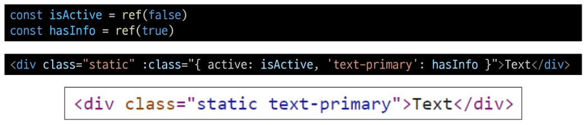

# 2024년 11월 4일(월) 수업 내용 정리 - Basic Syntax 1

- Template Syntax

  - Directive

- Dynamically data binding

  - v-bind
  - Attribute Bindings
  - Class and Style Bindings

- Event Handling

  - v-on
  - Modifiers

- Form Input Bindings

  - v-bind with v-on
  - v-model
  - v-model 활용

- 참고

  - 접두어 $
  - IME

## Template Syntax

- Template Syntax

  - DOM을 기본 구성 요소 인스턴스의 데이터에 **선언적으로 바인딩(Vue Instance와 DOM을 연결)**할 수 있는 HTML 기반 **템플릿 구문(확장된 문법 제공)**을 사용

- Template Syntax 종류

      1. Text Interpolation

      2. Raw HTML

      3. Attribute Bindings

      4. JavaScript Expressions

1. Text Interpolation

    

    - 데이터 바인딩의 가장 기본적인 형태

    - 이중 중괄호 구문 (콧수염 구문)을 사용

    - 콧수염 구문은 해당 구성 요소 인스턴스의 msg 속성 값으로 대체

    - msg 속성이 변경될 때마다 업데이트 됨

2. Raw HTML

    

    - 콧수염 구문은 데이터를 일반 텍스트로 해석하기 때문에 실제 HTML을 출력하려면 v-html을 사용해야 함

3. Attribute Bindings

    

    - 콧수염 구문은 HTML 속성 내에서 사용할 수 없기 때문에 v-bind를 사용

    - HTML의 id 속성 값을 vue의 dynamicId 속성과 동기화 되도록 함

    - 바인딩 값이 null이나 undefined인 경우 렌더링 요소에서 제거됨

4. JavaScript Expressions

    

    - Vue는 모든 데이터 바인딩 내에서 JavaScript 표현식의 모든 기능을 지원

    - Vue 템플릿에서 JavaScript 표현식을 사용할 수 있는 위치

      1. 콧수염 구문 내부

      2. 모든 directive의 속성 값 ("v-"로 시작하는 특수 속성)

- Expressions 주의사항

  - 각 바인딩에는 하나의 단일 표현식만 포함될 수 있음

    - 표현식은 값으로 평가할 수 있는 코드 조각 (return 뒤에 사용할 수 있는 코드여야 함)

  - 작동하지 않는 경우

    

### Directive

- Directive

  - 'v-' 접두사가 있는 특수 속성

- Directive 특징

  - Directive의 속성 값은 단일 JavaScript 표현식이어야 함(v-for, v-on 제외)

  - 표현식 값이 변경될 때 DOM에 반응적으로 업데이트를 적용

  - 예시

    

- Directive 전체 구문

  

- Directive - "Arguments"

  - 일부 directive는 directive 뒤에 콜론(":")으로 표시되는 인자를 사용할 수 있음

  - 아래 예시의 href는 HTML \<a> 요소의 href 속성 값을 myUrl 값에 바인딩하도록 하는 v-bind의 인자

    

  - 아래 예시의 click은 이벤트 수신할 이벤트 이름을 작성하는 v-on의 인자

    

- Directive - "Modifiers"

  - ". (dot)"로 표시되는 특수 접미사로, directive가 특별한 방식으로 바인딩되어야 함을 나타냄

  - 아래 예시의 .prevent는 발생한 이벤트에서 event.preventDefault()를 호출하도록 v-on에 지시하는 modifier

    

- Built-in Directives

  - v-tetx

  - v-show

  - v-if

  - v-for

  - ...

  - [https://vuejs.org/api/built-in-directives.html](https://vuejs.org/api/built-in-directives.html)

## Dynamically data binding

### v-bind

- v-bind

  - 하나 이상의 속성 또는 컴포넌트 데이터를 표현식에 동적으로 바인딩

- v-bind 사용처

      1. Attribute Bindings

      2. Class and Style Bindings

### Attribute Bindings

- Attribute Bindings (속성 바인딩)

  - HTML의 속성 값을 Vue의 상태 속성 값과 동기화 되도록 함

    

  - **v-bind** shorthand (약어)

    - ':' (colon)

    

- Dynamic attribute name (동적 인자 이름)

  - 대괄호([])로 감싸서 directive argument에 JavaScript 표현식을 사용할 수 있음

  - 표현식에 따라 동적으로 평가된 값이 최종 argument 값으로 사용됨

    

- Attribute Bindings 예시

  

  

### Class and Style Bindings

- Class and Style Bindings (클래스와 스타일 바인딩)

  - class와 style은 모두 HTML 속성이므로 다른 속성과 마찬가지로 v-bind를 사용하여 동적으로 문자열 값을 할당할 수 있음

  - Vue는 class및 style 속성 값을 v-bind로 사용할 때 **객체**또는 **배열**을 활용하여 작성할 수 있도록 함

  - 단순히 문자열 연결을 사용하여 이러한 값을 생성하는 것은 번거롭고 오류가 발생하기가 쉽기 때문

- Class and Style Bindings가 가능한 경우

      1. Binding HTML Classes

        1.1 Binding to Objects

        1.2 Binding to Arrays

      2. Binding Inline Styles

        2.1 Binding to Objects

        2.2 Binding to Arrays

#### 1.1 Binding HTML Classes - Binding to Objects

- 객체를 :class에 전달하여 클래스를 동적으로 전환할 수 있음

- 예시 1

  - isActive의 Boolean 값에 의해 active 클래스의 존재가 결정됨

    

- 객체에서 더 많은 필드를 포함하여 여러 클래스를 전환할 수 있음

- 예시 2

  - :class directive를 일반 클래스 속성과 함께 사용 가능

    

- 반드시 inline 방식으로 작성하지 않아도 됨

- 반응형 변수를 활용해 객체를 한번에 작성하는 방법

  

#### 1.2 Binding HTML Classes - Binding to Arrays

- :class를 배열에 바인딩하여 클래스 목록을 적용할 수 있음

- 예시 1

  

- 배열 구문 내에서 객체 구문을 사용하는 경우

- 예시 2

  

#### 2.1 Binding Inline Styles - Binding to Objects

- :style은 JavaScript 객체 값에 대한 바인딩을 지원(HTML style 속성에 해당)

- 예시 1

  

- 실제 CSS에서 사용하는 것처럼 :style은 kebab-cased 키 문자열도 지원(단, camelCase 작성을 권장)

- 예시 2

  

- 반드시 inline 방식으로 작성하지 않아도 됨

- 반응형 변수를 활용해 객체를 한번에 작성하는 방법

- 예시 3

  

#### 2.2 Binding Inline Styles - Binding to Arrays

- 여러 스타일 객체를 배열에 작성해서 :style을 바인딩할 수 있음

- 작성한 객체를 병합되어 동일한 요소에 적옹

- 예시 1

  

- v-bind 종합

  - [https://vuejs.org/api/built-in-directives.html#v-bind](https://vuejs.org/api/built-in-directives.html#v-bind)

## Event Handling

### v-on

### Modifiers

## Form Input Bindings

### v-bind with v-on

### v-model

### v-model 활용

## 참고

### 접두어 $

### IME