# 2024년 11월 5일(화) 수업 내용 정리 - Basic Syntax 2

- Computed Property

  - Computed
  - Computed vs. Methods

- Conditional Rendering

  - v-if
  - v-if vs. v-show

- List Rendering

  - v-for
  - v-for with key
  - v-for with v-if

- Watchers

  - watch
  - computed vs. watch

- Lifecycle Hooks

- Vue Style Guide

- 참고

  - computed 주의사항
  - Lifecycle Hooks 주의사항
  - 배열과 v-for 관련

## Computed Property

### Computed

- computed()

  - "계산된 속성"을 정의하는 함수

  - 미리 계산된 속성을 사용하여 템플릿에서 표현식을 단순하게 하고 불필요한 반복 연산을 줄임

- computed가 필요한 경우

  - 할 일이 남았는지 여부에 따라 다른 메시지를 출력하기

    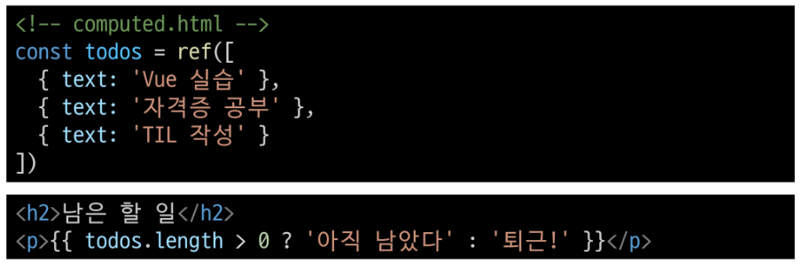

  - 템플릿이 복잡해지며 todos에 따라 계산을 수행하게 됨

  - 만약 이 계산을 템플릿에 여러 번 사용하는 경우에는 반복이 발생

  - computed 적용 후

  - 반응형 데이터를 포함하는 복잡한 로직의 경우 computed를 활용하여 미리 값을 계산하여 계산된 값을 사용

    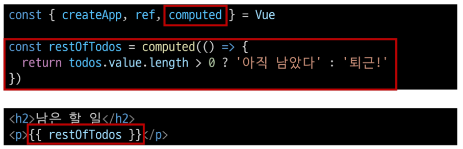

- computed 특징

  - 반환되는 값은 computed ref이며 일반 refs와 유사하게 계산된 결과를 .value로 참조할 수 있음 (템플릿에서는 .value 생략 가능)

  - computed 속성은 의존된 반응형 데이터를 **자동으로 추적**

  - 의존하는 데이터가 **변경될 때만 재평가**

    - restOfTodos의 계산은 todos에 의존하고 있음
    
    - 따라서 todos가 변경될 때만 restOfTodos가 업데이트 됨

      

### Computed vs. Methods

- computed와 동일한 로직을 처리할 수 있는 method

  - computed 속성 대신 method로도 동일한 기능을 정의할 수 있음

    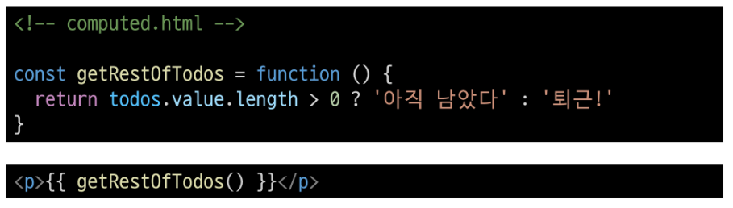

- computed와 method 차이

  - computed 속성은 **의존된 반응형 데이터를 기반으로 캐시(cached)**됨

  - 의존하는 데이터가 변경된 경우에만 재평가됨

  - 즉, 의존된 반응형 데이터가 변경되지 않는 한 이미 계산된 결과에 대한 여러 참조는 다시 평가할 필요 없이 이전에 계산된 결과를 즉시 반환

  - 반면, method 호출은 다시 렌더링이 발생할 때마다 항상 함수를 실행

- Cache (캐시)

  - 데이터나 결과를 일시적으로 저장해두는 임시 저장소
  
  - 이후에 같은 데이터나 결과를 다시 계산하지 않고 빠르게 접근할 수 있도록 함

- Cache 예시

  - "웹 페이지의 캐시 데이터"

    - 과거 방문한 적 있는 페이지에 다시 접속할 경우

    - 페이지 일부 데이터를 브라우저 캐시에 저장 후 같은 페이지에 다시 요청 시 모든 데이터를 다시 응답 받는 것이 아닌 일부 캐시 된 데이터를 사용하여 더 빠르게 웹 페이지를 렌더링

      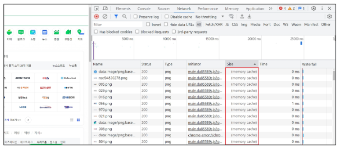

- computed와 method의 적절한 사용처

  - computed

    - 의존하는 데이터에 따라 결과가 바뀌는 계산된 속성을 만들 때 유용

    - 동일한 의존성을 가진 여러 곳에서 사용할 때 계산 결과를 캐싱하여 중복 계산 방지

  - method

    - 단순히 특정 동작을 수행하느 함수를 정의할 때 사용

    - 데이터에 의존하는지 여부와 관계없이 항상 동일한 결과를 반환하는 함수
    

- method와 computed 정리

  - computed

    - 의존된 데이터가 변경되면 자동으로 업데이트

  - method

    - 호출해야만 실행됨

  - 무조건 computed만 사용하는 것이 아니라 사용 목적과 상황에 맞게 computed와 method를 적절히 조합하여 사용

## Conditional Rendering

### v-if

- v-if

  - 표현식 값의 true/false를 기반으로 요소를 조건부로 렌더링

- v-if 활용

  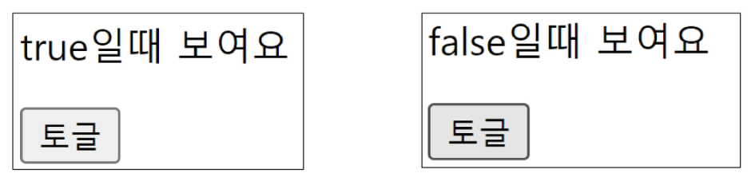

- v-if

  - 'v-if directive를 사용하여 조건부로 렌더링

    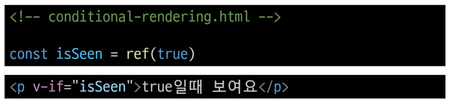

- v-else

  - 'v-else' directive를 사용하여 v-if에 대한 else 블록을 나타낼 수 있음

    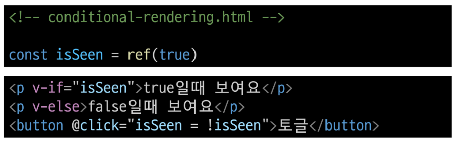

- v-else-if

  - 'v-else-if' directive를 사용하여 v-if에 대한 else if 블록을 나타낼 수 있음

    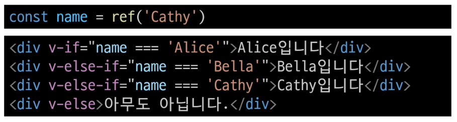

- 여러 요소에 대한 v-if 적용

  - HTML template 요소에 v-if를 사용하여 하나 이상의 요소에 대해 적용할 수 있음 (v-else, v-else-if 모두 적용 가능)

    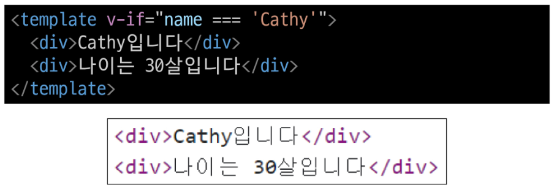

- HTML \<template> element

  - 페이지가 로드될 때 렌더링 되지 않지만 JavaScript를 사용하여 나중에 문서에서 지정할 수 있도록 하는 HTML을 보유하기 위한 메커니즘

  - "보이지 않는 wrapper 역할"

### v-if vs. v-show

- v-show

  - 표현식 값의 true/fasle를 기반으로 요소의 가시성(visibility)을 전환

- v-show 예시

  - v-show 요소는 항상 DOM에 렌더링 되어있음

  - CSS display 속성만 전환하기 때문

    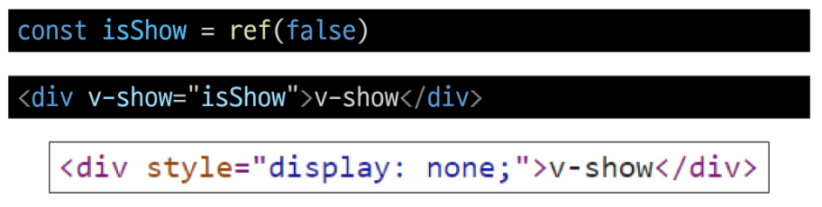

- v-if와 v-show의 적절한 사용처

  - v-if (Cheap initial load, expensive toggle)

    - 초기 조건이 false인 경우 아무 작업도 수행하지 않음

    - 토글 비용이 높음

  - v-show (Expensive initial load, cheap toggle)

    - 초기 조건에 관계 없이 항상 렌더링

    - 초기 렌더링 비용이 더 높음

  - 콘텐츠를 매우 자주 전환해야 하는 경우에는 v-show를, 실행 중에 조건이 변경되지 않는 경우에는 v-if를 권장

## List Rendering

### v-for

- v-for

  - 소스 데이터(Array, Object, Number, String, Iterable)를 기반으로 요소 또는 템플릿 블록을 여러 번 렌더링

- v-for 구조

  - v-for는 `alias in expression` 형식의 특수 구문을 사용

    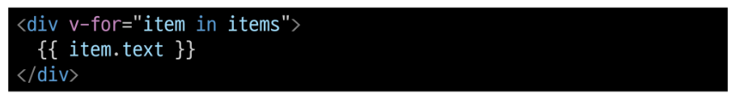

  - 인덱스(객체에서는 key)에 대한 별칭을 지정할 수 있음

    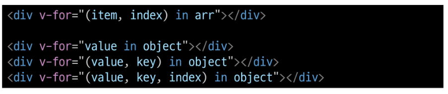

- v-for 예시

  - 배열 반복

    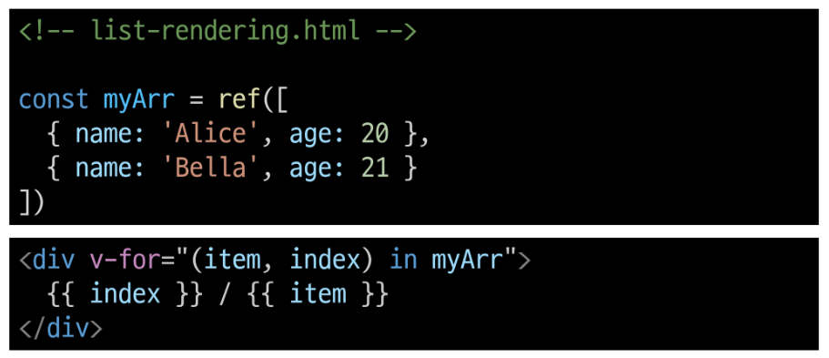

  - 객체 반복

    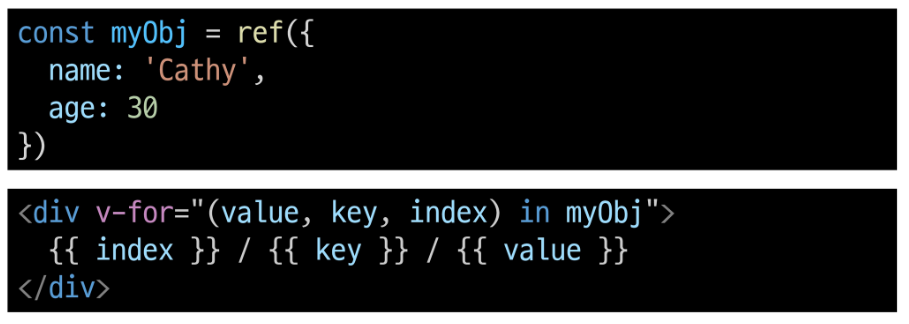

- 여러 요소에 대한 v-for 적용

  - HTML template 요소에 v-for를 사용하여 하나 이상의 요소에 대해 반복 렌더링 할 수 있음

    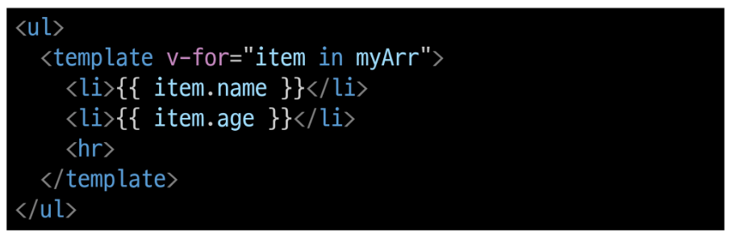

- 중첩된 v-for

  - 각 v-for의 하위 영역(scope)은 상위 영역에 접근할 수 있음

    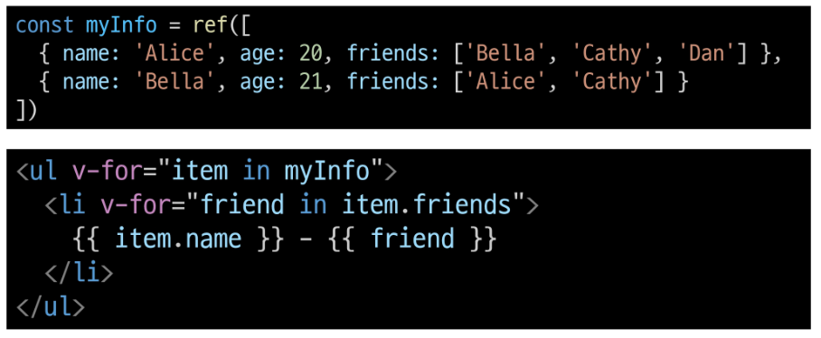

### v-for with key

- **반드시 v-for와 key를 함께 사용한다**

  - 내부 컴포넌트의 상태를 일관 되게 하여 데이터의 예측 가능한 행동을 유지하기 위함

- v-for와 key

  - key는 반드시 각 요소에 대한 **고유한 값을 나타낼 수 있는 식별자**여야 함

    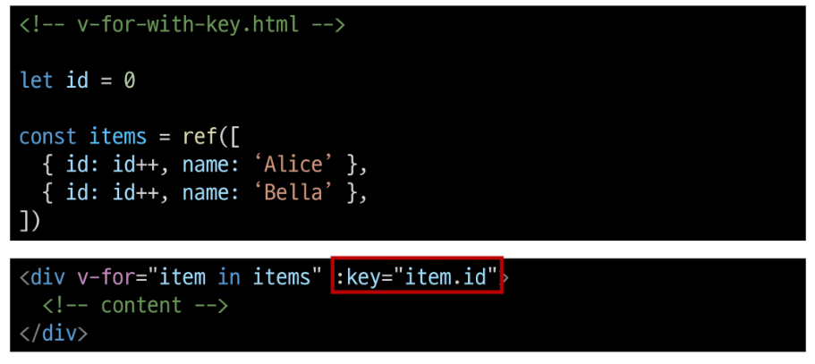

- 내장 특수 속성 'key'

      - number 혹은 string으로만 사용해야 함

      - Vue의 내부 가상 DOM 알고리즘이 이전 목록과 새 노드 목록을 비교할 때 각 node를 식별하는 용도로 사용

      ⇨ Vue 내부 동작 관련된 부분이기에 최대한 작성하려고 노력할 것

      - https://vuejs.org/api/built-in-special-attributes.html#key

### v-for with v-if

- **동일 요소에 v-for와 v-if를 함께 사용하지 않는다**

  - 동일한 요소에서 v-if가 v-for보다 우선순위가 더 높기 때문

  - v-if에서의 조건은 v-for 범위의 변수에 접근할 수 없음

- v-for와 v-if 문제 상황

  - todo 데이터 중 이미 처리한(isComplete === true) todo 만 출력하기

    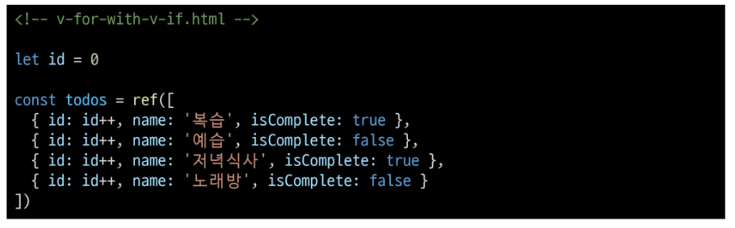

  - v-if가 더 높은 우선순위를 가지므로 v-for 범위의 todo 데이터를 v-if에서 사용할 수 없음

    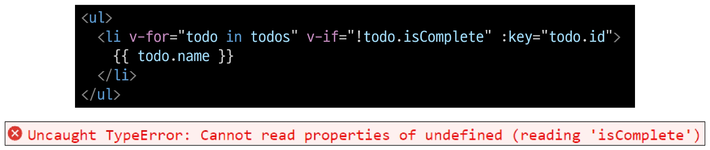

- v-for와 v-if 해결법 2가지

      1. computed 활용

      2. v-for와 <template>요소 활용

- v-for와 v-if 해결법

  1. **computed를 활용해 이미 필터링 된 목록을 반환하여 반복**하도록 설정

      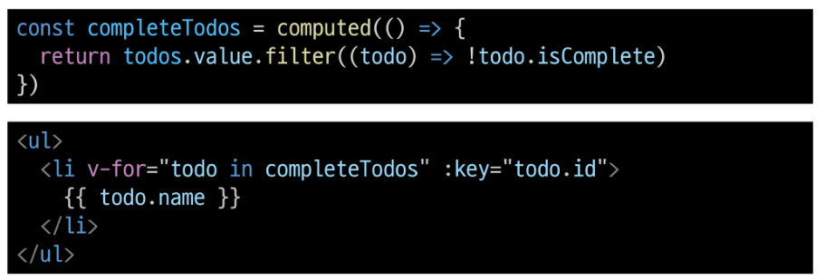

  2. v-for와 template 요소를 사용하여 **v-if 위치를 이동**

      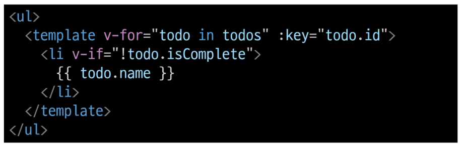

## Watchers

### watch

- watch()

  - 하나 이상의 반응형 데이터를 감시하고, 감시하는 데이터가 변경되면 콜백 함수를 호출

- watch 구조

  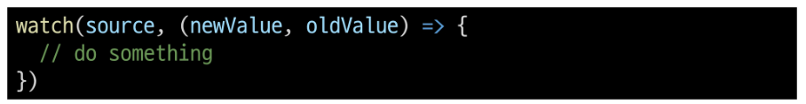

  - 첫번째 인자 (source)
    
    - watch가 감시하는 대상 (반응형 변수, 값을 반환하는 함수 등)

  - 두번째 인자 (callback function)

    - source가 변경될 때 호출되는 콜백 함수

    1. newValue

        - 감시하는 대상이 변화된 값

    2. oldValue (optoinal)

        - 감시하는 대상의 기존 값

- watch 기본 동작

  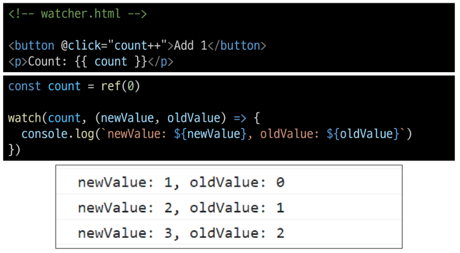

- watch 예시

  - 감시하는 변수에 변화가 생겼을 때 연관 데이터 업데이트하기

    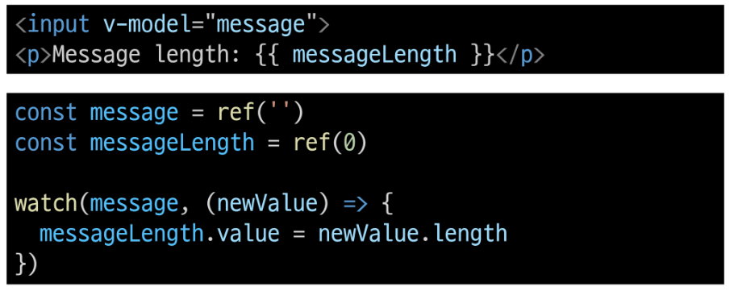

    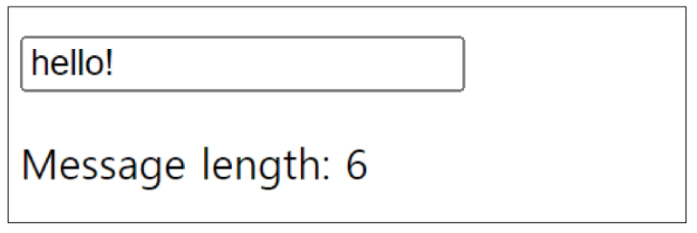

- 여러 source를 감시하는 watch

  - 배열을 활용하여 여러 대상을 감시할 수 있음

    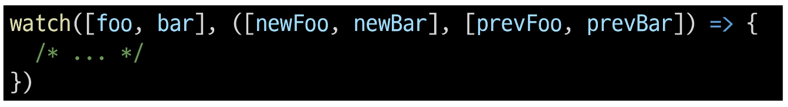

### computed vs. watch

- Computed와 Watchers
  
  <table style="text-align:center">
    <tr>
      <th scope="col"></td>
      <th scope="col" style="text-align:center">Computed</td>
      <th scope="col" style="text-align:center">Watchers</td>
    </tr>
    <tr>
      <td>공통점</td>
      <td colspan="2">데이터의 변화를 감지하고 처리</td>
    </tr>
    <tr>
      <td>동작</td>
      <td>의존하는 데이터 속성의 계산된 값을 반환</td>
      <td>특정 데이터 속성의 변화를 감시하고 작업을 수행(side-effects)</td>
    </tr>
    <tr>
      <td>사용 목적</td>
      <td>계산한 값을 캐싱하여 재사용 중복 계산 방지</td>
      <td>데이터 변화에 따른 특정 작업을 수행</td>
    </tr>
    <tr>
      <td>사용 예시</td>
      <td>연산된 길이, 필터링 된 목록 계산 등</td>
      <td>DOM 변경, 다른 비동기 작업 수행, 외부 API와 연동 등</td>
    </tr>
  </table>
  
  - **computed와 watch 모두 의존(감시)하는 원본 데이터를 직접 변경하지 않음**

## Lifecycle Hooks

- Lifecycle Hooks

  - Vue 컴포넌트의 생성부터 소멸까지 각 단계에서 실행되는 함수

- Lifecycle Hooks Diagram

  - 컴포넌트의 생애 주기 중간 중간에 함수를 제공

  - 개발자는 컴포넌트의 특정 시점에 원하는 로직을 실행할 수 있음

    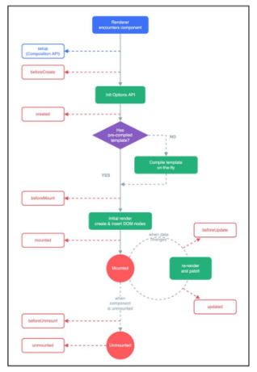

  - [https://vuejs.org/guide/essentials/lifecycle.html#lifecycle-diagram](https://vuejs.org/guide/essentials/lifecycle.html#lifecycle-diagram)

- Lifecycle Hooks 활용 예시 1 - Mounting

  - Vue 컴포넌트 인스턴스가 **초기 렌더링 및 DOM 요소 생성이 완료된 후** 특정 로직을 수행하기

    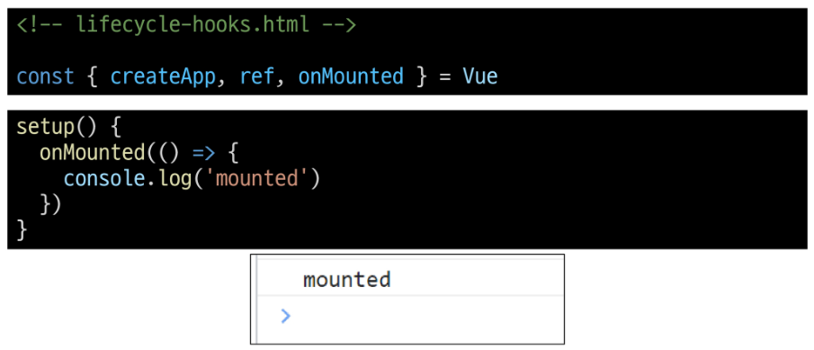

- Lifecycle Hooks 활용 예시 2 - Updating

  - 반응형 데이터의 변경으로 인해 컴포넌트의 **DOM이 업데이트된 후** 특정 로직을 수행하기

    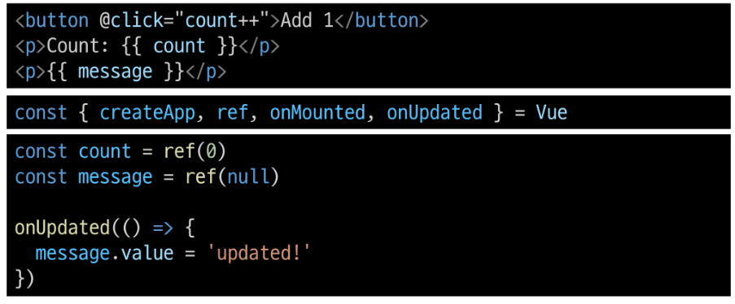

    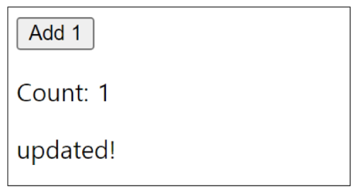

- 주요 Lifecycle Hooks

  - 생성 단계 / 마운트 단계 / 업데이트 단계 / 소멸 단계 등 다양한 단계 존재

  - 가장 일반적으로 사용되는 것은 onMounted, onUpdated, onUnmounted

  - [https://vuejs.org/api/composition-api-lifecycle.html](https://vuejs.org/api/composition-api-lifecycle.html)

## Vue Style Guide

- Vue Style Guide

  - Vue의 스타일 가이드 규칙은 우선순위에 따라 4가지 범주로 나뉨

  - 규칙 범주

    - 우선순위 A : 필수 (Essential)

    - 우선순위 B : 적극 권장 (Strongly Recommended)

    - 우선순위 C : 권장 (Recommended)

    - 우선순위 D : 주의 필요 (Use with Caution)

  - [https://vuejs.org/style-guide/](https://vuejs.org/style-guide/)

- 우선순위 별 특징

  - A : 필수 (Essential)

    - 오류를 방지하는 데 도움이 되므로 어떤 경우에도 규칙을 학습하고 준수

  - B : 적극 권장 (Strongly Recommended)

    - 가독성 및/또는 개발자 경험을 향상시킴

    - 규칙을 어겨도 코드는 여전히 실행되겠지만, 정당한 사유가 있어야 규칙을 위반할 수 있음

  - C : 권장 (Recommended)

    - 일관성을 보장하도록 임의의 선택을 할 수 있음

  - D : 주의 필요 (Use with Caution)

    - 잠재적 위험 특성을 고려함

- 우선순위 A였던 금일 학습 내용

  1. v-for에 key 작성하기

  2. 동일 요소에 v-if와 v-for 함께 사용하지 않기

    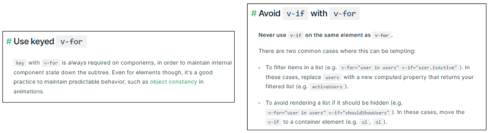

## 참고

### computed 주의사항

#### 1. computed의 반환 값은 변경하지 말 것

- computed의 반환 값은 의존하는 데이터의 파생된 값

  - 이미 의존하는 데이터에 의해 계산이 완료된 값

- 일종의 snapshot이며 의존하는 데이터가 변경될 때만 새 snapshot이 생성됨

- 계산된 값은 읽기 전용으로 취급되어야 하며 변경되어서는 안됨

- 대신 새 값을 얻기 위해서는 의존하는 데이터를 업데이트 해야 함

#### 2. computed 사용 시 원본 배열 변경하지 말 것

- computed에서 reverse() 및 sort() 사용 시 원본 배열을 변경하기 때문에 원본 배열의 복사본을 만들어서 진행 해야 함

  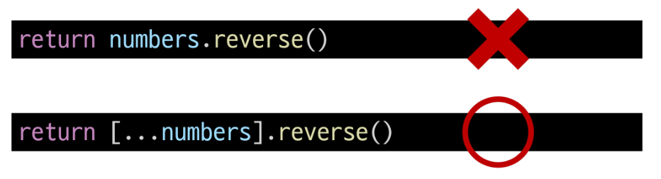

### Lifecycle Hooks 주의사항

- Lifecycle Hooks는 동기적으로 작성할 것

  1. 컴포넌트 상태의 일관성 유지

      - 컴포넌트의 생명주기 동안 상태가 예측 가능하고 일관되게 유지되도록 보장

      - 비동기적으로 실행될 경우, 컴포넌트의 상태가 예상치 못한 시점에 변경될 수 있어 버그 발생 가능성이 높아짐

  2. Vue 내부 메커니즘과의 동기화

      - Vue의 내부 로직은 컴포넌트의 라이프사이클에 맞춰 최적화되어 있음

      - 동기적 실행을 통해 Vue의 내부 프로세스와 개발자가 작성한 코드가 정확히 동기화될 수 있음

  - 비동기적으로 작성한 lifecycle hook 예시

    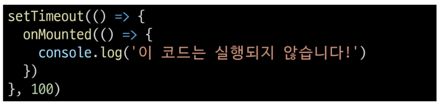

### 배열과 v-for 관련

- 배열 변경 관련 메서드

  - v-for와 배열을 함께 사용 시 배열의 메서드를 주의해서 사용해야 함

    1. 변화 메서드

        - 호출하는 원본 배열을 변경

        - push(), pop(), shift(), unshift(), splice(), sort(), reverse()

    2. 배열 교체

        - 원본 배열을 수정하지 않고 항상 새 배열을 반환
        
        - filter(), concat(), slice()

- v-for와 배열을 활용해 "필터링/정렬" 활용하기

  - 원본 데이터를 수정하거나 교체하지 않고 필터링하거나 정렬된 새로운 데이터를 표시하는 방법

    1. computed 활용

    2. method 활용 (computed가 불가능한 중첩된 v-for에 경우 사용)

#### 1. computed 활용

- 원본 기반으로 필터링 된 새로운 결과를 생성

  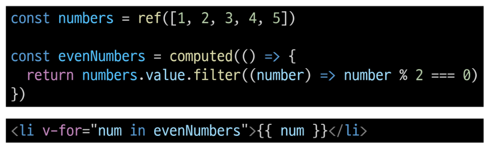

#### 2. method 활용

- computed가 불가능한 중첩된 v-for에 경우

  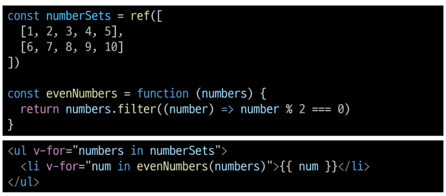

#### ※주의※ 배열의 인덱스를 v-for의 key로 사용하지 말 것

  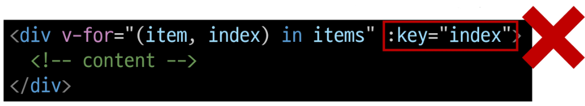

  - 인덱스는 식별자가 아닌 배열의 항목 위치만 나타내기 때문

  - 만약 새 요소가 배열의 끝이 아닌 위치 삽입되면 이미 반복된 구성 요소 데이터가 함께 업데이트되지 않기 때문

  - 직접 고유한 값을 만들어내는 메서드를 만들거나 외부 라이브러리 등을 활용하는 등 식별자 역할을 할 수 있는 값을 만들어 사용

