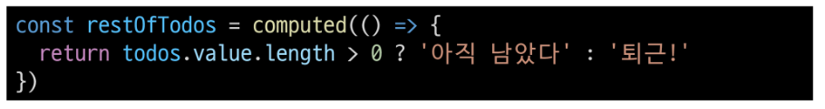

# 2024년 11월 5일(화) 수업 내용 정리 - Basic Syntax 2

- Computed Property

  - Computed
  - Computed vs. Methods

- Conditional Rendering

  - v-if
  - v-if vs. v-show

- List Rendering

  - v-for
  - v-for with key
  - v-for with v-if

- Watchers

  - watch
  - computed vs. watch

- Lifecycle Hooks

- Vue Style Guide

- 참고

  - computed 주의사항
  - Lifecycle Hooks 주의사항
  - 배열과 v-for 관련

## Computed Property

### Computed

- computed()

  - "계산된 속성"을 정의하는 함수

  - 미리 계산된 속성을 사용하여 템플릿에서 표현식을 단순하게 하고 불필요한 반복 연산을 줄임

- computed가 필요한 경우

  - 할 일이 남았는지 여부에 따라 다른 메시지를 출력하기

    

  - 템플릿이 복잡해지며 todos에 따라 계산을 수행하게 됨

  - 만약 이 계산을 템플릿에 여러 번 사용하는 경우에는 반복이 발생

  - computed 적용 후

  - 반응형 데이터를 포함하는 복잡한 로직의 경우 computed를 활용하여 미리 값을 계산하여 계산된 값을 사용

    

- computed 특징

  - 반환되는 값은 computed ref이며 일반 refs와 유사하게 계산된 결과를 .value로 참조할 수 있음 (템플릿에서는 .value 생략 가능)

  - computed 속성은 의존된 반응형 데이터를 **자동으로 추적**

  - 의존하는 데이터가 **변경될 때만 재평가**

    - restOfTodos의 계산은 todos에 의존하고 있음
    
    - 따라서 todos가 변경될 때만 restOfTodos가 업데이트 됨

      

### Computed vs. Methods

- computed와 동일한 로직을 처리할 수 있는 method

  - computed 속성 대신 method로도 동일한 기능을 정의할 수 있음

    

- computed와 method 차이

  - computed 속성은 **의존된 반응형 데이터를 기반으로 캐시(cached)**됨

  - 의존하는 데이터가 변경된 경우에만 재평가됨

  - 즉, 의존된 반응형 데이터가 변경되지 않는 한 이미 계산된 결과에 대한 여러 참조는 다시 평가할 필요 없이 이전에 계산된 결과를 즉시 반환

  - 반면, method 호출은 다시 렌더링이 발생할 때마다 항상 함수를 실행

- Cache (캐시)

  - 데이터나 결과를 일시적으로 저장해두는 임시 저장소
  
  - 이후에 같은 데이터나 결과를 다시 계산하지 않고 빠르게 접근할 수 있도록 함

- Cache 예시

  - "웹 페이지의 캐시 데이터"

    - 과거 방문한 적 있는 페이지에 다시 접속할 경우

    - 페이지 일부 데이터를 브라우저 캐시에 저장 후 같은 페이지에 다시 요청 시 모든 데이터를 다시 응답 받는 것이 아닌 일부 캐시 된 데이터를 사용하여 더 빠르게 웹 페이지를 렌더링

      

- computed와 method의 적절한 사용처

  - computed

    - 의존하는 데이터에 따라 결과가 바뀌는 계산된 속성을 만들 때 유용

    - 동일한 의존성을 가진 여러 곳에서 사용할 때 계산 결과를 캐싱하여 중복 계산 방지

  - method

    - 단순히 특정 동작을 수행하느 함수를 정의할 때 사용

    - 데이터에 의존하는지 여부와 관계없이 항상 동일한 결과를 반환하는 함수
    

- method와 computed 정리

  - computed

    - 의존된 데이터가 변경되면 자동으로 업데이트

  - method

    - 호출해야만 실행됨

  - 무조건 computed만 사용하는 것이 아니라 사용 목적과 상황에 맞게 computed와 method를 적절히 조합하여 사용

## Conditional Rendering

### v-if

- v-if

  - 표현식 값의 true/false를 기반으로 요소를 조건부로 렌더링

- v-if 활용

  

- v-if

  - 'v-if directive를 사용하여 조건부로 렌더링

    

- v-else

  - 'v-else' directive를 사용하여 v-if에 대한 else 블록을 나타낼 수 있음

    

- v-else-if

  - 'v-else-if' directive를 사용하여 v-if에 대한 else if 블록을 나타낼 수 있음

    

- 여러 요소에 대한 v-if 적용

  - HTML template 요소에 v-if를 사용하여 하나 이상의 요소에 대해 적용할 수 있음 (v-else, v-else-if 모두 적용 가능)

    

- HTML \<template> element

  - 페이지가 로드될 때 렌더링 되지 않지만 JavaScript를 사용하여 나중에 문서에서 지정할 수 있도록 하는 HTML을 보유하기 위한 메커니즘

  - "보이지 않는 wrapper 역할"

### v-if vs. v-show

## List Rendering

### v-for

### v-for with key

### v-for with v-if

## Watchers

### watch

### computed vs. watch

## Lifecycle Hooks

## Vue Style Guide

## 참고

### computed 주의사항

### Lifecycle Hooks 주의사항

### 배열과 v-for 관련