# 2024년 11월 6일(수) 수업 내용 정리 - Single-File Components

- Single-File Components

  - Component
  - SFC 구성요소

- SFC build tool

  - Vite
  - Vue Project
  - NPM
  - 모듈과 번들러

- Vue Project 구조

- Vue Component 활용

- 추가 주제

  - Virtual DOM
  - Composition API & Option API

- 참고

  - Single Root Element
  - CSS scoped
  - Scaffolding

## Single-File Components

### Component

- Component

  - 재사용 가능한 코드 블록

- Component 특징

  - UI를 독립적이고 재사용 가능한 일부분으로 분할하고 각 부분을 개별적으로 다룰 수 있음

  - 자연스럽게 애플리케이션은 중첩된 Component의 트리 형태로 구성됨

    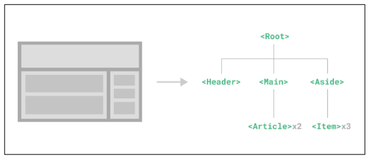

- Component 예시

  - 웹 서비스는 여러 개의 Component로 이루어져 있음

    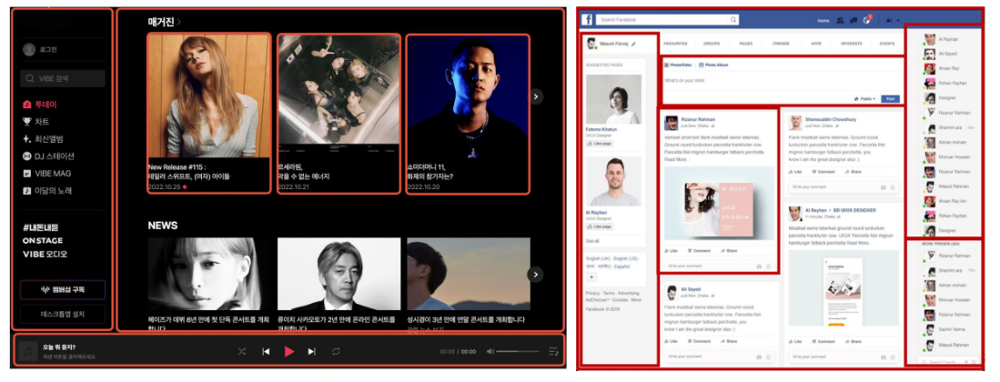

- Single-File Components(SFC)

  - 컴포넌트의 템플릿, 로직 및 스타일을 하나의 파일로 묶어낸 특수한 파일 형식(*.vue 파일)

- SFC 파일 예시

  - Vue SFC는 HTML, CSS 및 JavaScript를 단일 파일로 합친 것

  - \<template>, \<script>, 및 \<style> 블록은 하나의 파일에서 컴포넌트의 뷰, 로직 및 스타일을 독립적으로 배치

    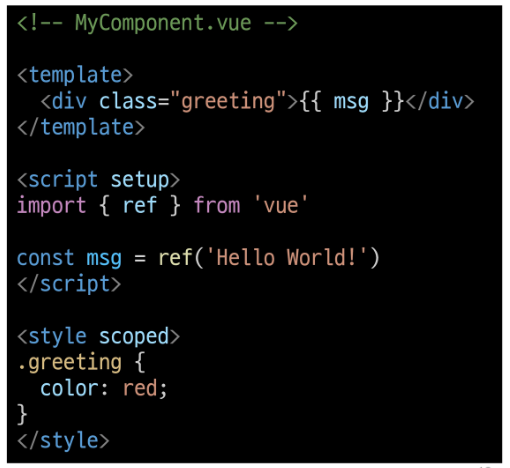

### SFC 구성요소

- SFC 구성요소

  - 각 *.vue 파일은 세 가지 유형의 최상위 언어 블록 \<template>, \<script>, \<style>으로 구성됨

  - 언어 블록의 작성 순서는 상관 없으나 일반적으로 template → script → style 순서로 작성

    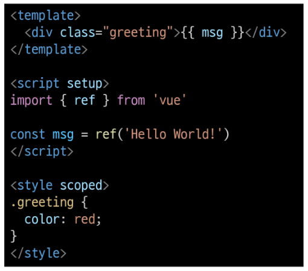

- \<template> 블록

  - 각 *.vue 파일은 최상위 \<template> 블록을 하나만 포함할 수 있음

    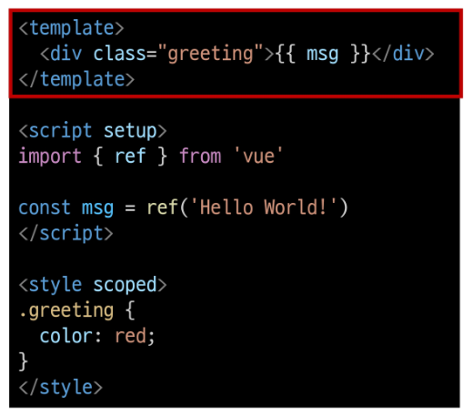

- \<script steup> 블록

  - 각 *.vue 파일은 \<script setup> 블록을 하나만 포함할 수 있음(일반 \<script> 제외)

  - 컴포넌트의 setup() 함수로 사용되며 컴포넌트의 각 인스턴스에 대해 실행

  - 변수 및 함수는 동일한 컴포넌트의 템플릿에서 자동으로 사용 가능

- \<style scoped> 블록

  - *.vue 파일에는 여러 \<style> 태그가 포함될 수 있음

  - scoped가 지정되면 CSS는 현재 컴포넌트에만 적용됨

    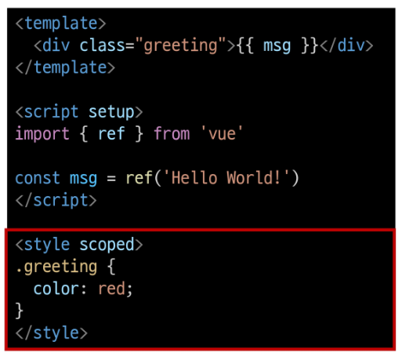

- 컴포넌트 사용하기

  - [https://play.vuejs.org/](https://play.vuejs.org/) 에서 Vue 컴포넌트 코드 작성 및 미리보기

  - Vue SFC는 일반적인 방법으로 실행할 수 없으며 컴파일러를 통해 컴파일 된 후 빌드 되어야 함

  - 실제 프로젝트에서는 Vite와 같은 공식 빌드(build) 도구를 사용

    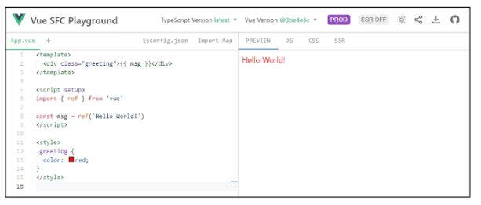

## SFC build tool

### Vite

  

  - 프론트 엔드 개발 도구

  - 빠른 개발 환경을 위한 빌드 도구와 개발 서버를 제공

  - [https://vitejs.dev/](https://vitejs.dev/)

- Build

      - 프로젝트의 소스 코드를 최적화하고 번들링하여 배포할 수 있는 형식으로 변환하는 과정

      - 개발 중에 사용되는 여러 소스 파일 및 리소스(JavaScript, CSS, 이미지 등)을 최적화된 형태로 조합하여 최종 소프트웨어 제품을 생성하는 것

      ⇨ Vite는 이러한 빌드 프로세스를 수행하는 데 사용되는 도구

### Vue Project

- Vue Project 생성

  - Vue Project (Application) 생성 (Vite 기반 빌드)

    

  - 프로젝트 설정 관련 절차 진행(하단 스크린샷 참고)

    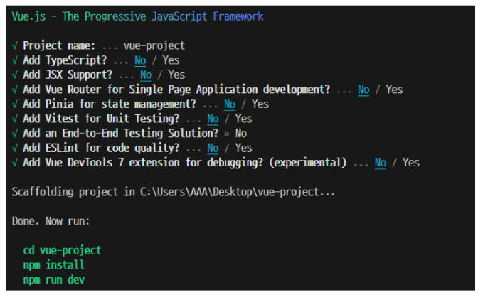

  - 프로젝트 폴더 이동

    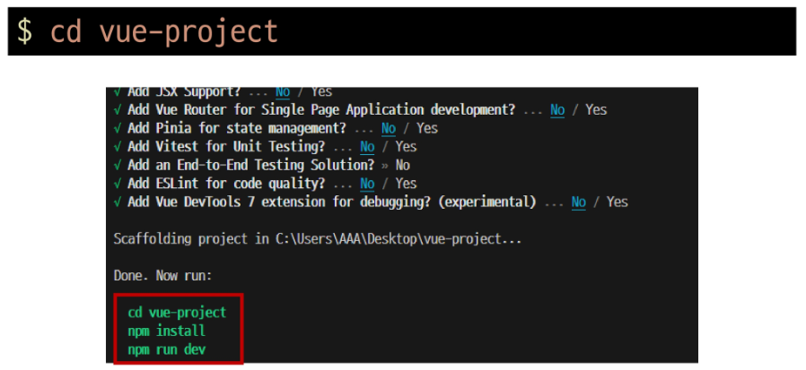

  - 패키지 설치

    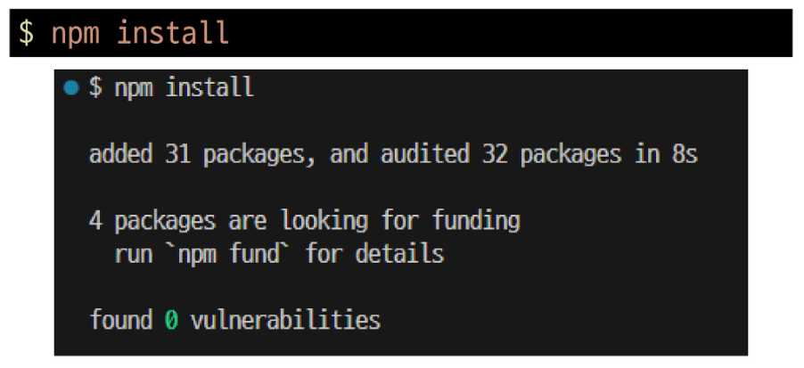

  - Vue 프로젝트 서버 실행

    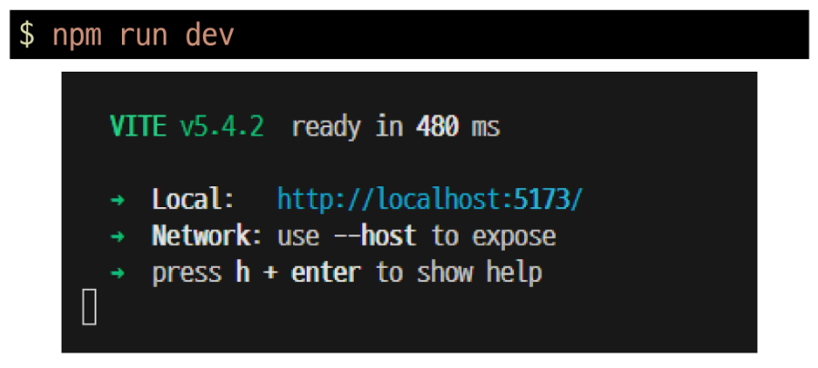

  - Vue 프로젝트 실행 결과

    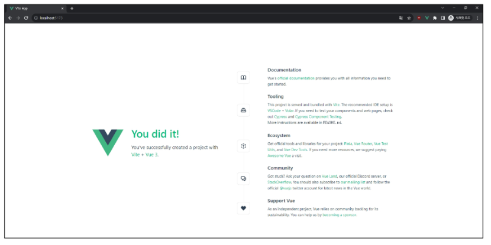

  - Vue 프로젝트 구성

    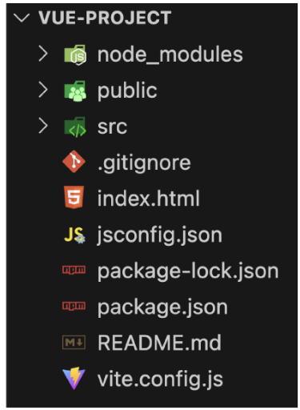

### NPM

- Node Package Manager(NPM)

  - Node.js의 기본 패키지 관리자

### 모듈과 번들러

## Vue Proejct 구조

## Vue Component 활용

## 추가 주제

### Virtual DOM

### Composition API & Option API

## 참고

### Single Root Element

### CSS scoped

### Scaffolding
