# 2024년 11월 7일(목) 수업 내용 정리 - Component State Flow

- Passing Props

  - Props
  - Props 선언
  - Props 세부사항
  - Props 활용

- Component Events

  - Emit
  - 이벤트 발신 및 수신
  - emit 이벤트 선언
  - 이벤트 전달
  - 이벤트 세부사항
  - emit 이벤트 활용

- 참고

  - 정적 & 동적 props 주의사항
  - Props & Emit 객체 선언 문법

## Passing Props

### Props

- 동일한 데이터, 하지만 다른 컴포넌트

  - 동일한 사진 데이터가 한 화면에 다양한 위치에서 여러 번 출력되고 있음

  - 하지만 해당 페이지를 구성하는 컴포넌트가 여러 개라면 각 컴포넌트가 개별적으로 동일한 데이터를 관리해야 할까?

  - 그렇다면 사진을 변경 해야 할 때 모든 컴포넌트에 대해 변경 요청을 해야 함

  - "공통된 부모 컴포넌트에서 관리하자"

    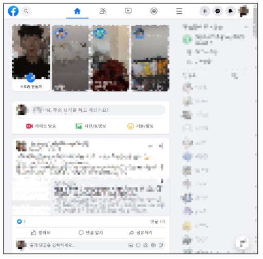

    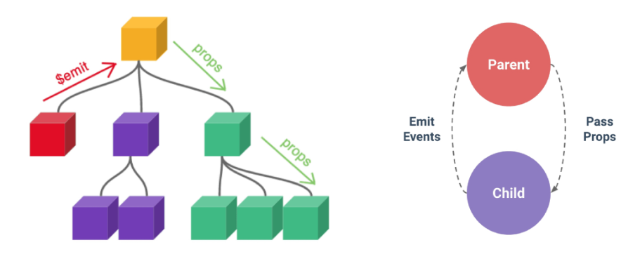

    - 부모는 자식에게 데이터를 전달(Pass Props)하며, 자식은 자신에게 일어난 일을 부모에게 알림(Emit event)

- Props

  - 부모 컴포넌트로부터 자식 컴포넌트로 데이터를 전달하는데 사용되는 속성

- Props 특징

  - 부모 속성이 업데이트되면 자식으로 전달 되지만 그 반대는 안됨

  - 즉, 자식 컴포넌트 내부에서 props를 변경하려고 시도해서는 안되며 불가능

  - 또한 부모 컴포넌트가 업데이트될 때마다 이를 사용하는 자식 컴포넌트의 모든 props가 최신 값으로 업데이트 됨

  - 부모 컴포넌트에만 변경하고 이를 내려 받는 자식 컴포넌트는 자연스럽게 갱신

- One-Way Data Flow

  - 모든 props는 자식 속성과 부모 속성 사이에 **하향식 단방향 바인딩**을 형성(one-way-down binding)

- 단방향인 이유

  - 하위 컴포넌트가 실수로 상위 컴포넌트의 상태를 변경하여 앱에서의 데이터 흐름을 이해하기 어렵게 만드는 것을 방지하기 위함

  - 데이터 흐름의 "일관성" 및 "단순화"

### Props 선언

- 사전 준비

  1. vue 프로젝트 생성

  2. 초기 생성된 컴포넌트 모두 삭제 (App.vue 제외)

  3. src/assets 내부 파일 모두 삭제

  4. main.js 해당 코드 삭제

      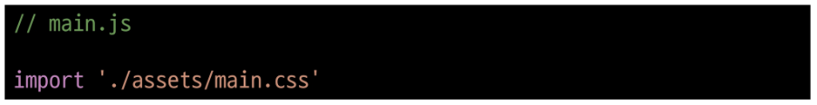

  5. App > Parent > ParentChild 컴포넌트 관계 작성

      - App 컴포넌트 작성

        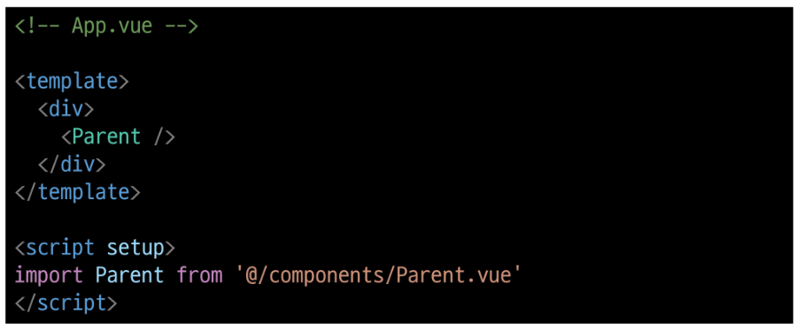

      - Parent 컴포넌트 작성

        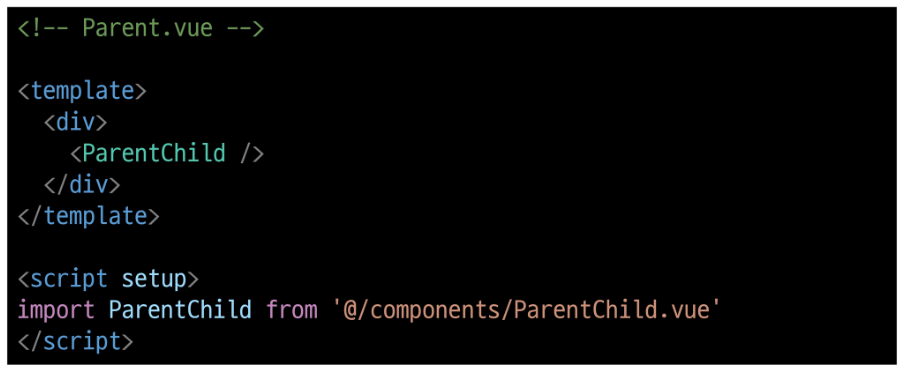

      - ParentChild 컴포넌트 작성

        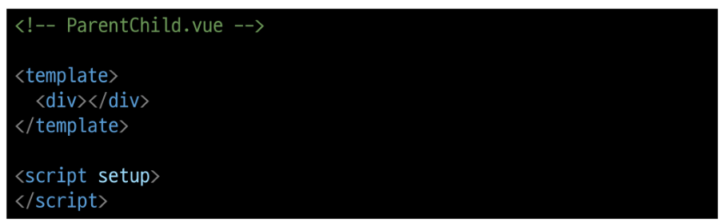

- Props 선언

  - 부모 컴포넌트에서 내려 보낸 props를 사용하기 위해서는 자식 컴포넌트에서 명시적인 props 선언이 필요

- Props 작성

  - 부모 컴포넌트 Parent에서 자식 컴포넌트 ParentChild에 보낼 props 작성

    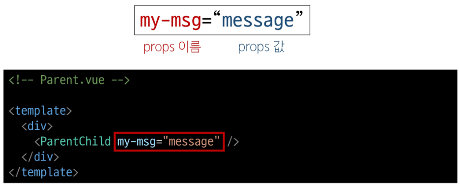

- Props 선언

  - defineProps()를 사용하여 props를 선언

  - defineProps()에 작성하는 인자의 데이터 타입에 따라 선언 방식이 나뉨

    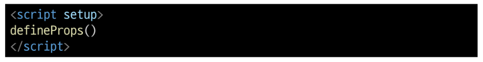

- Props 선언 2가지 방식

  1. "문자열 배열"을 사용한 선언

  2. "객체"를 사용한 선언

#### 1. 문자열 배열을 사용한 선언

- 배열의 문자열 요소로 props 선언

- 문자열 요소의 이름은 전달된 props의 이름

  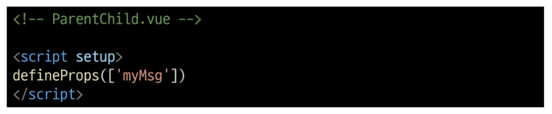

#### 2. 객체를 사용한 선언

- 각 객체 속성의 키가 전달받은 props 이름이 되며, 객체 속성의 값은 값이 될 데이터의 타입에 해당하는 생성자 함수(Number, String ...)여야 함

- **객체 선언 문법 사용 권장**

  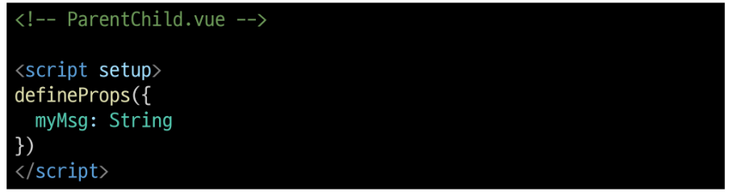

- props 데이터 사용

  - props 선언 후 템플릿에서 반응형 변수와 같은 방식으로 활용

    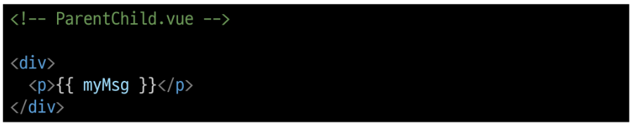

  - props를 객체로 반환하므로 필요한 경우 JavaScript에서 접근 가능

    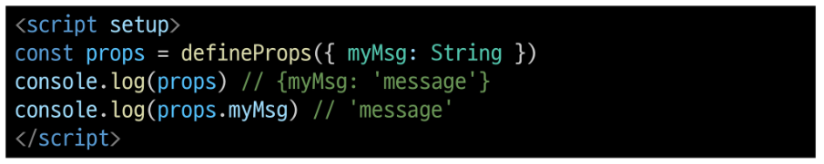

  - props 출력 결과 확인

    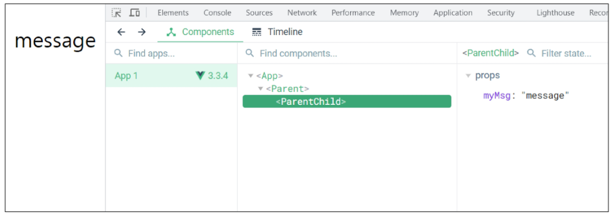

- 한 단계 더 props 내려 보내기

  - ParentChild 컴포넌트를 부모로 갖는 ParentGrandChild 컴포넌트 생성 및 등록

    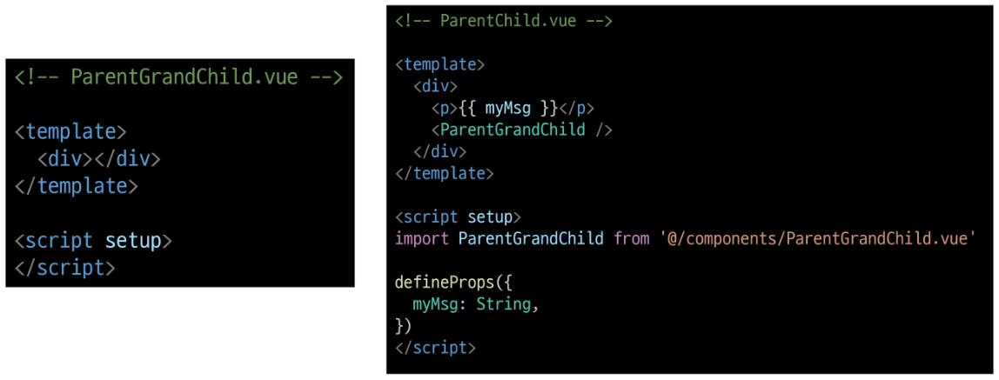

  - ParentChild 컴포넌트에서 Parent로부터 받은 props인 myMsg를 ParentGrandChild에게 전달

    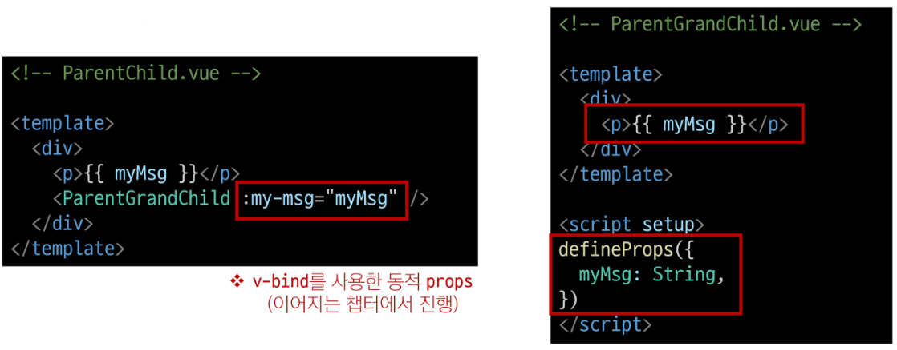

  - 출력 결과 확인

  - ParentGrandChild가 받아서 출력하는 props은 Parent에 정의 되어있는 props이며 Parent가 props을 변경할 경우 이를 전달받고 있는 ParentChild, ParentGrandChild에서도 모두 업데이트 됨

    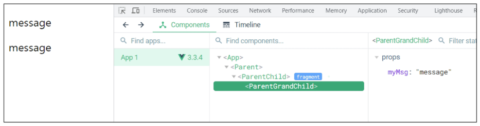

    

### Props 세부사항

### Props 활용

## Component Events

### Emit

### 이벤트 발신 및 수신

### emit 이벤트 선언

### 이벤트 전달

### 이벤트 세부사항

### emit 이벤트 활용

## 참고

### 정적 & 동적 props 주의사항

### Props & Emit 객체 선언 문법