# 2024년 11월 11일(월) 수업 내용 정리 - Vue Router

- Routing

- Vue Router

  - Basic Routing
  - Named Routes
  - Dynamic Route Matching
  - Nested Routes
  - Programmatic Navigation

- Navigation Guard

  - Globally Guard
  - Per-route Guard
  - In-component Guard

- 참고

  - Lazy Loading Routes

## Routing

- Routing

  - 네트워크에서 경로를 선택하는 프로세스
  
  - 웹 애플리케이션에서 다른 페이지 간의 전환과 경로를 관리하는 기술

- SSR에서의 Routing

  

  - SSR에서 routing은 서버 측에서 수행

  - 서버가 사용자가 방문한 URL 경로를 기반으로 응답을 전송

  - 링크를 클릭하면 브라우저는 서버로부터 HTML 응답을 수신하고 새 HTML로 전체 페이지를 다시 로드

- CSR에서의 Routing

  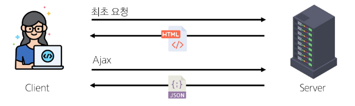

  - CSR에서 routing은 **클라이언트 측**에서 수행

  - 클라이언트 측 JavaScript가 새 데이터를 동적으로 가져와 전체 페이지를 다시 로드 하지 않음

- SPA에서 Routing이 없다면

  - 유저가 URL을 통한 페이지의 변화를 감지할 수 없음

  - 페이지가 무엇을 렌더링 중인지에 대한 상태를 알 수 없음

    - URL이 1개이기 때문에 새로 고침 시 처음 페이지로 되돌아감

    - 링크를 공유할 시 첫 페이지만 공유 가능

  - 브라우저의 뒤로 가기 기능을 사용할 수 없음

  - 페이지는 1개이지만, 주소에 따라 여러 컴포넌트를 새로 렌더링 하여 마치 여러 페이지를 사용하는 것처럼 보이도록 해야 함

## Vue Router

- Vue Router

  - Vue 공식 라우터(The official Router for Vue.js)

- 사전 준비

  - Vite로 프로젝트 생성 시 Router 추가

    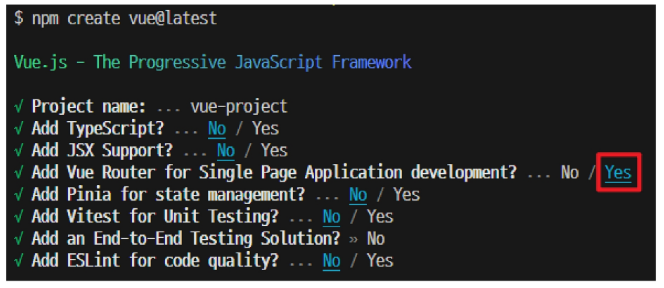

  - 서버 실행 후 Router로 인한 프로젝트 변화 확인

  - Home, Abaout 링크에 따라 변경되는 URL과 새로 렌더링 되는 화면

    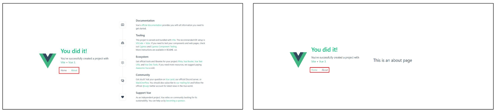

- Vue 프로젝트 구조 변화

  1. App.vue 코드 변화

  2. router 폴더 신규 생성

  3. views 폴더 신규 생성

    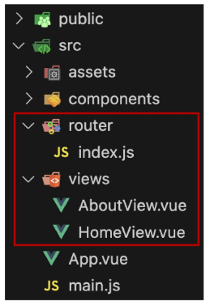

- RouterLink

  - 페이지를 다시 로드하지 않고 URL을 변경하여 URL 생성 및 관련 로직을 처리

  - HTML의 \<a> 태그를 렌더링

    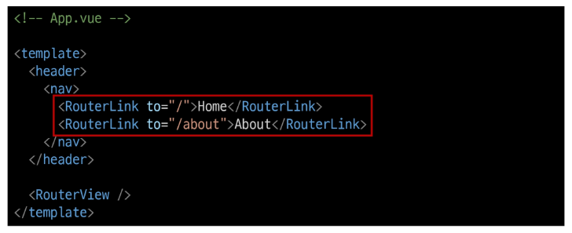

- RouterView

  - RouterLink URL에 해당하는 컴포넌트를 표시

  - 원하는 곳에 배치하여 컴포넌트를 레이아웃에 표시할 수 있음

    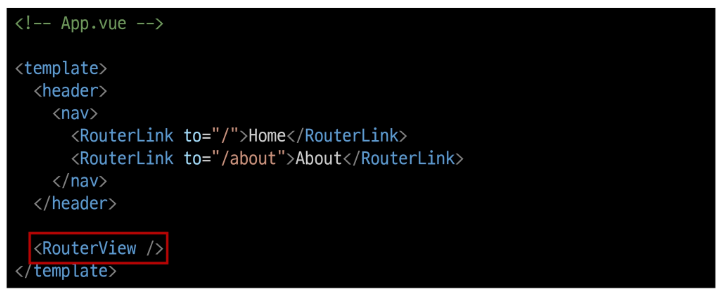

- RouterLink와 RouterView

  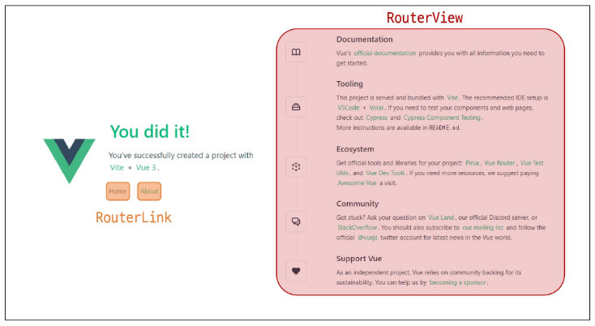

- router/index.js

  - 라우팅에 관련된 정보 및 설정이 작성되는 곳

  - router에 URL과 컴포넌트를 매핑

    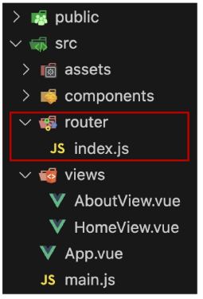

- views

  - RouterView 위치에 렌더링 할 컴포넌트를 배치

  - 기존 components 폴더와 기능적으로 다른 것은 없으며 단순 분류의 의미로 구성됨

  - **일반 컴포넌트와 구분하기 위해 컴포넌트 이름을 View로 끝나도록 작성하는 것을 권장**

### Basic Routing

- 라우팅 기본

1. index.js에 라우터 관련 설정 작성(주소, 이름, 컴포넌트)

    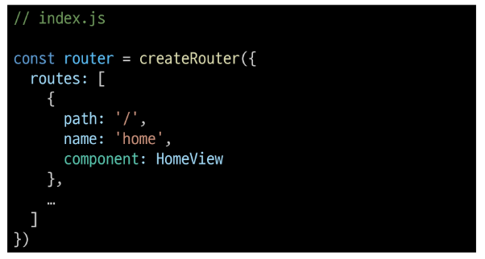

2. RouterLink의 'to' 속성으로 index.js에서 정의한 주소 값(path)을 사용

    

3. RouterLink 클릭 시 경로와 일치하는 컴포넌트가 RouterView에서 렌더링 됨

    

### Named Routes

- Named Routes

  - 경로에 이름을 지정하는 라우팅

- Named Routes 예시

  - name 속성 값에 경로에 대한 이름을 지정

  - 경로에 연결하려면 RouterLink에 v-bind를 사용해 'to' props 객체로 전달

    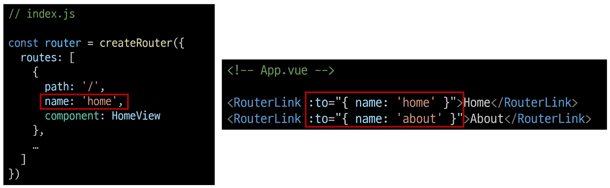

- Named Routes 장점

  - 하드 코딩 된 URL을 사용하지 않아도 됨

  - URL 입력 시 오타 방지

### Dynamic Route Matching

- Dynamic Route Matching

  - URL의 일부를 변수로 사용하여 경로를 동적으로 매칭

- 매개변수를 사용한 동적 경로 매칭

  - 주어진 패턴 경로를 동일한 컴포넌트에 매핑 해야 하는 경우 활용

  - 예를 들어 모든 사용자의 ID를 활용하여 프로필 페이지 URL을 설계 한다면?

    - user/1

    - user/2

    - user/3

    - 일정한 패턴의 URL 작성을 반복해야 함

- 매개변수를 사용한 동적 경로 매칭 활용

  - views 폴더 내 UserView 컴포넌트 작성

    

  - 매개변수는 콜론(":")으로 표기

  - UserView 컴포넌트 라우트 등록

    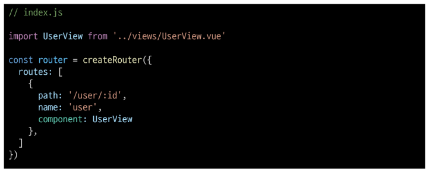

  - 매개변수는 객체의 params 속성의 객체 타입으로 전달

  - 단, 객체의 key 이름과 index.js에서 지정한 매개변수 이름이 같아야 함

  - UserView 컴포넌트로 이동하기 위한 RouterLink 작성

    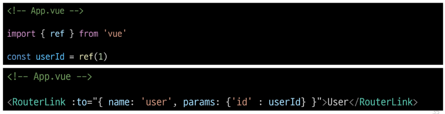

  - 경로가 일치하면 라우트의 매개변수는 컴포넌트에서 **$route.params**로 참조 가능

  - 현재 사용자의 id를 출력하기

    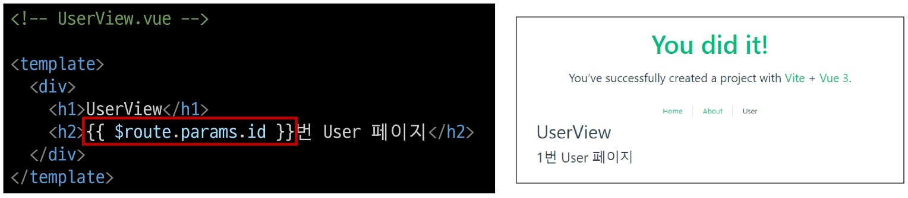

  - useRoute() 함수를 사용해 스크립트 내에서 반응형 변수에 할당 후 템플릿에 출력하는 것을 권장

  - 템플릿에서 $route를 사용하는 것과 동일

    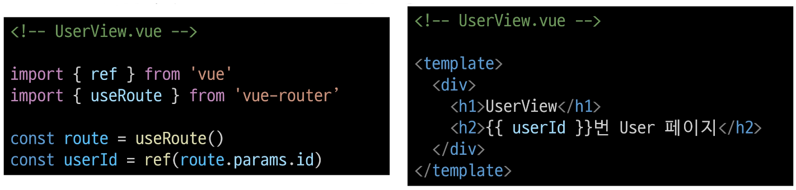

### Nested Routes

- Nested Routes

  - 중첩된 라우팅

    

  - 애플리케이션의 UI는 여러 레벨 깊이로 중첩된 컴포넌트로 구성되기도 함

  - 이 경우 URL을 중첩된 컴포넌트의 구조에 따라 변경되도록 이 관계를 표현할 수 있음

- 중첩된 라우팅 활용

  - 컴포넌트 생성
  
  - components 폴더에 UserProfile, UserPosts 컴포넌트 작성

    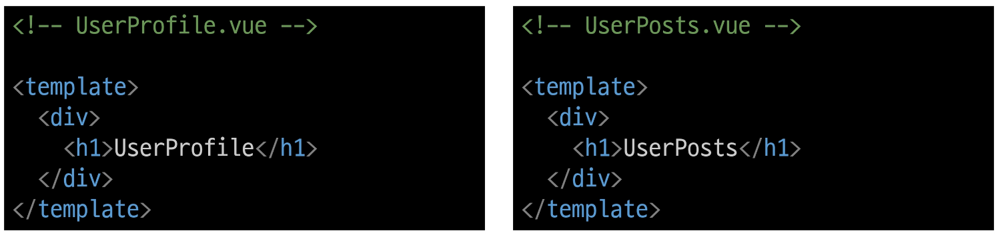

  - 라우팅 등록

  - index.js에 두 컴포넌트를 import

    

    - children 옵션

          - children 옵션은 배열 형태로 필요한 만큼 중첩된 관계를 표현할 수 있음

  - "children" 옵션을 사용해 중첩된 라우터에 컴포넌트를 등록

    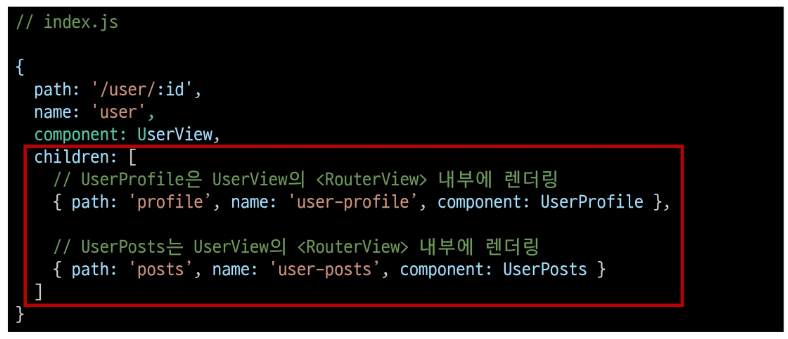

  - 두 컴포넌트에 대한 RouterLink 및 RouterView 작성

    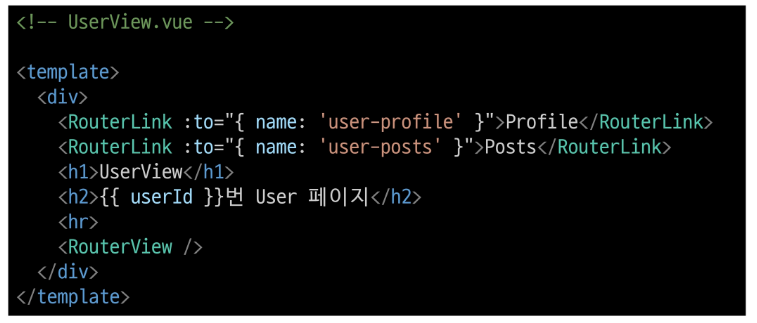

  - Profile과 Posts 링크를 클릭해서 렌더링 결과 확인

    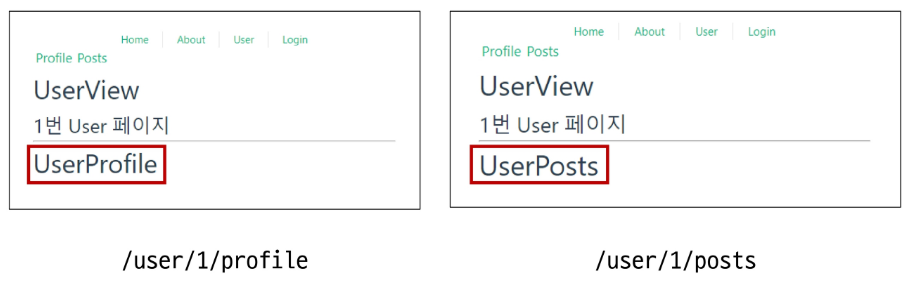

  - 중첩된 Named Routes를 다룰 때는 일반적으로 "하위 경로에만 이름을 지정"

  - 이렇게 하면 /user/:id로 이동했을 때 항상 중첩된 경로가 표시됨

    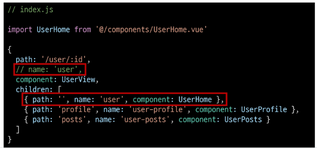

  - UserHome 컴포넌트 생성

    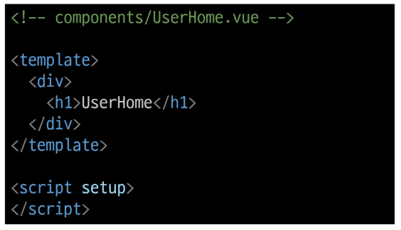

  - 이제 /user/:id 접속 시 중첩된 경로가 표시

  - 단, 이전처럼 상위 경로의 이름을 유지하는 구조로 작성해도 무관

    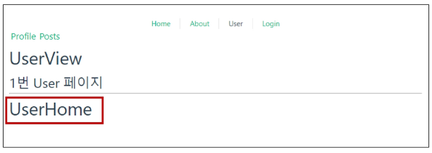

- 주의! 중첩된 라우팅

      - 컴포넌트 간 부모-자식 관계 관점이 아닌 URL에서의 중첩된 관계를 표현하는 관점으로 바라보기

### Programmatic Navigation

- Programmatic Navigation

  - RouterLink 대신 JavaScript를 사용해 페이지를 이동하는 것

- 프로그래밍 방식 네비게이션

  - 프로그래밍으로 URL 이동하기

  - router의 인ㅅ드턴스 메서드를 사용해 RouterLink로 \<a> 태그를 만드는 것처럼 프로그래밍으로 네비게이션 관련 작업을 수행할 수 있음

- router의 메서드

  1. 다른 위치로 이동하기

    - router.push() : 뒤로가기 가능

  2. 현재 위치 바꾸기

    - router.replace() : 뒤로가기 불가

- router.push()

  - 다른 위치로 이동하기(Navigate to a different location)

  - 다른 URL로 이동하는 메서드

  - 새 항목을 history stack에 push하므로 사용자가 브라우저 뒤로 가기 버튼을 클릭하면 이전 URL로 이동할 수 있음

  - RouterLink를 클릭했을 때 내부적으로 호출되는 메서드이므로 RouterLink를 클릭하는 것은 router.push()를 호출하는 것과 같음

  |선언적 표현|프로그래밍적 표현|
  |:--:|:--:|
  |\<RouterLink :to="...">|router.push(...)|
   

- router.push 활용

  - UserView 컴포넌트에서 HomeView 컴포넌트로 이동하는 버튼 만들기

    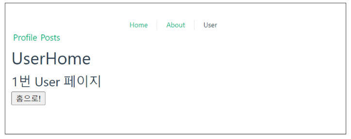

    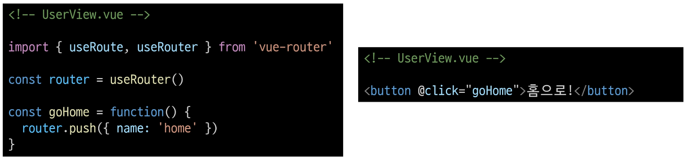

- router.replace()

  - 현재 위치 바꾸기(Replace current location)

  - push 메서드와 달리 history stack에 새로운 항목을 push 하지 않고 다른 URL로 이동(=== 이동 전 URL로 뒤로 가기 불가)

  |선언적 표현|프로그래밍적 표현|
  |:--:|:--:|
  |\<RouterLink :to="..." replace>|router.replace(...)|
   

- router.replace 활용

  - UserView 컴포넌트에서 HomeView 컴포넌트로 이동하는 버튼 만들기

    

- [참고] router.push의 인자 활용

  - [https://router.vuejs.org/guide/essentials/navigation.html](https://router.vuejs.org/guide/essentials/navigation.html)

    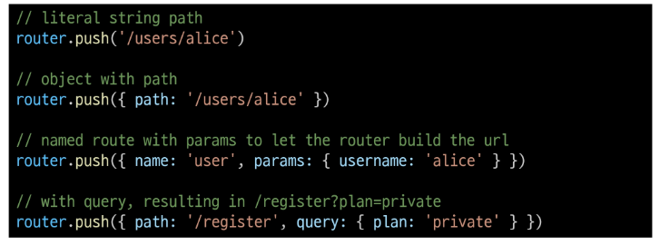

## Navigation Guard

- Navigation Guard

  - Vue router를 통해 특정 URL에 접근할 때 다른 URL로 redirect를 하거나 취소하여 내비게이션을 보호

  - 라우트 전환 전/후 자동으로 실행되는 Hook

- Navigation Guard 종류

  1. Globally (전역 가드)

    - 애플리케이션 전역에서 모든 라우트 전환에 적용되는 가드

  2. Per-route (라우터 가드)

    - 특정 라우트에만 적용되는 가드

  3. In-component (컴포넌트 가드)

    - 컴포넌트 내에서만 적용되는 가드

### Globally Guard

- Globally Guard

  - 애플리케이션 전역에서 동작하는 가드

    - 작성위치 : index.js

- Globally Guard 종류

      - beforeEach()

      - beforeResolve()

      - afterEach()

- router.beforeEach()

  - 다른 URL로 이동하기 직전에 실행되는 함수(Global Before Guards)

- router.beforeEach 구조

  

  - 모든 가드는 2개의 인자를 받음

    - to : 이동할 URL 정보가 담긴 Route 객체

    - from : 현재 URL 정보가 담긴 Route 객체

  - 선택적으로 다음 값 중 하나를 반환

    1. false

      - 현재 내비게이션을 취소

      - 브라우저 URL이 변경된 경우(사용자가 수동으로 또는 뒤로가기 버튼을 통해) 'from' 경로의 URL로 재설정

    2. Route Location

      - router.push()를 호출하는 것처럼 경로 위치를 전달하여 다른 위치로 redirect

      - return이 없다면 자동으로 'to' URL Route 객체로 이동

- router.beforeEach 예시

  1. 전역 가드 beforeEach 작성

  2. HomeView에서 UserView로 이동했을 때 각 인자 값 출력 확인하기

      

    - Home에서 User로 이동해보기

    - to에는 이동할 URL인 user 라우트에 대한 정보가, from에는 현재 URL인 home 라우트에 대한 정보가 들어있음

      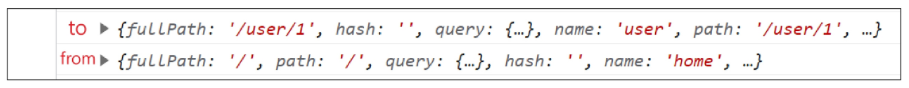

-router.beforeEach 활용

  - "Login이 되어있지 않다면 페이지 진입을 막고 Login 페이지로 이동시키기"

  - LoginView 컴포넌트 작성 및 라우트 등록

    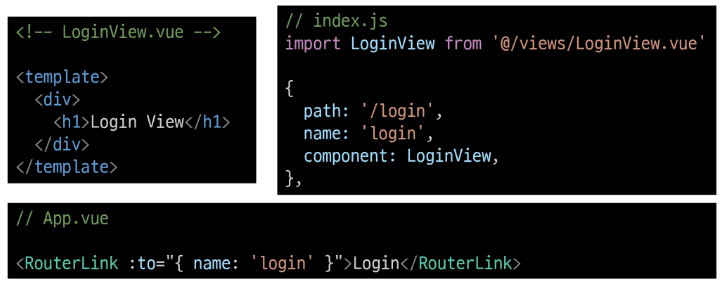

  - 어떤 RouterLink를 클릭해도 LoginView 컴포넌트만 볼 수 있음

    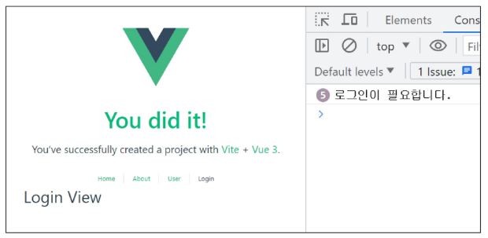

  - 만약 로그인이 되어있지 않고(1), 이동하는 주소 이름이 login이 아니라면(2) login 페이지로 redirect

    

### Per-route Guard

- Per-route Guard

  - 특정 라우터에서만 동작하는 가드

    - 작성위치 : index.js의 각 routes

- Per-route Guard 종류

      - beforeEnter()

- router.beforeEnter()

  - 특정 route에 진입했을 때만 실행되는 함수

  - 단순히 URL의 매개변수나 쿼리 값이 변경될 때는 실행되지 않고, 다른 URL에서 탐색해 올 때만 실행됨

- router.beforeEnter 구조

  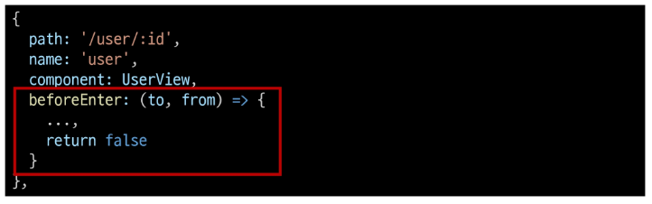

  - routes 객체에서 정의

- router.beforeEnter 예시

  1. 라우터 가드 beforeEnter 작성

  2. HomeView에서 UserView로 이동 후 각 인자 값 출력 확인하기

    

    - to에는 이동할 URL인 user 라우트에 대한 정보가, from에는 현재 URL인 home 라우트에 대한 정보가 들어있음

    - 다른 경로에서 user 라우트를 탐색했을 때 실행된 것

      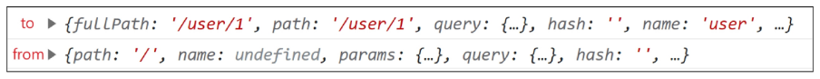

- router.beforeEnter 활용

  - "이미 로그인 한 상태라면 LoginView 진입을 막고 HomeView로 이동시키기"

  - 전역 가드 beforeEach 관련 코드는 주석 처리 후 진행

  - 로그인 상태라면 HomeView로 이동

  - 로그인 상태가 아니라면 LoginView로 이동

    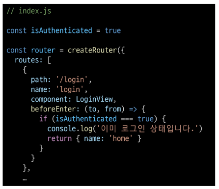

    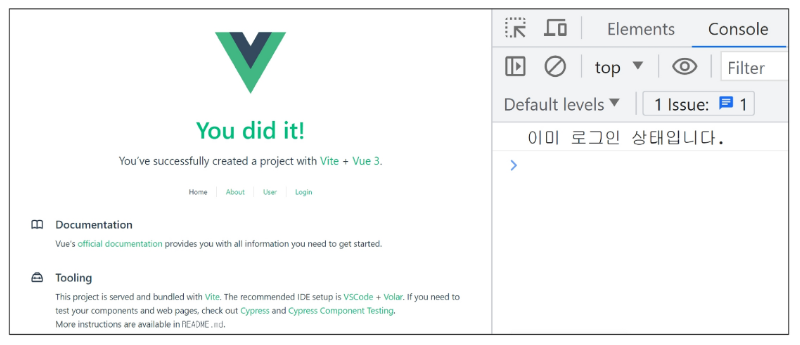

### In-component Guard

- In-component Guard

  - 특정 컴포넌트 내에서만 동작하는 가드

  - 작성위치 : 각 컴포넌트의 \<script> 내부

- In-component Guard 종류

  - onBeforeRouteLeave()

    - 현재 라우트에서 다른 라우트로 이동하기 전에 실행

    - 사용자가 현재 페이지를 떠나는 동작에 대한 로직을 처리

  - onBeforeRouteUpdate()

    - 이미 렌더링 된 컴포넌트가 같은 라우트 내에서 업데이트 되기 전에 실행

    - 라우트 업데이트 시 추가적인 로직을 처리

- onBeforeRouteLeave 활용

  - "사용자가 UserView를 떠날 시 팝업 창 출력하기"

    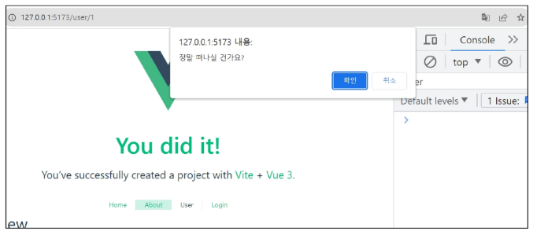

    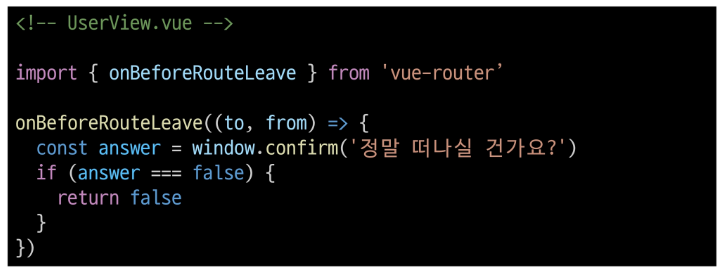

- onBeforeRouteUpdate 활용

  - "UserView 페이지에서 다른 id를 가진 User의 UserView 페이지로 이동하기"

  - 같은 라우트 내에서 업데이트 되는 경우 (/user/1 → /user/100)

    

    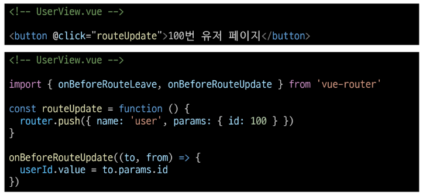

- 만약 onBeforeRouteUpdate를 사용하지 않았다면?

  - onBeforeRouteUpdate에서 userId를 변경하지 않으면 userId는 갱신되지 않음

  - 컴포넌트가 재사용 되었기 때문

    

    

- Navigation Guard 정리

  1. Globally (전역 가드)

    - 애플리케이션 전역에서 동작

    - 작성위치 : **index.js**

  2. Per-route (라우터 가드)

    - 특정 route에서만 동작

    - 작성위치 : **index.js의 각 routes**

  3. In-component (컴포넌트 가드)

    - 특정 컴포넌트 내에서만 동작

    - 작성위치 : **각 컴포넌트의 script**

## 참고

### Lazy Loading Routes

- Lazy Loading Routes

  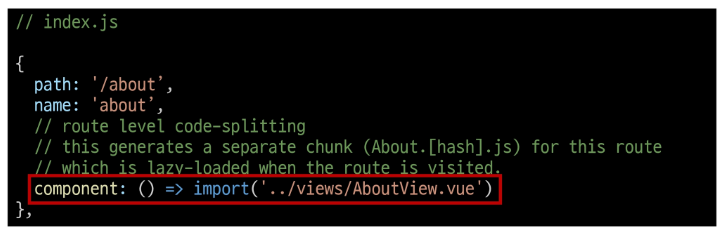

  - Vue 애플리케이션 첫 빌드 시 해당 컴포넌트를 로드 하지 않고, "해당 경로를 처음 방문할 때 컴포넌트를 로드"하는 것

    - 앱을 빌드할 때 처음부터 모든 컴포넌트를 준비하면 컴포넌트의 크기에 따라 페이지 로드 시간이 길어질 수 있기 때문