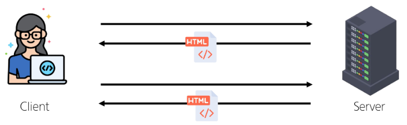

# 2024년 11월 11일(월) 수업 내용 정리 - Vue Router

- Routing

- Vue Router

  - Basic Routing
  - Named Routes
  - Dynamic Route Matching
  - Nested Routes
  - Programmatic Navigation

- Navigation Guard

  - Globally Guard
  - Per-route Guard
  - In-component Guard

- 참고

  - Lazy Loading Routes

## Routing

- Routing

  - 네트워크에서 경로를 선택하는 프로세스
  
  - 웹 애플리케이션에서 다른 페이지 간의 전환과 경로를 관리하는 기술

- SSR에서의 Routing

  

  - SSR에서 routing은 서버 측에서 수행

  - 서버가 사용자가 방문한 URL 경로를 기반으로 응답을 전송

  - 링크를 클릭하면 브라우저는 서버로부터 HTML 응답을 수신하고 새 HTML로 전체 페이지를 다시 로드

## Vue Router

### Basic Routing

### Named Routes

### Dynamic Route Matching

### Nested Routes

### Programmatic Navigation

## Navigation Guard

### Globally Guard

### Per-route Guard

### In-component Guard

## 참고

### Lazy Loading Routes