# 2024년 11월 12일(화) 수업 내용 정리 - Stat Management

- State Management

- Sate management library (Pinia)

  - Pinia
  - Pinia 구조
  - Pinia 구성 요소 활용

- Pinia 실습

  - Read Todo
  - Create Todo
  - Delete Todo
  - Counting Todo
  - Local Storage

- 참고

  - Pinia 활용 시점

## Sate Management

- State Management(상태 관리)

  - Vue 컴포넌트는 이미 반응형 상태를 관리하고 있음

  - 상태 === 데이터

- 컴포넌트 구조의 단순화

  - 상태(State)

    - 앱 구동에 필요한 기본 데이터

  - 뷰(View)

    - 상태를 선언적으로 매핑하여 시각화

  - 기능(Actions)

    - 뷰에서 사용자 입력에 대해 반응적으로 상태를 변경할 수 있게 정의된 동작

    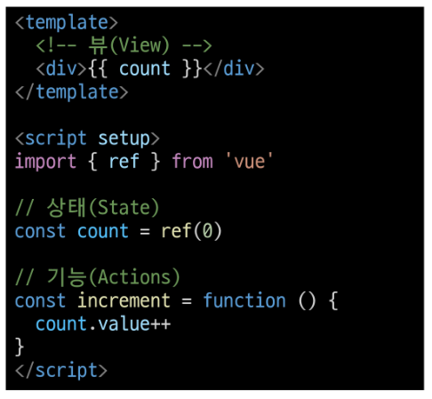

  - "단방향 데이터 흐름"의 간단한 표현

    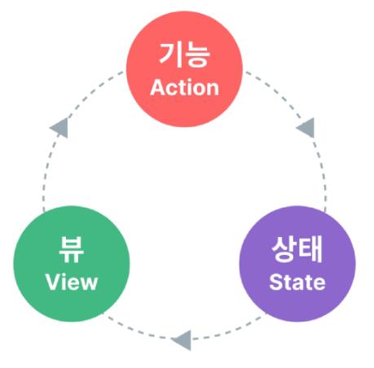

- 상태 관리의 단순성이 무너지는 시점

  - "여러 컴포넌트가 상태를 공유할 때"

    1. 여러 뷰가 동일한 상태에 종속되는 경우

        - 공유 상태를 공통 조상 컴포넌트로 "끌어올린" 다음 props로 전달하는 것

        - 하지만 계층 구조가 깊어질 경우 비효율적, 관리가 어려워 짐

          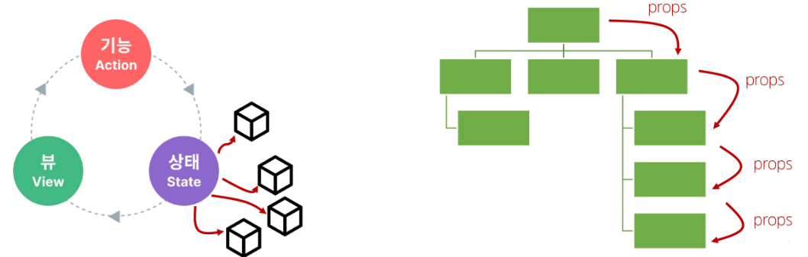

    2. 서로 다른 뷰의 기능이 동일한 상태를 변경시켜야 하는 경우

        - 발신(emit)된 이벤트를 통해 상태의 여러 복사본을 변경 및 동기화 하는 것

        - 마찬가지로 관리의 패턴이 깨져서 쉽고 유리 관리할 수 없는 코드가 됨

          

- 해결책

  - 각 컴포넌트의 공유 상태를 추출하여, 전역에서 참조할 수 있는 저장소에서 관리

    

    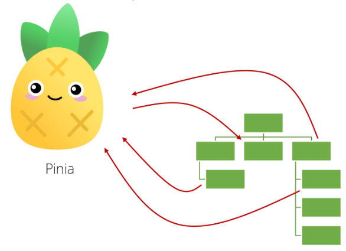

  - 컴포넌트 트리는 하나의 큰 View가 되고 모든 컴포넌트는 트리 계층 구조에 관계 없이 상태에 접근하거나 기능을 사용할 수 있음

  - Vue의 공식 상태 관리 라이브러리 === **"Pinia"**

    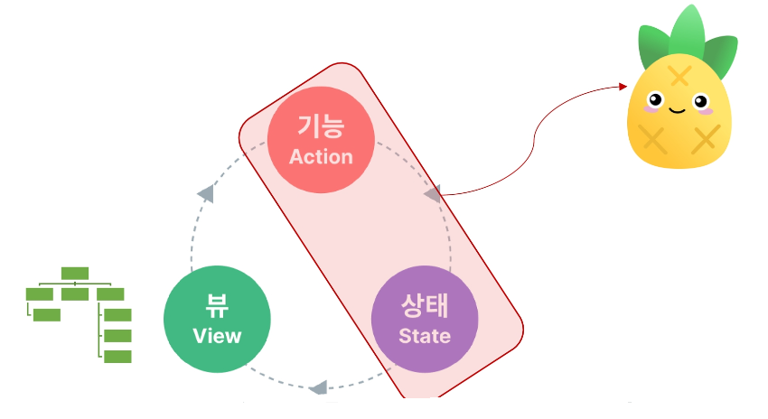

## State management library (Pinia)

### Pinia

- Pinia

  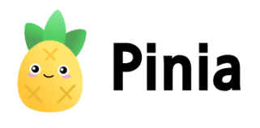

  - Vue 공식 상태 관리 라이브러리

- Pinia 설치

  - Vite 프로젝트 빌드 시 Pinia 라이브러리 추가

    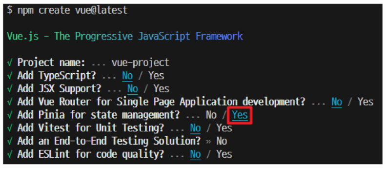

- Vue 프로젝트 구조 변화

  - stores 폴더 신규 생성

    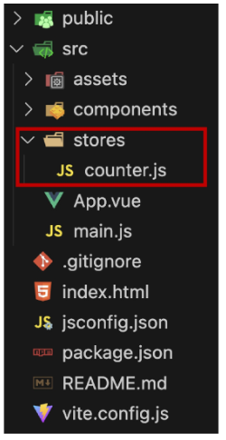

### Pinia 구조

- Pinia 구성 요소

  1. store

  2. state

  3. getters

  4. actions

  5. plugin

### 1. Pinia 구성 요소 - 'store'

- 중앙 저장소

- 모든 컴포넌트가 공유하는 상태, 기능 등이 작성됨

- defineStore()의 반환 값의 이름은 use와 store를 사용하는 것을 권장

- defineStore()의 첫번째 인자는 애플리케이션 전체에 걸쳐 사용하는 store의 고유 ID

  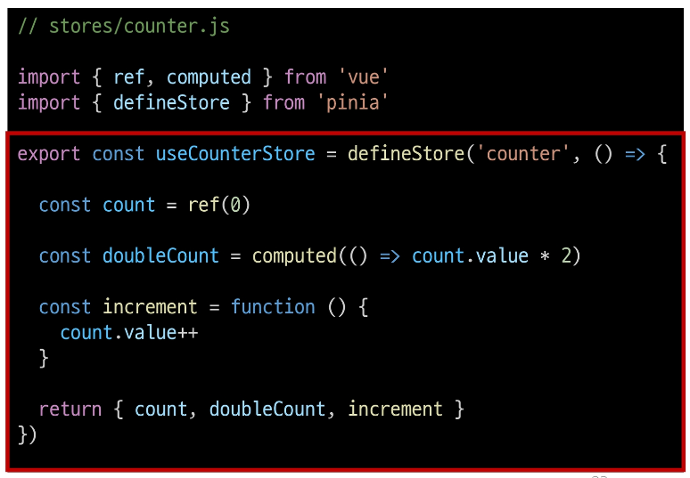

#### 2. Pinia 구성 요소 - 'state'

- 반응형 상태(데이터)

- ref() === state

  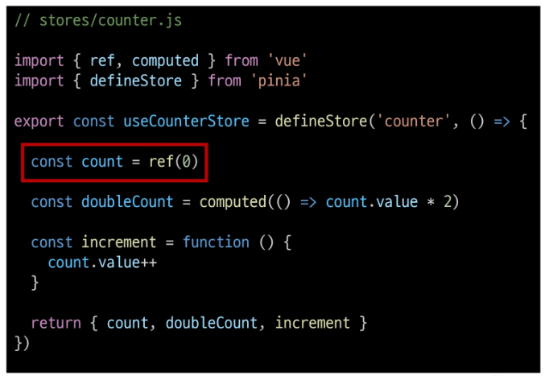

#### 3. Pinia 구성 요소 - 'getters'

- 계산된 값

- computed() === getters

  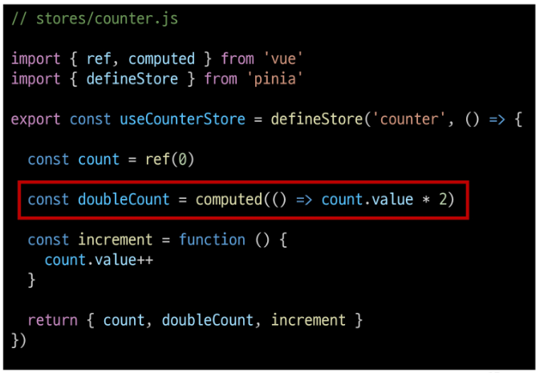

#### 4. Pinia 구성 요소 - 'actions'

- 메서드

- function() === actions

  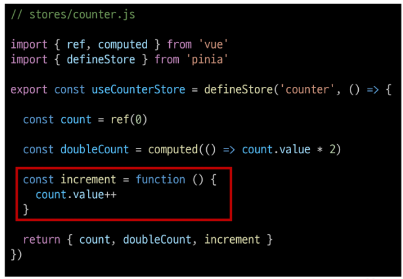

- Setup Stores의 반환 값

  - pinia의 상태들을 사용하려면 반드시 반환해야 함

  - **store에서는 공유 하지 않는 private한 상태 속성을 가지지 않음**

    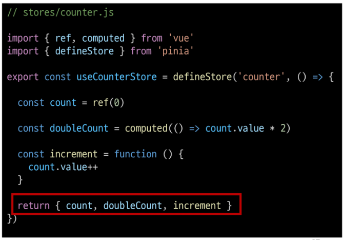

#### 5. Pinia 구성 요소 - 'plugin'

- 애플리케이션의 상태 관리에 필요한 추가 기능을 제공하거나 확장하는 도구나 모듈

- 애플리케이션의 상태 관리를 더욱 간편하고 유연하게 만들어주며 패키지 매니저로 설치 이후 별도 설정을 통해 추가 됨

- Pinia 구성 요소 정리

  - Pinia는 store라는 저장소를 가짐

  - store는 state, getters, actions으로 이루어지며 각각 ref(), computed(), function()과 동일함

### Pinia 구성 요소 활용

- State

  - 각 컴포넌트 깊이에 관계 없이 store 인스턴스로 state에 접근하여 직접 읽고 쓸 수 있음

  - 만약 store에 state를 정의하지 않았다면 컴포넌트에서 새로 추가할 수 없음

    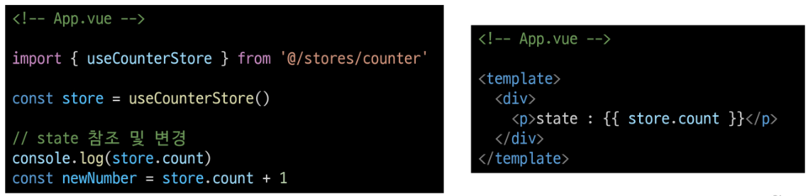

- Getters

  - store의 모든 getters 또한 state 처럼 직접 접근 할 수 있음

    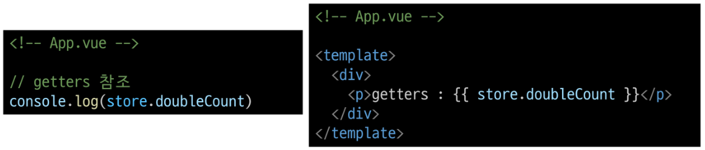

- Actions

  - store의 모든 actions 또한 직접 접근 및 호출 할 수 있음

  - getters와 달리 state 조작, 비동기, API 호출이나 다른 로직을 진행할 수 있음

    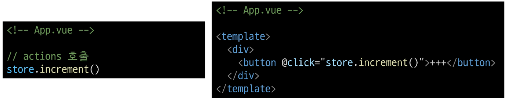

- Vue devtools로 Pinia 구성 요소 확인하기

  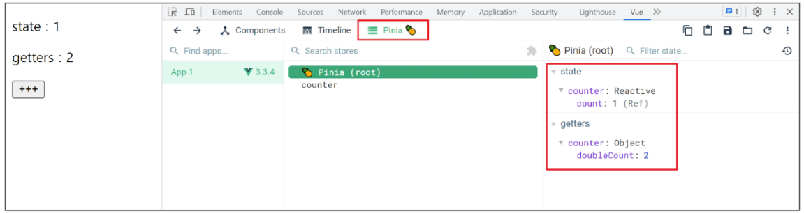

## Pinia 실습

- Pinia를 활용한 Todo 프로젝트 구현

  - Todo CRUD 구현

  - Todo 개수 계산

    - 완료된 Todo 개수

- 컴포넌트 구성

  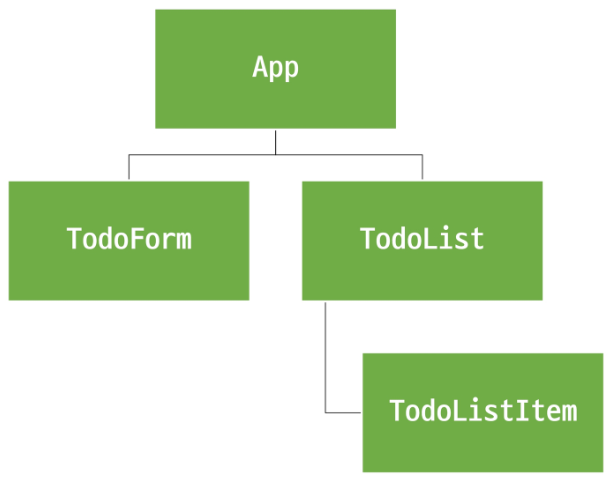

- 사전 준비

  - 초기 생성된 컴포넌트 모두 삭제 (App.vue 제외)

  - src/assets 내부 파일 모두 삭제

  - main.js 해당 코드 삭제

    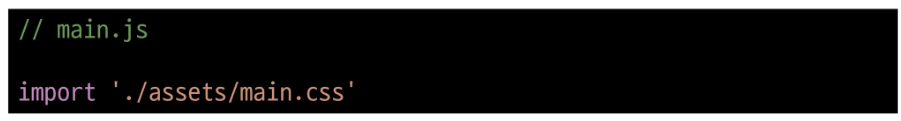

  - TodoListItem 컴포넌트 작성

    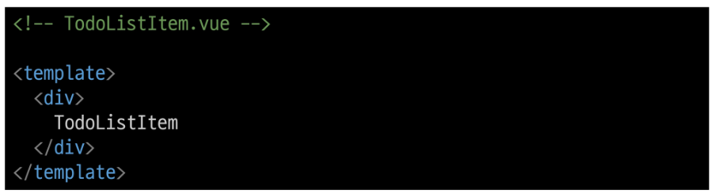

  - TodoList 컴포넌트 작성

  - TodoListItem 컴포넌트 등록

    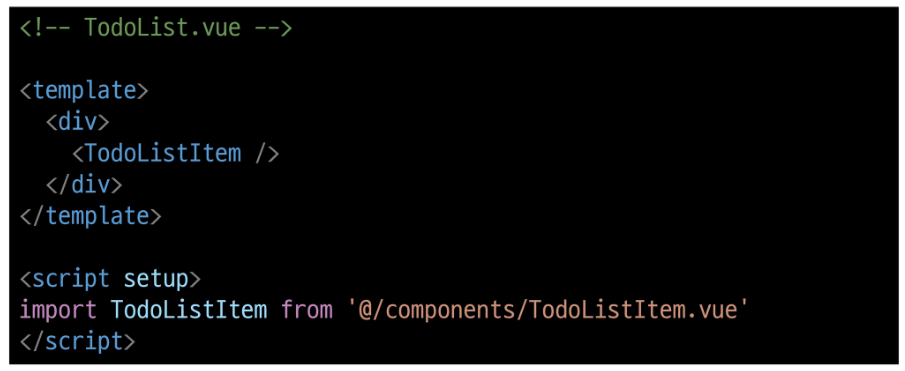

  - TodoForm 컴포넌트 작성

    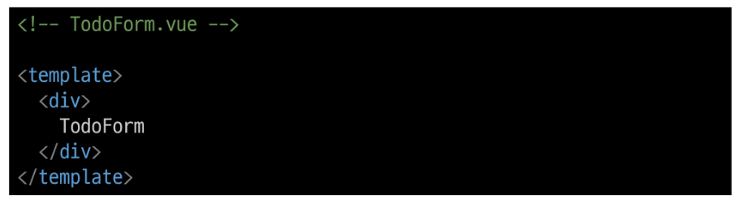

  - App 컴포넌트에 TodoList, TodoForm 컴포넌트 등록

    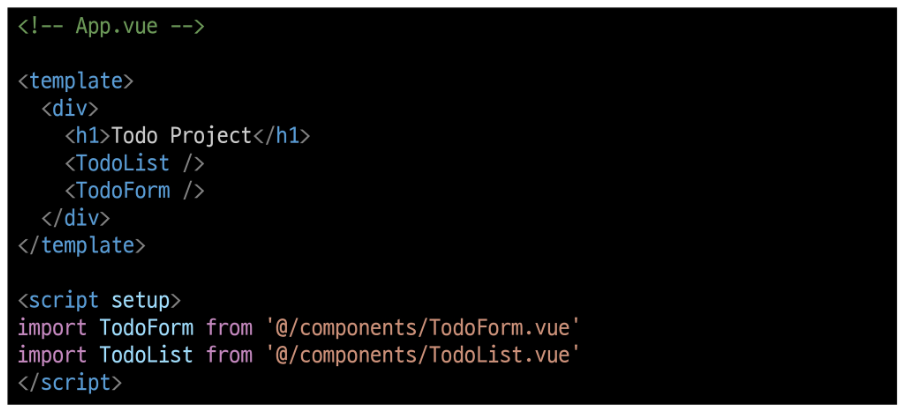

  - 컴포넌트 구성 확인

    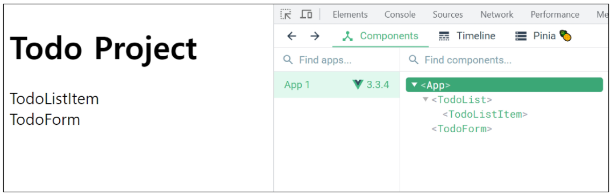

### Read Todo

- Todo 조회

  - store에 임시 todos 목록 state를 정의

    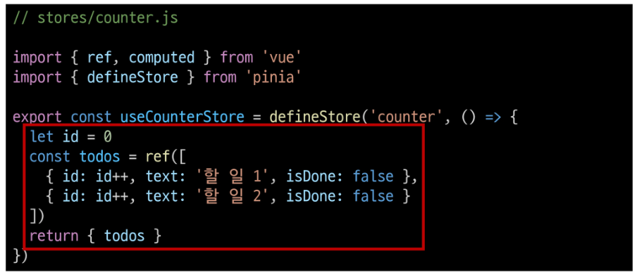

  - store의 todos state를 참조

  - 하위 컴포넌트인 TodoListItem을 반복 하면서 개별 todo를 props로 전달

    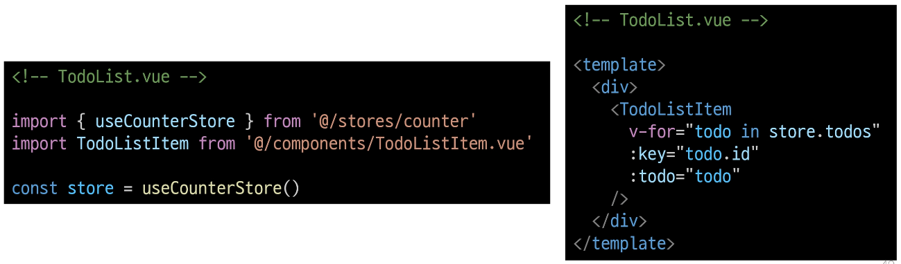

  - props 정의 후 데이터 출력 확인

    

### Create Todo

- Todo 생성

  - todos 목록에 todo를 생성 및 추가하는 addTodo 액션 정의

    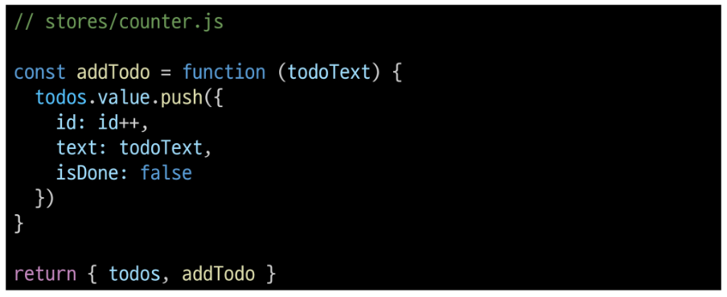

  - TodoForm에서 실시간으로 입력되는 사용자 데이터를 양방향 바인딩하여 반응형 변수로 할당

    

  - submit 이벤트가 발생했을 때 사용자 입력 텍스트를 인자로 전달하여 store에 정의한 addTodo 액션 메서드를 호출

    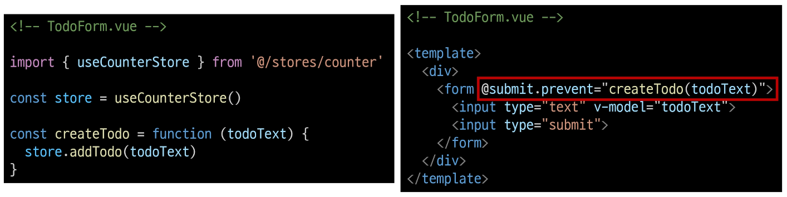

  - form 요소를 선택하여 todo 입력 후 input 데이터를 초기화 할 수 있도록 처리

    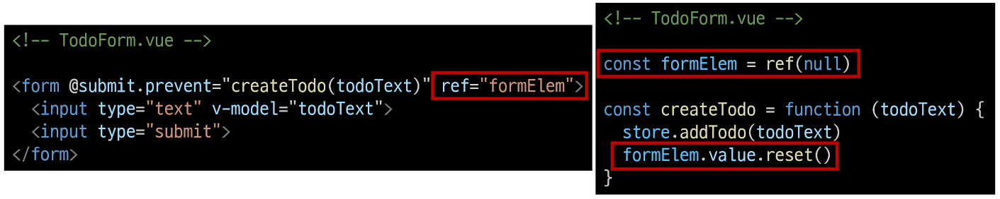

  - 결과 확인

    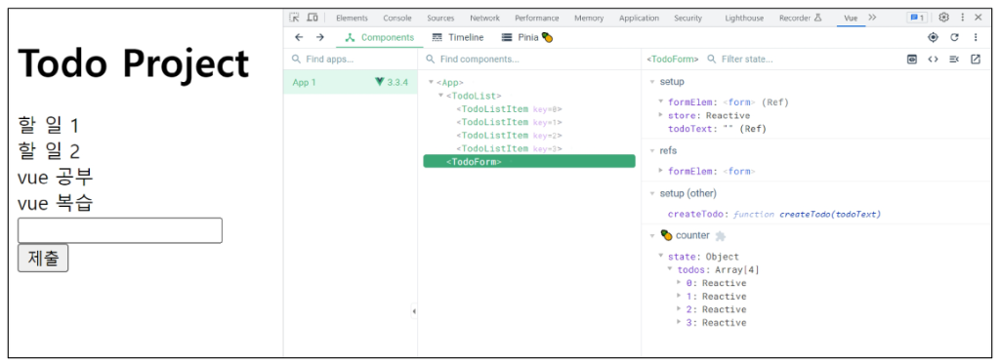

### Delete Todo

- Todo 삭제

  - todos 목록에서 특정 todo를 삭제하는 deleteTodo 액션 정의

    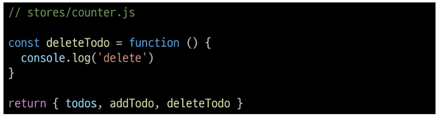

  - 각 todo에 삭제 버튼을 작성

  - 버튼을 클릭하면 선택된 todo의 id를 인자로 전달해 deleteTodo 메서드 호출

    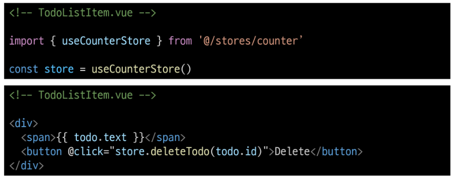

  - 전달받은 todo의 id 값을 활용해 선택된 todo의 인덱스를 구함

  - 특정 인덱스 todo를 삭제 후 todos 배열을 재설정

    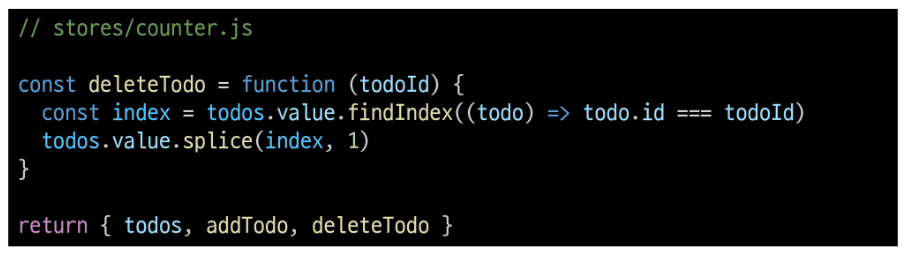

  - 결과 확인

    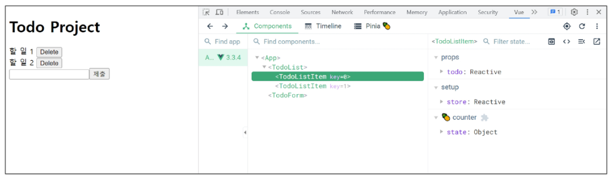

### Update Todo

- Todo 수정

  - "각 todo 상태의 isDone 속성을 변경하여 todo의 완료 유무 처리하기"

  - 완료된 todo에는 취소선 스타일 적용하기

  - todos 목록에서 특정 todo의 isDone 속성을 변경하는 updateTodo 액션 정의

    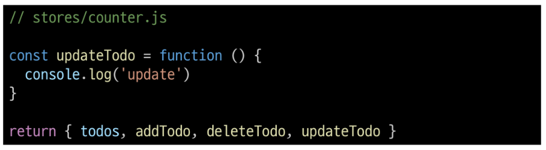

  - todo 내용을 클릭하면 선택된 todo의 id를 인자로 전달해 updateTodo 메서드를 호출

    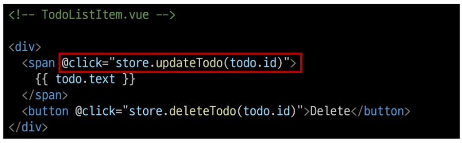

  - 전달받은 todo의 id 값을 활용해 선택된 todo와 동일 todo를 목록에서 검색

  - 일치하는 todo 데이터의 isDone 속성 값을 반대로 재할당 후 새로운 todo 목록 반환

    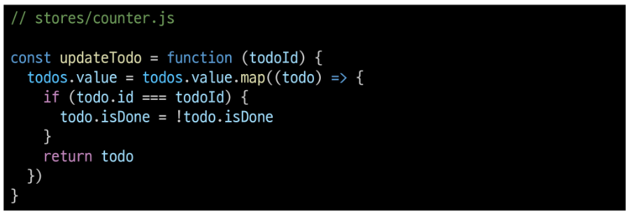

  - todo 객체의 isDone 속성 값에 따라 스타일 바인딩 적용하기

    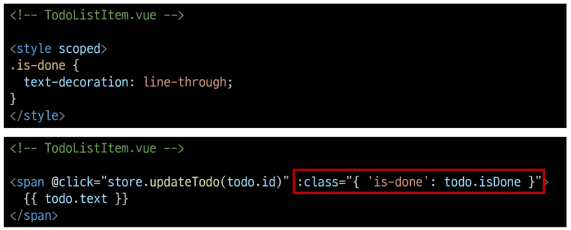

  - 결과 확인

    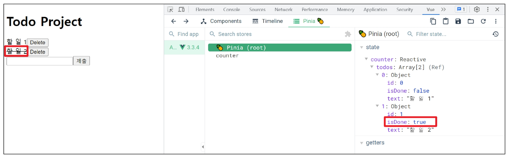

### Counting Todo

- 완료된 todo 개수 계산

  - todos 배열의 길이 값을 반환하는 함수 doneTodosCount 작성 (getters)

    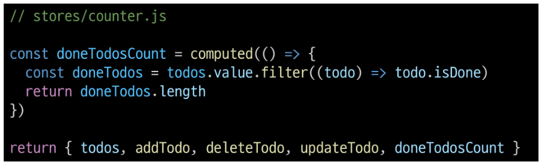

  - App 컴포넌트에서 doneTodosCount getter를 참조

    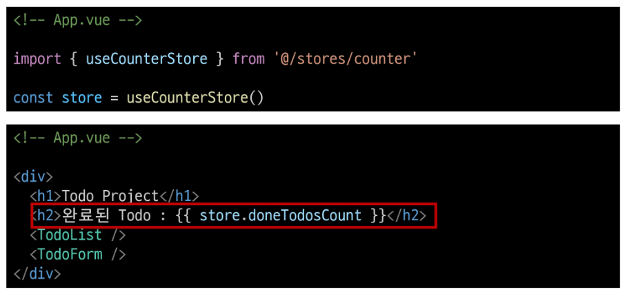

### Local Storage

- Local Storage

  - 브라우저 내에 key-value 쌍을 저장하는 웹 스토리지 객체

- Local Storage 특징

  - 페이지를 새로 고침하고 브라우저를 다시 실행해도 데이터가 유지

  - 쿠키와 다르게 네트워크 요청 시 서버로 전송되지 않음

  - 여러 탭이나 창 간에 데이터를 공유 할 수 있음

- Local Storage 사용 목적

  - 웹 애플리케이션에서 사용자 설정, 상태 정보, 캐시 데이터 등을 클라이언트 측에서 보관하여 웹 사이트의 성능을 향상시키고 사용자 경험을 개선하기 위함

- pinia-plugin-persistedstate

  - Pinia의 플러그인(plugin) 중 하나

  - 웹 애플리케이션의 상태(state)를 브라우저의 local storage나 session storage에 영구적으로 저장하고 복원하는 기능을 제공

  - [https://prazdevs.github.io/pinia-plugin-persistedstate/](https://prazdevs.github.io/pinia-plugin-persistedstate/)

- pinia-plugin-persistedstate 설정

  - 설치 및 등록

    

    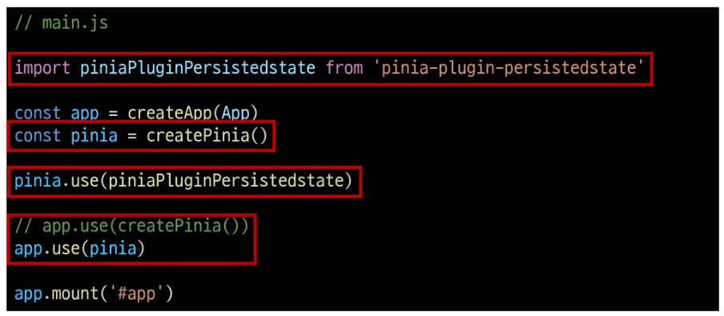

    - defineStore()의 3번째 인자로 관련 객체 추가

      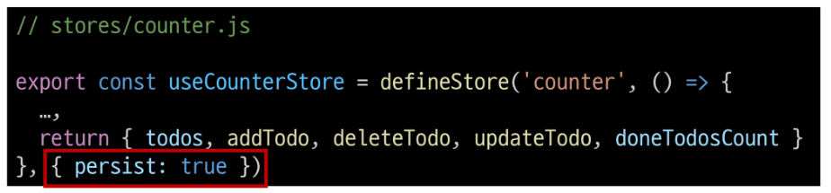

  - 적용 결과 (개발자도구 → Application → Local Storage)

    - 브라우저의 Local Storage에 저장되는 todos state 확인

    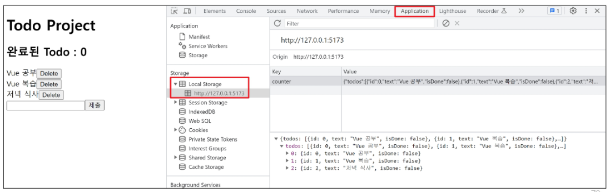

## 참고

### Pinia 활용 시점

- 이제 모든 데이터를 store에서 관리해야 할까?

  - Pinia를 사용한다고 해서 모든 데이터를 state에 넣어야 하는 것은 아님

  - pass props, emit event를 함께 사용하여 애플리케이션을 구성 해야 함

  - 상황에 따라 적절하게 사용하는 것이 필요

- Pinia, 언제 사용해야 할까?

  - Pinia는 공유된 상태를 관리하는 데 유용하지만, 구조적인 개념에 대한 이해와 시작하는 비용이 큼
  
  - 애플리케이션이 단순하다면 Pinia가 없는 것이 더 효율적일 수 있음

  - 그러나 중대형 규모의 SPA를 구축하는 경우 Pinia는 자연스럽게 선택할 수 있는 단계가 오게 됨

  - 결과적으로 적절한 상황에서 활용했을 때 Pinia 효용을 극대화 할 수 있음