# 2024년 11월 13일(수) 수업 내용 정리 - Vue with DRF 1

- 프로젝트 개요

  - DRF 프로젝트 안내
  - Vue 프로젝트 안내

- 메인 페이지 구현

  - 게시글 목록 출력
  - DRF 외의 요청과 응답

- CORS Policy

  - CORS Policy
  - CORS Headers 설정

- Article CR 구현

  - 전체 게시글 조회
  - 단일 게시글 조회
  - 게시글 작성

## 프로젝트 개요

- 이틀동안 진행할 프로젝트

      1. Vue with DRF 1

        - Vue와 DRF 간 기본적인 요청과 응답

      2. Vue with DRF 2

        - Vue와 DRF에서의 인증 시스템

### DRF 프로젝트 안내

- DRF 프로젝트 안내

  - 스켈레톤 프로젝트 django-pjt 제공

  - 외부 패키지 및 라이브러리는 requirements.txt에 작성되어 있음

  - DRF 프로젝트는 "주석을 해제"하며 진행

- Skeleton code 살펴보기

  - Model 클래스 확인

    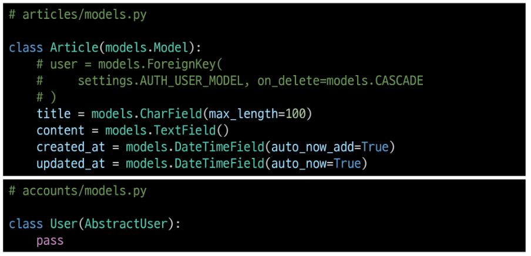

  - URL 확인

    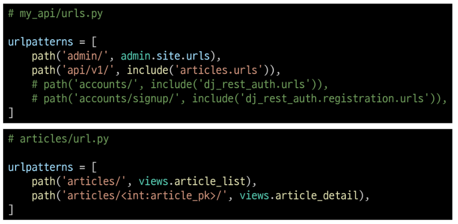

  - Serializers 확인

    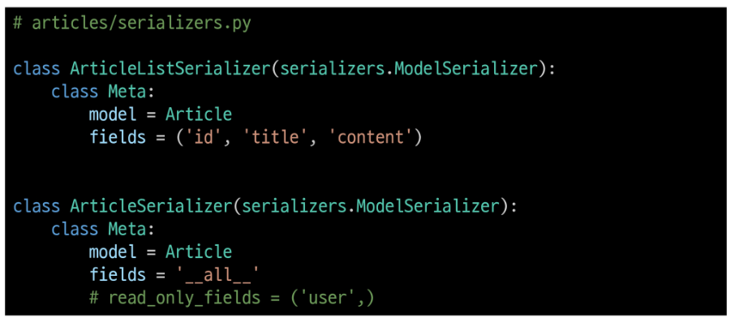

  - views.py의 import 부분 확인

    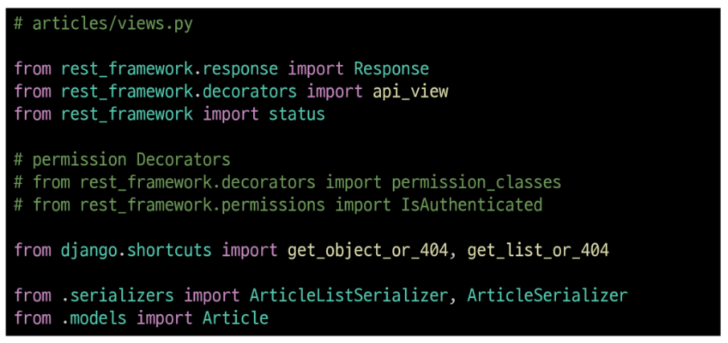

  - View 함수 확인

    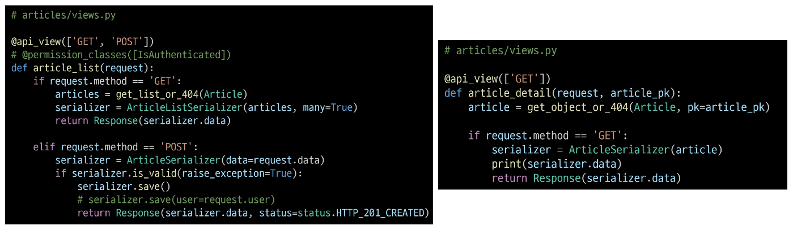

  - settings.py 확인

    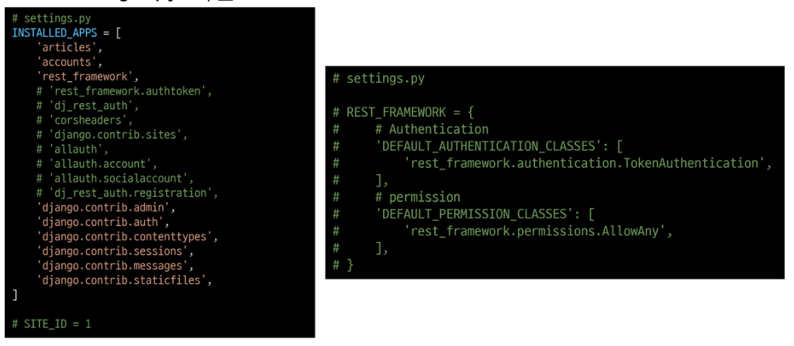

    

  - Fixtures 확인

    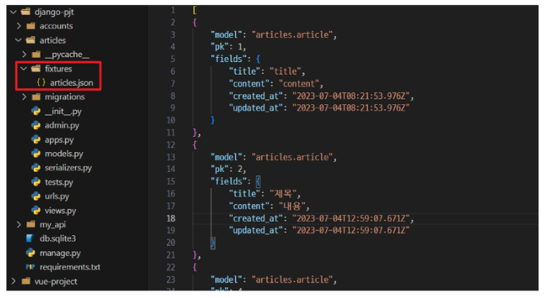

  - 가상 환경 생성 및 활성화

    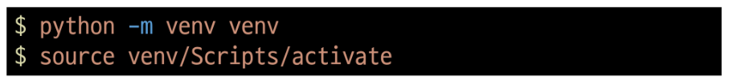

  - 패키지 설치

    

  - Migration 진행

    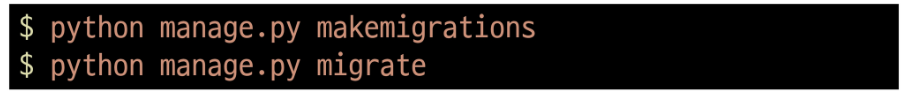

  - Fixtures 데이터 로드

    \

  - Django 서버 실행 후, 전체 게시글 조회 요청

    - [http://127.0.0.1:8000/api/v1/articles/](http://127.0.0.1:8000/api/v1/articles/)

    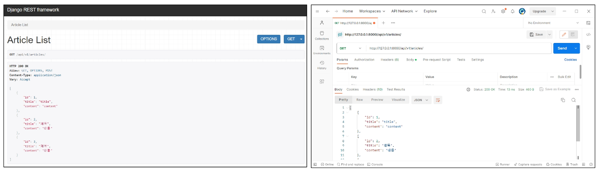
    

### Vue 프로젝트 안내

- Vue 프로젝트 안내

  - 스켈레톤 프로젝트 vue-pjt 제공

  - Vite를 사용해 Pinia 및 Vue Router가 추가 되어있음

  - pinia-plugin-persistedstate가 설치 및 등록 되어있음

  - Vue 프로젝트는 "직접 코드를 작성"하며 진행

  - 컴포넌트 구조

    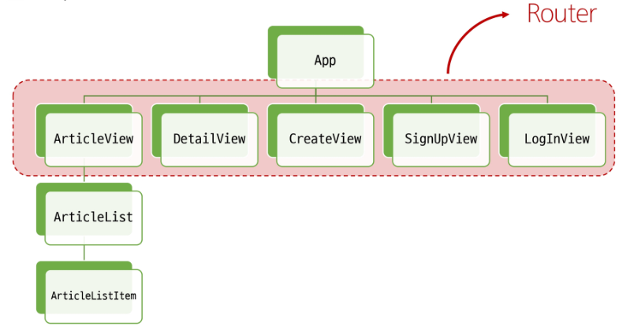

  - 프로젝트 구조

    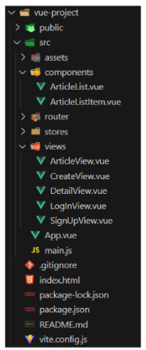

- Skeleton code 살펴보기

  - App 컴포넌트

    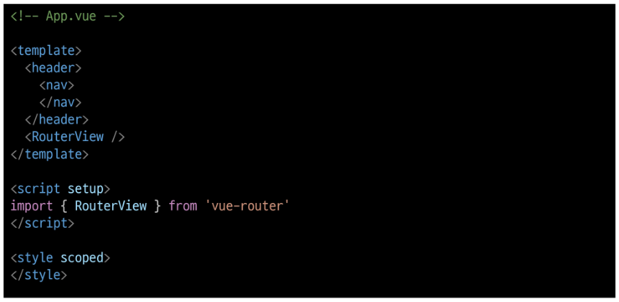

  - route에 등록된 컴포넌트 (Article, Create, Detail, LogIn, SignUp)

    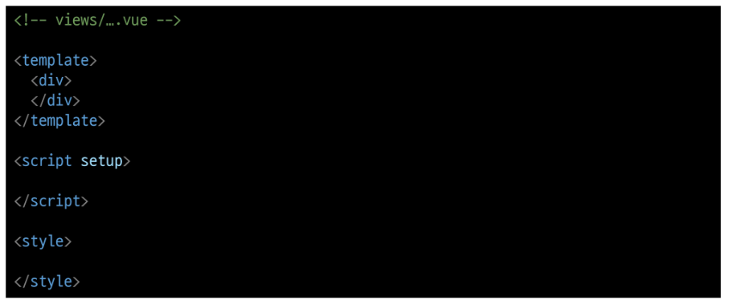

  - ArticleList 컴포넌트

    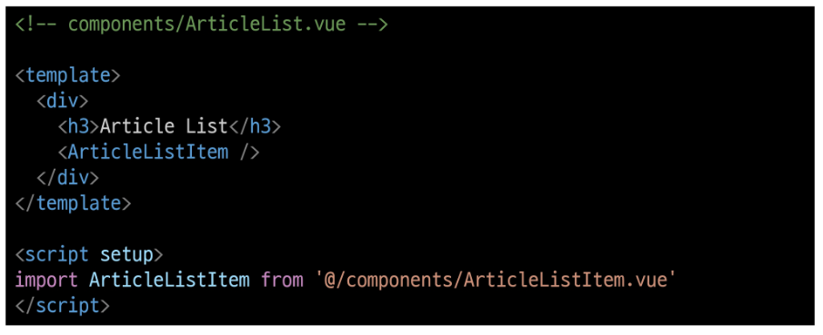

  - ArticleListItem 컴포넌트

    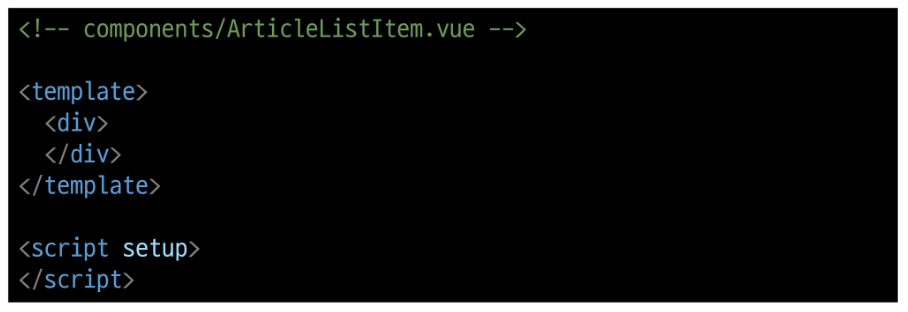

  - routes 현황

    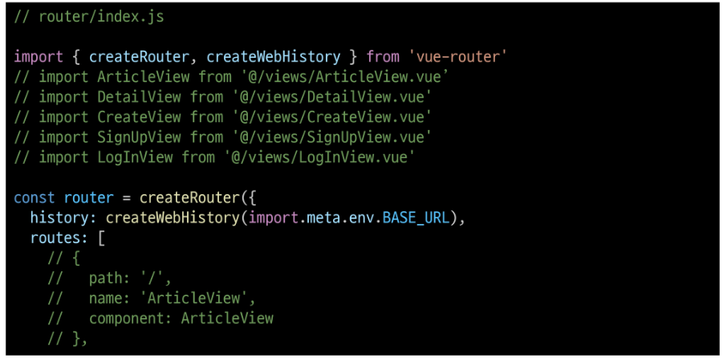

  - store 현황

    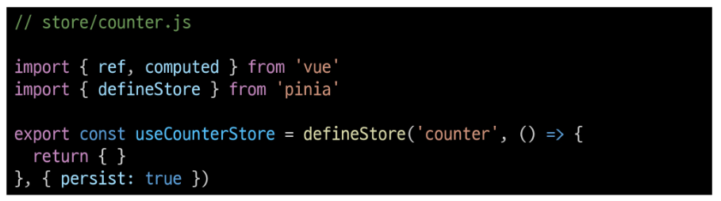

  - main.js 현황

    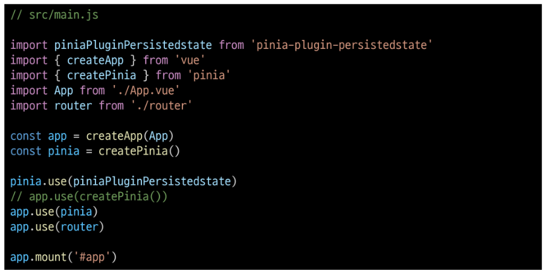

  - 패키지 설치

    

  - 서버 실행

    

## 메인 페이지 구현

- 시작하기 전에

  - 무결점의 프로젝트를 만드는 것이 아님

  - frontend 프레임워크와 backend 프레임워크 간의 요청과 응답, 그 과정에서 등장하는 새로운 개념과 문제를 해결하면서 하나의 웹 애플리케이션 서비스를 구현하는 과정에 집중할 것

### 게시글 목록 출력

- 개요

  - ArticleView 컴포넌트에 ArticleList 컴포넌트와 ArticleListItem 컴포넌트 등록 및 출력하기
  
  - ArticleList와 ArticleListItem은 각각 게시글 출력을 담당

- 게시글 목록 출력

  - ArticleView의 route 관련 코드 주석 해제

    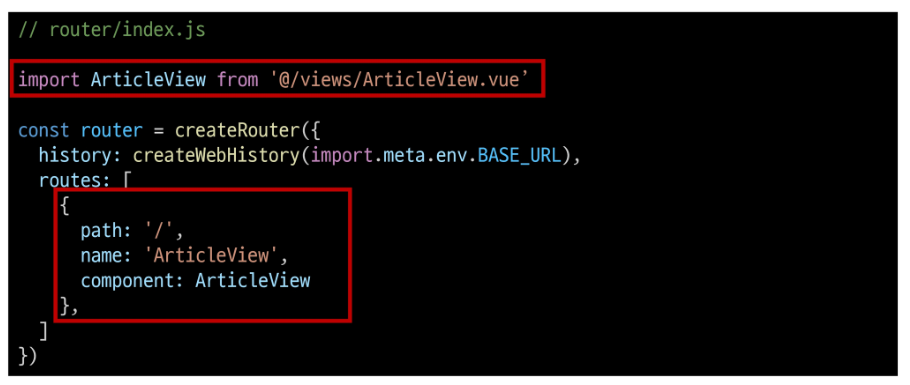

  - App 컴포넌트에 ArticleView 컴포넌트로 이동하는 RouterLink 작성

    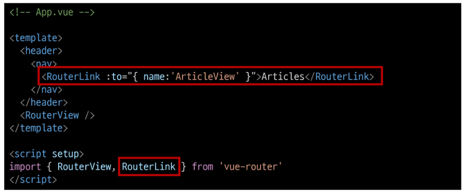

  - ArticleView 컴포넌트에 ArticleList 컴포넌트 등록

    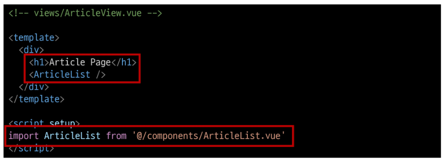

  - store에 임시 데이터 articles 배열 작성하기

    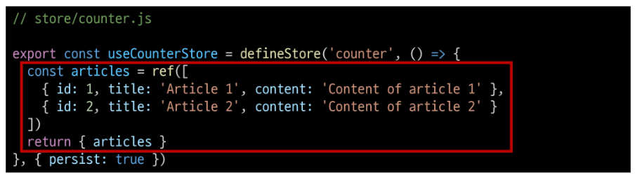

  - ArticleList 컴포넌트에서 게시글 목록 출력

  - store의 articles 데이터 참조

  - v-for를 활용하여 하위 컴포넌트에서 사용할 article 단일 객체 정보를 props로 전달

    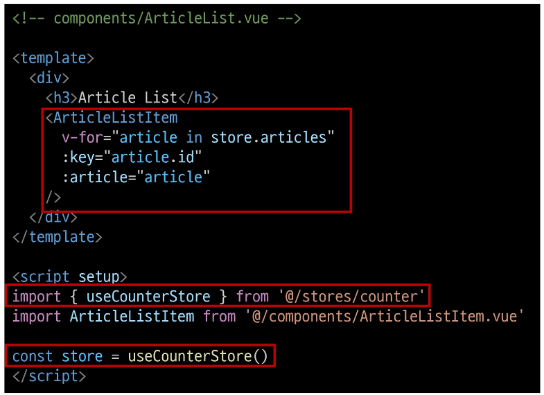

  - ArticleListItem 컴포넌트는 내려 받은 props를 정의 후 출력

    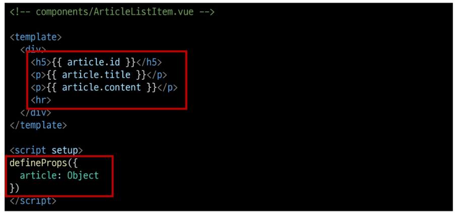

  - 메인 페이지에서 게시글 목록 출력 확인

    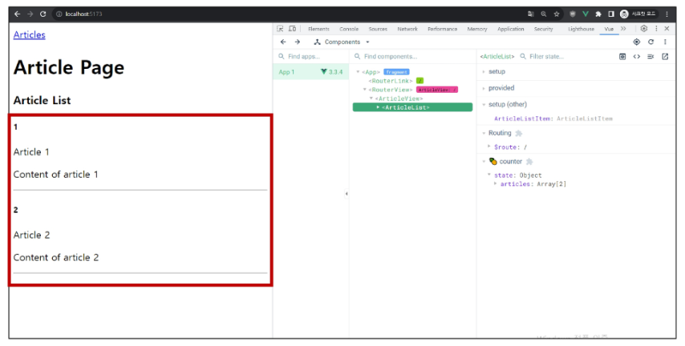

### DRF 외의 요청과 응답

- DRF로 부터 응답 데이터 받기

  - 이제는 임시 데이터가 아닌 DRF 서버에 요청하여 데이터를 응답 받아 store에 저장 후 출력하기

- DRF와의 요청과 응답

  - DRF 서버로의 AJAX 요청을 위한 axios 설치 및 관련 코드 작성

    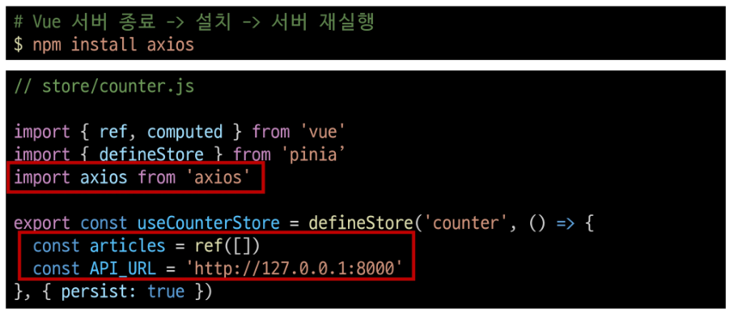
  
  - DRF 서버로 요청을 보내고 응답 데이터를 처리하는 getArticles 함수 작성

    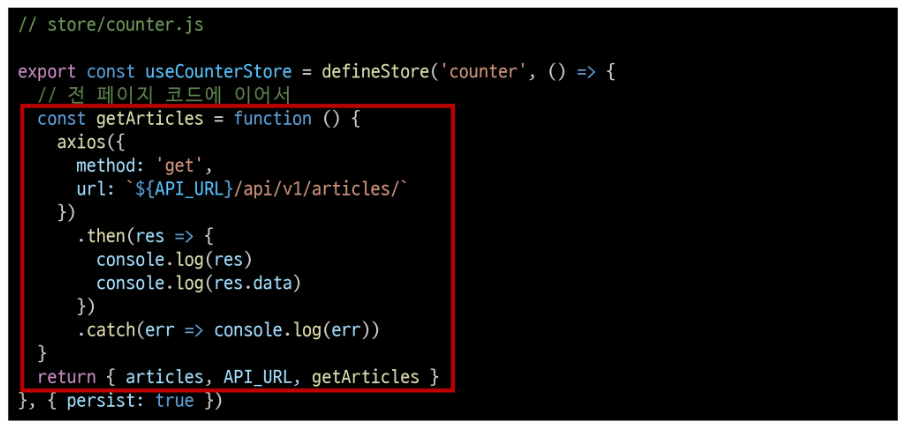

  - ArticleView 컴포넌트가 마운트 될 때 getArticles 함수가 실행되도록 함

  - 해당 컴포넌트가 렌더링 될 때 항상 최신 게시글 목록을 불러오기 위함

    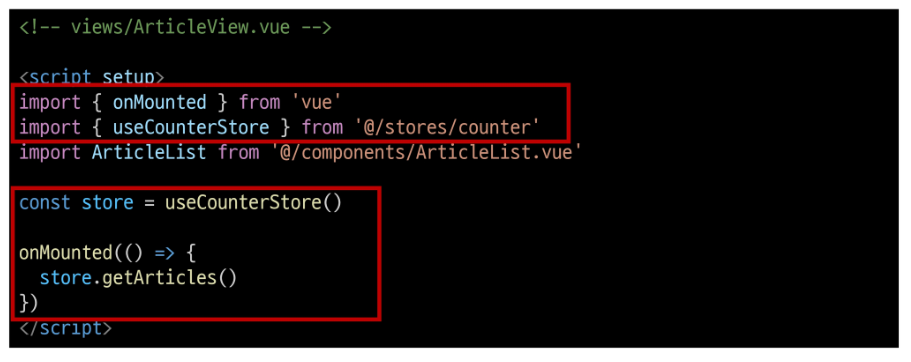

  - Vue와 DRF 서버를 모두 실행한 후 응답 데이터 확인

  - 에러 발생

    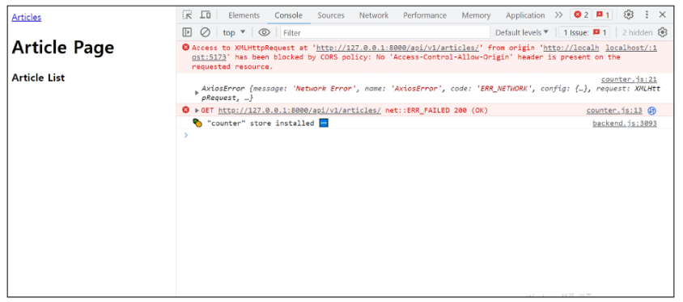

  - 그런데 DRF 서버 측에서는 문제 없이 응답했음 (200 OK)

  - 서버는 응답했으나 브라우저 측에서 거절한 것

    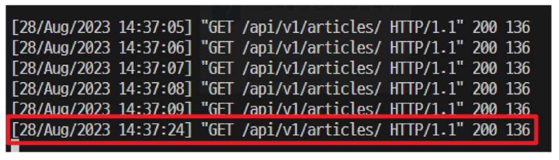

  - 브라우저가 거절한 이유

  - 'localhost:5173'에서 '127.0.0.1:8000/api/v1/articles/'의 XMLHttpRequests에 대한 접근이 **CORS policy**에 의해 차단되었다.

    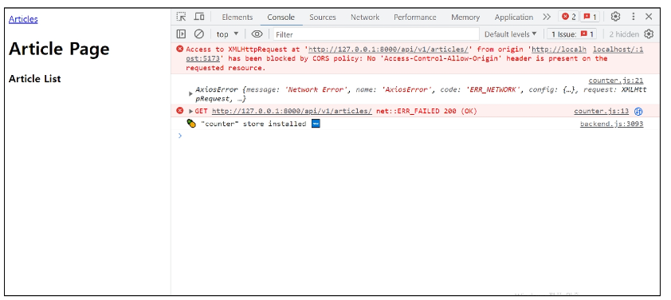

## CORS Policy

### CORS Policy

- SOP(Same-origin policy)

 - 동일 출처 정책

- SOP

  - 어떤 출처(Origin)에서 불러온 문서나 스크립트가 다른 출처에서 가져온 리소스와 상호 작용하는 것을 제한하는 보안 방식

  - "다른 곳에서 가져온 자료는 일단 막는다."

  - 웹 애플리케이션의 도메인이 다른 도메인의 리소스에 접근하는 것을 제어하여 사용자의 개인 정보와 데이터의 보안을 보호하고, 잠재적인 보안 위협을 방지

  - 잠재적으로 해로울 수 있는 문서를 분리함으로써 공격받을 수 있는 경로를 줄임

  - [https://developer.mozilla.org/en-US/docs/Web/Security/Same-origin_policy](https://developer.mozilla.org/en-US/docs/Web/Security/Same-origin_policy)

- Origin (출처)

  - URL의 Protocol, Host, Port를 모두 포함하여 "출처"라고 부름

  - Same Origin 예시

    - 아래 **세 영역이 일치하는 경우에만 동일 출처(Same-origin)**로 인정

    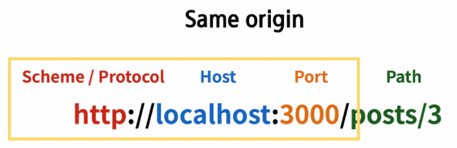

  - Same Origin 예시

    - http://localhost:3000/articles/3/을 기준으로 동일 출처 여부를 비교

      |URL|결과|이유|
      |:--:|:--:|:--:|
      |http://localhost:3000/articles/|성공|Path만 다름|
      |http://localhost:3000/comments/3/|성공|Path만 다름|
      |http**s**://localhost:3000/articles/3/|실패|Protocol 다름|
      |http://localhost:80/articles/3/|실패|Port 다름|
      |http://yahuua:3000/articles/3/|실패|Host 다름|
       

- CORS policy의 등장

  - 기본적으로 웹 브라우저는 같은 출처에서만 요청하는 것을 허용하며, 다른 출처로의 요청은 보안상의 이유로 차단됨

    - SOP에 의해 다른 출처의 리소스와 상호작용 하는 것이 기본적으로 제한되기 때문

  - 하지만 현대 웹 애플리케이션은 다양한 출처로부터 리소스를 요청하는 경우가 많기 때문에 CORS 정책이 필요하게 되었음

  - **CORS**는 웹 서버가 리소스에 대한 서로 다른 출처 간 접근을 허용하도록 선택할 수 있는 기능을 제공

- CORS(Cross-Origin Resource Sharing)

  - 교차 출처 리소스 공유

- CORS

  - 특정 출처에서 실행 중인 웹 애플리케이션이 **다른 출처의 자원에 접근할 수 있는 권한을 부여**하도록 브라우저에 알려주는 체제

  - 만약 다른 출처의 리소스를 가져오기 위해서는 이를 제공하는 서버가 브라우저에게 다른 출처지만 접근해도 된다는 사실을 알려야 함

  - "CORS policy (교차 출처 리소스 공유 정책)"

- CORS Policy(Cross-Origin Resource Sharing Policy)

  - 교차 출처 리소스 공유 정책

- CORS Policy

  - 다른 출처에서 온 리소스를 공유하는 것에 대한 정책

  - 서버에서 설정되며, 브라우저가 해당 정책을 확인하여 요청이 허용되는지 여부를 결정

  - 다른 출처의 리소스를 불러오려면 그 다른 출처에서 올바른 **CORS header를 포함한 응답을 반환**해야 함

  - [https://developer.mozilla.org/docs/Web/HTTP/CORS](https://developer.mozilla.org/docs/Web/HTTP/CORS)

- CORS 적용 방법

  

- CORS policy 정리

  - 웹 애플리케이션이 다른 도메인에 있는 리소스에 안전하게 접근할 수 있도록 허용 또는 차단하는 보안 메커니즘

  - 서버가 약속된 CORS Header를 포함하여 응답한다면 브라우저는 해당 요청을 허용

  - 서버에서 CORS Header를 만들어야 한다.

  - [https://developer.mozilla.org/docs/Web/HTTP/CORS](https://developer.mozilla.org/docs/Web/HTTP/CORS)

### CORS Headers 설정

- CORS Headers 설정하기

  - Django에서는 django-cors-headers 라이브러리 활용

  - 손쉽게 응답 객체에 CORS header를 추가해주는 라이브러리

  - [https://github.com/adamchainz/django-cors-headers](https://github.com/adamchainz/django-cors-headers)

- django-cors-headers 사용하기

  - 설치 (requirements.txt로 인해 사전에 설치되어 있음)

    

  - 관련 코드 주석 해제

    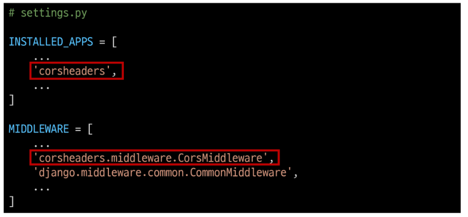

  - CORS를 허용할 Vue 프로젝트의 Domain 등록

    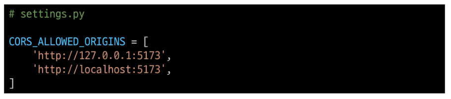

- CORS 처리 결과

  - 메인 페이지에서 DRF 응답 데이터 재확인

    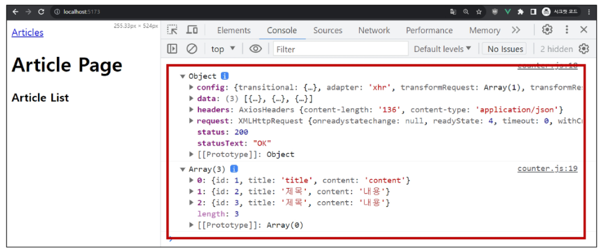

    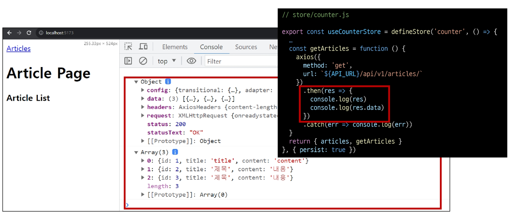

  - 응답 객체에서 'Access-Control-Allow-Origin' Header 확인

    - 개발자도구 - Network - Fetch/XHR

      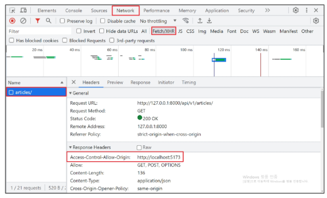

## Article CR 구현

### 전체 게시글 조회

- 전체 게시글 목록 저장 및 출력

  - 응답 받은 데이터에서 각 게시글의 데이터 구성 확인 (id, title, content)

    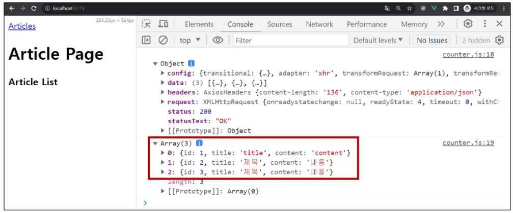

  - store에 게시글 목록 데이터 저장

    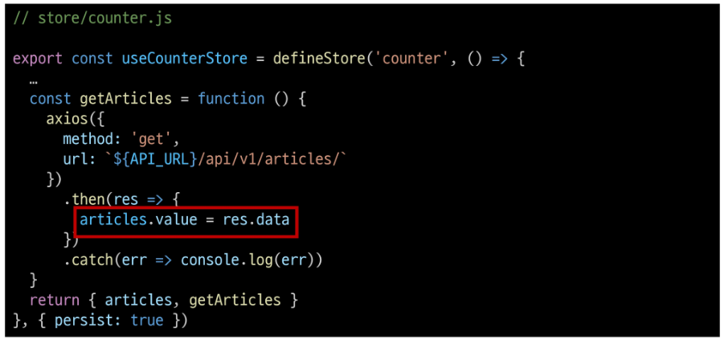

  - store에 저장된 게시글 목록 출력 확인

    - pinia-plugin-persistedstate에 의해 브라우저 Local Storage에 저장됨

    

### 단일 게시글 조회

- 단일 게시글 데이터 출력

  - DetailVue 관련 route 주석 해제

    

  - ArticleListItem에 DetailView 컴포넌트로 가기 위한 RouterLink

    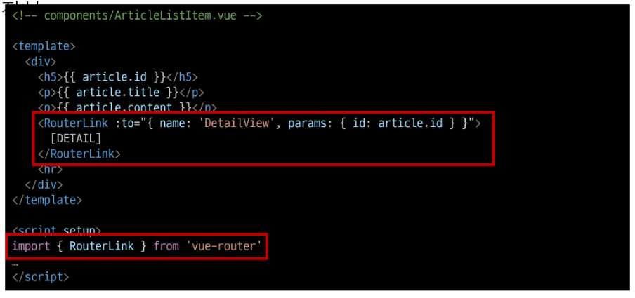

  - DetailView가 마운트 될 때 특정 게시글을 조회하는 AJAX 요청 진행

    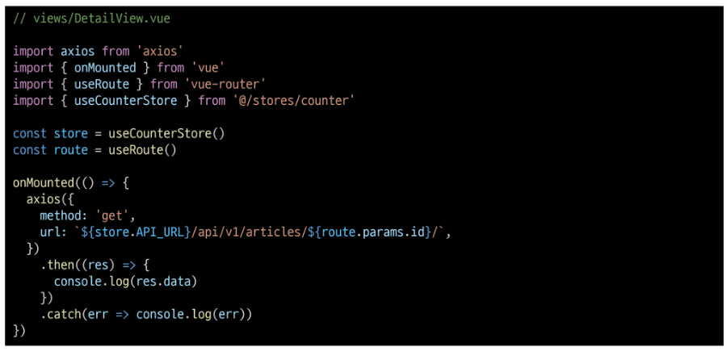

  - 응답 데이터 확인

    - [http://localhost:5173/articles/1/](http://localhost:5173/articles/1/)

    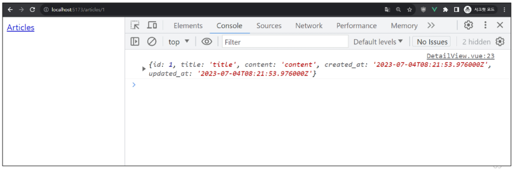

  - 응답 데이터 저장 후 출력

    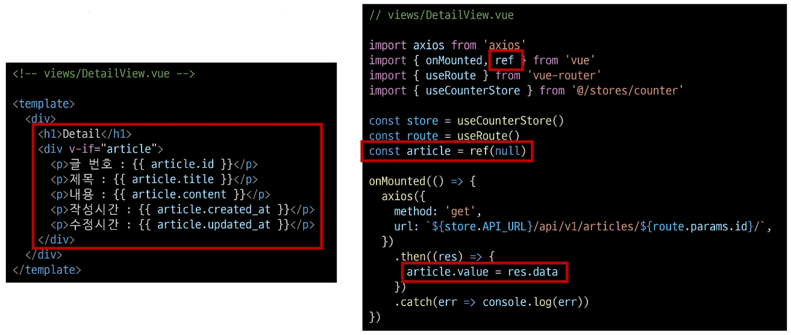

  - 결과 확인

    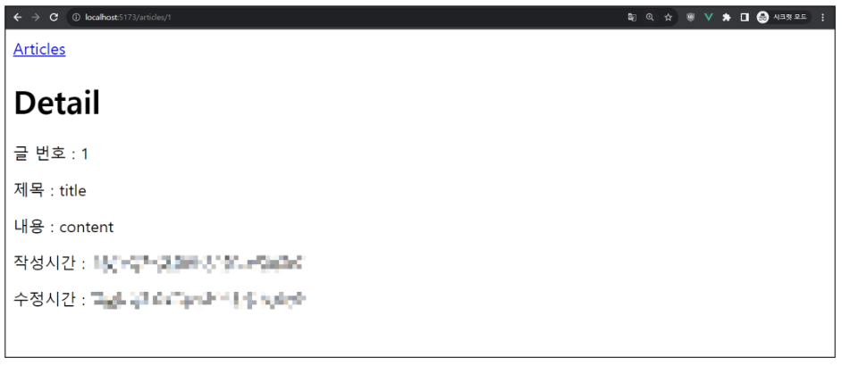

### 게시글 작성

- 게시글 작성

  - CreateView 관련 route 주석 해제

    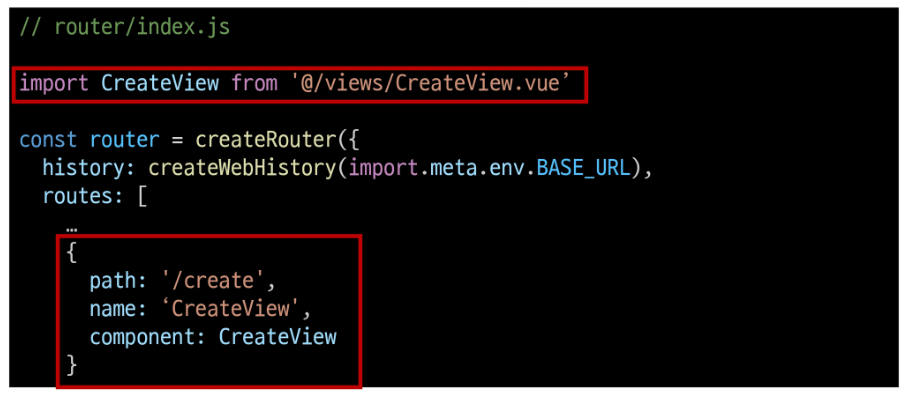

  - ArticleView에 CreateView 컴포넌트로 가기 위한 RouterLink 작성

    

  - v-model을 사용해 사용자 입력 데이터를 양방향 바인딩

  - v-model의 trim 수식어를 사용해 사용자 입력 데이터의 공백을 제거

    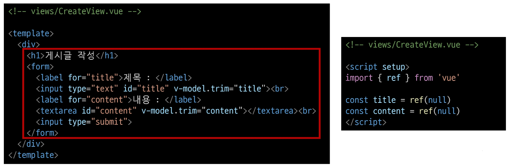

  - 게시글 작성

    - 양방향 바인딩 데이터 입력 확인

      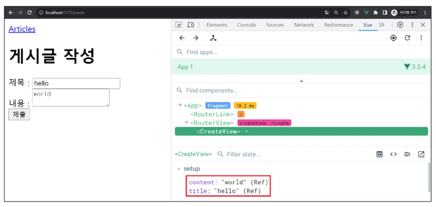

  - 게시글 생성 요청을 담당하는 createArticle 함수 작성

  - 게시글 생성이 성공한다면 ArticleView 컴포넌트로 이동

    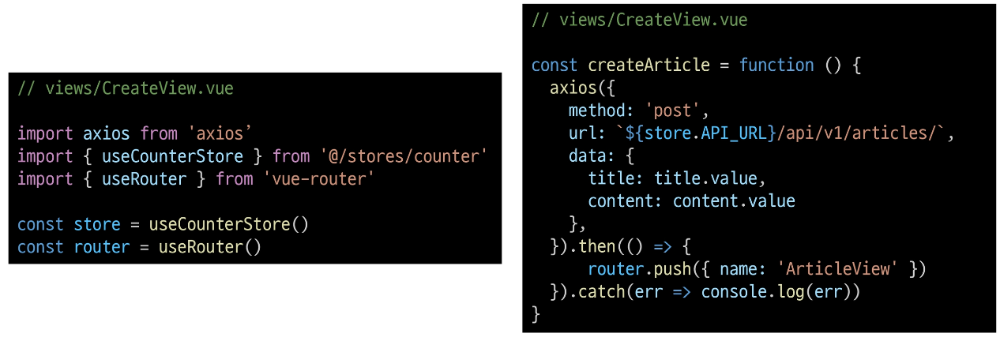

  - submit 이벤트가 발생하면 createArticle 함수를 호출

  - v-on의 prevent 수식어를 사용해 submit 이벤트의 기본 동작 취소

    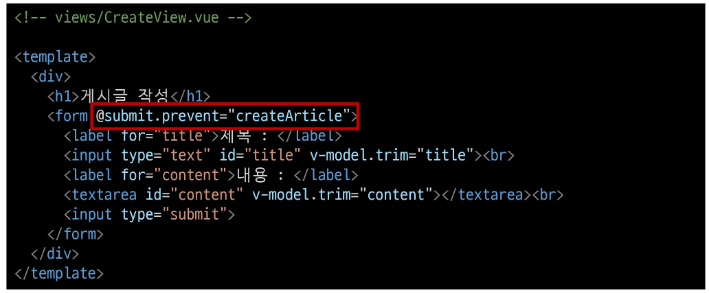

  - 게시글 생성 결과 확인

    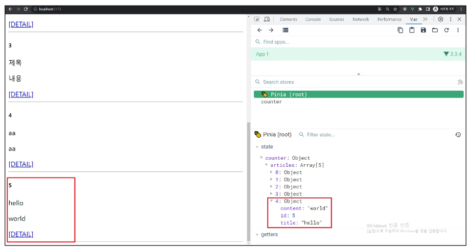

  - 서버 측 DB 확인

    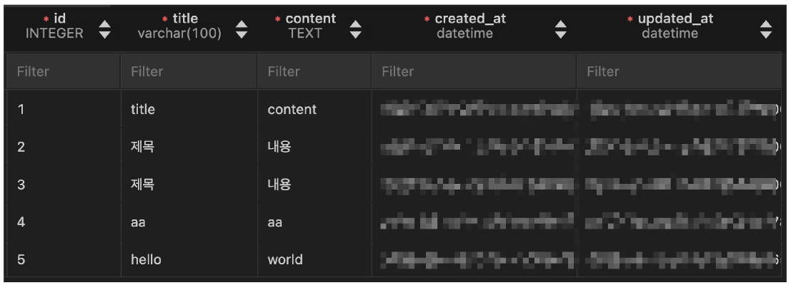