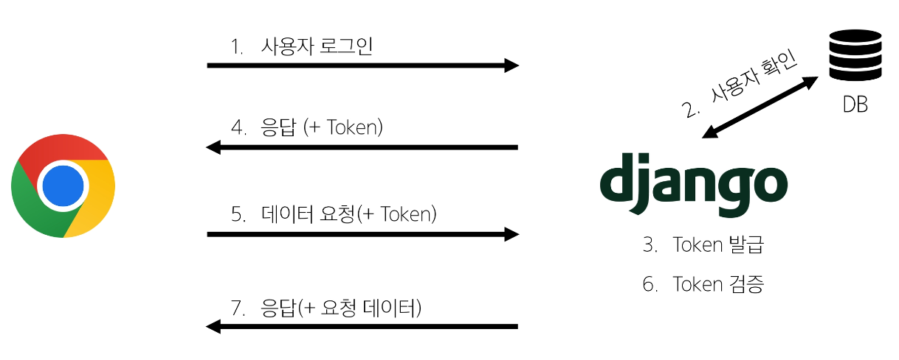
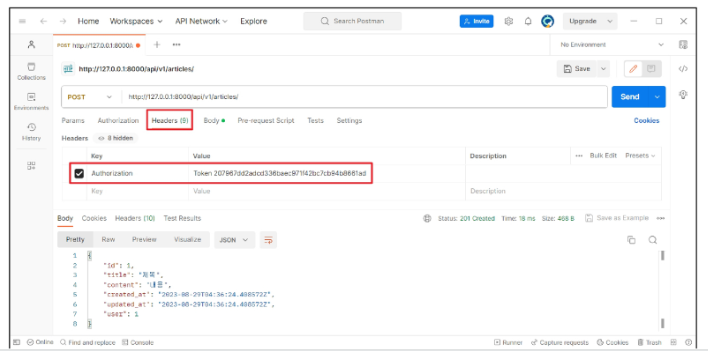
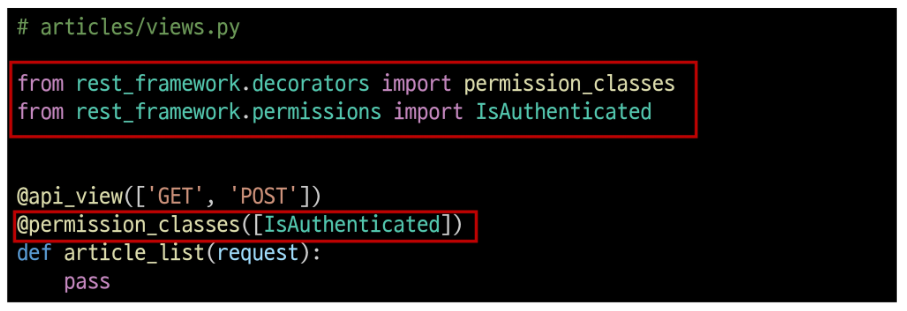

# 2024년 11월 14일(목) 수업 내용 정리 - Vue with DRF 2

- 인증 with DRF

  - 인증
  - 인증 정책 설정
  - Token 인증 설정
  - Dj-Rest-Auth 라이브러리
  - Token 발급 및 활용

- 권한 with DRF

  - 권한 정책 설정
  - IsAuthenticated 설정

- 인증 with Vue

  - 회원가입
  - 로그인
  - 요청과 토큰
  - 인증 여부 확인

- 참고

  - 기타 기능 구현
  - Django Signals
  - 환경 변수
  - Vue 참고 자료

## 인증 with DRF

- 시작하기 전에

  - 인증 로직 진행을 위해 User 모델 관련 코드 활성화

  - user ForeignKey 주석 해제

    

  - serializers의 read_only_fields 주석 해제

    

  - article_list view 함수에서 게시글 생성 시 user 정보도 저장될 수 있도록 주석 해제

    

  1. DB 초기화

      - db.sqlite3 삭제

      - migrations 파일 삭제

  2. Migration 과정 재진행

### 인증

- Authentication(인증)

  - 수신된 요청을 해당 요청의 사용자 또는 자격 증명과 연결하는 메커니즘

  - 누구인지를 확인하는 과정

- Permissions(권한)

  - 요청에 대한 접근 허용 또는 거부 여부를 결정

- 인증과 권한

  - 순서상 인증이 먼저 진행되며 수신 요청을 해당 요청의 사용자 또는 해당 요청이 서명된 토큰(token)과 같은 자격 증명 자료와 연결

  - 그런 다음 권한 및 제한 정책은 인증이 완료된 해당 자격 증명을 사용하여 요청을 허용해야 하는 지를 결정

- DRF 에서의 인증

  - 인증은 항상 view 함수 시작 시, 권한 및 제한 확인이 발생하기 전, 다른 코드의 진행이 허용되기 전에 실행됨

  - 인증 자체로는 들어오는 요청을 허용하거나 거부할 수 없으며, **단순히 요청에 사용된 자격 증명만 식별**한다는 점에 유의

  - [https://www.django-rest-framework.org/api-guide/authentication/](https://www.django-rest-framework.org/api-guide/authentication/)

- 승인되지 않은 응답 및 금지된 응답

  - 인증되지 않은 요청이 권한을 거부하는 경우 해당되는 두 가지 오류 코드를 응답

  1. HTTP 401 Unauthorized

    - 요청된 리소스에 대한 유효한 인증 자격 증명이 없기 때문에 클라이언트 요청이 완료되지 않았음을 나타냄 (누구인지를 증명할 자료가 없음)

  2. HTTP 403 Forbidden (Permission Denied)

    - 서버에 요청이 전달되었지만, 권한 때문에 거절되었다는 것을 의미

    - 401과 다른 점은 서버는 클라이언트가 누구인지 알고 있음

### 인증 정책 설정

- 인증 정책 설정 방법 2가지

  1. 전역 설정

  2. View 함수 별 설정

#### 1. 전역 설정

- 프로젝트 전체에 적용되는 기본 인증 방식을 정의

- DEFAULT_AUTHENTICATION_CLASSES를 사용

- 기본 값 : SessionAuthentication과 BasicAuthentication

- 사용 예시

  

#### 2. View 함수 별 설정

- authentication_classes 데코레이터를 사용

- 개별 view에 지정하여 재정의

- 사용 예시

  

- DRF가 제공하는 인증 체계

  1. BasicAuthentication

  2. TokenAuthentication ✔

  3. SessionAuthentication

  4. RemotreUserAuthentication

- TokenAuthentication

  - token 기반 HTTP 인증 체계

  - 기본 데스크톱 및 모바일 클라이언트와 같은 클라이언트-서버 설정에 적합

  - 서버가 인증된 사용자에게 토큰을 발급하고 사용자는 매 요청마다 발급받은 토큰을 요청과 함께 보내 인증 과정을 거침

  - [https://www.django-rest-framework.org/api-guide/authentication/#tokenauthentication](https://www.django-rest-framework.org/api-guide/authentication/#tokenauthentication)

### Token 인증 설정

- TokenAuthentication 적용 과정

  1. 인증 클래스 설정

  2. INSTALLED_APPS 추가

  3. Migrate 진행

  4. 토큰 생성 코드 작성

#### 1. 인증 클래스 설정

- TokenAuthentication 활성화 코드 주석 해제

- 전역 인증 정책을 Token 방식으로 설정

  

#### 2. INSTALLED_APPS 추가

- rest_framework.authtoken 주석 해제

  

#### 3. Migrate 진행

- Migrate

  

#### 4. 토큰 생성 코드 작성

- accounts/signals.py 주석 해제

- 인증된 사용자에게 자동으로 토큰을 생성해주는 역할

  

- 토큰 인증 방식 과정

  

### Dj-Rest-Auth 라이브러리

- Dj-Rest-Auth

  - 회원가입, 인증(소셜미디어 인증 등), 비밀번호 재설정, 사용자 세부 정보 검색, 회원 정보 수정 등 다양한 인증 관련 기능을 제공하는 라이브러리

- Dj-Rest-Auth 설치 및 적용

  - 설치 (사전에 설치되어 있음)

    

  - 추가 App 주석 해제

    

  - 추가 URL 주석 해제

    

- Dj-Rest-Auth의 Registration(등록) 기능 추가 설정

  1. 패키지 추가 설치

  2. 추가 App 등록

  3. 추가 URL 등록

  4. Migrate

  - [https://dj-rest-auth.readthedocs.io/en/latest/installation.html#registration-optional](https://dj-rest-auth.readthedocs.io/en/latest/installation.html#registration-optional)

- Registration 기능 추가

  1. 패키지 추가 설치 (사전에 설치되어 있음)

    

  2. 추가 App 주석 해제

    

  3. 관련 설정 코드 주석 해제

    

  4. 추가 URL 주석 해제

    

  5. Migrate 진행

    

### Token 발급 및 활용

- Token 발급

  - 회원 가입 및 로그인을 진행하여 토큰 발급 테스트하기

  - 라이브러리 설치로 인해 추가 된 URL 목록 확인

    - [http://127.0.0.1:8000/accounts/](http://127.0.0.1:8000/accounts/)

    

  - 회원 가입 진행 (DRF 페이지 하단 회원 가입 form 사용)

    - [http://127.0.0.1:8000/accounts/signup/](http://127.0.0.1:8000/accounts/signup/)

    

  - 로그인 진행 (DRF 페이지 하단 로그인 form 사용)

    - [http:127.0.0.1:8000/accounts/login/](http:127.0.0.1:8000/accounts/login/)

    

  - 로그인 성공 후 DRF로부터 발급 받은 Token 확인

    ⇨ **이제 이 Token을 Vue에서 별도로 저장하여 매 요청마다 함께 보내야 함**

    

- Token 활용

  - 게시글 작성 과정을 통해 Token 사용 방법 익히기

  - Postman을 활용해 게시글 작성 요청

    - [http://127.0.0.1:8000/api/v1/articles/](http://127.0.0.1:8000/api/v1/articles/)

  - Body에 게시글 제목과 내용 입력

    - [http://127.0.0.1:8000/api/v1/articles/](http://127.0.0.1:8000/api/v1/articles/)

    

  - Headers에 발급받은 Token 작성 후 요청 성공 확인

    - Key: **"Authorization"**

    - Value: **"Token 토큰 값"**

    

- 클라이언트가 Token으로 인증 받은 방법

  1. **"Authorization"** HTTP Header에 포함

  2. 키 앞에는 문자열 **"Token"**이 와야 하며 **"공백"으로 두 문자열을 구분해야 함**

    

  - [https://www.django-rest-framework.org/api-guide/authentication/#tokenauthentication](https://www.django-rest-framework.org/api-guide/authentication/#tokenauthentication)

- Token 데이터 확인

  - Django DB 확인

    

#### 발급 받은 Token을 인증이 필요한 요청마다 함께 보내야 함

## 권한 with DRF

### 권한 정책 설정

- 권한 설정 방법

  1. 전역 설정

  2. View 함수 별 설정

#### 1. 전역 설정

- 프로젝트 전체에 적용되는 기본 권한 방식을 정의

- DEFAULT_PERMISSION_CLASSES를 사용

- 기본 값 : rest_framework.permissions.AllowAny

- 사용 예시

  

#### 2. View 함수 별 설정

- permission_classes 데코레이터를 사용

- 개별 view에 지정하여 재정의

- 사용 예시

  

- DRF가 제공하는 권한 정책

  1. IsAuthenticated ✔

  2. IsAdminUser

  3. IsAuthenticatedOrReadOnly

  4. ...

  - [https://www.django-rest-framework.org/api-guide/permissions/#api-reference](https://www.django-rest-framework.org/api-guide/permissions/#api-reference)

- IsAuthenticated

  - 인증되지 않은 사용자에 대한 권한을 거부하고 그렇지 않은 경우 권한을 허용

    ⇨ 등록된 사용자만 API에 엑세스할 수 있도록 하려는 경우에 적합

### IsAuthenticated 설정

- IsAuthenticated 권한 설정

  - DEFAULT_PERMISSION_CLASSES 주석 해제

    ⇨ 기본적으로 모든 View 함수에 대한 접근을 허용

    

  - permission_classes 관련 코드 주석 해제

    ⇨ 전체 게시글 조회 및 생성 시에만 인증된 사용자만 진행할 수 있도록 권한 설정

    

- 권한 활용

  - 만약 관리자만 전체 게시글 조회가 가능한 권한이 설정 되었을 때, 인증된 일반 사용자가 조회 요청을 할 경우 어떻게 되는지 응답 확인하기

  - 테스트를 위해 임시로 관리자 관련 권한 클래스 IsAdminUser로 변경

    

  - 전체 게시글 조회 요청

    - [http://127.0.0.1:8000/api/v1/articles/](http://127.0.0.1:8000/api/v1/articles/)

  - 403 Forbidden 응답 확인

    

  - IsAdminUser 삭제 후 IsAuthenticated 권한으로 복구

    

## 인증 with Vue

- 시작하기 전에

  - 정상 작동하던 게시글 전체 조회가 작동하지 않음

    - 401 status code 확인

    ⇨ 게시글 조회 요청 시 인증에 필요한 수단(token)을 보내지 않고 있으므로 게시글 조회가 불가능해진 것

    

### 회원가입

- 회원가입 로직 구현

  - SignUpView route 관련 코드 주석 해제

    

  - App 컴포넌트에 SignUpView 컴포넌트로 이동하는 RouterLink 작성

    

  - 회원가입 form 작성

    

  - 사용자 입력 데이터와 바인딩 될 반응형 변수 작성

    

  - SignUpView 컴포넌트 출력 확인

    

  - 회원가입 요청을 보내기 위한 signUp 함수가 해야 할 일

    1. 사용자 입력 데이터를 받아

    2. 서버로 회원가입 요청을 보냄

    

  - 컴포넌트에 사용자 입력 데이터를 저장 후 store의 signUp 함수를 호출하는 함수 작성

    

  - 실제 회원가입 요청을 보내는 store의 signUp 함수 작성

    

  - 회원가입 테스트

    

  - Django DB 확인

    

### 로그인

- 로그인 로직 구현

  - LogInView route 관련 코드 주석 해제

    

  - App 컴포넌트에 LogInView 컴포넌트로 이동하는 RouterLink 작성

    

  - 로그인 form 작성

    

  - 사용자 입력 데이터와 바인딩 될 반응형 변수 작성

    

  - LogInView 컴포넌트 출력 확인

    

  - 로그인 요청을 보내기 위한 logIn 함수가 해야 할 일

    1. 사용자 입력 데이터를 받아

    2. 서버로 로그인 요청 및 응답 받은 **토큰 저장**

    

  - 컴포넌트에 사용자 입력 데이터를 저장 후 store의 logIn 함수를 호출하는 함수 작성

    

  - 실제 로그인 요청을 보내는 store의 logIn 함수 작성

    

  - 로그인 테스트

  - 응답 객체 안에 Django가 발급한 Token이 함께 온 것을 확인

    

### 요청과 토큰

#### Token을 store에 저장하여 인증이 필요한 요청마다 함께 보낸다.

- 토큰 저장 로직 구현

  - 반응형 변수 token 선언 및 토큰 저장

    

  - 다시 로그인 요청 후 store에 저장된 토큰 확인

    

### 인증 여부 확인

## 참고

### 기타 기능 구현

### Django Signals

### 환경 변수

### Vue 참고 자료