## AI DAY 시험 대비 내용 정리

#### 개발자에게 AI가 중요한 이유

- AI는 개발자의 업무 환경에도 많은 변화를 가져왔고 AI를 이해하고 활용할 줄 아는 개발자는 미래에 더욱 높은 경쟁력을 가질 수 있다.

  - 코드 생산성 UP

  - AI 소통 능력 UP

  - AI 문제 해결 역량 UP

  - 커리어 경쟁력 UP

#### AI 2번째 관점

- Programming

  - Data와 Program으로 Output을 만든다

- Machine Learning (Software 2.0)

  - Data와 Output으로 Program을 만든다.

#### Machine Learning & Deep Learning

- Traditional Machine Learning

  - input → Feature extraction → Classification → Output

- Deep Learning

  - input → End2End(Universal approximator)(Feature extraction + Classification) → Output

#### What is AI?

- Artificial Intelligence ⊃ Machine Learning ⊃ Deep Learning

#### It starts from a single neuron

- 1950년대에 이미 시작

- Perceptron : First real implementation of neural networks(뉴럴 네트워크의 첫 번째 시행)

#### Neural Networks

  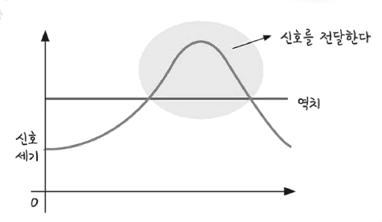

  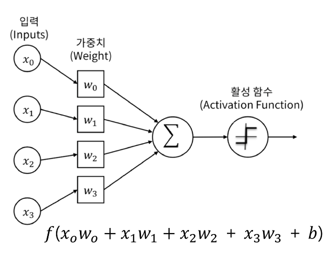

#### Single layer neural network (perceptron)

- 퍼셉트론의 활성화 함수

  - 신호가 역치 이상이면 값을 다른 뉴런에 전달하는 것을 모사하기 위해 활성화 함수로 계단 함수(Step function)을 활용

    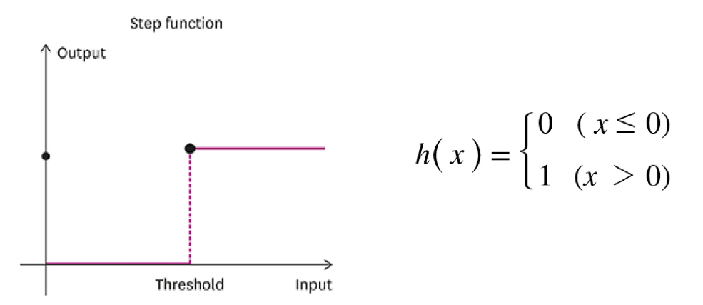

    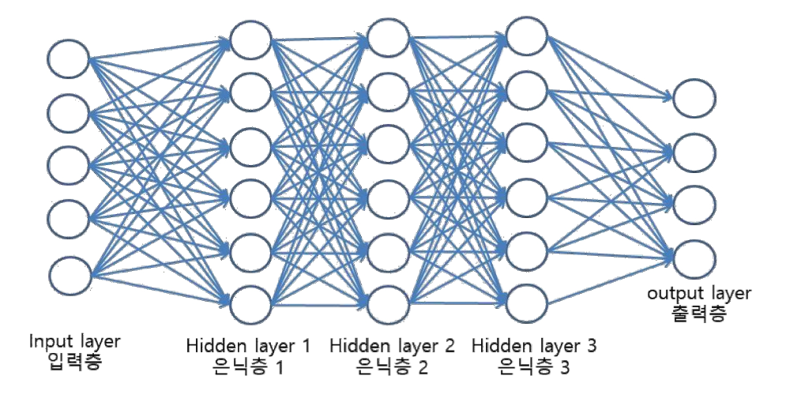

#### Return of the neural networks (in 2012)

- 합성곱 신경망 (CNN : Convolution Neural Networks)

  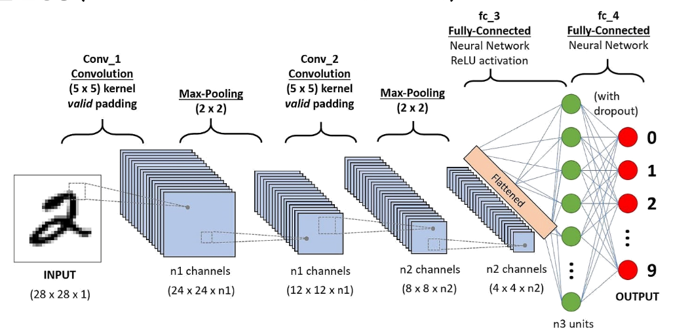

  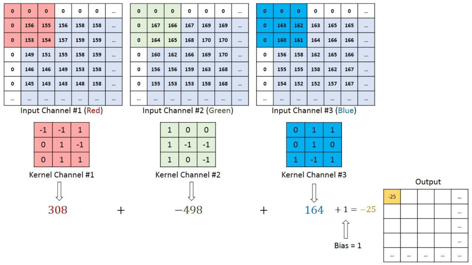

- Pooling Layer

  - 큰 이미지를 처리하는 부담을 줄이기 위해 **중요한 정보로 요약**하고 불필요한 세부 사항은 생략

    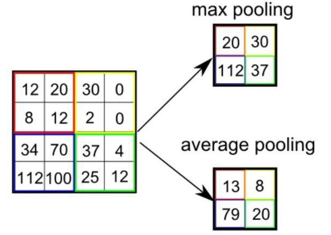

#### 3 + Reasons of AI Success

- Computing HW + Data + Algorithm

#### Performance of NN is not saturated yet

- 뉴럴 네트워크의 performance는 아직 포화되지 않았다.

  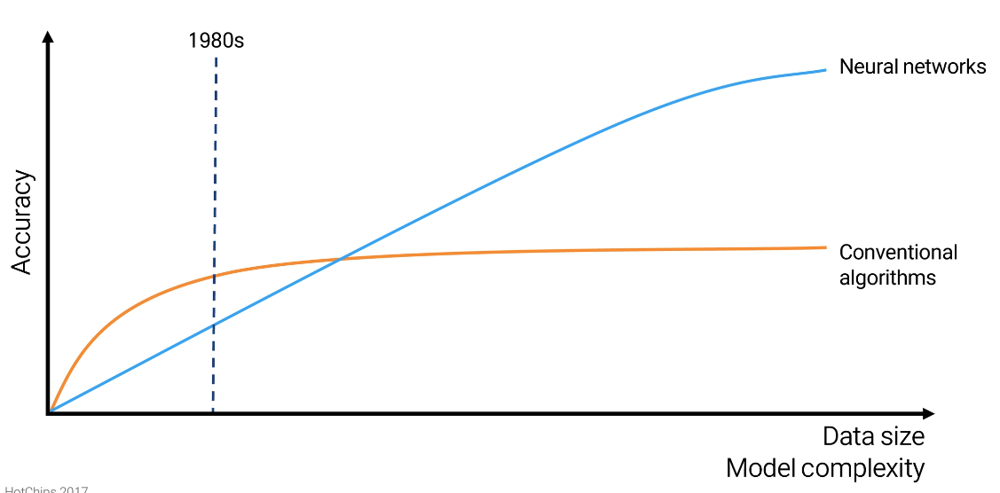

#### How to Build AI

- Key Components of Deep Learning

  - Data : 모델이 학습할 데이터

  - Model : 입력 데이터를 우리가 원하는 출력으로 변환해주는 함수

  - Loss function : 모델의 출력을 통해 모델이 잘하는지 못하는지 판단해 수치화해주는 함수(매핑)

  - Algorithm : Loss를 줄여주기 위해 모델(파라미터)을 업데이트 하는 방법

#### AI의 디자인 요소 4(3)가지

- Big data

  - Data depend on the type of the problem to solve(Classification, Detection, Segmentation, etc.)

- Model

  - 영상인식 예시

    - Classifier : 입력 영상을 카테고리(클래스)로 매핑해주는 함수 f(.)

      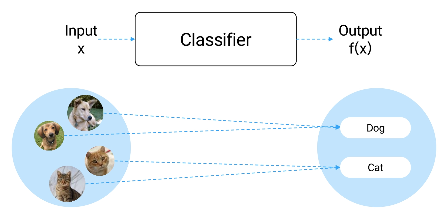

  - Single layer neural network (perceptron)

    - 퍼셉트론

      - 각 입력값 $x_i$에 대한 가중치(weight) $w_i$가 존재할 때, 두 값을 곱한 $w_ix_i$ 벡터의 합으로 구성된 모델

      - 즉, **선형 결합** 관계에 있는 가중치로 구성된 모델 ($w^Tx + b$)

      - 활성화 함수 $\phi$를 통해 특정 임계값을 초과하는지를 기준으로 0 혹은 1의 값으로 결과 $y$를 출력

      - $y = \phi(w^T + b)$ ⇒ $y = \phi(x_0w_0 + x_1w_1 + x_2w_2 + \cdots + x_nw_n + b)$

        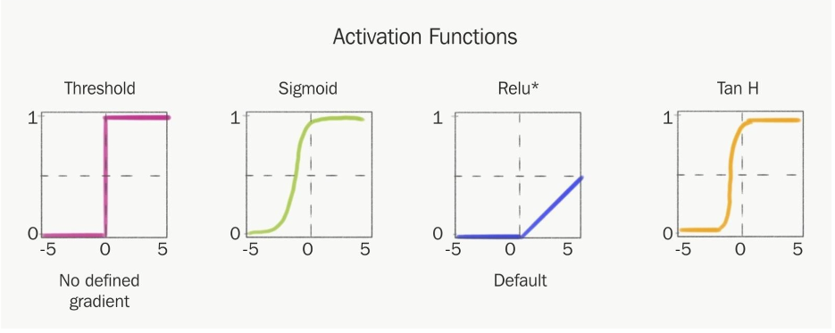

    - 선형 모델(단층 퍼셉트론)의 한계

      - XOR연산과 같은 복잡한 관계를 모델로 나타낼 수 없음

      - 즉, 현실 세계에 존재하는 데이터들의 복잡한 관계를 충분히 표현할 수 있음

        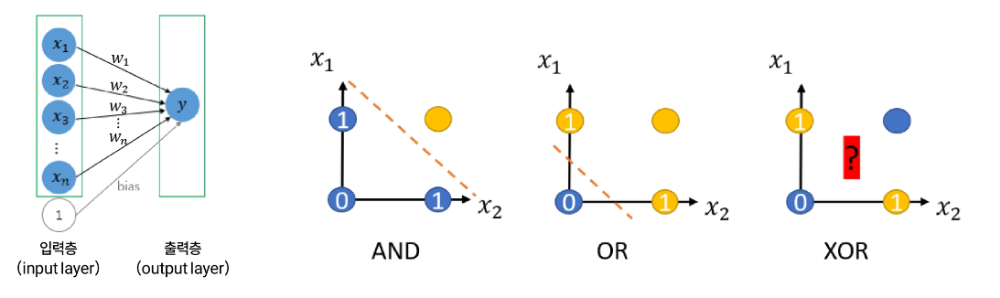

  - Multi Layer Perceptron (MLP)

    - 다층 퍼셉트론

      - 입력 레이어와 출력 레이어만 존재하는 단일 퍼셉트론에 **'은닉층'**이라는 중간 레이어 추가

      - 즉, 여러 개의 레이어를 쌓음으로써 단일 퍼셉트론으로 표현할 수 없는 복잡한 연산을 수행할 수 있음

        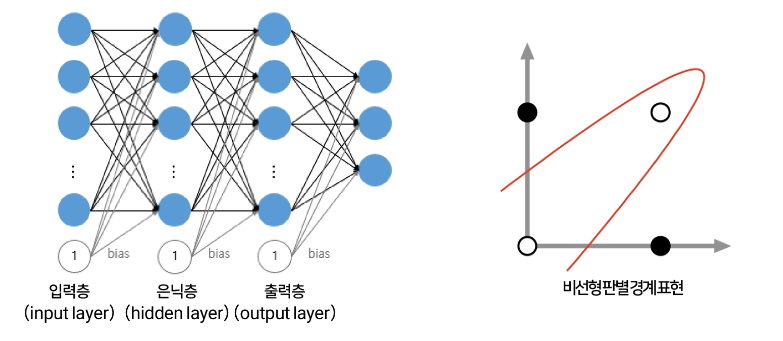
      

- Loss(Reward)

  - 손실 함수 (loss function)

    - **모델의 출력값과 실제 데이터의 정답 사이의 오차**를 계산하는 함수

    - AI 모델을 학습한다는 것은 주어진 데이터에 대한 정답에 근사한 예측을 할 수 있는 모델을 만드는 것

    - 즉, 손실을 최대한 작은 값으로 줄이는 것이 AI 모델 학습의 목표

      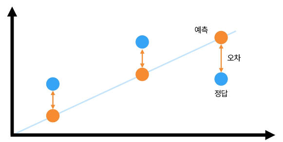

  - 손실 함수 (loss function) 종류 예시

    - Regression Task

      - $MSE = \frac{1}{N}\displaystyle\sum_{i=1}^{N}\displaystyle\sum_{d=1}^{D}(y_i^d - \hat{y}_i^d)^2$

    - Classification Task

      - $CE = -\frac{1}{N}\displaystyle\sum_{i=1}^{N}\displaystyle\sum_{d=1}^{D}y_i^dlog$

    - 회귀(regression)

      - 범주가 아닌 연속적인 수치를 예측하는 태스크

        - 예. 이미지 안의 고양이 마리 수 예측, 9월의 제품 A 판매량 예측

- Algorithm

  - Loss의 편미분(partial derivatives)은 하나의 파라미터가 Loss에 미치는 영향을 알려줌

  - Backpropagation : 모델의 가중치(weight) 업데이트

  - Learning rate : 학습률

  - Learning rate Scheduler : 학습 도중 learning rate(학습률)을 동적으로 조정

#### AI 3번째 관점

  - 계산 / 추론 (computation / inference)

    - 함수를 주고, Output이 나오도록 계산

  - 최적화 (Optimization)

    - 한 세트의 (input, output)을 주고, 관계를 가장 잘 설명하는 함수 f(.)를 찾는 것

#### 모델 평가의 중요성

- 학습된 모델을 테스트함으로서 일반화 능력(Generalization)을 측정하는 과정

- 평가를 통해 모델의 성능 개선 방향을 결정

#### 훈련, 테스트셋

- 모델의 일반화 성능형가(= 과적합, Overfitting)을 위해 데이터 분할 필요

#### Overfitting

- 학습된 모델이 새로운 데이터에 대한 일반화 성능이 떨어지는 현상

- Train set에서 높은 성능, test set에서 낮은 성능

- 대표적 Overfitting 치료법

  - Data augmentation

  - Regularization

  - Model design change

  - More training data

#### 오픈소스 대규모 언어모델(LLM)

- LLaMA, Vicuna, Falcon

#### 자연어 처리 모델

- 입력 문장의 토큰화 및 벡터화

  - 토큰화 : 텍스트를 의미 있는 단위로 분리하는 과정

  - 벡터화 : 토큰을 기계가 처리할 수 있는 수치 데이터로 변환하는 과정

  - 예시. 입력 문장 : this movie has amazing diverse characters => Sequence Data