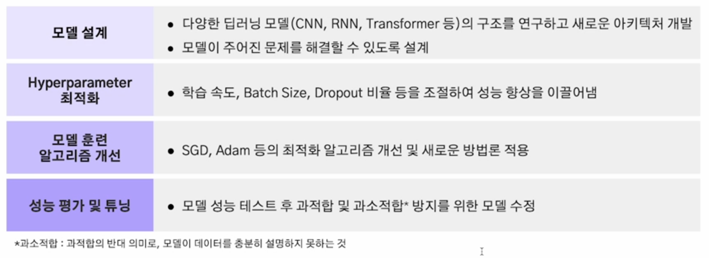
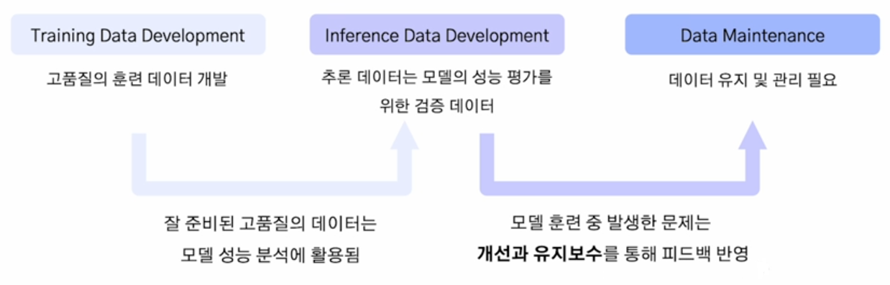

# 2024년 12월 2일(월) 수업 내용 정리 - Introduction to Data - Centric AI

## 데이터와 AI 모델 성능의 상관관계

- 데이터와 AI 모델

  - 형식에 따른 데이터의 종류
  - 모델 훈련에 따른 데이터의 종류
  - 데이터가 AI 모델에 미치는 영향

- Model-Centric AI, Data-Centric AI

  - Model-Centric AI
  - Data-Centric AI

### 01 데이터와 AI 모델

- 학습 목표

  - 형식에 따른 데이터의 종류를 확인한다.
  - AI 모델 훈련 방식에 따른 데이터의 종류를 확인한다.
  - 데이터와 AI 모델 성능 간 상관관계를 이해한다.

 

AI = Code + Data

- AI 시스템은 코드(모델 및 알고리즘)와 데이터로 구성

  

#### 형식에 따른 데이터

  

(1) 정형 데이터

- 정의 : 고정된 형식과 구조를 갖는 데이터
- 예시 : 엑셀, MySQL, 관계형 DB 등

  ※ 활용 예시

  - 거래 금액, 시간 등으로 사기 거래 탐지
  - 환자의 나이, 혈압, 혈당, 콜레스테롤 수치 등으로 환자 진단 질병 예측

    

(2) 반정형 데이터

  - 정의 : 고정된 형태는 없으나 특정한 구조를 갖춘 데이터
  - 예시 : JSON, XML, HTML 등

    ※ 활용 예시

      - 로그 데이터 이상 탐지(서버 로그에서 이상 트래픽 탐지)
      - JSON 데이터의 텍스트 기반 정보를 추출하여 요약 작업 수행

        

(3) 비정형 데이터

  - 정의 : 특정한 구조가 없는 데이터
  - 예시 : 텍스트, 이미지, 비디오 등

    ※ 활용 예시

      - 자율 주행 차량의 차선 및 보행자 인식
      - 의료 분야에서 CT, MRI 데이터 분석

        

#### 모델 훈련에 따른 데이터의 종류

(1) 지도학습(Supervised Learning)

  - 입력 데이터와 이에 대응하는 **정답 레이블이 제공되는 데이터셋**을 사용하여 모델 학습
  - 새로운 데이터와 주어졌을 때 정답을 예측할 수 있도록 함

    ※ 대표 알고리즘

      - **분류(Classification)** : 데이터가 특정 범주에 속하는지 예측
      - **회귀(Regression)** : 데이터의 연속적인 값을 예측

        

(2) 비지도학습(Unsupervised Learning)

  - **정답 레이블이 없는 데이터셋**을 사용하여 데이터의 패턴이나 구조 학습
  - 주로 데이터의 분포, 군집, 특징을 탐색

    ※ 대표 알고리즘

      - **군집화(Clustering)** : 데이터를 유사한 그룹으로 나눔
      - **차원 축소(Dimensionality Reduction)** : 데이터의 차원을 줄이면서 특성 유지

        

#### 데이터는 AI 모델의 연료

- 데이터가 AI 시스템에서 큰 비중을 차지하는 만큼, 데이터의 품질은 AI 성능에 직접적으로 연결됨

  

#### 데이터의 크기 - 중요성

  

  |효과|설명|
  |:--:|:--:|
  |다양성 확보|다양한 학습 케이스를 포함할 가능성이 높아 일반화 능력 향상|
  |노이즈 감소|학습 데이터의 양이 많아 노이즈의 영향이 줄어들어 희석되는 효과|
  |과적합 방지|특정 패턴에 과도하게 의존하는 것을 방지|
  |복잡한 패턴 학습|다양한 학습을 하며 복잡한 모델을 학습|
  |희귀 케이스 포착|데이터의 양이 많을수록 드문 케이스도 포함할 확률 증가|
   

#### 데이터의 크기 - 크기가 부족할 때 생기는 문제

과적합(Overfitting)

- 정의 : 모델이 **훈련 데이터의 특징들을 과도하게 반영**하여 새로운 데이터에 대한 **일반화 성능이 떨어지는 현상**
- 원인 : **데이터가 부족**하여 훈련 데이터 내 포함된 노이즈 데이터를 정상적인 패턴으로 인식하고 학습

  

#### 데이터의 품질

- 데이터의 크기도 중요하지만, 품질이 낮은 채 크기만 크다면 좋은 데이터라 할 수 없음
- 데이터의 유형별로 **품질을 평가할 수 있는 여러 기준으로 세우고** 이에 따라 관리하는 것이 중요

  |데이터 유형|품질 기준 예시|
  |:--:|:--|
  |정형 데이터|• 완전성 : 누락된 데이터 값이 없어야 함 • 유일성 : 중복된 값이 없어야 함|
  |비정형 데이터|1. 이미지 • 해상도 : 이미지의 픽셀 단위 • 정확성 : 이미지의 정보와 메타데이터의 일치 2. 동영상 • 운용성 : 사운드 및 자막 동기화 여부 • 이해성 : 영상 끊김의 정도|
   
  

#### 데이터의 품질 - AI 모델에 미치는 영향

 

 

### 02 Model-Centric AI, Data-Centric AI

- 학습 목표

  - Model-Centric AI를 이해한다.
  - Data-Centric AI를 이해한다.

#### Model-Centric AI와 Data-Centric AI 차이점

#### Model-Centric AI

- 정의 : AI 시스템 개발에서 **모델을 중심으로 접근**하는 방법론
- 데이터를 일정 수준 고정 혹은 제한하고 **모델 자체의 설계와 최적화에 집중**
- 과거부터 지금까지 주로 사용되는 AI 시스템 개발의 주 접근 방식
- BERT, GPT, ResNet 등이 Model-Centric AI의 산물이라 볼 수 있음

  

#### Model-Centric AI - 주요 목적

#### Model-Centric AI - 한계 및 사례

#### 다른 방법론의 필요성

- 과거 연구의 트렌드 : Task에 맞는 데이터를 대량으로 집어 넣고 **노이즈를 잘 걸러내는 모델**을 만드는 것 (BERT 등)
- **최근 연구**의 트렌드 : 사전 학습 모델에 **소량의 고품질 데이터**를 확보하여 Fine-Tuning하는 것
- AI 시스템에서 데이터가 차지하는 비율이 80%

  

#### Data-Centric AI

- AI 시스템 개발에서 **데이터를 중심으로 접근**하는 방법론
- 데이터가 AI 성능의 핵심이라는 인식에서 출발
- 모델의 구조를 고정 혹은 최소한의 조정 후 데이터 품질에 노력을 기울임
- 2020년대에 들어 주목받기 시작한 접근 방식

  ※ 필요성

    - 모델 성능을 종합적으로 평가할 수 있는 데이터셋이 필요
    - 실전에서는 소량의 데이터가 반복적으로 생성되므로 좋은 데이터셋을 생성하는 알고리즘 필요

- Data-Centric AI의 3가지 주요 목표

  

#### Data-Centric AI의 목표

(1) Training Data Development

- 훈련 데이터는 모델 학습의 기초로, 고품질의 데이터를 구성하는 것이 중요

  ※ 종류

  - Data Collection : 새로운 데이터 구축 또는 기존 데이터셋 통합
  - Data Labeling : 수집한 데이터들에 라벨을 부여하여 학습 가능한 형태로 만듦
  - Data Preparation : 데이터 정제, 특징 추출, 표준화 및 정규화를 통해 학습 준비
  - Data Reduction : 특징 선택, 차원 축소 등을 통해 데이터의 크기와 복잡성감소
  - Data Augmentation : 데이터를 더 수집하지 않고 다양성을 높임

(2) Inference Data Development

- 추론 데이터는 모델의 성능 평가를 위한 테스트와 검증 데이터로 사용됨

  ※ 종류

  - In Distribution Evaluation : training 데이터와 **같은 분포를 가진 데이터셋**으로 모델 성능 평가
  - Out of Distribution Evaluation : **다른 분포를 가진 데이터셋**으로 성능 평가

(3) Data Maintenance

- AI 시스템 운영 환경에서는 데이터가 지속적으로 변화하며, 데이터 유지 관리가 필수

  ※ 종류

  - Data Understanding : 데이터의 특성을 전반적으로 이해할 수 있는 알고리즘
  - Data Quality Assurance : 데이터의 퀄리티를 평가할 수 있는 Metric을 개발
  - Data Storage & Retrieval : 데이터를 효율적으로 저장하고 빠르게 검색할 수 있도록 관리

#### Model-Centric AI와 Data-Centric AI의 비교

  |항목|Model-Centric AI|Data-Centric AI|
  |:--:|:--:|:--:|
  |목표|모델 성능 향상을 위한 구조 설계|데이터에서 최대 정보 추출|
  |초점|모델 구조 및 알고리즘 개선|데이터 품질 개선 및 최적화|
  |장점|고품질 데이터 없이도 성능 향상|일반화 성능 향상|
  |단점|큰 성능 향상의 어려움|관리에 시간과 비용이 많이 듦|
  |적용 영역|연구 및 혁신|실제 비즈니스 문제 해결|
   

#### Model-Centric AI와 Data-Centric AI는 상호 보완적

- AI 시스템 개발에서 데이터와 모델 모두 최적화 하는 것이 중요함
- 적은 양의 데이터를 활용할 수 있는 Model-Centric AI도 중요함
- Data-Centric AI의 중요도에 비해 연구가 부족한 상황

  

### SUMMARY

1. 데이터와 AI 모델

    - 형식에 따른 데이터 종류 - 정형, 반정형, 비정형 데이터
    - 모델 훈련에 따른 데이터 종류 - 지도학습 : 라벨 있는 데이터, 비지도학습 : 라벨 없는 데이터
    - 데이터가 AI 모델에 미치는 영향 - 크기와 다양성이 부족하면 모델의 일반화 성능 감소

2. Model-Centric AI, Data-Centric AI

    - Model-Centric AI - 데이터를 고정하고 모델 구조에 집중하는 AI 시스템 개발 방식
    - Data-Centric AI - 모델을 고정하고 데이터에 집중하는 AI 시스템 개발 방식

## 좋은 데이터와 나쁜 데이터의 차이, 데이터 품질의 중요성

- 데이터의 품질

  - 데이터 품질의 정의
  - 데이터 품질의 여러 가지 유형

- 데이터의 품질 관리

  - 데이터 품질 관리의 중요성
  - 품질 측정 및 지수
  - 좋은 데이터의 사례

### 01 데이터의 품질

- 학습 목표

  - 데이터 품질에 대한 정의를 이해한다
  - 항목별로 데이터의 품질을 평가하는 법을 익힌다

#### 폭발적으로 증가하는 데이터

- 2000년대 초반 ~ 2023년까지 생산된 데이터의 양이 90ZB(제타바이트)에 달함
- 이는 그 이전 5000년간 쌓은 데이터의 3000배가 넘는 수치
- 1인당 일주일에 1TB 용량의 데이터를 생성하는 것과 같은 상황

  

#### 데이터 품질에 대한 정의

- 데이터 유형(정형, 비정형)에 따라 다르지만, 일반적인 데이터 품질 기준의 정의는 다음과 같음
- 쉽게 말하면, AI 모델이 학습하기에 얼마나 완전하고 정확하게 구축되었는가?

  |품질 기준|정의|
  |:--:|:--:|
  |완전성(Completeness)|필수 항목에 누락이 없어야 함|
  |유일성(Uniqueness)|데이터 항목은 유일해야 하며, 중복되어서는 안 됨|
  |유효성(Validity)|데이터 항목은 정해진 데이터 유효 범위 및 도메인을 충족해야 함|
  |일관성(Consistency)|데이터가 지켜야 할 구조, 값, 표현되는 형태가 일관되게 정의되고, 일치해야 함|
  |정확성(Accuracy)|실세계에 존재하는 객체의 표현 값이 정확히 반영되어야 함|
   

#### 정형 데이터의 품질에 대한 정의

(1) 완전성

  ※ 완전성이 지켜지지 않은 경우

  - AI 모델이 학습할 수 있는 정보가 줄어들고 중요한 정보가 손실될 수 있음

(2) 유일성

