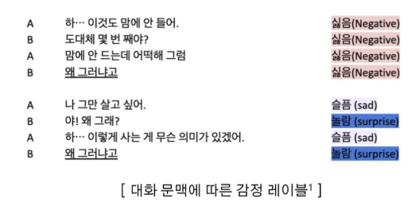
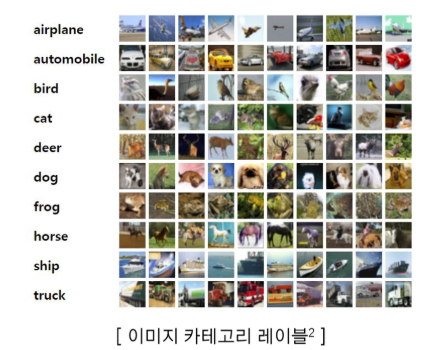
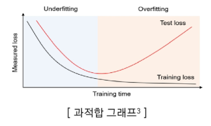
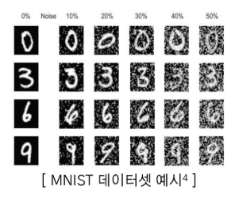
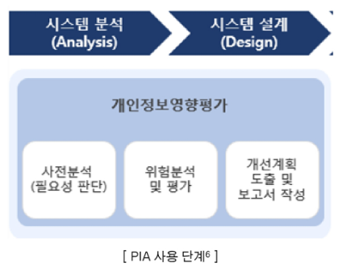
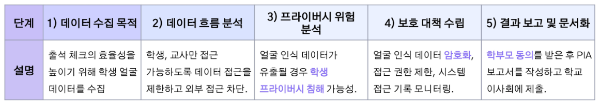
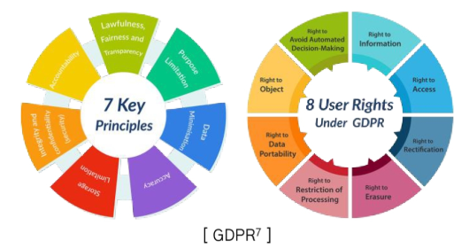
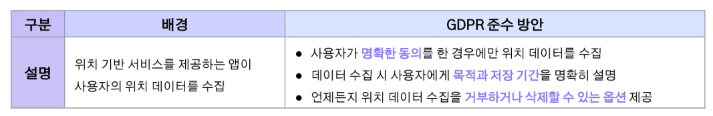
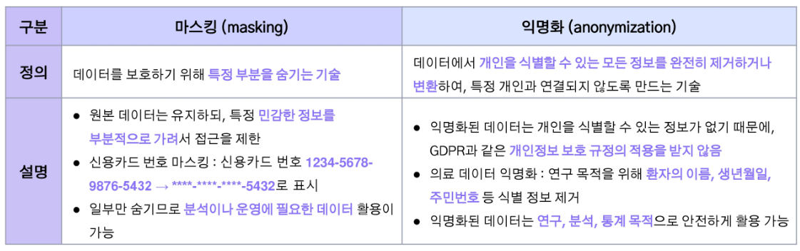

# 2024년 12월 3일(화) 수업 내용 정리 - 데이터 구축 방법론

## 데이터 수집 시 고려애햐 할 사항

- 데이터 수집의 목적 정의

  - 문제 정의와 목표 설정의 중요성
  - 목적에 맞는 데이터 요구사항 분석
  - 다양하고 풍부한 데이터 확보
  - 데이터 수집의 범위와 한계 설정
  - 목적에 따른 목표 데이터 예시

- 법적 / 윤리적 고려 사항

  - 개인정보 보호 및 프라이버시 문제의 심각성
  - 윤리적 데이터 수집과 책임
  - 법적 고려사항을 반영한 데이터 수집 계획
  - 데이터 편향과 공정성 문제

### 01 데이터 수집의 목적 정의

- 학습 목표

  - 데이터 수집의 목적을 명확히 정의해야 하는 이유를 인지할 수 있다
  - 목적에 따라 요구되는 데이터를 정의할 수 있다

#### 문제 정의와 목표 설정의 중요성

(1) 목표 설정이 중요한 이유

- 데이터 수집 전에 목표를 명확히 정의하면 **필요한 데이터의 형태**와 특성을 파악할 수 있음
- 불필요한 데이터 수집을 방지하고, **고품질의 데이터를 확보**할 수 있음

(2) 목표를 잘못 설정할 경우

- 데이터의 **품질 저하**로 AI 모델의 성능이 떨어질 수 있음
- **시간과 자원의 낭비**로 이어짐

#### 목적에 맞는 데이터 요구사항 분석

사례

- 모델에 필요한 데이터 유형 : **텍스트, 이미지, 음성 등**
- 감정 분석 모델에는 **레이블링된 텍스트 데이터**가 필요
- 이미지 분류 모델은 **이미지 정보와 정확한 카테고리 레이블**이 필요

  

  

#### 다양하고 풍부한 데이터 확보

(1) 데이터의 다양성

- 다양한 특성(연령, 성별, 지역 등)을 가진 데이터는 모델의 **일반화 성능**을 향상

  |예시|구체적인 데이터 예시|기대 효과|
  |:--:|:--|:--|
  |음성 인식 모델|• 여러 국가의 억양 • 시끄러운 거리 소음에서의 음성|• 다양한 사용자 환경에서도 높은 인식률 • 억양과 배경 소음의 다양성이 높을수록 더 정확한 인식이 가능|
  |챗봇 모델|• 여러 언어의 대화 • 구어체와 문어체 혼합된 텍스트|• 다국어 지원 및 문맥에 따른 정확한 답변 • 다양한 언어와 표현 방식에 대응할 수 있어야 다국적 사용자와 원활히 소통 가능|
   

(2) 데이터의 풍부성

- 모델 학습에 사용되는 **데이터의 양**을 의미
- 충분한 양의 데이터는 모델이 **더 많은 패턴과 관계를 학습**할 수 있도록 도움
- 데이터 양이 적으면 **과적합(overfitting)**될 가능성이 높아짐
- 충분한 데이터는 **모델의 신뢰성**을 높임

  ※ 과적합(overfitting)

  - 모델이 **학습 데이터에 너무 지나치게 적응**하여 새로운 데이터(테스트 데이터)에는 제대로 일반화되지 못하는 상황
  - 학습 데이터에 대한 정확도는 높지만 **실제 상황에서의 예측 성능이 떨어짐**

    

(3) 데이터의 정확성

- 데이터의 정확성은 수집된 데이터가 얼마나 정확하고 **신뢰**할 수 있는지를 나타냄
- 모델이 **정확한 정보**를 기반으로 학습해야 함
- 잘못된 데이터는 **모델 학습을 왜곡**
- **노이즈(noise)**가 섞인 데이터는 모델의 신뢰성을 저하

  ※ 노이즈(noise)

  - 데이터에 포함된 **불필요**하거나 **잘못된 정보**
  - 모델이 학습해야 할 **유용한 패턴을 방해**하여 성능 저하
  - 예시 : 잘못된 레이블, 부정확한 측정값, 오타 등

    

#### 데이터 수집의 범위와 한계 설정

(1) 범위 설정의 중요성

- 불필요한 데이터 수집을 줄여 효율성을 높임
- 데이터 범위를 설정하여 정확한 목표에 맞춘 수집 가능

(2) 한계 설정

- 법적, 윤리적 제한 사항을 고려하여 데이터 수집
- 예시 : 개인정보를 포함한 데이터 수집 시 법적 절차 준수 필요

#### 목적에 다른 목표 데이터 예시

(1) 목적 : 고객 리뷰의 감정(긍정, 부정, 중립) 분류

  |예시|목표를 명확히 정의한 경우|목표를 명확히 정의하지 않은 경우|
  |:--:|:--|:--|
  |감정 분석 AI 모델|• 필요한 데이터 : 제품 리뷰, SNS 포스트 등의 **레이블링된 텍스트 데이터** • 수집된 데이터는 감정(긍정, 부정, 중립)이 **명확하게 레이블링**되어 있어야 함 • 특정 언어, 그리고 **특정 제품 카테고리**에 대한 데이터로 집중하여 모델의 예측 정확도를 높임|• 관련 없는 주제의 리뷰나 SNS 데이터를 무작위로 수집하여 **정확도 저하** • 불필요한 언어 및 중복된 데이터를 포함해 **처리 비용과 시간 증가** • 감정 분석에 필요하지 않은 비정형 데이터가 포함되어 모델 성능이 저하됨|
   

(2) 목적 : 특정 질병(예 : 폐암)을 조기에 진단하기 위한 AI 모델 개발

  |예시|목표를 명확히 정의한 경우|목표를 명확히 정의하지 않은 경우|
  |:--:|:--|:--|
  |의료 진단 AI 모델|• 필요한 데이터 : 환자의 **CT 스캔 이미지** 및 해당 진단 결과 레이블 • 데이터의 **해상도와 포맷**을 사전에 설정하여, 일관성 있는 이미지를 수집 • 특정 연령대, 성별, 지역을 고려해 **대표성 있는 데이터** 확보|• 다양한 질병의 의료 이미지를 무작위로 수집하여 **분석 혼선 발생** • 관련 없는 정보를 포함해 모델 훈련 시 **오류 발생 가능성 증가** • 환자 개인정보를 보호하지 않고 수집하여 **법적 문제 초래**|
   

(3) 목적 : 자율주행 차량이 도로 상황 인식 및 장애물 회피

  |예시|목표를 명확히 정의한 경우|목표를 명확히 정의하지 않은 경우|
  |:--:|:--|:--|
  |자율주행 도로 인식 모델|• 필요한 데이터 : **다양한 날짜, 시간대, 도로 조건**에서 촬영된 도로 이미지와 비디오 • 도로 표지판, 차선, 보행자 등 **특정 객체에 대한 레이블링**이 포함된 데이터 확보 • 도심, 고속도로, 주거 지역 등 다양한 **환경 데이터를 포함**하여 모델의 일반화 성능 향상|• 단일 날씨 조건(맑은 날)이나 특정 지역에서만 데이터를 수집해 모델이 **다양한 상황에서 작동하지 않음** • 보행자나 도로 표지판 등의 레이블이 누락된 데이터로 훈련 시 **안전 문제** 발생 가능 • 불필요한 객체가 포함된 데이터를 사용해 모델의 **혼란 가중**|
   

(4) 목적 : 고객 문의 자동 응답

  |예시|목표를 명확히 정의한 경우|목표를 명확히 정의하지 않은 경우|
  |:--:|:--|:--|
  |챗봇 AI 모델|• 필요한 데이터 : **FAQ(Frequently Asked Questions), 고객 문의 데이터**와  이에 대한 답변 사례 • 특정 산업 및 국가(한국의 은행 챗봇은 금융과 한국어에 집중된 데이터)에 맞춘 **특화된 데이터 수집** • 문맥과 질문 의도에 따라 **정확한 레이블링**을 통해 챗봇의 응답 정확도 향상|• 범용 대화 데이터만 수집하여 특정 도메인에서의 **응답 부정확** • 여러 언어의 데이터를 섞어 수집해 **챗봇의 언어 처리 혼란** 초래 • 중복된 데이터나 불필요한 대화 내용으로 인해 **모델 학습 시간 증가**|
   

### 02 법적 / 윤리적 고려 사항

- 학습 목표

  - 데이터 수집 과정에서 발생할 수 있는 법적 / 윤리적 고려사항을 인지할 수 있다
  - 법적 / 윤리적 고려사항을 준수하여 윤리적이고 책임감 있는 데이터를 수집할 수 있다

#### 개인정보 보호 및 프라이버시 문제의 심각성

(1) 개인정보 보호

- AI 모델 개발 시 개인의 데이터를 수집할 때 **프라이버시 침해**발생 가능
- 데이터를 안전하게 관리하지 않으면 신뢰도 저하와 법적 처벌로 이어질 수 있음

(2) 문제 예시

- 의료 데이터, 위치 정보, 대화 기록 등 **민감한 정보**의 무단 수집 및 유출
- 부정확한 개인정보 처리로 인한 **개인 피해** 및 **법적 분쟁** 발생
- 대표적인 예시로 구글의 '프로젝트명 : 나이팅게일'

#### 윤리적 데이터 수집과 책임

  |구분|최소 데이터 수집 원칙|목적 제한 원칙|
  |:--:|:--|:--|
  |설명|• **필요한 데이터**만 수집하여 프라이버시 침해 최소화 • 예시 : 성별에 대한 분류 데이터를 수집할 때, 주소나 위치 등의 개인정보를 제외한 성별만을 수집|• 수집한 데이터는 **사전에 정의된 목적**에만 사용 • 예시 : 마케팅 목적의 데이터가 의료 연구에 사용되지 않도록 제한|
   

#### 법적 고려사항을 반영한 데이터 수집 계획

(1) PIA(Privacy Impact Assessment, 개인정보 영향 평가)

- 개인정보가 사용되는 프로젝트에서 **개인정보에 미칠 수 있는 잠재적 영향**을 평가하고 이를 완화할 수 있는 대책을 마련하는 절차

  

- 예시를 통한 PIA의 진행 절차
- 한 학교가 학생들의 출석을 자동으로 확인하기 위해 얼굴 인식 시스템을 도입하고자 함

  

(2) GDPR(General Data Protection Regulation, 유럽연합 일반 개인정보 보호법)

- 실효성 있는 정보보호를 위해 유럽이 도입한 제도
- 개인의 **개인정보를 보호**하고, 데이터 처리와 관련된 **투명성과 신뢰성**을 강화하기 위해 제정

  

- GDPR에는 **원칙**과 **사용자 권리**가 존재
- GDPR 위반 시 최대 매출의 4% 또는 2천만 유로 중 더 높은 금액을 **벌금**으로 부과

- GDPR 준수를 위한 예시
- 모바일 앱에서 위치 정보 수집

  

(3) 마스킹(masking) 및 익명화(anonymization)

  

### SUMMARY

1. 데이터 수집 목적 정의

    - 고품질 데이터 확보를 위해 목적에 맞는 데이터 요구 사항 분석
    - 일반화 성능 향상 목적을 위해 데이터의 다양성과 풍부성 확보

2. 법적 / 윤리적 고려 사항

    - 윤리적 데이터 수집과 책임 : 최소 데이터 수집 원칙, 목적 제한 원칙
    - 법적 고려사항을 반영 : PIA, GDPR
    - 마스킹, 익명화 등을 고려

