# 2024년 12월 3일(화) 수업 내용 정리 - 데이터 구축 방법론

## 데이터의 Bias

- 데이터 편향의 이해와 유형

  - 편향의 정의
  - 다양한 유형의 편향과 발생 원인
  - 편향과 분산 간의 Trade-off

- 데이터의 편향 완화 전략

  - 데이터 수집 및 전처리 단계에서의 전략
  - 모델에서 편향 완화하는 방법

### 01 데이터의 편향의 이해와 유형

- 학습 목표

  - 편향의 정의를 이해한다
  - 편향의 유형, 발생원인을 확인한다

#### 편향이란?

- 사전적 정의 : 한 쪽으로 치우침

  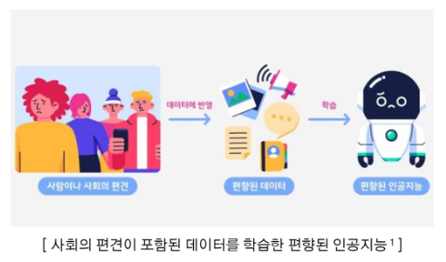

  ※ 인공지능의 편향

  - 편향된 데이터로 인해 편향된 결과를 출력
  - 수많은 데이터를 학습함에 따라 사회에 내제된 편견을 흡수함
  - 모델 알고리즘 자체에 문제가 있는 경우도 있음

#### 인공지능의 편향 사례

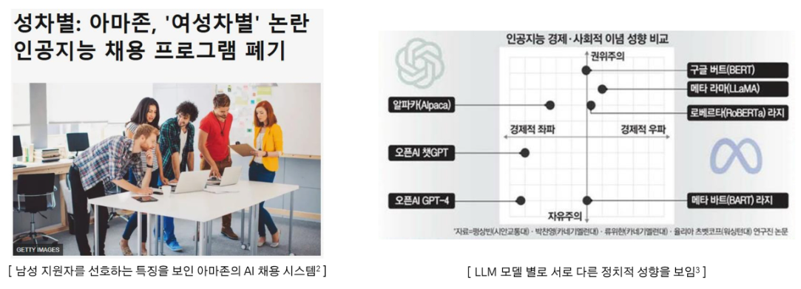

#### 편향의 발생 원인

- AI 시스템의 **80%는 데이터로 구성**
- AI의 편향은 학습되는 데이터로부터 발생할 가능성이 큼

  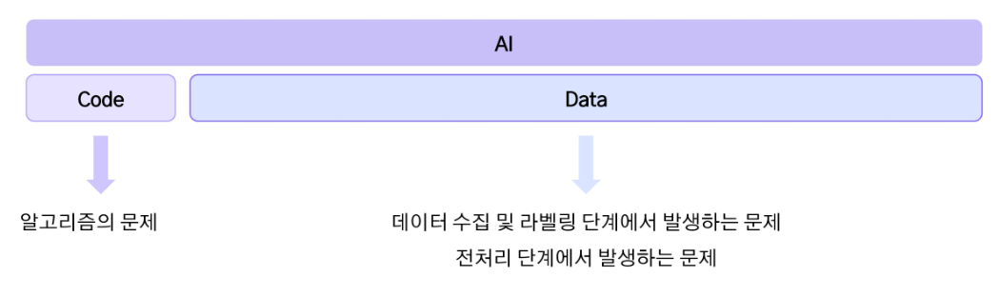

#### 편향의 유형

(1) 표본 편향(Sample Bias)

- 선택 편향(Selection Bias)이라고도 불리며, 데이터가 전체 모집단을 적절히 대표하지 못하는 경우 발생

  ※ 원인

  - 데이터 수집 과정에서 그룹을 과대 또는 과소 대표
  - 표본의 크기가 충분히 크지 않거나 무작위성을 확보하지 못함

  ※ 사례

  - 2차 대전 당시 미군 전투기의 탄흔 숫자 분석

(2) 측정 편향(Measurement Bias)

- 데이터를 측정하거나 기록하는 과정에서 오류 혹은 불일치 발생

  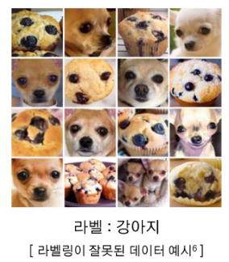
  
  ※ 원인

  - 데이터 측정 도구의 부정확성
  - 데이터를 라벨링하는 과정에서 발생하는 실수

  ※ 사례

  - 스마트폰 센서로 걸음 수 측정할 때 기기 문제로 과소 측정
  - 법적 판결 데이터 학습 시 판사의 편견이 반영된 레이블

(3) 사회적 편향(Social Bias)

- 데이터에 사회적 고정관념, 차별, 또는 불평등이 반영

  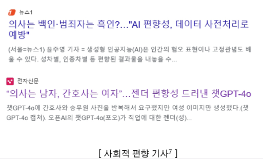

  ※ 원인

  - 이미 사회에 많이 녹아 들어 있는 편향
  - 데이터 수집 과정에서 특정 집단의 특성이 과잉 반영

  ※ 사례

  - 번역 모델이 Doctor를 남성으로 지칭하고 Nurse를 여성으로 지칭
  - 특정 인종에 대한 의료 정확도가 낮음

(4) 확증 편향(Confirmation Bias)

- 기존 가설을 강화하거나 뒷받침하는 데이터만 선택적으로 사용

  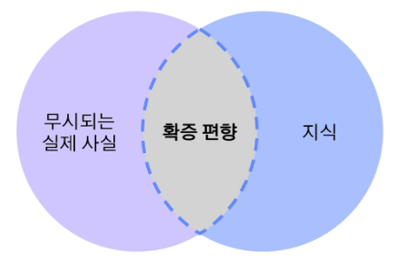

  ※ 원인

  - 연구자나 데이터 과학자가 원하는 결과를 지지하는 데이터만 사용
  - 반대되는 데이터를 무시하거나 배제

  ※ 사례

  - 특정 약물이 효과적이라는 실험 결과만 선택
  - 긍정적인 리뷰만 수집

(5) 데이터 불균형(Imbalance Bias)

- 특정 클래스가 다른 클래스에 비해 과대 또는 과소 대표하여 균형이 맞지 않음

  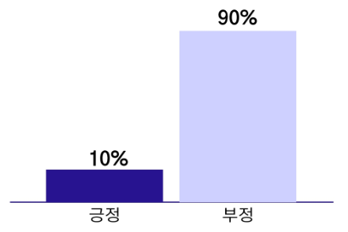

  ※ 원인

  - 데이터의 자연적 분포가 불균형
  - 수집 과정에서 특정 클래스가 배제됨

  ※ 사례

  - 희귀한 질병 데이터가 적어 모델이 해당 질병을 제대로 탐지하지 못함

(6) 알고리즘 편향(Algorithmic Bias)

- 데이터가 편향 뿐만 아니라 알고리즘의 설계, 모델 학습 과정에서 발생하는 편향

  ※ 원인

  - 알고리즘이 최적화하려는 목적 함수가 공정성을 고려하지 않고 설계된 경우
  - 출력 결과가 다시 데이터로 피드백이 되며 편향이 강화됨

  ※ 사례

  - 고객 대출 승인 모델이 대출 승인률 최대화를 목표로 설계된 경우, 소득이 낮은 그룹은 과소평가됨
  - 추천 시스템이 인기 콘텐츠만 반복적으로 추천하며 다양성 감소

#### 데이터 편향이 모델에 미치는 영향

(1) 일반화 능력 부족

- 특정 그룹에 대해 과적합된 결과를 냄
- 실제 배포 환경 및 새로운 데이터에 대해서는 낮은 성능

(2) 공정성 문제

- 모델이 특정 그룹에 유리하거나 불리한 결과를 초래하여 윤리적 문제를 발생

#### Bias, Variance

(1) Bias(편향)

- 모델이 학습 데이터로부터 얻은 **추정값이 실제 정답(목표값)과 얼마나 다른지**를 나타냄
- 모델이 학습 데이터의 패턴을 **제대로 학습하지 못해** 발생하는 오류
- 편향이 높은 모델은 데이터 내에 패턴을 통해 제대로 예측하지 못하기에 **보통 일관되게 정답을 벗어남**

(2) Variance(분산)

- 모델이 학습 데이터의 **작은 변동에 얼마나 민감하게 반응하는지**를 나타냄
- 학습 데이터의 **세부적인 패턴을 과도하게 학습(overfitting)**하여 **새로운 데이터에서 일반화가 어렵게 되는 경우** 발생

#### Bias-Variance Trade-off

- 정의 : 머신러닝 모델에서 **과소적합(Underfitting)**과 **과적합(Overfitting)** 사이의 균형을 설명하는 개념
- 목표 : **Bias(편향)와 Variance(분산)을 적절히 조정**하여 최적의 일반화 성능을 얻는 것

  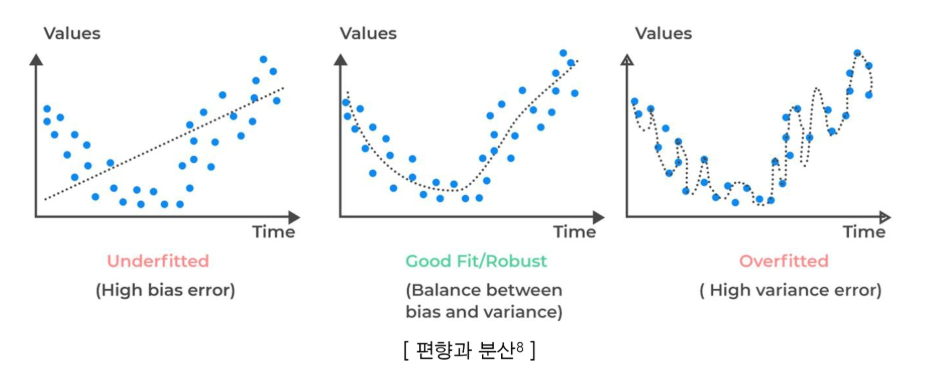

- 간단한 모델은 **패턴을 제대로 학습하지 못해서 Bias이 높고, 예측치의 가변성이 작으므로 Variance가 낮음**
- 복잡한 모델은 **패턴을 잘 해석하기에 Bias는 낮아** 내재된 패턴을 더 잘 포착할 수 있으며, **훈련 데이터에 "너무" 잘 맞기에 예측치의 가변성이 높아서 Variance이 높음**
- 따라서 **Bias와 Variance가 균형을 이루는 지점**을 찾아야 함

  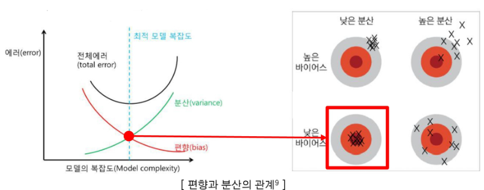

### 02 데이터의 편향 완화 전략

- 학습 목표

  - 데이터에서 편향을 줄이는 방법을 배운다
  - 모델에서 편향을 줄이는 방법을 배운다

#### 편향 완화 전략

(1) 데이터 수집 단계에서 편향 완화 저략

- 데이터 수집의 목적을 명확히 함
- 대표성이 있는 데이터를 수집하고, 수집 기준을 표준화

(2) 데이터 전처리

- 수집한 데이터의 균형이 맞지 않을 경우 전처리를 통해 이를 해결

(3) 모델에서 편향 완화

- 모델 알고리즘을 수정하여 편향 출력을 방지할 수 있음
- 모델 완성 후 모니터링을 통해 편향 감지

#### 데이터 수집 단계에서 편향 완화

(1) 대표성 있는 데이터 수집

- AI 모델이 학습 데이터에서 **다양한 특성**과 **집단을 공정하게 학습**할 수 있도록 설계

  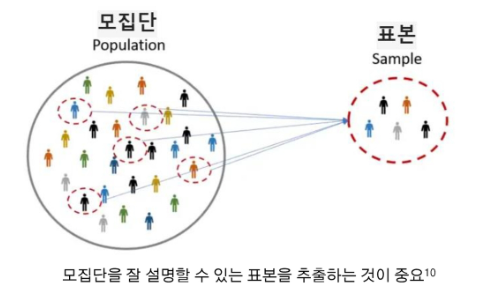

  ※ 대표성이 중요한 이유

  - 일반화 능력 향상 : 모델이 모집단 전반에 대해 잘 설명할 수 있음
  - 공정성 확보 : 특정 집단에 치우치는 불공정한 결과 방지

① 데이터 수집 범위 확장

- 데이터 수집 과정에서 발생할 수 있는 **불일치와 편차를 최소화**

② 무작위 샘플링

- 모집단의 다양한 특성을 공정하게 반영하는 데이터 확보

③ 층화 샘플링

- 모집단의 중요한 특성으로 나누고 각 그룹에서 균등하게 데이터를 수집

④ 데이터 증강

- 현실적으로 수집이 어려운 데이터는 증강 기법으로 보완

(2) 데이터 수집 기준 표준화

- 데이터 수집 과정에서 발생할 수 있는 **불일치와 편차를 최소화**

  ※ 표준화가 중요한 이유

  - 데이터 품질 향상 : 일관된 기준으로 수집된 데이터로 정확성 향상
  - 재현성 확보 : 동일 조건에서 수집한 데이터는 이후 실험과 분석의 재현성이 높아짐

① 수집 도구 표준화

- 카메라, 센서 등의 수집 장비의 사양을 동일하게 유지

② 수집 프로세스 표준화

- 수집 절차를 문서화하여 모든 수집자가 동일한 방법으로 따르도록 함

③ 데이터 포맷 표준화

- 데이터의 형식과 구조를 통일하여 데이터 처리의 일관성 확보

#### 데이터 균형화

- 데이터셋 내 클래스 간 불균형을 완화하여 편향되지 않도록 조정

  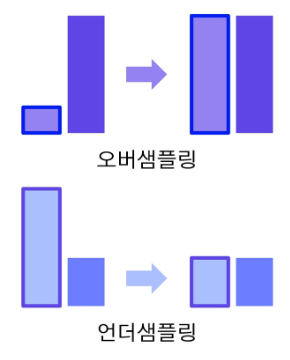

  ※ 오버 샘플링

  - 소수 클래스의 데이터를 늘림
  - 방법 : SMOTE, ADASYN, ...
  - 단점 : 노이즈가 증폭될 가능성

  ※ 언더 샘플링

  - 다수 클래스의 데이터를 줄임
  - 방법 : Tomek Links, CNN(Condensed Nearest Neighbor), ...
  - 단점 : 정보 손실 가능성

#### 데이터 균형화 : 오버샘플링

(1) SMOTE(Synthetic Minority Oversampling Technique)

- 소수 클래스의 데이터를 기반으로 새로운 데이터를 합성
- 아웃 데이터 포인트 사이에 임의의 값을 생성

  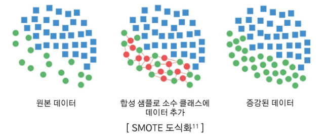

(2) ADASYN(Adaptive Synthetic Sampling Approach)

- 소수 클래스 데이터를 확대하되, **데이터 분포의 복잡성을 고려**하여 생성
- 학습하기 어려운 샘플(즉, 소수 클래스 데이터 주변에 다수 클래스 데이터가 많은 경우)에 더 많은 데이터 생성

  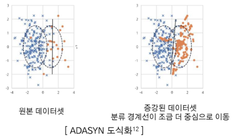

- SMOTE와 ADASYN 비교
- Python에서 imbalanced-learn 라이브러리(imblearn)를 활용하여 SMOTE와 ADASYN을 간단히 구현할 수 있음

  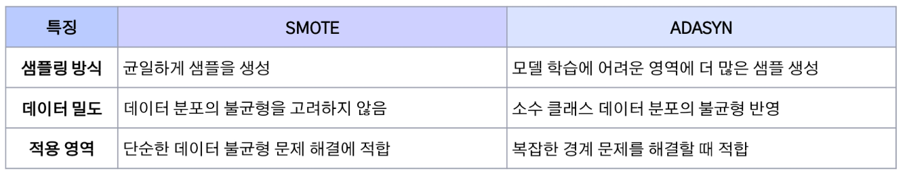

#### 데이터 균형화 : 언더샘플링

(1) Tomek Links

- Tomek Links는 가장 가까운 두 데이터를 묶었을 때 각 데이터가 서로 다른 클래스에 속하는 것을 의미(= 모호한 데이터들)
- 이들을 찾아 제거하여 **데이터의 경계를 명확히 하고** 모델이 경계에서 더 정확히 학습할 수 있도록 도움

  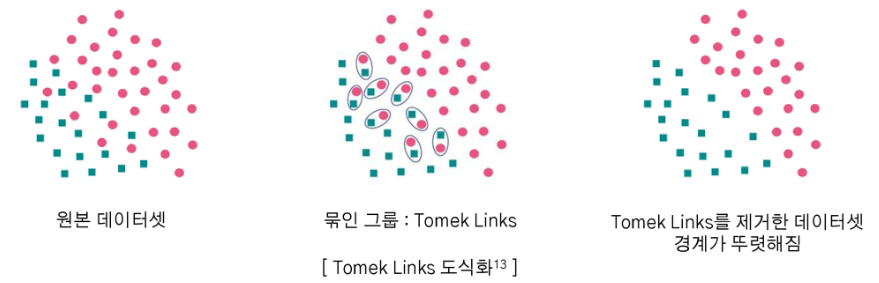

(2) CNN(Condensed Nearest Neighbor)

- 다수 클래스에서 데이터 하나를 뽑고, 소수 클래스 전체를 합집합한 것을 S 집합이라 둠
- 다수 클래스 데이터 중 하나를 뽑아 소수 클래스와 더 가까우면 해당 데이터를 S에 포함시킴
- 더 이상 선택되는 데이터가 없을 때까지 이를 반복(1-NN으로 분류되지 않는 데이터만 남기는 것)
  
  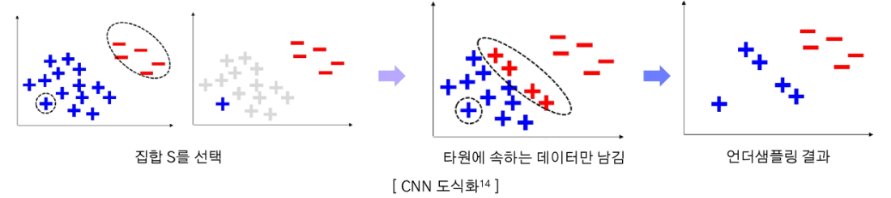

#### 데이터 균형화 : 복합샘플링

(1) SMOTE-Tomek

- SMOTE로 오버샘플링 수행하여 데이터를 증강
- 증강된 데이터에서 경계에 위치한 Tomek-Links를 찾아 제거

  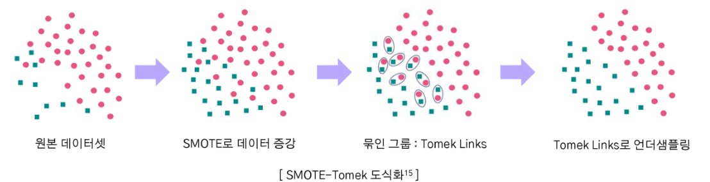

(2) OSS(One Sided Selection)

- Tomek Links로 데이터셋의 경계를 확실히 만듦
- 이후 CNN을 적용하여 경계와 멀리 떨어진 데이터를 제거

  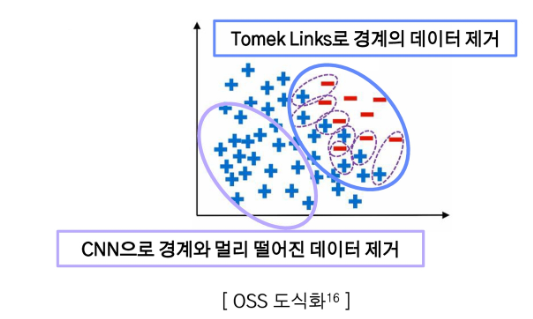

#### 모델 학습 단계에서 편향 완화

(1) 공정성 제약(Fairness Constraints)

- AI 모델 학습 과정에서 공정성을 목표로 하는 제약 조건을 추가하여 편향되지 않도록 조정
- 편항된 데이터가 입력되어도 어느 정도 보정 가능

  ※ 공정성 제약을 모델에 포함하는 방법

  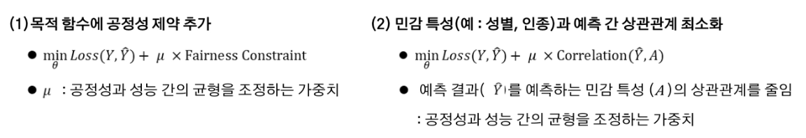

(2) Adversarial Debiasing

- 적대적 학습(Adversarial Training)을 활용하여 AI 모델의 편향 완화

  ※ 절차

  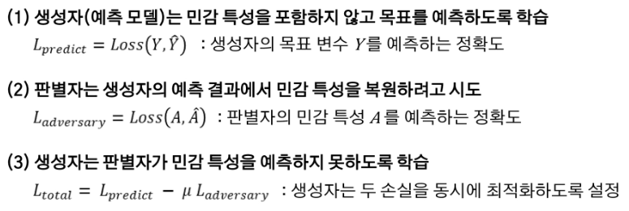

#### 모델 평가 단계에서 편향 완화

- 모델 완성 및 배포 이후에도 지속적으로 관리가 필요

(1) 공정성 평가 지표 사용

- 구축한 모델이 공정하게 작동하는지 평가
- 교차 검증으로 모델이 다양한 시나리오에서 일관되게 작동하는지 평가

(2) 모니터링

- 데이터 분포를 분석하며 새로운 편향이 발생하는지 감지
- 시간이 지남에 따라 데이터 분포의 변화를 반영

### SUMMARY

1. 데이터 편향의 이해와 유형

    - 편향의 정의와 유형 - 표본 편향, 측정 편향, 확증 편향, 알고리즘 편향, ...
    - 편향 유형별 발생 원인

2. 데이터의 편향 완화 전략

    - 데이터 수집 단계에서 전략 - 대표성 있는 데이터 수집, 수집 기준 표준화
    - 데이터 전처리에서 전략 - 오버샘플링, 언더샘플링
    - 모델에서 편향 완화 - 공정성 제약 추가, Adversarial Debiasing