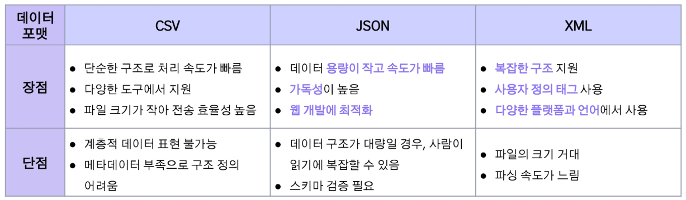

# 2024년 12월 3일(화) 수업 내용 정리 - 데이터 구축 방법론

## 데이터 수집 방법론

- 크롤링을 통한 데이터 수집

  - 웹 크롤링
  - 크롤링 라이브러리
  - 데이터 포맷
  - 크롤링 실습

- API를 통한 데이터 수집

  - Open API(Application Programming Interface)
  - 공공데이터 API

### 01 크롤링을 통한 데이터 수집

- 학습 목표

  - 웹 크롤링의 정의, 원리 및 작동 방식을 설명할 수 있다
  - 웹 크롤링 진행 시, 윤리적 법적 문제를 이해할 수 있다

#### 웹 크롤링

(1) 정의

- 자동화된 스크립트(봇)을 이용해 웹 페이지를 **자동으로 탐색**하고 **데이터를 수집하고 저장**하는 과정
- 주로 **검색 엔진**에서 웹 페이지를 수집하여 **색인(Indexing)**하거나, 데이터 분석 및 연구를 위해 **대량의 데이터를 수집**

  

(2) 원리

- **크롤러**가 특정 웹 페이지에 접근하여 **HTML 코드를 다운로드**한 후, 필요한 정보를 **자동 추출**
- 크롤러는 웹 페이지의 **링크를 따라가며 연속적으로 페이지를 탐색**하여 데이터 수집
- 수집한 데이터를 **정제 및 가공**하여 분석 가능한 형태로 저장

  

(3) 관련 용어

  

(4) 웹 페이지(HTML 문서)의 구조

- **HTML(Hyper Text Markup Language)** : 웹 문서를 작성하기 위해 사용하는 기본적인 웹 언어
- 월드와이드웹(WWW)을 통해 접근 가능한 문서를 만들 때 주로 사용
- 목적 : 문서의 **글자 크기, 색상, 모양, 그래픽, 하이퍼링크** 등을 정의하여 웹 페이지의 **구조와 스타일**을 설정
- 태그(tag) : HTML 명령어로, 꺽쇠괄호(<>)로 표기

  

  

(5) 일반적인 웹 크롤링 순서

  

(6) robots.txt

- 웹사이트에서 **크롤러의 접근을 제어**하기 위해 사용하는 텍스트 파일
- 웹사이트 소유자가 **크롤러가 접근 가능한 영역과 제한해야 할 영역**을 정의
- 권고 사항이며, 강제성은 없음

  

(7) 크롤링 시 고려사항 - 1. 윤리적 문제

- 대량의 요청을 보내면 웹 서버에 과부하를 유발할 수 있어 **서비스 장애** 유발
  > 크롤링 시 적절한 요청 간격을 두어 서버에 무리를 주지 않도록 해야 함

- 사용자의 동의 없이 이메일, 전화번호 등 **개인 정보**를 수집할 수 있음
  > GDPR과 같은 개인정보 보호법을 위반할 경우 **법적 처벌** 가능

  

(8) 크롤링 시 고려사항 - 2. 법적 문제

- 일부 웹사이트는 **이용 약관**에 따라 크롤링을 금지하며, 이를 무시하고 데이터를 수집하면 법적 분쟁 발생 가능
- 특히, 유료 콘텐츠나 구독 기반 사이트에서 크롤링을 시도하는 것은 법적으로 문제 가능
- 웹 페이지의 콘텐츠를 무단으로 수집하여 **상업적 목적**으로 사용하는 경우 저작권법 위반에 해당
  - 예를 들어, 뉴스 사이트의 기사를 크롤링하여 자신의 블로그에 게시하면 저작권 침해로 고소 가능

  ※ 예시 : 야놀자 vs 여기 어때

  - 4년 8개월 간 법정 다툼
  - 크롤링 프로그램을 이용해 야놀자의 플랫폼에 게시된 숙박업소 정보를 대량 수집해 여기어때의 플랫폼 영업에 이용
  - 야놀자에서 시간과 비용 등 노력을 들여서 정보로의 부가가치를 만든 것이라 주장하며 민사소송 제기

    

####  크롤링 라이브러리

(1) 파이썬 라이브러리

  

(2) BeautifulSoup : HTML 문서 파싱

- HTML 문서를 단순한 파이썬 객체처럼 다룰 수 있어 **직관적이고 사용이 간편**
- 파이썬 내장 파서(html.parser), lxml, html5lib 등 **다양한 HTML 파서 지원**하여 성능과 호환성 선택 가능
- CSS 선택자, 태그, 속성 등 다양한 방식으로 데이터를 선택할 수 있어 **복잡한 웹 페이지에서도 유용**

  

(3) Requests, Urllib : 정적 수집 도구

  

(4) Selenium : 동적 수집 도구

- 웹 애플리케이션의 테스트를 자동화할 수 있도록 설계된 오프 소스 프레임워크
- 다양한 브라우저(Chrome, Firefox, Edge, Safari 등)를 지원하며, 여러 프로그래밍 언어(Python, Java, C#, Ruby 등)로 제어
- 웹 사이트가 자바스크립트로 동적 콘텐츠를 로드하는 경우, Selenium을 통해 브라우저를 직접 제어하며 **동적 페이지의 콘텐츠**도 스크래핑 가능

  

#### 데이터 포맷

(1) CSV

- 데이터를 쉼표(,)로 구분하여 저장한 텍스트 파일 형식
- 각 줄은 레코드(record), 쉼표로 구분된 값들은 필드(field)
- 프로그래밍 언어(Python, R, Java 등)에서 쉽게 읽고 쓰기 가능함
- 저장 공간을 적게 사용하고 처리 속도가 빠름

  

(2) JSON

- JavaScript에서 파생된 경량 데이터 교환 형식
- 사람이 읽기 쉽고 기계가 분석 및 생성하기 쉬운 구조
- **Key-Value 쌍**으로 이루어진 데이터 구조

  

(3) XML(eXtensible Markup Language)

- 데이터의 구조와 의미를 설명하기 위해 태그를 사용하는 언어(유연한 마크업 언어)
- **사용자 정의 태그를 사용**하여 데이터를 표현
- 계층적 구조와 속성(attribute)을 사용하여 다양한 데이터 형태를 표현 가능

  

(4) 데이터 포맷의 비교

  

#### 크롤링 실습(Colab)

(1) 필요한 기능들

  

(2) Chrome 옵션 설정

  

(3) robots.txt로 크롤링 허용 확인

  

(4) 웹 페이지로부터 가져올 내용 분석

  

(5) 내용 가져오기

  

(6) 내용 csv화

  

### 02 API를 통한 데이터 수집

- 학습 목표

  - 웹 크롤링과 API를 구분하여 데이터를 수집 방법을 정할 수 있다
  - 공공데이터 포털의 OpenAPI를 활용하여 데이터를 수집할 수 있다

#### OpenAPI(Application Programming Interface)

(1) 정의

- 웹 사이트에서 서비스를 제공하는 주체가 **자신이 가진 기능을 이용할 수 있도록** 공개한 프로그래밍 인터페이스
- 대표적인 API : 네이버 뉴스, 백과사전, 지도, 구글 맵 등

  

