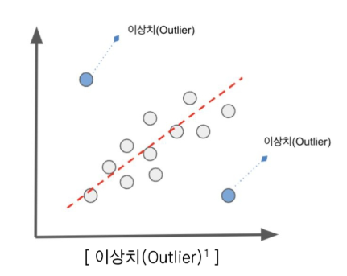
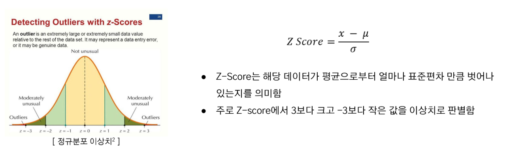

# 2024년 12월 4일(수) 수업 내용 정리 - 데이터 전처리 및 클렌징

## 데이터에 포함될 수 있는 여러 가지 문제점

- 데이터의 품질 문제 유형

  - 결측치 및 이상치
  - 불균형 데이터
  - 데이터 크기, 단위, 분포 차이

- 자연어 데이터의 고유 문제

  - 자연어 데이터의 고유 문제
  - 자연어 데이터 문제 해결 방법

- 윤리 및 법적 문제

  - 개인정보 및 민감정보
  - 데이터 편향 및 차별
  - 데이터 왜곡 및 조작
  - 저작권 및 데이터 소유권
  - 허위정보 유포 및 범죄 악용

### 01 데이터 품질 문제 유형

- 학습 목표

  - 데이터의 품질을 저해하는 요소들을 명확히 이해한다
  - 데이터 전처리 및 품질 관리 단계에서 문제를 인식하고 대응할 수 있다

#### 결측치(Missing Value)

- 정의 : 수집된 데이터셋 중 **관측되지 않거나 누락된** 데이터
- 값의 특성 : Null
- 발생 시 잘못된 분석 결과를 낳거나 분석 시 에러가 발생할 수 있음

  

  ※ 결측치 발생 사유

  - 센서 오작동, 네트워크 문제 등으로 인한 경우
  - 설문조사에서 응답자가 특정 질문에 답하지 않은 경우
  - 데이터를 입력하는 과정에서 값이 누락되거나 잘못 기록된 경우
  - 데이터베이스 손상, 저장 프로세스의 오류로 인한 경우

#### 결측치(Missing Value) - 종류

  

#### 이상치(Outlier)

- 정의 : 관측된 데이터의 범위에서 **많이 벗어난 아주 작은 값이나 큰 값**을 말함
- 예시 : 평균 키가 170cm인 집단에서 250cm 키가 측정된 경우
- 데이터 분석 혹은 모델링할 경우, 이러한 이상치가 의사결정에 큰 영향을 미칠 수 있기 때문에 **이상치 처리는 필수**적임

  

  ※ 이상치 발생 사유

  - 잘못된 데이터 입력 또는 장비 오류
  - 데이터 분포 내에서 극단적인 값이 발생
  - 데이터 수집하면서 샘플링 과정에서 발생한 오류

#### 이상치(Outlier) - 탐지 방법

(1) Z-Score

- 데이터의 분포가 **정규 분포**를 이룰 때, 데이터의 **표준 편차**를 이용해 이상치를 탐지하는 방법

  

(2) IQR(Interquartile Range) with Box plots

- 데이터의 분포가 **정규 분포를 이루지 않거나 한쪽으로 치우친 경우**, 데이터의 IQR 값을 사용해 이상치를 탐지하는 방법

  

(3) Isolation Forest

- 결정 트리(decision tree) 계열의 **비지도 학습 알고리즘**으로 **고차원 데이터셋**에서 이상치 탐지할 때 효과적임
- 이 알고리즘은 데이터의 **"고립"**을 기반으로 작동하며 이상치는 정상 데이터보다 고립되기 쉽다는 점을 활용함

  

  ※ 작동 원리

  1. 데이터를 랜덤한 방식으로 나무 구조를 분할함
  2. 이상치는 적은 횟수의 분할만으로도 고립되기 때문에, 고립되는 데 필요한 경로 길이가 짧음
  3. 여러 나무의 결과를 평균 내어 이상치 점수를 계산함

(4) DBScan(Density Based Spatial Clustering of Applications with Noise)

- 밀도 기반 클러스터링 알고리즘으로, 밀도 기준으로 군집을 정의하고 **밀도가 낮은 데이터**를 이상치로 탐지
- 밀집된 지역에서 데이터를 군집화한 후, 밀도가 낮아 **어느 군집에도 속하지 못하는 점**들을 이상치로 간주함

  

  ※ 주요 매개변수

  - Eps : 데이터 포인트가 이웃이라고 간주되는 거리의 반경으로, 데이터 분포에 따라 결정됨
  - MinPts : 한 군집을 이루는 최소 데이터 포인트 개수로, 데이터 차원(D)에 따라 일반적으로 D+1 이상의 값으로 설정함

#### 불균형 데이터(Imbalanced Data)

- 정의 : 범주형 데이터 중, 클래스 간 샘플 수의 비율이 크게 차이 나는 데이터
- 예시 : 이진 분류에서 긍정 클래스가 10%이고, 부정 클래스가 90%인 경우

  

  ※ 불균형 데이터의 문제점

  - 다수의 클래스에 맞춰 예측하는 경향이 생김
  - 정확도가 높더라도 소수 클래스 예측 성능은 낮을 수 있음
  - 소수 클래스의 정보를 손실하여 정확한 예측이 어려움

#### 불균형 데이터(Imbalanced Data) - 데이터 접근 해결 방법

  

#### 불균형 데이터(Imbalanced Data) - 알고리즘 접근 해결 방법

  

#### 데이터 크기, 단위, 분포 차이 - 데이터 스케일링

- **데이터의 크기, 단위, 분포 차이**를 조정하여 머신러닝 모델의 성능을 향상시키기 위한 과정
- 많은 알고리즘은 **변수의 크기에 영향을 받기 때문에** 값이 큰 데이터가 더 큰 영향을 미치지 않도록 조정 필요
- **단위나 범위가 크게 다른 경우**, 특정 특징이 다른 특징을 압도하는 문제를 방지(예 : 나이 vs 수입)

  

### 02 자연어 데이터의 고유 문제

- 학습 목표

  - 자연어 데이터의 특수한 문제를 이해한다
  - 자연어 데이터에 적합한 처리 방안을 학습한다
  - 자연어 데이터 전처리 역량을 키운다

#### 자연어 데이터 - 고유 문제

- 비정형 데이터 : 틀이 잡혀 있지 않고 사전 정의가 없는 데이터
- 희소성 : 높은 차원에 비해 특정 단어가 드물게 나타나, 문장 간 유사도를 파악하기 어려움
- 모호성과 중의성 : 단어의 다의성과 문맥 의존성(예 : "Apple" : 과일 vs 회사)
- 다양성 : 동일한 의미를 가진 다양한 표현(예 : 좋아요 → 좋아, 굿, nice)
- 비표준 표현 : 대/소문자, 띄어쓰기, 맞춤법, 오탈자, 문법 오류
- 불필요한 언어 : 길이가 짧은 단어, 등장빈도가 적은 단어, 특수기호
- 비구조화 : 컴퓨터가 자연어 데이터를 인식 및 처리할 수 없음

  

#### 자연어 데이터 - 문제 해결 방법

(1) 텍스트 정제(Text Cleaning)

- 텍스트 데이터에서 의미가 없는 기호, 숫자, 불용어 등을 제거
- 불용어란, "the", "is", "것", "들"와 같이 의미가 없는 단어를 뜻함
- 예시 : URL, HTML 태그 제거

(2) 텍스트 정규화(Text Normalization)

- 데이터를 일관된 형식으로 변환하여 모델이 학습하기 쉽도록 만듦
- 구어체, 약어, 이모티콘 등 다양한 표현을 문법적, 의미적 표준 형태로 통일함
- 예시 : 소문자 변환, 철자 교정

  

  ※ 텍스트 정제 및 정규화 - 파이썬 예시

    

(3) 토큰화(Tokenization)

- 텍스트를 단어, 문장, 서브워드 등으로 분리하여 분석이 가능한 형태로 만듦
- 토큰은 **텍스트 분석에서 다룰 수 있는 최소 단위**로, 이를 통해 텍스트를 구조화하여 **모델이 이해**할 수 있게 함
- 라이브러리 : **transformers, konlpy**(한국어 적용) 사용하여 토큰화 진행

  

  ※ 토큰화(transformers) - 파이썬 예시

    

  ※ 토큰화(Okt) - 파이썬 예시

    

(4) 텍스트 벡터화(Text Vectorization)

- 자연어 데이터를 **수치화**하여 컴퓨터가 처리할 수 있는 형태로 변환

  

  ※ 텍스트 벡터화 : TF-IDF(Term Frequency-Inverse Document Frequency)

    
  
  - 텍스트 데이터에서 특정 단어의 중요도를 평가하기 위한 통계적 방법
  - 단어의 빈도(TF)와 역문서 빈도(IDF)를 조합하여 **단어의 중요도 정도를 가중치**로 주는 방법
  - 문서 내에서 특정 단어가 많이 등장하면서도, 전체 문서에는 드물게 등장하는 단어에 높은 점수 부여
  - 예 : "NLP"는 중요한 단어, "the", "is"와 같은 흔한 단어는 낮은 점수를 받음

※ 텍스트 벡터화 : Word2Vec

- 단어를 고차원 벡터로 매핑하는 임베딩 방법으로, **단어의 문맥적 관계** 학습함
- CBOW(Continuous Bag of Words)와 Skip-Gram 두 가지 모델 구조를 사용하여 효율적 학습이 가능함
- **의미적 유사성 반영**(예 : king - man + woman = queen)
- 단어 간 수학적 연산 가능

  

※ 텍스트 벡터화 : Word2Vec (CBOW)

- 주변에 있는 단어들을 입력으로 **중간에 있는 단어들을 예측**하며, **중심 단어가 희귀 단어**일 때 유리함

  

※ 텍스트 벡터화 : Word2Vec (Skip-Gram)

- 중심 단어에서 **주변 단어**를 예측하며 **주변 단어가 희귀 단어**일 때 유리함

  

### 03 윤리 및 법적 문제

- 학습 목표

  - 데이터의 윤리 및 법적 문제 사례를 확인한다
  - 학습자가 책임 있는 데이터 활용 방법을 익힌다

#### 개인정보 및 민감정보

- 데이터에는 개인의 신상, 건강, 금융정보 등 민감한 내용이 포함될 수 있음
- 데이터가 비식별화되지 않은 상태에서 유출되거나 악용될 위험이 있음
- 동의없는 수집/사용될 경우 개인의 권리 침해

  

#### 데이터 편향 및 차별

- 데이터셋이 특정 성별, 인종, 연령, 계층에 대해 편향된 내용을 포함
- 편향된 데이터를 학습한 모델이 특정 그룹에 대해 차별적 결정을 내릴 위험

  

#### 데이터의 왜곡 및 조작

- 데이터를 조작하거나 왜곡하여 잘못된 결과를 도출하는 행위
- 데이터 분석 결과의 신뢰성을 떨어뜨리고 잘못된 의사결정 유도함

  

#### 저작권 및 데이터 소유권

- 데이터가 누구의 소유인지 명확하지 않으면 사용 권한에 대한 문제가 발생함
- 옵트 아웃이란, 당사자가 자신의 데이터 수집을 허용하지 않는다고 명시할 때 정보수집이 금지되는 제도

  

#### 허위 정보 유포 및 범죄 악용

- 가짜 정보를 제작하고 유포하여 사회적 혼란을 야기하거나 범죄에 악용될 수 있음
- 딥페이크 콘텐츠는 개인의 명예를 훼손하거나 초상권을 침해함

  

### SUMMARY

1. 데이터 품질 문제 유형

    - 결측치의 정의와 종류 - 완전 무작위, 무작위, 비무작위 결측
    - 이상치의 정의와 탐지 방법 - Z-Score, IQR, Isolation Forest, DBScan
    - 불균형 데이터 정의 및 해결 - Over/UnderSampling, 클래스 및 앙상블 기법
    - 데이터 분포, 크기, 단위 차이에 대한 스케일링 방법 - Standard/Min-Max Scaler, log 변환

2. 자연어 데이터의 고유 문제

    - 자연어 데이터의 고유 문제 - 비정형, 비표준 데이터, 모호성, 중의성, ...
    - 자연어 데이터의 해결방법 - 텍스트 정제, 정규화, 토큰화

3. 윤리 및 법적 문제

    - 기사를 통한 데이터의 윤리 및 법적 문제