# 2024년 12월 4일(수) 수업 내용 정리 - 데이터 전처리 및 클렌징

## 데이터 정제 및 전처리 과정(결측치 처리, 이상탐지, 스케일링, 정규화 등)

- 데이터 EDA (Exploratory Data Analysis)

  - 데이터 EDA란?
  - 데이터 EDA의 중요성
  - 정형 데이터 EDA
  - 비정형 데이터 EDA

- 정형 데이터 전처리

  - 수치형 데이터 전처리 방법
  - 범주형 데이터 전처리 방법

- 비정형 데이터 전처리

  - 텍스트 데이터 전처리 방법

### 01 데이터 EDA (Exploratory Data Analysis)

- 학습 목표

  - 정형 데이터의 EDA를 할 수 있다
  - 비정형 데이터의 EDA를 할 수 있다

#### 데이터 EDA란?

- 데이터를 본격적으로 분석하기 전에 데이터를 탐색하고 이해하는 과정으로 **데이터의 분포, 특성, 이상치, 결측치 등 데이터 품질에 영향을 미치는 요인을 파악하는 데 핵심적인 단계**

#### 데이터 EDA의 중요성

- 데이터 EDA(Exploratory Data Analysis)는 여행을 떠나기 전 지도를 보고 목적지와 길을 파악하는 과정에 비유할 수 있음

  

#### 정형 데이터 EDA

- 정형 데이터 : Students' Academic Performance Dataset

  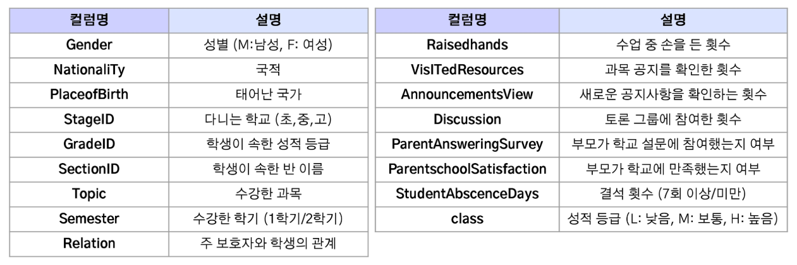

1. 데이터프레임의 각 컬럼과 값 확인하기
2. 결측치 확인
3. 기술 통계(평균, 중앙값, 최댓값, 최솟값, 분산, 표준편차, 사분위수)
4. 데이터 분포 확인(히스토그램, 커널밀도, 박스 플롯)
5. 상관관계 분석
6. 데이터의 스케일링 필요성 검토
7. 파생 변수 생성 가능성 탐색

 

(1) 데이터프레임의 각 컬럼과 값 확인하기

- head(), tail() 메서드를 통해 데이터프레임 일부를 쉽게 확인 가능
- 예시. data.head(8)처럼 괄호 안에 숫자를 넣어주면 입력한 숫자만큼의 데이터를 앞에서부터 확인 가능, default 값 5개
- 예시. data.tail(4)는 데이터를 뒤에서부터 4개만 확인 가능

  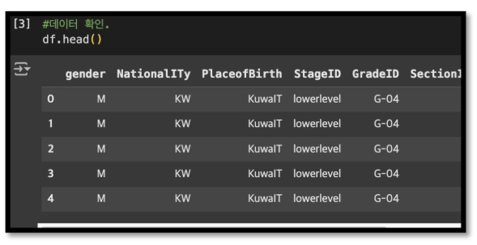

(2) 결측치 확인

- info() 메서드를 통해 데이터의 총 개수와 각 컬럼별 결측치와 type을 확인 가능

  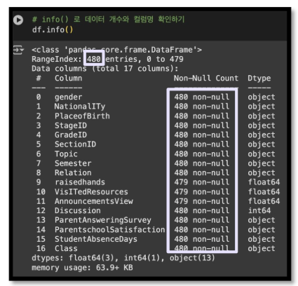

(3) 기술 통계(평균, 중앙값, 최댓값, 최솟값, 분산, 표준편차, 사분위수)

- 수치형 데이터만 describe() 메서드를 통해 기술통계값을 간단히 확인 가능

  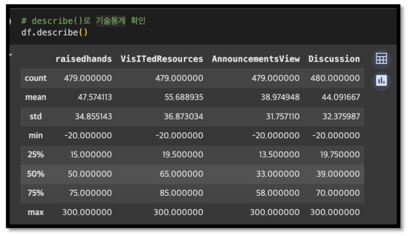

(4) 데이터 분포 확인

- 수치형 데이터와 범주형 데이터에 따라 데이터 분포 확인 방법이 다름

  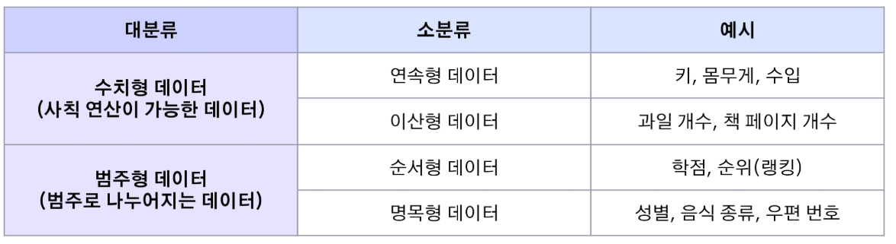

(4) - 1 데이터 분포 확인 - 수치형

- 수치형 데이터는 **일정 범위 안에서 어떻게 분포하고 있는지 파악하는 것이 중요**

  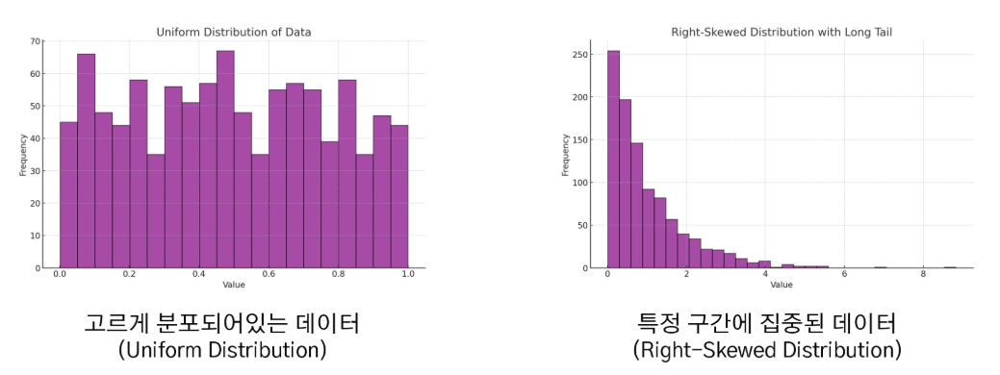

  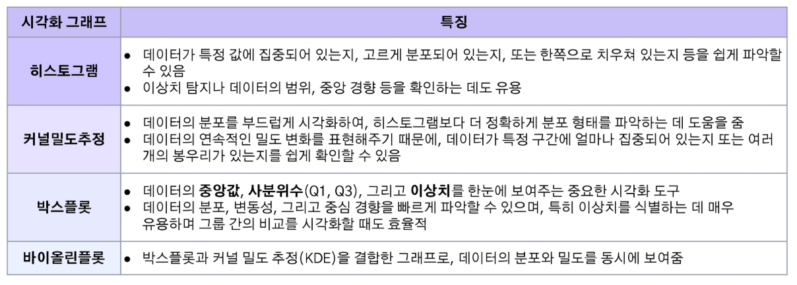

- histplot() : 히스토그램
- kdeplot() : 커널밀도추정 함수 그래프
- boxplot() : 박스플롯
- violinplot() : 바이올린플롯

  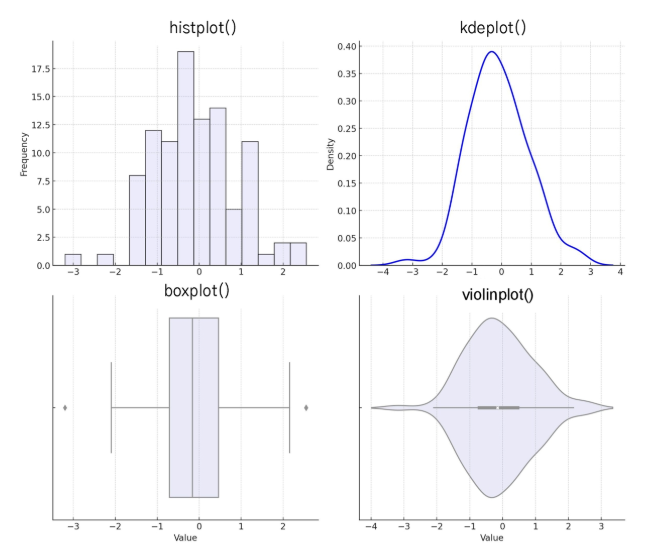

- Students' Academic Performance Dataset의 수치형 데이터 컬럼

  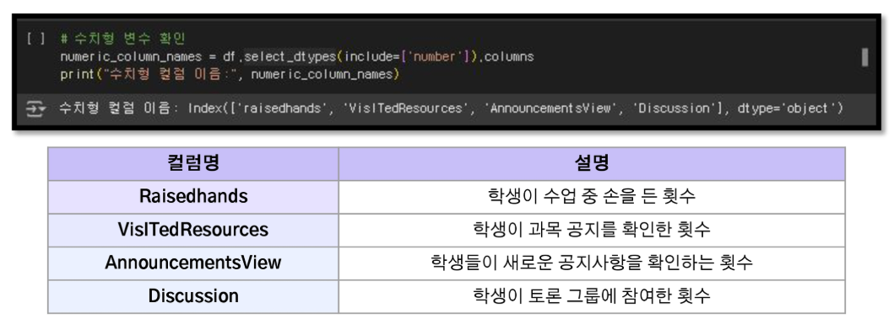

- Raisehands 변수 히스토그램의 다양한 시각화

  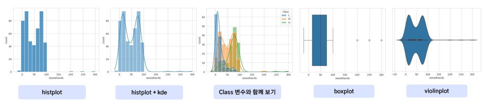

- 박스플롯, 바이올린플롯 해석 방법

  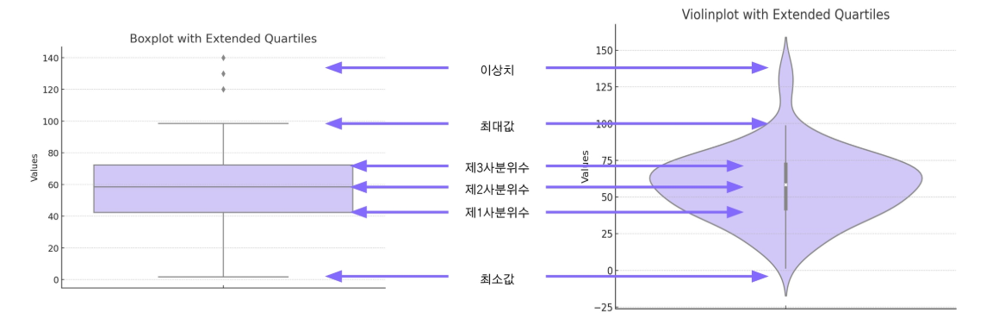

(4) - 2 데이터 분포 확인 - 범주형

- Students' Academic Performance Dataset의 범주형 데이터 컬럼

  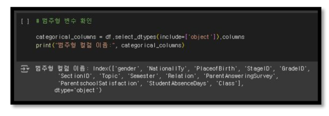

  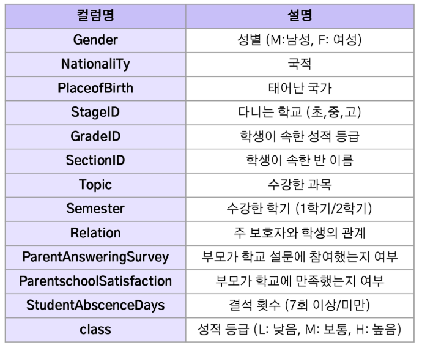

- countplot : 범주형 데이터의 개수를 확인할 때 사용
- pie chart : 원그래프로 범주형 데이터의 개수를 확인할 때 사용

  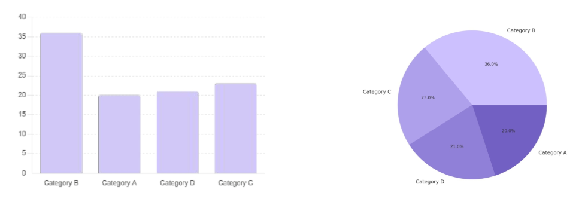

- 예시. Gender 변수의 pie chart, countplot() 시각화

  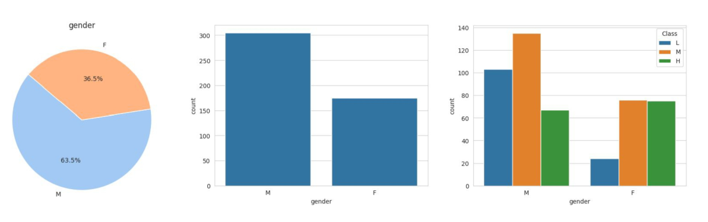

(4) - 3 데이터 분포 확인 - 수치형 & 범주형 데이터

- 수치형 데이터와 범주형 데이터 시각화 : raisedhands, class 변수 함께 시각화하기

  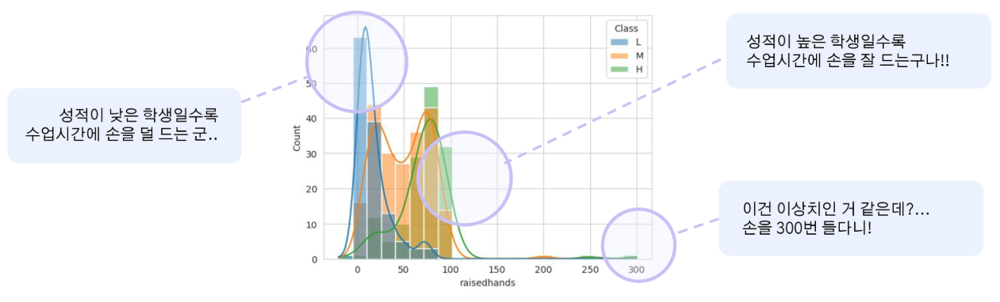

- 수치형 데이터와 범주형 데이터를 함께 시각화하기 : Topic, raisedhands

  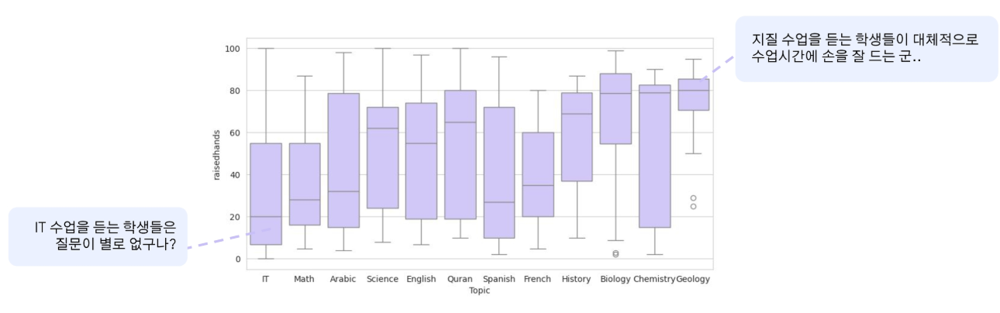

(5) 상관관계 분석

- **상관관계 분석**은 변수들 간의 관계를 파악하기 위해 중요하고, 수치형 데이터만 계산 가능함
- 상관관계 분석을 통해 변수들 사이의 연관성을 확인할 수 있으며, 특히 예측 모델에서 중요 변수를 식별하는 데 유용함
- 다중공선성 문제 (변수들 간의 높은 상관성으로 인해 모델이 불안정해지는 문제)를 조기에 발견하여, 불필요하거나 중복된 변수들 제거 가능
- 피어슨 상관계수 등을 이용하여 각 변수 쌍의 선형성을 값으로 반환하며, 상관계수의 값의 범위는 -1에서 1로 계산

- 간단히 pandas 라이브러리에서 제공하는 메서드인 corr()으로 상관계수를 계산할 수 있음

  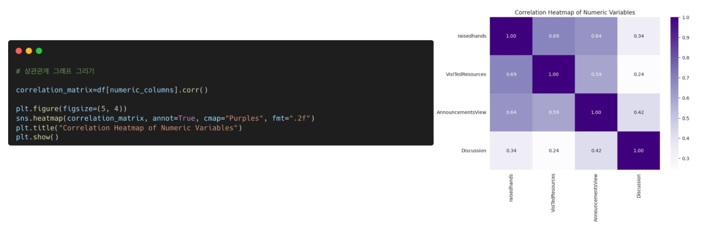

(6) 데이터의 스케일링 필요성 검토

- **스케일링(Scaling)** : 서로 다른 변수의 값 범위를 일정한 수준으로 맞추는 작업을 의미함
- 스케일링은 모델링 및 데이터 분석 과정에서 **변수 간 크기 차이가 중요한 영향을 미칠 때** 필요
- **describe()** 메서드를 통해 변수 간 범위 차이를 확인하거나, 데이터 시각화를 통해 분포를 확인하여 스케일링의 필요성을 검토해볼 수 있음

  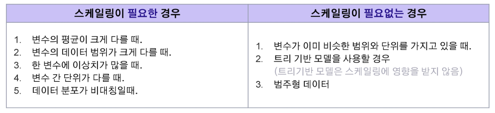

- 스케일링 예시. 키 및 몸무게 데이터

  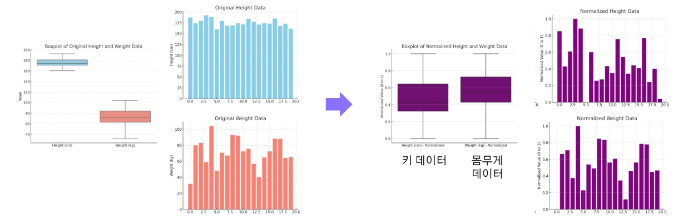

(7) 파생 변수 생성 가능성 탐색

- 파생 변수는 원본 데이터에서 새로운 의미를 가지도록 가공하거나 결합하여 만든 변수
- 원본 데이터의 정보를 재구성하여 새로운 관점에서 분석할 수 있음

  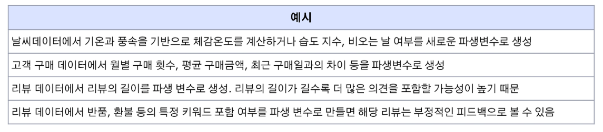

#### 비정형 데이터 EDA

- 비정형 데이터 : 네이버 영화 리뷰 데이터

  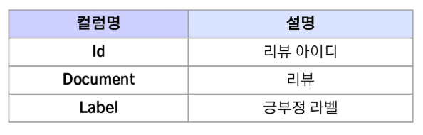

1. 데이터프레임의 각 컬럼과 값 확인하기
2. 결측치 확인
3. 데이터 분포 확인(히스토그램, 커널밀도, 박스플롯 등)
4. 데이터 중복값 확인

(1) 데이터프레임의 각 컬럼과 값 확인하기

- head(), tail() 메서드를 통해 데이터프레임 일부를 쉽게 확인 가능

  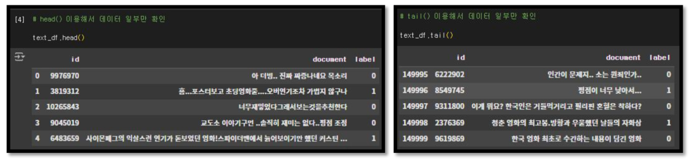

(2) 결측치 확인

- info() 메서드를 통해 쉽게 확인 가능

  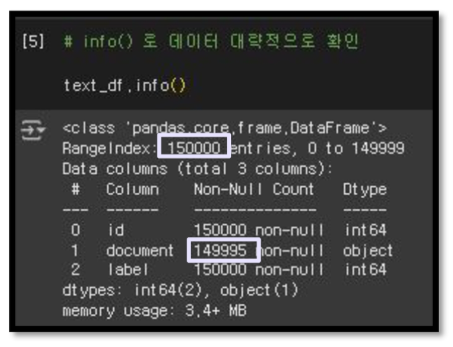

(3) 데이터 분포 확인

- 문장의 길이 및 평균 길이 확인

  - 텍스트 데이터의 구조를 이해하는 데 유용함
  - 데이터의 특성을 파악하거나 모델 입력 값을 조정할 때 도움을 줌
  - 예시. len() 메서드를 이용해 문장의 길이를 측정해 새로운 컬럼에 저장해주고, 평균값 계산 및 히스토그램을 통해 평균길이와 분포 확인 가능

    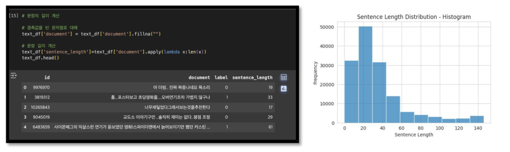

- 데이터 중복값 확인

  - 중복된 텍스트는 분석 결과의 왜곡을 초래할 수 있으므로 제거하거나 처리하는 것이 중요함
  - 텍스트 데이터 품질을 높이고, 모델 성능에 긍정적인 영향을 미침
  - 예시. duplicated() 메서드를 사용하면 중복값을 확인할 수 있음

    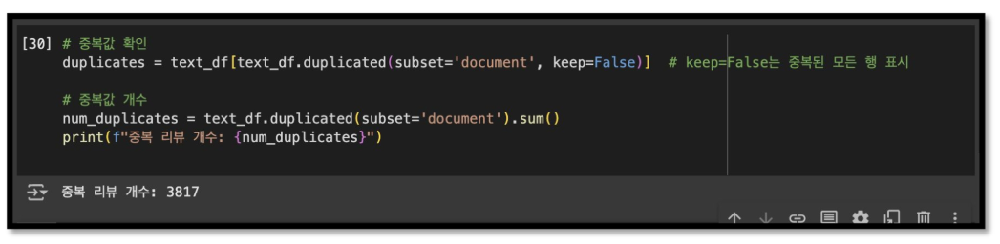

### 02 정형 데이터 전처리

- 학습 목표

  - 정형 데이터의 결측치, 이상치, 중복데이터 처리를 할 수 있다
  - 수치형 데이터의 표준화 및 정규화를 할 수 있다
  - 범주형 데이터의 수치화를 할 수 있다

#### 수치형 데이터 전처리 방법

1. 결측치 처리
2. 이상치 탐지 및 처리
3. 스케일링 및 정규화
4. 데이터 타입 변환

(1) 결측치 처리

- 간단히 pandas 라이브러리에서 제공하는 메서드인 dropna()를 통해 결측치에 해당하는 행을 삭제할 수 있음

  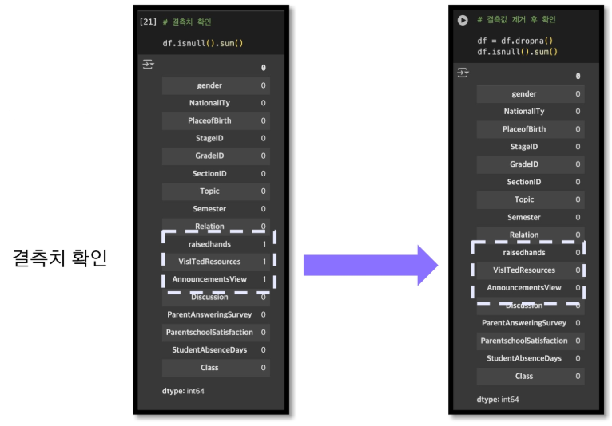

(2) 이상치 탐지 및 처리

- EDA 과정에서 데이터 분포도를 통해 이상치 발견 가능

  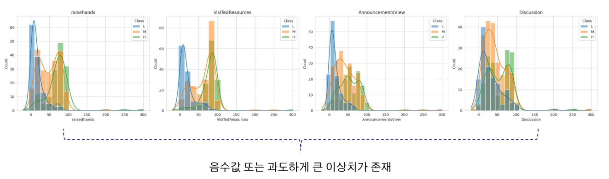

- IQR 방식으로 처리

  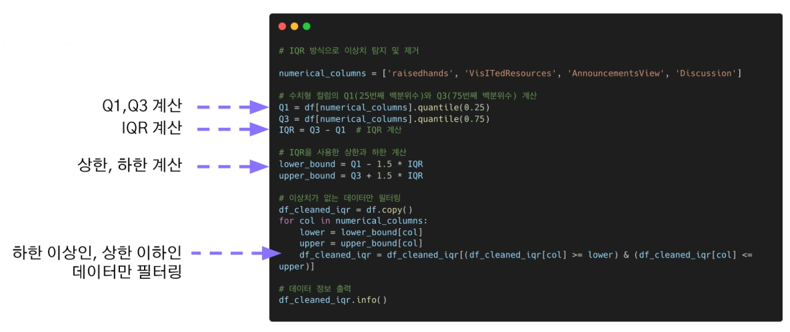

  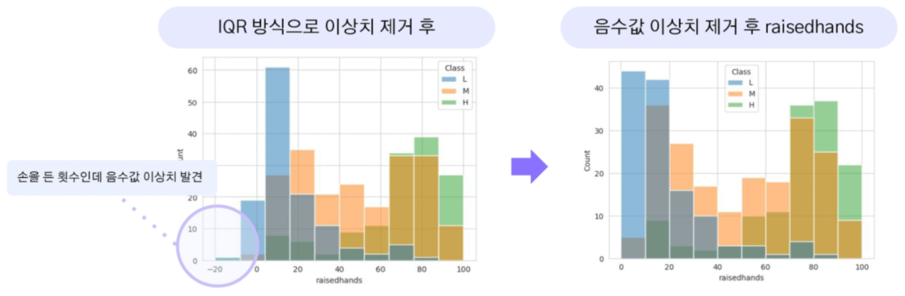

(3) 스케일링 및 정규화

- 사이킷런에서 제공하는 스케일링 함수

  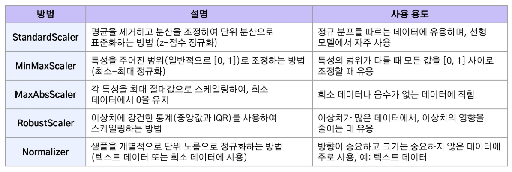

- MinMaxScaler로 정규화 예시

  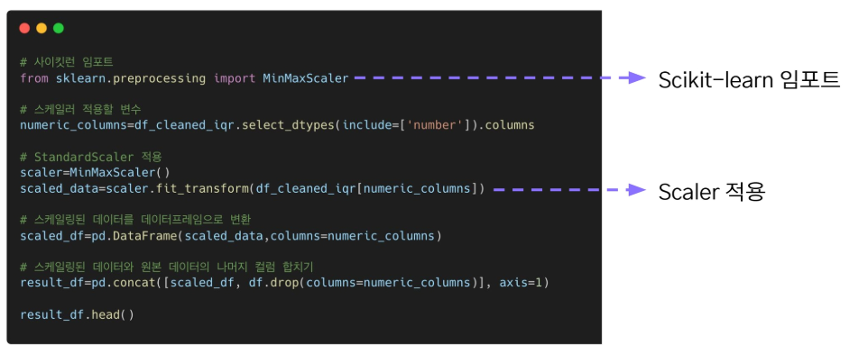

- MinMaxScaler로 정규화하기

  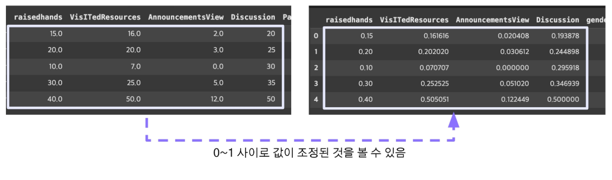

#### 범주형 데이터 전처리 방법

• 데이터 타입 변환

- 대부분의 머신러닝 알고리즘(예 : 선형 회귀, 로지스틱 회귀, 결정 트리, 신경망)은 수치 데이터를 입력으로 사용, 머신러닝 알고리즘은 수학적 연산(거리 계산, 벡터 내적 등)을 기반으로 작동하므로, 범주형 데이터를 그대로 사용하면 작동하지 않거나 부정확한 결과를 초래할 수 있음

  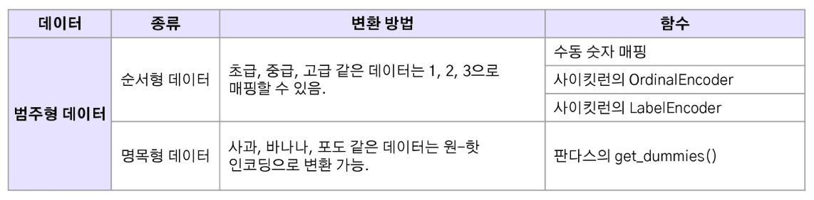

• 데이터 타입 변환 : 명목형 데이터

※ 원-핫 인코딩(one-hot edcoding)이란?

  - 각 범주를 새로운 컬럼으로 생성하고, 해당 범주에 해당하면 1, 그렇지 않으면 0으로 나타내는 방법

    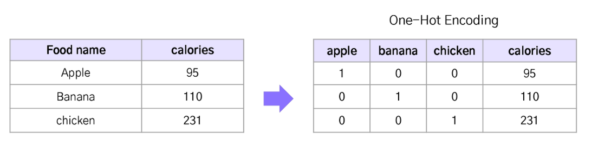

  - 원-핫 인코딩 예시. pandas의 get_dummies() 메서드를 이용해 쉽게 원-핫 인코딩 가능

    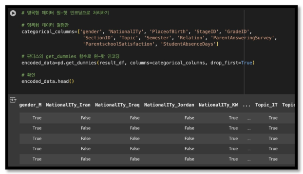

• 데이터 타입 변환 : 순서형 데이터

- 순서형 데이터는 순서에 따라 가중치를 부여해야 하므로 수동 매핑
- Class L(Low), M(Middle), H(High)를 1, 2, 3으로 매핑하기

  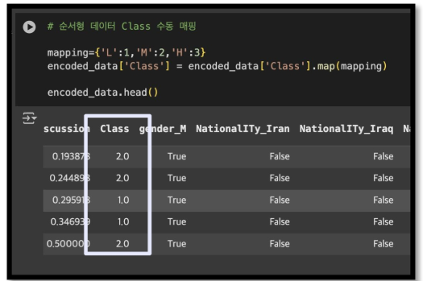

### 03 비정형 데이터 전처리

- 학습 목표

  - 텍스트 데이터의 전처리를 할 수 있다
  - 텍스트 데이터의 어간, 표제어 추출을 할 수 있다

#### 텍스트 데이터 전처리 방법

  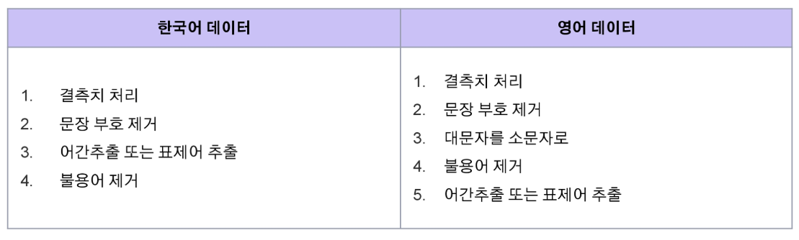

(1) 결측치 처리

- 간단히 pandas 라이브러리에서 제공하는 메서드인 **dropna()**를 통해 결측치에 해당하는 행을 삭제할 수 있음

  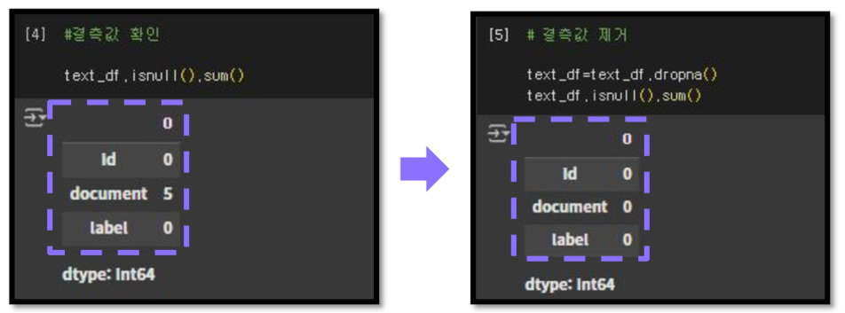

(2) 문장 부호 제거

- 문장 부호를 제거해야 하는 이유

  ① **분석에 중요하지 않은 정보**일 경우

  ② **단어기반 분석을 방해** : Hello!와 Hello는 동일한 단어이지만 문장부호를 제거하지 않을 경우 별개의 단어로 처리
  
  ③ **노이즈 감소** : !?:;' 등의 데이터들이 중요한 특징으로 학습될 가능성이 있음

  ④ 텍스트 데이터를 벡터화하거나 토큰화 할 때 문장 부호가 단어와 섞어 있으면 처리과정이 복잡함

    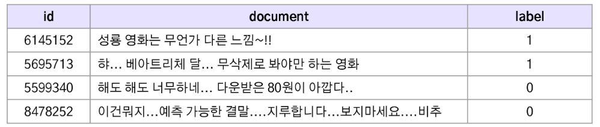

- 문장부호를 제거하지 않아도 되는 경우

  ① **문장 부호가 텍스트의 맥락이나 감정을 나타낼 때** : What?과 What!은 감정이 다를 수 있음. 이럴 경우 문장부호를 제거하면 안됨
  
  ② **문장 구조가 중요한 경우** : 문장 분류, 요약, 생성 등에서 문장 부호가 구문 이해에 필수적일 수 있음

- 문장 부호 제거 방법

  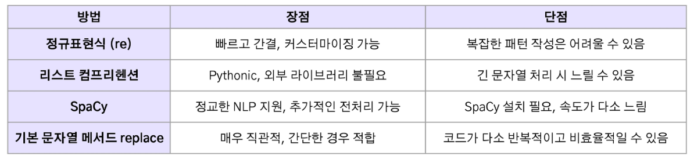

  - Python 라이브러리 **string**에서 **string.punctuation**을 활용

    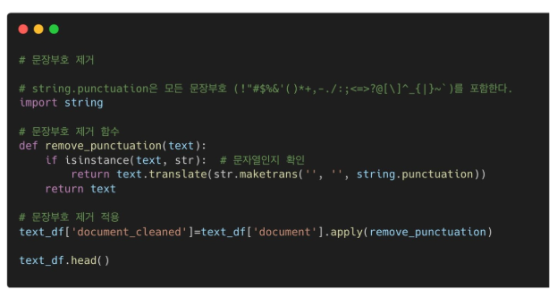

    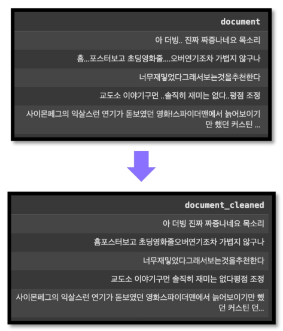

(3) 어간 추출 및 표제어 추출

- 어간 추출과 표제어 추출 및 형태소 분석의 필요성 :

  ① 자연어에서는 동일한 의미를 가진 단어가 여러 형태로 변형되어 사용되기 때문에 **단어의 변형 형태를 통일해야 함**

  ② 어간 추출은 이러한 변형을 제거하여 중복 단어를 **통합하고 분석 결과의 일관성을 높임**

  ③ 또한 변형 형태를 통일하면 고유 단어 수가 줄어들어 모델 학습 시 데이터의 패턴을 더욱 잘 파악할 수 있으면 데이터 처리 속도가 빨라짐

    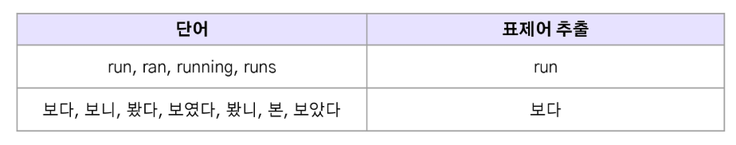

(3) - 1 어간 추출 및 표제어 추출 : 영어

- 영어 데이터의 어간 추출과 표제어 추출의 차이

  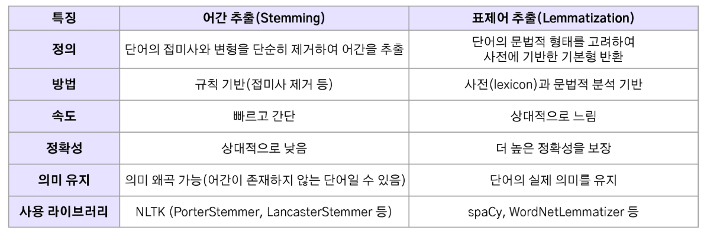

  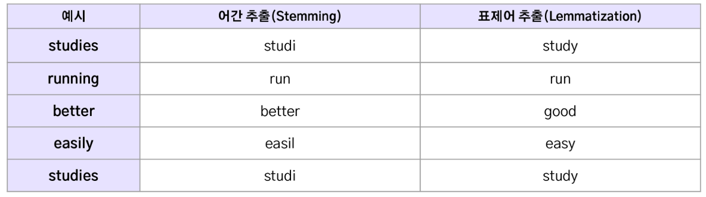

(3) - 2 어간 추출 및 표제어 추출 : 한국어

- **Okt(Open Korean Text)**에서는 한국어 형태소 분석기를 제공하고 있음

  ① **형태소 분석(morphs)** : 텍스트를 형태소 단위로 분리함

  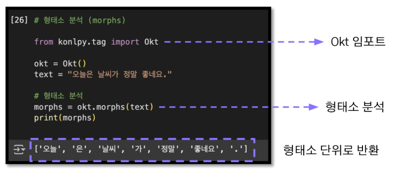
  
  ② **품사 태깅(pos)** : 형태소와 함께 품사 태그를 반환함

  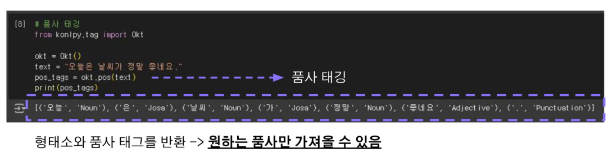
  
  ③ **명사 추출(nouns)** : 텍스트에서 명사만 추출함

  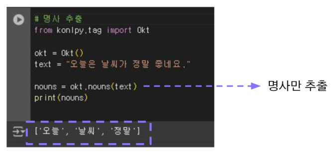

- Okt의 장단점

  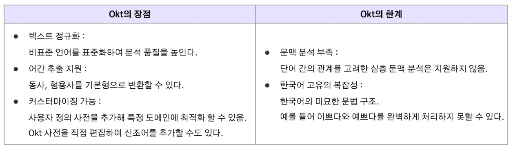

- 한국어 형태소 분석(morphs) 예시

  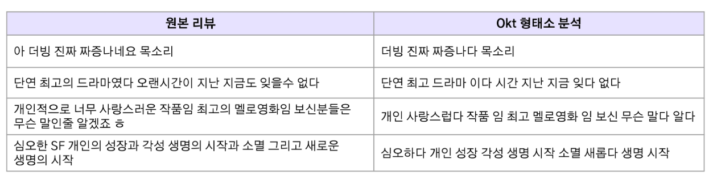

(4) 불용어 제거

> **불용어(Stop, Words)**는 텍스트 데이터에서 자주 등장하지만, 분석의 주요 목적이나 의미 파악에 기여하지 않는 단어, 텍스트 데이터 전처리 과정에서 불용어를 제거하면 분석의 정확성과 효율성을 높일 수 있음

- 불용어의 특징

  ① 영어에서 **the, is, in, and**와 같은 단어, 한국어에서는 **은, 는, 이, 가** 등이 불용어로 간주됨

  ② **의미 기여도가 낮고 분석 결과를 왜곡**할 가능성이 있기 때문에 전처리 과정에서 제거하는 것이 좋음

- 불용어 제거의 필요성

  ① **노이즈 제거** : 불용어는 데이터 분석 과정에서 노이즈로 작용할 수 있음(예시 : TF-IDF 계산 시 불필요한 단어가 높은 점수를 받는 것을 방지)
  
  ② **모델 성능 개선** : 불필요한 데이터를 제거함으로써, 모델이 중요한 특징에 집중할 수 있음, 텍스트 벡터 크기가 줄어들어 계산 효율성이 증가
  
  ③ **데이터 압축** : 불용어를 제거하면 데이터 크기가 줄어들어 처리 속도가 빠라지고 메모리 사용이 줄어듦

- 한국어 불용어 리스트는 [https://www.ranks.nl/stopwords/korean](https://www.ranks.nl/stopwords/korean) 링크에서 제공하고 있어, 선별해 사용할 수 있음
- 영어 불용어 리스트는 NLTK 라이브러리에서 제공

  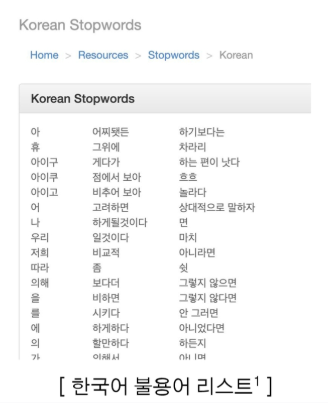

### SUMMARY

1. 정형 데이터와 비정형 데이터의 EDA

    - 정형 데이터 : 데이터 컬럼, 결측치, 기술 통계, 데이터 분포, 상관관계 분석, 스케일링 검토, 파생 변수 생성 가능성 탐색
    - 비정형 데이터 : 데이터 컬럼, 결측치, 문장 길이 및 평균, 중복값 확인

2. 정형 데이터 전처리

    - 결측치, 이상치, 중복 데이터 처리
    - 표준화 및 정규화, 범주형 데이터의 수치화

3. 비정형 데이터 전처리

    - 결측치 처리 및 문장부호 제거
    - 어간 및 표제어 추출과 불용어 제거
