# 2024년 12월 4일(수) 수업 내용 정리 - 데이터 전처리 및 클렌징

## 정제되지 않는 데이터가 일으키는 문제점 case study

- 데이터 결측이 모델 성능에 미치는 영향

  - 결측 데이터가 모델 성능에 미치는 영향
  - 결측 데이터 처리 방법
  - 결측 데이터 실습

- 이상치와 모델의 민감도

  - 이상치가 모델 성능에 미치는 영향
  - 이상치 탐지 및 처리 방법
  - 이상치 실습

- 텍스트 데이터의 정제 사례

  - 텍스트 데이터 품질 문제
  - 텍스트 데이터 품질의 중요성
  - 텍스트 데이터 실습

### 01 데이터 결측이 모델 성능에 미치는 영향

- 학습 목표

  - 데이터에서 결측치가 발생했을 때 모델의 성능이 어떻게 저하되는지 학습한다
  - 결측치 처리 기법을 적용해 모델 성능을 개선한다
  - 데이터 정제의 필요성과 중요성을 체감할 수 있다

#### 결측 데이터 - 모델 성능에 미치는 영향

  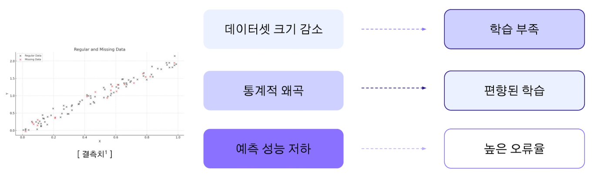

#### 결측 데이터 - 처리 방법

  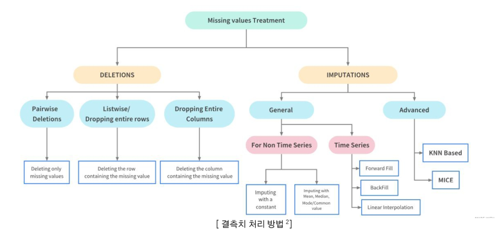

- 변수 타입이 수치형일 때의 전처리 방법과 범주형일 때의 전처리 방법이 다름

  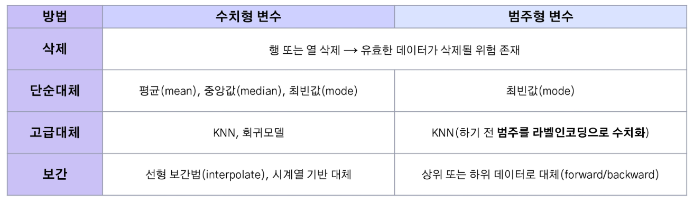

#### 결측 데이터 실습 - 실험 데이터

- **실험 데이터 설명** : 학생 성적 예측 데이터셋
- **종속 변수** : G3(최종 성적)
- **데이터 크기** : 678행 X 33열
- 수치형(int) 변수 16개, 범주형(object) 변수 17개 존재

  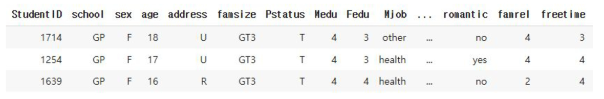

- 데이터에서 **결측 데이터가 존재하지 않음**

  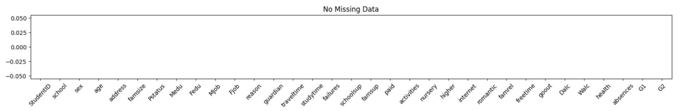

- 그러나, **결측 데이터로 인한 모델 성능을 확인**하기 위해 **임의로 결측 데이터 생성**함

  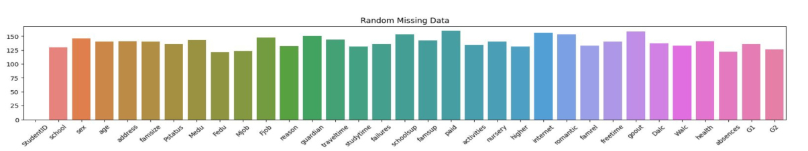

#### 결측 데이터 실습 - 결측치 생성

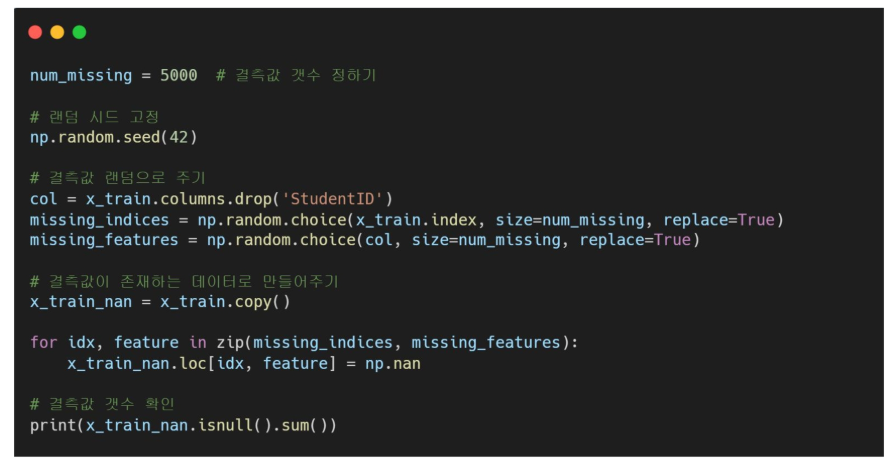

#### 결측 데이터 실습 - 수치형 변수

(1) 중앙값 또는 평균값 대체

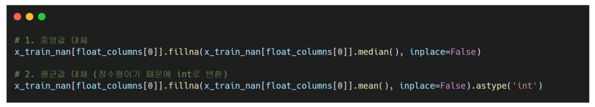

- 각 변수의 중앙값이나, 평균값으로 대체
- 수치형 변수의 타입이 정수(int)이기 때문에, 평균값으로 대체 후 데이터 타입을 정수로 변환해줘야 함
- 'inplace = True' : 원본 데이터 자체를 바로 수정해, 수정된 결과를 새 변수에 저장할 필요 없음
- 'inplace = False' : 원본 데이터는 유지되고, 수정된 결과를 새 변수에 저장해야 함

(2) KNN imputer

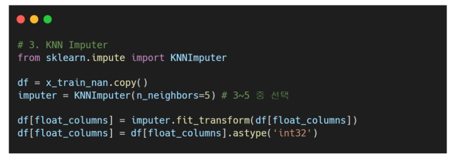

- KNN imputation은 결측치를 주변의 K개의 이웃 데이터 값으로 추정함
- 거리(metric)을 이용한 유사도 기반 대체함
- Scikit-learn 라이브러리의 KNNImputer 사용하여 결측치 처리

  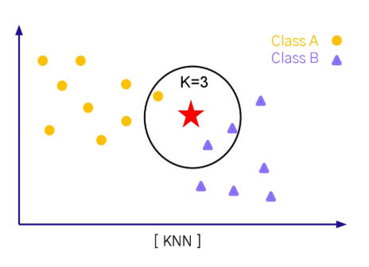

#### 결측 데이터 실습 - 범주형 변수

(1) 그룹별 최빈값 대체

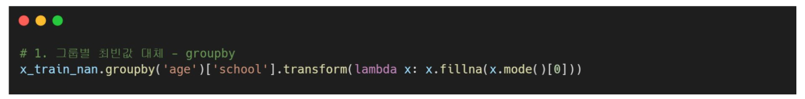

- age 별로 데이터를 그룹화하여 그룹 내 결측치를 처리함
- 각 그룹에서 school 변수의 **최빈값(mode()[0])**을 계산하여 결측치를 대체함
- transform()을 사용해 그룹별로 계산한 값을 원래 데이터 프레임의 형태에 맞게 변환함

(2) KNN Imputer

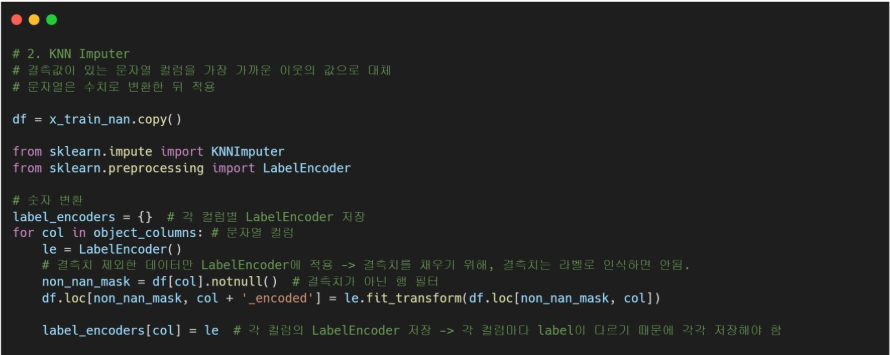

- 범주형(문자열) 데이터를 모델이 처리할 수 있도록 **수치형 데이터로 인코딩**해야 함
- **Label Endocing을 사용**해 문자열 값을 각기 다른 숫자로 매핑함(순서 고려하지 않음)

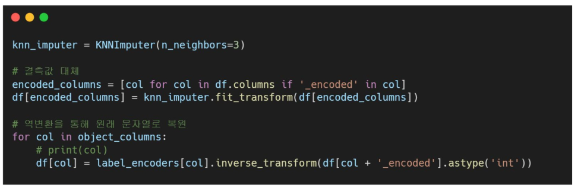

- KNN Imputer를 통해 결측치를 대체함
- 결측치 대체 이후에는 **Label Encoding 역변환**하여 원래 범주형 값으로 복원함(필요시)

#### 결측 데이터 실습 - RandomForest 성능 확인

- 결측치 존재 vs 결측치를 KNN Imputer로 대체

  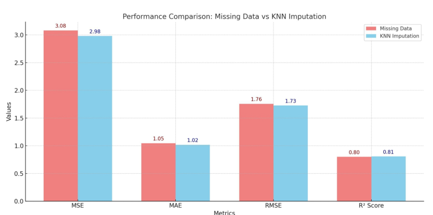

### 02 이상치와 모델의 민감도

- 학습 목표

  - 이상치가 포함된 데이터를 적용했을 때 발생하는 과적합 또는 예측 오류를 분석한다
  - 이상치 탐지 및 처리를 통해 모델 성능 변화를 확인한다

#### 이상치 - 모델 성능에 미치는 영향

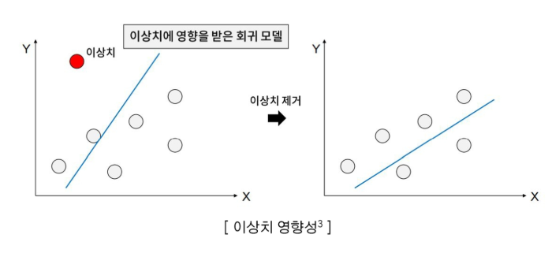

- **평균, 분산과 같은 통계량을 크게 왜곡**하여 모델이 데이터의 일반적인 패턴을 학습하는 데 어려움을 겪음
- 이상치를 처리하려다 보니 모델이 **과도하게 복잡**해지거나 **과적합(Overfitting)**될 가능성이 커짐
- 이상치가 포함된 데이터는 변수 간 관계를 잘못된 방향으로 보이게 해 데이터 분석 및 모델의 **해석의 신뢰성을 낮춤**

#### 이상치 - 탐지 및 처리 방법

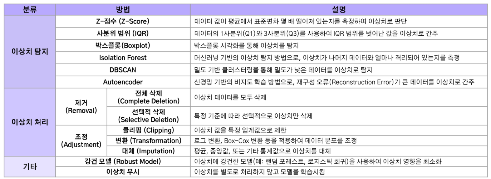

#### 이상치 실습 - 실험 데이터셋

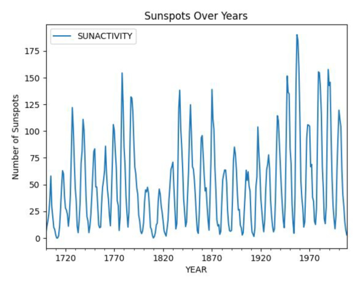

- **실험 데이터** : statsmodel 내부 데이터인 **sunspots** 데이터
- **설명** : 태양 흑점(sunspots) 활동을 측정한 **시계열 데이터**
- **데이터 크기** : 1750년 2008년까지의 연간 태양 흑점수(309개)

#### 이상치 실습 - 실험 데이터셋 이상치 확인

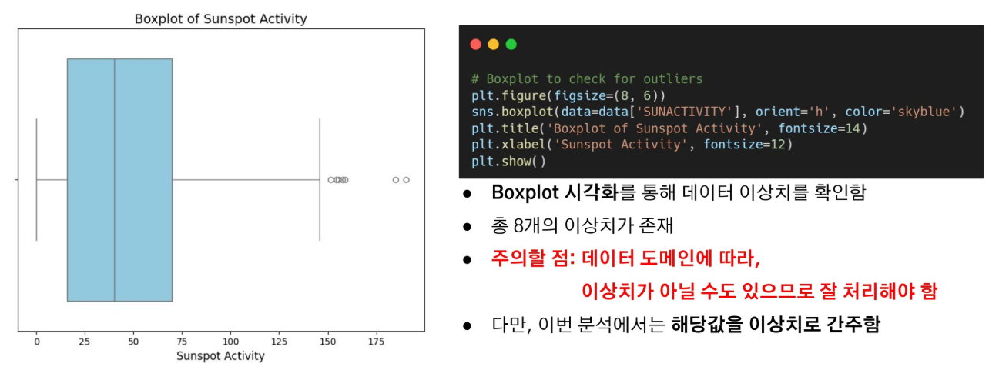

#### 이상치 실습 - 실험 데이터셋 이상치 처리

- 이상치를 IQR로 탐지 후, **interpolate(선형 보간)**법을 통해 대체해줌

#### 이상치 실습 - 시계열 모델링

- 이상치 전처리 전 후 성능을 확인하기 위해 모델 적용
- ARIMA에 계절성을 추가한 모델인 Seasonal ARIMA를 사용
- RMSE로 성능 확인

  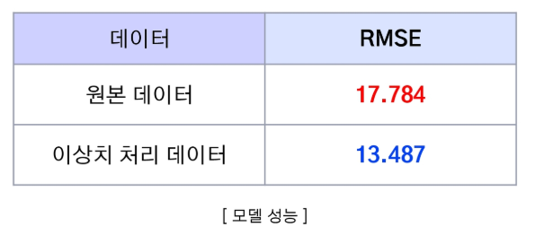

  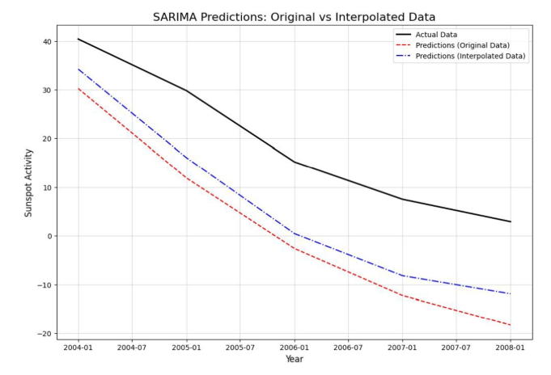

### 03 텍스트 데이터의 정제 사례

- 학습 목표

  - 텍스트 데이터의 품질이 모델 학습에 미치는 영향을 확인한다
  - 텍스트 데이터 정제 후 모델 성능 비교를 통해 전처리의 중요성을 이해한다

#### 텍스트 데이터 - 품질 문제

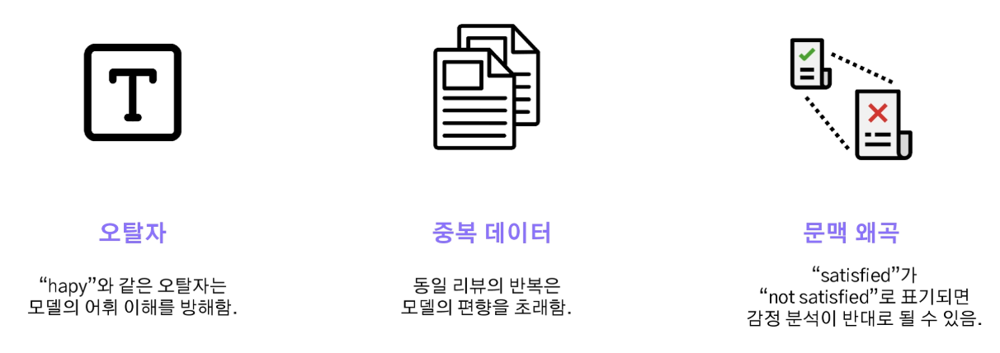

#### 텍스트 데이터 - 품질이 중요한 이유

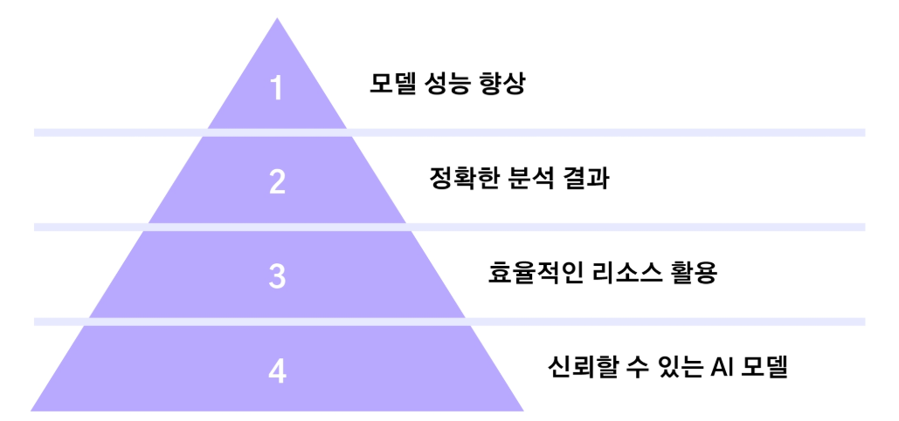

#### 텍스트 데이터 실습 - 실험 데이터셋

- 데이터셋 : 긍정, 부정 리뷰 데이터셋(챗 gpt 생성)
- 데이터 내부에 오탈자 및 중복 데이터, 특수 문자 존재함

  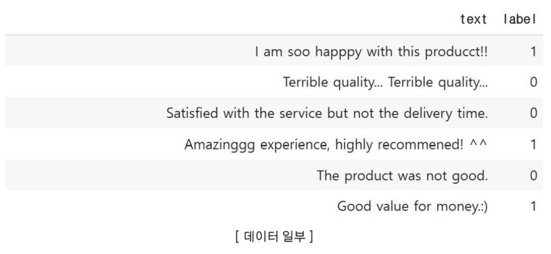

#### 텍스트 데이터 실습 - 정제

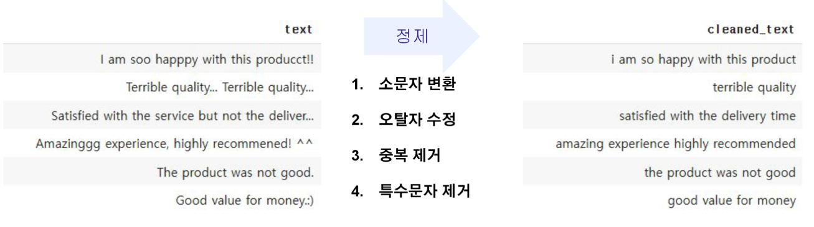

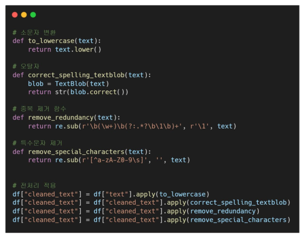

- **TextBlob**은 자연어 처리를 간단하게 수행할 수 있는 라이브러리이며 **오탈자** 수정이 가능함
- **정규표현식**을 이용한 **중복 및 특수문자 제거**

#### 텍스트 데이터 실습 - 정제 후 모델 성능 비교

- **TF-IDF 벡터화 진행** : 텍스트 데이터를 수치화하여 각 단어의 중요도를 계산
- **Multinomial Naive Bayes** : 확률 기반 텍스트 분류 모델

  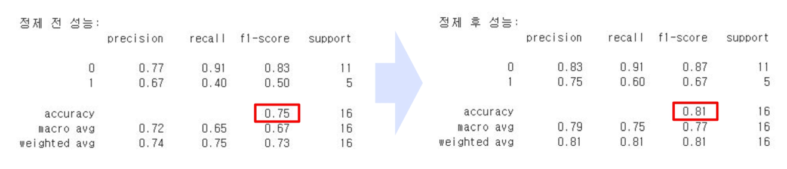

### SUMMARY

1. 데이터 결측이 모델 성능에 미치는 영향

    - 결측 데이터가 모델 성능에 미치는 영향 - 학습 부족, 높은 오류율, 편향된 학습
    - 결측 데이터 처리 방법 - 수치형·범주형 컬럼에 따른 정제
    - 결측 데이터 처리 실습

2. 이상치와 모델의 민감도

    - 이상치가 모델 성능에 미치는 영향 - 과적합, 통계적 왜곡
    - 이상치 탐지 및 정제 방법 - 탐지(IQR, Z-Score, ...), 정제(삭제, 대체)
    - 이상치 처리 실습

3. 텍스트 데이터의 정제 사례

    - 텍스트 데이터 품질 문제 - 오탈자, 중복 데이터, 문맥 왜곡
    - 텍스트 데이터 정제 실습