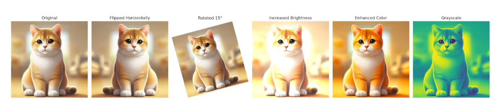
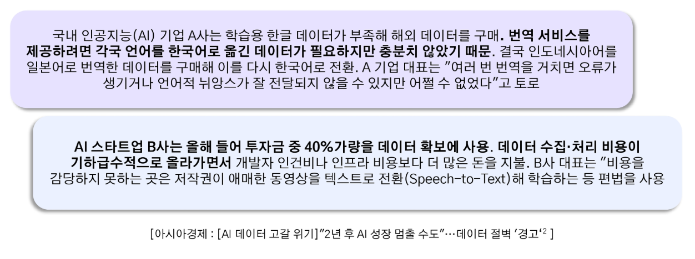
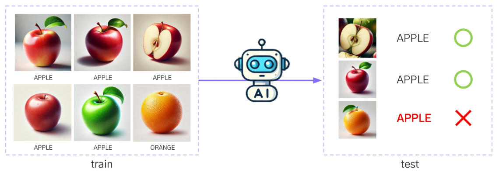
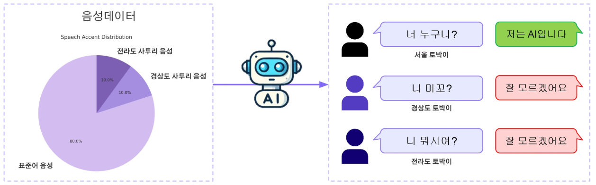
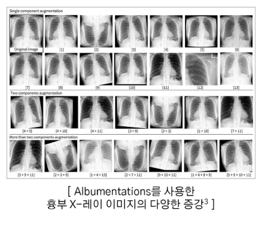

# 2024년 12월 5일(목) 수업 내용 정리 - 데이터 증강

## 데이터 증강의 개념과 필요성

- 데이터 증강의 개념

  - 데이터 증강(Data Augmentation)

- 데이터 증강의 필요성

  - 불균형 데이터
  - 모델 과적합 방지
  - 데이터 증강 사례

- 데이터 증강 기법 소개

  - 이미지, 텍스트, 시계열 데이터의 증강 기법 소개

### 01 데이터 증강의 개념

- 학습 목표

  - 데이터 증강이 무엇인지 설명할 수 있다

#### 데이터 증강(Data Augmentation)

- 기존 데이터를 변형하거나 가공하여 새로운 데이터를 생성하는 기법
- 데이터의 양과 다양성을 증가시켜 모델 성능을 향상 시킴

- 이미지 증강 예시

  

- 텍스트 증강 예시

  

### 02 데이터 증강의 필요성

- 학습 목표

  - 데이터 증강의 필요성을 설명할 수 있다
  - 데이터 증강으로 해결할 수 있는 문제들을 설명할 수 있다

#### 데이터 증강이 왜 필요할까?

- 데이터 증강은 **머신러닝과 딥러닝 모델의 성능을 향상시키기 위해 필수적인 기술**
- 머신러닝과 딥러닝 모델은 대량의 데이터를 기반으로 학습하기 때문에 **데이터의 양이 충분하지 않으면 모델은 일반화 능력을 상실하고 훈련 데이터에 과도하게 의존하는 과적합(overfitting) 문제가 발생**
- 데이터가 충분하지 않으면 AI 모델이 학습할 패턴이 제한되어 새로운 데이터에서 낮은 정확도를 보일 수 있음

#### AI 학습을 위한 데이터 부족

- 국내 AI 기업 중 **70.8%가 데이터 확보 및 품질 문제로 어려움**을 겪고 있음
- 국내 대기업들도 데이터가 부족해 해외 데이터를 구매하거나 합성데이터를 이용
- AI 모델의 학습 속도가 빨라지면서 데이터 증가 속도를 따라가고 있음
- 현재 인터넷 상에 존재하는 데이터로는 2년 내 AI 모델 성능을 높이는 데 한계가 생길 것이라는 예측
- 인터넷의 방대한 데이터 중 AI 모델 학습에 사용하기 좋은 고품질의 데이터는 부족

  

#### 불균형 데이터

- 특정 클래스에 대한 훈련 데이터가 작을 때 생기는 문제
- 예시. 이진 분류 문제에서 클래스 사과에 속하는 데이터가 90%이고 클래스 오렌지에 속하는 데이터가 10%인 경우

  

- 모델이 빈도가 높은 다수 클래스의 편향되어 예측 결과가 왜곡될 수 있음

  - 90%의 데이터가 클래스 A에 속한다면 모델은 모든 데이터를 A로 분류해도 90%의 정확도를 가지지만 좋지 않은 모델임

- **소수 클래스 데이터를 증강하여 데이터 비율을 맞출 수 있음**

#### 모델 과적합

- 모델이 학습 데이터에만 특화되어 일반화 성능 저하
- 데이터 증강을 통해 데이터 다양성을 증가시켜 과적합 방지

  

#### 데이터 증강 사례

(1) 헬스 케어 : 질병 진단

- 의료 업계는 특히 희귀 질환에 대한 데이터 부족으로 어려움을 겪는 경우가 많음
- 한 연구팀은 딥러닝 모델을 통해 유전 질환의 조기 발견을 향상시키고자 함. 하지만 질병과 관련된 이미지가 한정되어 있어 훈련 과정이 복잡했음
- 이 문제를 해결하기 위해 **연구팀은 사용 가능한 이미지를 회전, 뒤집기, 확대, 축소 하는 등 데이터 증강 기법을 사용하여 모델이 학습할 수 있는 더 많은 데이터를 생성**

  

(2) 자동차 : 자율주행 자동차

- Waymo라는 자동차 회사는 '희귀 시나리오 시뮬레이션'이라는 방법을 활용하여 다양하게 변형된 **엣지 케이스(예시 : 비 오는 날 밤 교차로에서의 긴급 상황)** 주행 시나리오를 생성
- **다양한 상황을 조합해 주행 데이터를 변형함으로써 모델 학습용 데이터를 증강**

  

### 03 데이터 증강 기법 소개

- 학습 목표

  - 이미지 데이터의 증강 기법을 확인한다
  - 텍스트 데이터의 증강 기법을 확인한다
  - 시계열 데이터의 증강 기법을 확인한다

