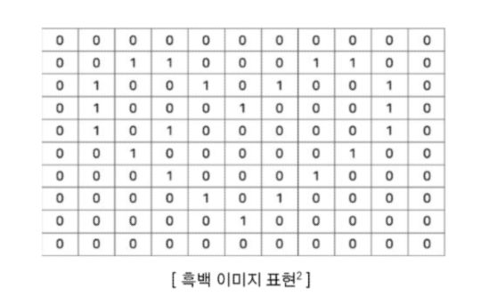
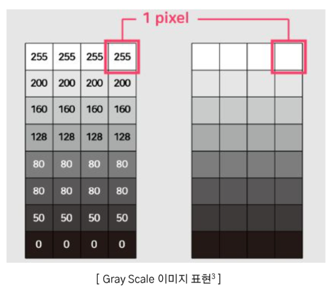

# 2024년 12월 5일(목) 수업 내용 정리 - 데이터 증강

## 이미지 데이터 증강 기법

- 이미지 데이터

  - 픽셀
  - 이미지 데이터 종류

- 이미지 데이터 기본 증강 기법

  - 이미지 데이터 증강
  - image Manipulation
  - image Erasing
  - image Mix

- 이미지 데이터 고급 증강 기법

  - Auto Augment
  - Feature Augmentation
  - Deep Generative Models

### 01 이미지 데이터

- 학습 목표

  - 픽셀(pixel)에 대해 이해한다
  - 이미지 데이터의 종류를 구분한다

#### 픽셀(pixel)

- 컴퓨터는 숫자로 데이터를 표현 및 저장
- 이미지를 **픽셀(pixel)** 형태로 만들어 처리
- 픽셀 : 그림의 **작은 사각형 한 개**
- 한 개의 이미지에 픽셀이 많을수록 고화질
- 한 이미지의 표현(해상도) : **세로 픽셀 수(높이) X 가로 픽셀 수(너비)**

#### 흑백 이미지(Gray Scale)

- 픽셀이 **0(흰색)** 혹은 **1(검은색)**로 저장 및 표현
- 0과 1로만 표현을 하게 되면 이미지의 명암 표현 불가능
- **0~255**까지의 숫자로 **명암**을 표현하여 픽셀에 저장 및 표현

  

  

