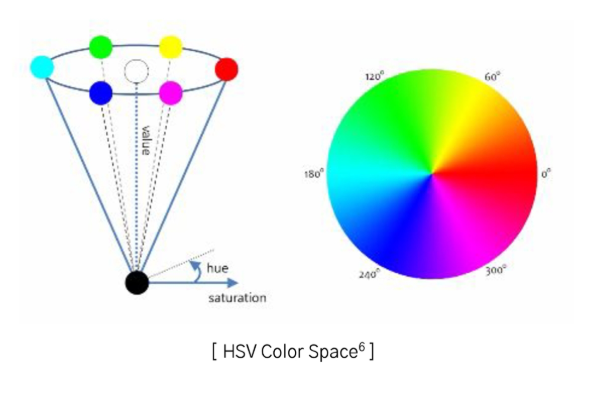

# 2024년 12월 5일(목) 수업 내용 정리 - 데이터 증강

## 이미지 데이터 증강 기법

- 이미지 데이터

  - 픽셀
  - 이미지 데이터 종류

- 이미지 데이터 기본 증강 기법

  - 이미지 데이터 증강
  - image Manipulation
  - image Erasing
  - image Mix

- 이미지 데이터 고급 증강 기법

  - Auto Augment
  - Feature Augmentation
  - Deep Generative Models

### 01 이미지 데이터

- 학습 목표

  - 픽셀(pixel)에 대해 이해한다
  - 이미지 데이터의 종류를 구분한다

#### 픽셀(pixel)

- 컴퓨터는 숫자로 데이터를 표현 및 저장
- 이미지를 **픽셀(pixel)** 형태로 만들어 처리
- 픽셀 : 그림의 **작은 사각형 한 개**
- 한 개의 이미지에 픽셀이 많을수록 고화질
- 한 이미지의 표현(해상도) : **세로 픽셀 수(높이) X 가로 픽셀 수(너비)**

#### 흑백 이미지(Gray Scale)

- 픽셀이 **0(흰색)** 혹은 **1(검은색)**로 저장 및 표현
- 0과 1로만 표현을 하게 되면 이미지의 명암 표현 불가능
- **0~255**까지의 숫자로 **명암**을 표현하여 픽셀에 저장 및 표현

  

  

#### 컬러 이미지(RGB)

- **빨강(Red), 녹색(Green), 파랑(Blue)**의 조합으로 **RGB**로 표현
- RGB는 빨강, 녹색, 파랑 **3개의 채널(깊이)**로 구성
- 각 색깔은 **0~255**까지의 숫자로 표현 및 저장
- 이미지의 크기 : **6(높이) X 5(너비) X 3(채널)**

  

#### HSV

- 색상 정보와 밝기 정보를 분리하여 RGB보다 뛰어난 성능
- **색상(Hue)** : 가시광선 스펙트럼을 주파수 별로 고리 모양으로 배치했을 때의 각도
- **채도(Saturation)** : 특정한 색상의 진함의 정도
- **명도(Value)** : 밝은 정도

  

#### 이미지 데이터셋

### 02 이미지 데이터 기본 증강 기법

- 학습 목표

  - 이미지 데이터 증강의 필요성을 알 수 있다
  - 기본 증강 기법의 개념을 구분할 수 있다
  - 기본 증강 기법을 코드로 구현할 수 있다

#### 이미지 데이터 증강

- 다른 데이터 증강과 마찬가지로, **과적합을 피가히** 위해 **생성**을 통해 **증강**이 목표
- 하나의 이미지를 이용하여 다양한 이미지를 생성할 수 있음

  

  

#### Image Manipulation

(1) 뒤집기(Flipping)

- 이미지의 픽셀을 **수평(Horizontal), 수직(Vertical)** 또는 **상하좌우(Diagonal)**로 반전
- 대칭적인 특징을 학습하거나 모델의 강건성을 향상시키는 데 유용

  

(2) 회전(Rotation)

- 이미지를 특정 각도로 **시계 방향** 또는 **반시계 방향**으로 회전
- 객체의 위치나 방향이 변하더라도 모델이 동일한 객체를 인식하도록 학습시키는 데 유용

  

(3) 위상변환(Scaling Ratio)

- 이미지를 **확대**하거나 **축소**하여 크기를 변경하는 기법
- 객체 크기가 달라져도 모델이 객체를 인식할 수 있도록 학습하는 데 유용

  

(4) 이동(Translation)

- 이미지를 **수평** 또는 **수직**으로 **이동**하는 기법
- 객체가 이미지 내에서 다양한 위치에 있을 때 모델이 이를 인식하도록 학습

  

(5) 색상 변환(Color Space)

- 이미지의 **다른 색상 공간으로 변환**하는 기법
- RGB → HSV, Grayscale 등으로 변환하여 색상 기반 조작

  

(6) 대비 조정(Contrast)

- 이미지의 **밝고 어두운 영역 간의 차이를 조정**하는 기법
- 모델이 다양한 조명 조건에서도 잘 동작할 수 있도록 학습

  

(7) 선명도 조정(Sharpening)

- 이미지 **경계를 강조하여 선명하게** 만드는 기법
- 흐릿한 이미지에서 세부 정보를 강조하고, 객체의 가장자리 정보를 강화하여 학습 성능 개선

  

(8) 노이즈 추가(Noise Injection)

- 이미지에 **노이즈(가우시안 노이즈 등)를 추가**하는 기법
- 모델이 노이즈가 있는 데이터에서도 강건하게 학습할 수 있도록 지원

  

(9) 잘라내기(Cropping)

- 이미지의 **일부 영역을 잘라내어** 사용하는 기법
- 데이터 증강을 위해 다양한 부분의 이미지를 생성

  

#### Image Erasing

(1) Cutout

- .이미지의 특정 영역을 정사각형 형태로 삭제(일반적으로 검정색 또는 중립값으로 채움)
- 구현이 간단하며, 모델이 삭제된 영역 외의 정보를 학습하도록 유도

  

(2) Random Erasing

- Cutout의 변형으로, 삭제되는 영역의 크기, 위치, 모양을 랜덤화
- Cutout의 다양한 삭제 패턴을 제공하고, 삭제된 영역의 형태와 크기가 랜덤으로 설정됨

  

#### Image Mix

(1) Mixup

- 두 이미지를 픽셀 단위로 혼합하고, 레이블 또한 두 이미지의 비율에 따라 결합
- 모델이 다중 클래스 분포를 학습하도록 유도

  

(2) CutMix

- 한 이미지의 일부 영역을 잘라내고, 해당 영역에 다른 이미지를 삽입
- 객체의 일부 정보 보존이 가능하며, 레이블 혼합을 통해 모델이 다양한 분포를 학습

  

