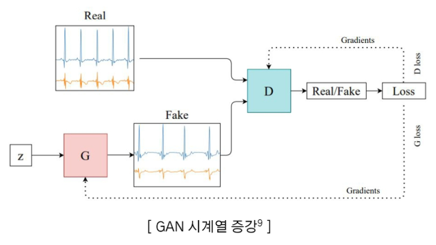

# 2024년 12월 5일(목) 수업 내용 정리 - 데이터 증강

## 텍스트 데이터, 시계열 데이터 증강 기법

- 텍스트 데이터 증강 기법

  - 텍스트 데이터 기본 증강 기법
  - 텍스트 데이터 고급 증강 기법

- 시계열 데이터 증강 기법

  - 시계열 데이터
  - 시계열 데이터 기본 증강 기법
  - 시계열 데이터 고급 증강 기법

### 01 텍스트 데이터 증강 기법

- 학습 목표

  - 기본 텍스트 증강 기법의 개념을 이해하고 이를 코드로 구현할 수 있다
  - 고급 텍스트 증강 기법 3가지를 구분하고 설명할 수 있다

#### 텍스트 데이터 증강

#### 텍스트 데이터 기본 증강 기법

(1) 동의어 교체

- **설명** : 문장에서 **하나 이상의 단어를 동의어로 대체**

  

- **주의** : 맥락을 고려하지 않아 원래 문장의 의미와 달라질 수 있음

  

- 구현 코드 : NLTK 라이브러리의 WordNet를 이용한 동의어 교체

  - **NLTK(Natural Language Toolkit)** : 자연어 처리 관련 작업(토큰화, 어근 추출 등)을 지원하는 라이브러리
  - **WordNet** : 단어의 의미 체계를 기반으로 한 어휘 데이터베이스(영어만 있음)
    - synsets(Synonym Set) : 동의어 사전

    

    

(2) 랜덤 단어 추가

- **설명** : 문장에서 임의의 단어의 동의어를 문장의 무작위 위치에 추가

  

- 단, 추가하는 단어는 기존 문장에서 **불용어가 아닌 단어의 동의어**
- 불용어의 추가는 모델이 다양한 표현을 학습하는 데 큰 도움이 되지 않음

  

- 구현 코드 : NLTK에서 지원하는 불용어 모음을 활용

  - 먼저 동의어를 검색하는 함수 구현 후, 랜덤 단어 추가 방식 구현

    

(3) 단어 순서 변경

- **설명** : 문장에 있는 2개 단어의 순서를 변경

  

- **주의** : 단순히 순서만 변경하게 되면 문법적으로, 혹은 의미적으로 크게 달라질 수 있음

  

- 구현 코드 : KoNLPy 라이브러리의 Komoran을 활용한 단어 순서 변경

  - **KoNLPy(Korean Natural Language Processing in Python)** : 한국어 자연어 처리에 특화된 라이브러리
  - **Komoran(Korean Morphological Analyzer)** : 한국어 형태소 분석기
  - 문장의 의미와 구조를 해치지 않도록 하기 위해 **특정 품사가 포함된 어절만 교환**하도록 설정하는 것이 중요

  

  

#### 텍스트 데이터 고급 증강 기법

(1) 역번역

- **설명** : 문장을 다른 언어로 번역한 후 다시 원래 언어로 번역
- 번역 언어를 여러 언어로 시도하여 다양한 표현을 얻을 수 있음

  

- 구현 코드 : Google Translate API를 활용한 구현

  

(2) 마스킹

- **설명** : **MLM**(Masked Language Model)을 이용
- **BERT**는 텍스트의 일부를 마스킹하고 해당 단어를 예측하는 **Masked Language Model**로 학습
- 이 과정에서 마스킹된 단어의 앞뒤 단어를 모두 활용하여 보다 문맥에 적합한 단어 선택 가능

  

- 구현 코드

  ① 주어진 문장에서 랜덤한 위치를 마스킹함
  
  ② 마스킹된 단어를 BERT를 통해 예측하고 채우도록 함

  

  

(3) LLM 활용

- 현재 개발된 LLM들은 텍스트 처리 능력이 매우 뛰어남
- 단순히 프롬프트를 입력하여 기존 방법들을 복잡한 코드 없이 구현할 수 있음

  

- 구현 코드 : GPT API를 활용한 증강 구현(로그인 후 개인 키 발급 필요)

  

### 02 시계열 데이터 증강 기법

- 학습 목표

  - 시계열 데이터의 특성을 이해한다
  - 시계열 데이터에 적합한 증강 기법을 학습한다
  - 간단한 실습으로 시계열 데이터 증강을 이해한다

#### 시계열 데이터(Time Series)

- 시계열 데이터란? **시간의 순서**에 따라 수정된 데이터로, **관측치 간의 종속성**이 존재함
- 과거의 데이터가 현재나 미래의 데이터에 영향을 미침

  

  

  - **계절성(Seasonality)** : 주기적으로 반복되는 패턴(예 : 계절별 기온 변화)
  - **추세(Trend)** : 시간에 따라 점진적으로 증가하거나, 감소하는 장기적 변화(예 : 지구온난화로 평균 기온 상승)
  - **주기성(Cyclicity)** : 계절성과 달리 특정 주기에 따라 나타나는 반복적인 패턴(예 : 경제 경기 사이클)
  - **불규칙성(Irregularity)** : 특정 패턴을 따르지 않는 데이터의 무작위성이나 예측할 수 없는 변동

#### 시계열 데이터(Time Series) - 증강을 하는 이유

- 시계열 데이터는 특정 도메인에서 **수집하기 어렵거나 비용이 많이 들 수 있음**
- 모델이 훈련 데이터에서 **학습한 패턴만 고집**하고, 새로운 데이터에 대해 **일반화하지 못할 가능성** 있음
- **도메인에 특화된 패턴을 가지므로**, 이를 반영하지 않으면 모델이 유의미한 패턴을 학습하지 못함

  

#### 시계열 데이터(Time Series) - 증강이 어려운 이유

- **시간적 순서를 유지**하는 것이 중요함
- **기존 증강 기법은 주로 이미지나 텍스트를 대상**으로 설계되어 있어, **시계열 데이터의 내재적 특성을 활용하지 못함** → **시간에 따른 분포와 특성이 변하는 문제**가 생김

  

#### 시계열 데이터(Time Series) - 증강 기법

#### 시계열 데이터 기본 증강 기법 - Time Domain Transformations

(1) 크로핑(Cropping)

  

(2) 플리핑(Flipping)

  

(3) 지터링(Jittering)

  

(4) 위상 변환(Time Warping)

  

#### 시계열 데이터 기본 증강 기법 - Frequency Domain Transformations

푸리에 변환(Fourier Transform) 활용한 시계열 증강

- **푸리에 변환** : 시간 도메인(Time Domain)에서 표현된 신호를 **주파수 도메인(Frequency Domain)으로 변환**
- 증강 : 원본 데이터에 **특정 주파수를 강조하거나 제거**하여 다른 주기 패턴을 포함한 데이터를 생성
- 장점 : 빠른 계산 속도를 자랑하며, 대규모 데이터도 쉽게 적용 가능
- 단점 : 선형 시스템에 적합해 비선형 데이터(금융데이터)에는 한계가 있음

  

#### 시계열 데이터 고급 증강 기법

(1) 분해 기반 방법(Decomposition-Based Methods)

- 시계열 데이터를 **추세, 계절성, 잔차로 분해**한 후, 각 요소를 **개별적으로 변형**하여 새로운 시계열 데이터 생성
- 장점 : 데이터의 각 구성 요소를 독립적으로 조작 가능하며, 특정 요소만 변형하여 모델 학습 다양화
- 단점 : 데이터 분해 품질에 따라 증강 효과가 달라지며, 특정 구성 요소가 누락되거나 과도하게 변형될 위험이 있음

(2) 딥러닝 모델 활용

- **GAN(Generative Adversarial Networks)**의 **딥러닝 기반 모델을 활용**하여 시계열 데이터를 학습하고 새로운 데이터 생성
- 장점 : 복잡하고 고차원적인 시계열 데이터를 **현실감 있게 생성**
- 단점 : 훈련 과정이 복잡하고 시간 소요되며 생성된 데이터의 품질을 보장하기 어려움

  

- **GAN은 생성자(Generator, G)와 판별자(Discriminator, D)로 구성**되며, 이 둘이 **경쟁적으로 학습하는 구조**를 가짐

  

  - **생성자(G)**는 입력된 노이즈(z)를 기반으로 진짜(Real)처럼 보이는 **가짜(Fake) 시계열 데이터를 생성**함
  - **판별자(D)**는 입력된 데이터가 **진짜(Real) 데이터인지 가짜(Fake) 데이터인지 구별**함
  - 생성자는 판별자를 속여 가짜 데이터를 진짜로 분류하게 만드는 방향으로 학습되며, 이 과정에서 **점점 더 정교한 가짜 데이터를 생성하는 방향으로 수렴**함

(3) 자동화된 증강 기법

- 강화학습(Reinforcement Learning)또는 메타러닝을 활용하여 **데이터 증강 전략을 자동으로 학습**하는 기법
- 장점 : 시계열 분류 문제에서 **최적의 증강 조합을 자동**으로 탐색
- 단점 : 계산 비용이 높고 복잡한 설계로 실험 설정이 어려울 수 있음

  

### SUMMARY

1. 텍스트 데이터 증강 기법

    - 텍스트 기본 증강 기법 - 동의어 교체, 랜덤 단어 추가, 단어 순서 변경을 배우고 관련 코드를 확인
    - 텍스트 고급 증강 기법 - 역번역, 마스킹, LLM 활용을 배우고 관련 코드를 확인

2. 시계열 데이터 증강 기법

    - 기존 증강 기법은 주로 이미지나 텍스트 데이터를 대상으로 설계되어 있어, 시계열 데이터의 내재적 특성을 활용하지 못함
    - 기본 증강 기법 - Cropping, Flipping, Jittering, Time Warping
    - 고급 증강 기법 - 분해 기반, 딥러닝 활용, 자동화된 증강 기법

