# 2024년 12월 6일(금) 수업 내용 정리 - 데이터 품질 평가

## 데이터 선택과 볼륨의 정의, 데이터 선택과 볼륨간 Trade-off 사례

- 데이터 선택과 볼륨

  - 데이터 선택
  - LLM에서의 데이터 선택
  - 데이터 볼륨

- 데이터 선택과 볼륨 간 Trade-off 사례

  - 적절한 데이터 볼륨과 데이터 선택 사례

### 01 데이터 선택과 볼륨

- 학습 목표

  - 데이터 선택과 데이터 볼륨이 LLM에 미치는 영향을 이해한다
  - 모델 개발 시 적합한 데이터 전략을 수립할 수 있다
  

#### 데이터 선택

- 데이터 선택은 머신러닝에서 오래된 과제로, 주어진 raw data에서 특정 목표 함수에 대해 최적의 데이터셋을 설계하는 것을 목표로 함
- 특히 대규모 언어 모델(LLM, Large Language Model) 훈련에서 핵심적인 역할을 함

#### LLM에서의 데이터 선택

- 대규모 언어 모델(LLM)은 방대한 데이터를 사용하기 때문에 효율적이고 효과적인 데이터 선택이 필수
- 대규모 언어 모델(LLM) 학습에서 데이터 선택 방식은 데이터 파이프라인의 각 단계와 학습 목적에 따라 다양하게 적용

  

**각 학습 단계에 따라 데이터 선택 전략이 달라짐. 각 단계에서 어떤 데이터를 선택애햐 하는지 명확하게 이해해야 함**

1. Pretraining
2. Instruction Tuning
3. Alignment
4. Task-specific Fine-tuning

##### 1. Pretraining(사전학습) 단계에서의 데이터 선택

- Pretraining 단계는 언어 모델 학습의 초기 단계로, 범용성 있는 모델을 구축하기 위해 다양한 데이터 선택 방법을 사용.
- 이 단계에서는 방대한 양의 데이터에서 **고품질, 효율적인 데이터**를 선정하고, **불필요한 노이즈와 중복 데이터**를 제거하는 것이 핵심

  

(1) Language Filtering

- Language Filtering의 주요 목적

  - 사전학습 데이터에서 특정 언어(자연어 또는 프로그래밍 언어)만 포함시키는 작업
  - 다국어 모델의 경우 언어 간 데이터 비율을 유지하거나, 특정 언어를 제외하기도 함

    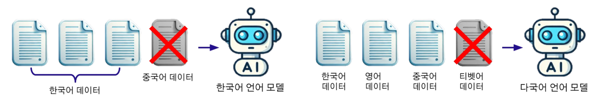

    ① **문자 n-gram 기반 분류기** : 텍스트에서 문자 n-gram(예 : 2글자 또는 3글자 조합)을 사용하여 언어를 판별

      - langdetect : 간단하고 빠르게 언어를 감지
      - cld3 : Google에서 개발한 도구로 다국어 감지 성능 우수
      - FastText : Facebook에서 개발한 도구로, 많은 언어를 지원하며 속도와 정확도가 뛰어남

        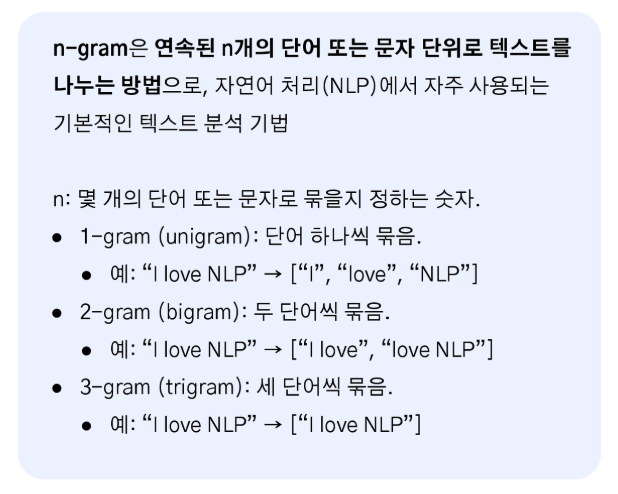

    ② **비영어 데이터 제거** : 영어 데이터만 남기고 다른 언어 데이터를 모두 제거

      - C4 데이터셋에서는 langdetect 분류기를 사용해 영어가 아닌 페이지를 제거(99% 이상의 확률로 영어로 분류된 데이터만 유지)

        

    ③ **다국어 데이터 필터링** : 여러 언어를 포함한 데이터셋을 다룰 때, 각 언어별 임계값을 설정해 데이터를 필터링

      - **ROOT 코퍼스**에서는 FastText를 사용해 언어별 신뢰도 점수를 계산하고, 기준 미달 데이터를 제거

        

    ④ **URL 및 도메인 기반 필터링** : 특정 국가 도메인(.kr, .fr 등)이나 URL 패턴을 사용해 언어를 간접적으로 판별

      - **도메인 확장자(예 : .kr, .fr, .de)를 사용해 특정 국가와 관련된 데이터를 필터링**
      - 낮은 자원 언어(예 : 위구르어)의 경우 언어 분류기보다 URL 기반 필터링이 더 효과적
      - 분류기가 지원하지 않는 언어에도 적용 가능
      - 저자원 언어 데이터를 상대적으로 신뢰성 있게 수집 가능
      - URL 패턴만으로 언어를 완벽히 판별하기는 어렵다는 단점이 있음

    ⑤ **코드 데이터 필터링** : 코드 파일의 확장자(예 : .py, .java) 또는 특정 패턴을 사용해 코드 데이터를 필터링

      - GitHub 저장소의 스냅샷 데이터를 처리할 때 파일 확장자를 기반으로 프로그래밍 언어를 식별
      - 간단하고 빠르게 코드 데이터를 선별 가능
      - 코드와 자연어가 섞인 문서에서는 코드 부분을 정확히 분리하기 어려움

(2) Heuristic Approaches

  ① **항목 개수를 기준으로 필터링** : 데이터의 문장 수, 단어 수, 문자 수 등의 통계 기준으로 필터링

  - C4 데이터셋은 5문장 미만의 페이지를 제거
  - MassiveText는 50~100,000 단어 범위를 초과하는 문서를 제거
  
  ② **반복성 제거** : 반복적으로 등장하는 n-gram, 문장, 문단이 많은 데이터를 제거

  - MassiveText는 문서에서 반복된 문장이 30%를 넘으면 해당 문서를 제거
  
  ③ **특정 패턴 및 블랙리스트 기반 필터링** : 블랙리스트 단어나 패턴이 포함된 데이터를 제거

  - C4는 부적절한 단어 리스트에 포함된 단어를 가진 문서를 제거
  - HTML 태그, 광고 문구, 오류 메시지 등을 제거

 

- 단순한 휴리스틱은 품질을 직접 판단하지 못하며, 유용한 데이터까지 제거할 위험이 있음
- 새로운 휴리스틱의 효과를 검증하려면 많은 시간과 비용이 소요

(3) Data Quality : **고품질** 데이터를 선별해 모델 성능을 높이고, 불필요한 데이터를 제거

  ① **고품질의 참조 데이터셋과 비교** : 고품질 참조 데이터셋(위키피디아, 책, 뉴스기사 등)을 기준으로 유사성 점수를 계산해 데이터 선택

  - GPT-3는 Web Text와 유사한 데이터를 포함시키는 분류기를 사용
  - FastText, n-gram, 해시 기반 분류기로 대규모 데이터를 빠르게 처리

    - FastText : Facebook에서 개발한 언어 모델로, 텍스트를 빠르게 분류하고 유사성을 계산
    - N-gram : 텍스트를 일정 길이로 쪼개 참조 코퍼스와 유사도를 비교
    - Hash : 텍스트를 숫자로 변환해 비교를 간단하게 만듦
  
  ② **퍼플렉시티 기반 평가**

  - 참조 데이터셋(위키피디아, 학술논문 등)으로 학습된 언어 모델을 사용해 데이터의 퍼플렉시티 점수를 계산
  - 퍼플렉시티가 낮을수록 참조 도메인에 가까운 데이터로 간주
  - CCNet은 5-gram 언어 모델로 문단별 퍼플렉시티를 평가해 데이터를 필터링

    

(4) 도메인 특화 필터링

- **Moore-Lewis 필터링** : 특정 분야(도메인)에 적합한 데이터를 고르는 방법, 어떤 데이터가 내가 원하는 분야(의학, 법률 등)에 더 잘 맞는지를 계산하는 방식

  - 의학, 법률, 기술 등 특화딘 주제에 대해 모델의 성능을 높이는 것이 목표
  - 두개의 모델을 사용, 특정 분야에서 학습된 도메인 모델과 일반적인 데이터에서 학습된 일반 모델을 가지고 새로운 데이터를 두 모델에 넣고, 각 모델이 이 데이터와 얼마나 잘 맞는다고 생각하는지 점수를 계산
  - 도메인 모델의 점수가 일반 모델보다 높다면 이 데이터는 도메인에 적합하다고 판단

(5) 중복 제거

- 데이터 효율성을 높이고 과적합을 방지
- 문서, 문장, n-gram 수준에서 중복을 감지해 데이터셋을 축소
- **CCNet**은 동일 문장을 포함한 문서를 제거
- 고품질 필터링 없이도 중복 제거만으로 모델 성능을 유지한 사례 존재(Penedo et al.,2023)

  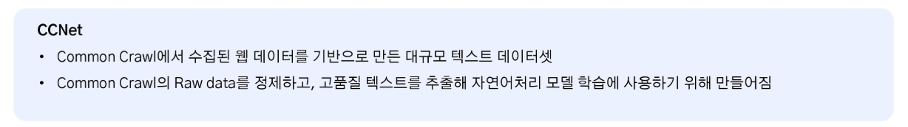

##### 2. Instruction Tuning에서의 데이터 선택

모델이 사용자 명령(instruction)을 이해하고 수행하는 능력을 학습시키는 과정. 모델이 다양한 작업에서 정확하고 유용한 답변을 제공하도록 특정 데이터셋을 선택하고 사용하는 것이 핵심. 데이터는 instruction(명령)과 output(결과) 쌍으로 구성

  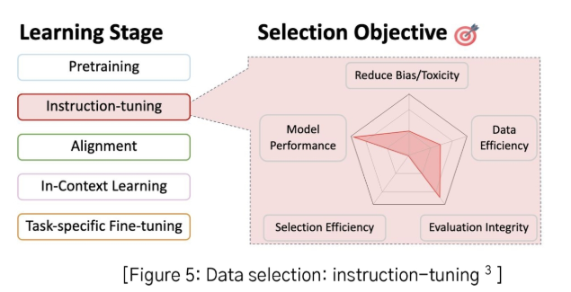

- Instruction Tuning 이란?

  모델이 사용자 명령(instruction)을 이해하고 원하는 결과(output)를 생성하도록 학습하는 방법. 구글의 FLAN(Finetuned Language Models are Zero-Shot Learners)논문에서 처음 나온 개념

- Instruction 이란?

  사용자가 모델에 전달하는 명령어 또는 요청으로 task의 유형과 맥락을 제공해 모델이 무엇을 해야 하는지 이해할 수 있게 만듦

    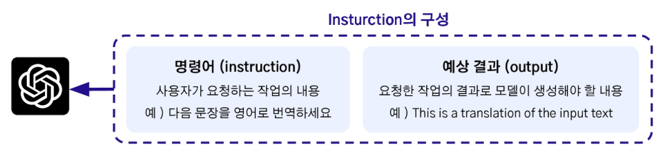

  ① 데이터 다양성 확대

  - 다양한 작업 포함

    - 여러 종류의 작업을 학습시켜 모델이 다양한 작업을 처리할 수 있도록 만듦

      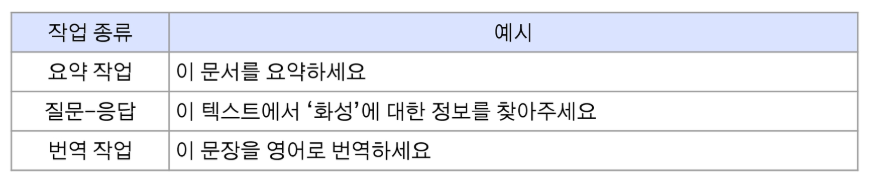
  
  - 질문-응답 형식 통합

    - 다양한 작업을 질문과 답 형식으로 통일

  - 데이터 증강

    - Hugging Face, TensorFlow Datasets와 같은 오픈소스 데이터셋에서 증강

      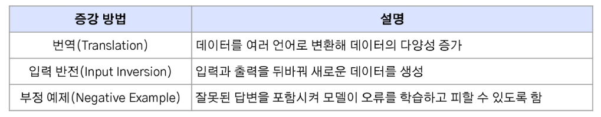
  
  ② 템플릿 다양화

  - 다양한 형식의 명령과 데이터를 학습에 포함시켜 모델이 더 많은 스타일의 요청에 적응할 수 있도록 하는 방법

    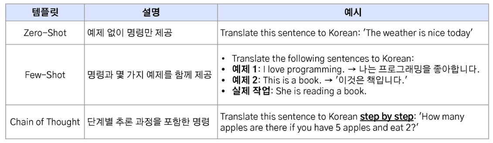

    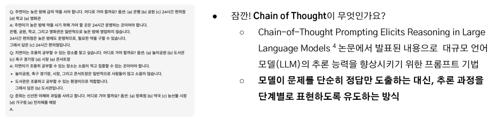
  
  ③ 데이터 균형 유지

  - 특정 작업이나 대규모 데이터셋이 학습을 독점하지 않도록 조정

    - 샘플링 제한 : 한 작업이나 데이터셋에서 사용하는 데이터 수를 제한
    - 가중치 적용 : 저자원 작업(드문 언어나 복잡한 작업)에 더 높은 가중치를 부여

      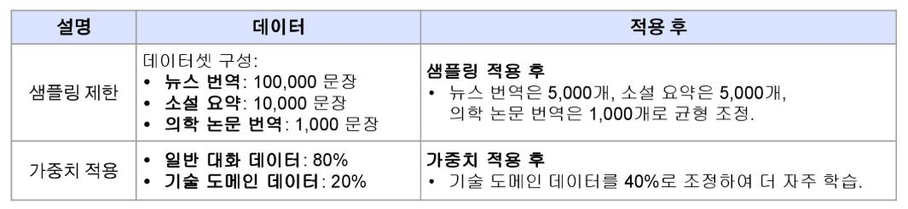

(3) Alignment에서 데이터 선택

Alignment는 모델이 사용자 의도와 윤리적 기준에 맞춰 응답하도록 조정. 편향 제거, 유해 데이터 필터링 등을 통해 안전한 서비스를 만들 수 있음

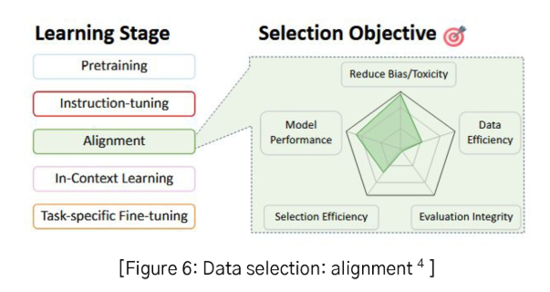

① 편향 및 유해성 데이터 필터링

- 사용자가 입력한 요청이 부적절하거나 위험할 경우, 이를 적절히 처리하도록 설계

  ⅰ. 입력 필터링

  - 사용자가 입력한 프롬프트를 사전에 검사
  - 예시. 욕설, 증오 표현, 비윤리적 요청(해킹 방법 요청 등)이 포함된 프롬프트를 감지
  - 구현 : 키워드 필터링, 금지 패턴 감지
    
  ⅱ. 안전 메시지 제공

  - 부적절한 요청에 대해 적절히 거부하거나 안전한 메시지를 반환
  - 예시. 프롬프트 : "폭력을 조장하는 방법을 알려줘" / 응답 : "죄솧아지만, 요청하신 내용은 제공할 수 없습니다."

② 사용자 피드백 시스템 구축

- 모델의 출력이 사용자의 기대에 부합하지 않을 경우, 피드백을 받아 개선

  ⅰ. 피드백 버튼 추가

  - 사용자가 모델 응답에 대해 "유용함" 또는 "부적절함"을 표시할 수 있도록 UI 설계
  
  ⅱ. 피드백 데이터 활용

  - 부적절한 응답 데이터를 수집하여 프롬프트를 개선하거나, 더 나은 응답을 도출하는 규칙을 추가
  
  ⅲ. 실시간 개선

  - 반복적인 피드백 루프를 통해 서비스 품질을 점진적으로 향상

(4) Task-Specific Fine-Tuning을 위한 데이터 선택

특정 작업에 최적화된 서비스를 제작하려면 Task-Specific Fine-Tuning 과정에서 관련성 높은 데이터를 신중히 선택하고 이를 통해 모델이 목표 작업에 최적화되도록 해야함

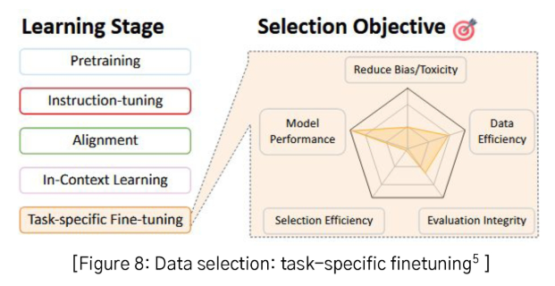

① Task의 직접적으로 관련된 데이터를 수집

② 고품질의 데이터 확보

③ 적절한 양의 데이터 필요, 너무 적거나, 너무 많으면 새로운 데이터나 테스트 데이터에 대한 성능이 떨어지는 과적합(overfitting)이 일어남

④ 데이터의 다양성을 높이기 위해 증강

- GPT-4는 Fine-Tuning이 불가능하지만, GPT-3.5 Turbo는 Fine-Tuning을 지원
- Solar Pro Preview / Solar Mini는 Huggingface에 오픈되어있어 활용 가능
- 지원하는 Fine-Tuning 기능

  ⅰ. 맞춤형 응답 생성 : 도메인 특화된 데이터 학습
  
  ⅱ. 특정 스타일이나 템플릿을 따르는 응답 생성

- 활용 방법

  ⅰ. 오픈소스 모델들을 활용하여 Fine-Tuning 데이터를 준비하고 업로드
  
  ⅱ. Instruction 데이터를 기반으로 Fine-Tuning 진행

#### 데이터 볼륨

(1) 데이터 볼륨의 중요성

  ① LLM은 방대한 데이터로 학습되며, 데이터 볼륨이 크면 더 많은 언어 패턴과 지식을 학습할 기회가 생김
  
  ② 특히 Pretraining 단계에서 데이터 양이 클수록 모델의 기본적인 언어 이해 능력이 좋아짐

(2) 데이터 볼륨이 지나치게 클 경우의 문제점

  ① 노이즈 증가

  - 데이터 볼륨이 크더라도 품질이 낮거나 노이즈가 많은 데이터가 포함되면 성능에 부정적인 영향을 미침
  - 예시. 잘못된 문법, 의미없는 텍스트, 편향된 데이터
  
  ② 과도한 학습 비용

  - 데이터가 클수록 학습에 필요한 계산 차원과 시간이 증가
  - Pretraining 데이터셋의 크기가 클 경우 학습 비용이 기하급수적으로 상승
  
  ③ 과적합 위험

  - 동일하거나 유사한 데이터를 지나치게 많이 학습하면 모델이 특정 데이터 분포에 과적합 될 수 있음

