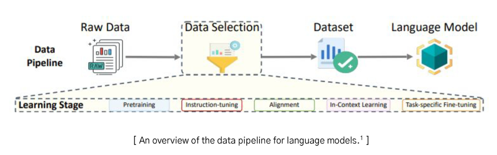
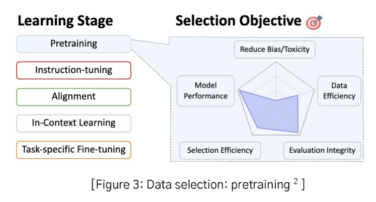

# 2024년 12월 6일(금) 수업 내용 정리 - 데이터 품질 평가

## 데이터 선택과 볼륨의 정의, 데이터 선택과 볼륨간 Trade-off 사례

- 데이터 선택과 볼륨

  - 데이터 선택
  - LLM에서의 데이터 선택
  - 데이터 볼륨

- 데이터 선택과 볼륨 간 Trade-off 사례

  - 적절한 데이터 볼륨과 데이터 선택 사례

### 01 데이터 선택과 볼륨

- 학습 목표

  - 데이터 선택과 데이터 볼륨이 LLM에 미치는 영향을 이해한다
  - 모델 개발 시 적합한 데이터 전략을 수립할 수 있다
  

#### 데이터 선택

- 데이터 선택은 머신러닝에서 오래된 과제로, 주어진 raw data에서 특정 목표 함수에 대해 최적의 데이터셋을 설계하는 것을 목표로 함
- 특히 대규모 언어 모델(LLM, Large Language Model) 훈련에서 핵심적인 역할을 함

#### LLM에서의 데이터 선택

- 대규모 언어 모델(LLM)은 방대한 데이터를 사용하기 때문에 효율적이고 효과적인 데이터 선택이 필수
- 대규모 언어 모델(LLM) 학습에서 데이터 선택 방식은 데이터 파이프라인의 각 단계와 학습 목적에 따라 다양하게 적용

  

**각 학습 단계에 따라 데이터 선택 전략이 달라짐. 각 단계에서 어떤 데이터를 선택애햐 하는지 명확하게 이해해야 함**

1. Pretraining
2. Instruction Tuning
3. Alignment
4. Task-specific Fine-tuning

(1) Pretraining(사전학습) 단계에서의 데이터 선택

- Pretraining 단계는 언어 모델 학습의 초기 단계로, 범용성 있는 모델을 구축하기 위해 다양한 데이터 선택 방법을 사용.
- 이 단계에서는 방대한 양의 데이터에서 **고품질, 효율적인 데이터**를 선정하고, **불필요한 노이즈와 중복 데이터**를 제거하는 것이 핵심

  
