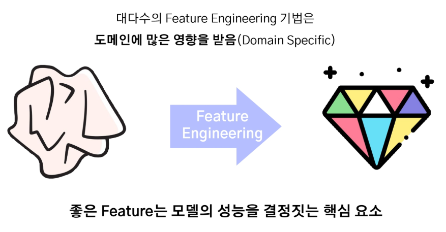

# 2024년 12월 6일(금) 수업 내용 정리 - 데이터 품질 평가

## Feature Engineering 중요성, 모델 성능에 영향을 미치는 주요 Features, Feature Engineering 및 Feature 중요도 적용

- Feature Engineering의 중요성

  - Feature Engineering 정의, 필요성, 중요성
  - Feature Engineering 기법

- 모델 성능에 영향을 미치는 주요 Feature

  - 모델 해석의 중요성
  - Feature 선택 및 중요도 평가

- Feature Engineering 및 Feature 중요도 실습

  - 실제 데이터로 실습 진행

### 01 Feature Engineering의 중요성

- 학습 목표

  - Feature Engineering의 기본 개념과 중요성, 다양한 기법을 배운다
  - 데이터 전처리 및 모델 개발 과정에서 효율적인 Feature Engineering을 적용할 수 있는 역량을 키운다

#### Feature Engineering

- 데이터의 Feature을 **분석해 적합한 Feature로 변환**하거나 **새로운 Feature를 생성**하는 과정

  

  

#### Feature Engineering - 필요성

- 최근 많은 분야의 데이터들은 변수의 수가 **매우 많은 고차원 데이터(High demensional data)의 특징**을 가지고 있음

  

- **차원의 저주(Curse of Dimensionality)** : 고차원 공간에서 데이터가 희소해지고 거리 개념이 왜곡되어 알고리즘 성능이 저하되는 현상
- 동등한 설명력을 갖기 위해서는 변수가 증가할 때 필요한 개체의 수는 기하급수적으로 증가함
- 실제 데이터의 차원은 매우 크더라도 **내재된 차원은 원래 차원의 수보다 낮은 경우**가 대부분임

  

  

#### Feature Engineering - 중요성

#### Feature Engineeering - 기법

(1) Feature 생성

- 도메인 지식과 창의성을 바탕으로 **기존 Feature들을 재조합하여 새로운 Feature를 만드는 과정**
- 모델이 더 잘 학습할 수 있도록 **데이터의 유용한 정보**를 추가로 제공

  

(2) Feature 변환

- 기존 Feature의 값을 **수학적으로 변환**하여 데이터의 특성을 변경
- 데이터를 **모델이 더 잘 이해할 수 있는 형태로 변환**하는 과정

  

(3) Feature Encoding

- **범주형 데이터**를 모델이 처리할 수 있는 **수치형 데이터로 변환**하는 과정
- 모델은 범주형 데이터를 직접 처리하지 못하기 때문에, 인코딩하여 모델 입력에 적합하게 만드는 것이 필수적

  

**※ Feature 생성 및 변환 후 원래 Feature 삭제 여부를 결정하는 기준**

(4) Feature 선택

① 전역 탐색법(Exhaustive Search)

- 가능한 모든 경우의 조합에 대해 모델을 구축한 뒤 **최적의 Feature 조합**을 찾는 방식
- **변수 선택을 위한 모델 평가 기준** : 회귀 및 분류에서 사용하는 **성능 평가 지표**를 주로 사용함
- 예. 선형회귀분석 - AIC(Akaike Information Criteria), BIC(Bayesian Information Criteria), adjusted R-sqaured
- 그러나, 현실적으로 전역 탐색법은 **탐색 소요 시간이 오래 걸려 유효한 방법이 아님**

  

② 전진 선택법(Forward Selection)

- 설명변수가 하나도 없는 모델에서부터 시작하여 **가장 유의미한 변수를 하나씩 추가**해 나가는 방법
- 한번 **선택된 변수는 제거**되지 않음

  

③ 후진 소거법(Backward Elimination)

- 모든 변수를 사용하여 구축한 모델에서 **유의미하지 않은 변수를 하나씩 제거**해 나가는 방법
- 한번 **제거된 변수는 다시 선택될 가능성이 없음**

  
  

④ 단계적 선택법(Stepwise Selection)

- **전진 선택법과 후진 소거법을 번갈아** 가면서 수행하는 변수 선택 기법
- 한번 선택된 변수가 이후 과정에서 제거되거나, 제거된 변수가 이후 과정에서 **재선택**될 수 있음

  

⑤ 유전 알고리즘(Genetic Algorithm)

- 앞서 전진 선택, 후진 소거, 단계적 선택은 전역 탐색에 비해 매우 효율적이나 **최적 변수 집합을 찾을 가능성은 낮아짐**
- 기존 휴리스틱 기법을 보다 **더 많은 시간을 사용해 최적 변수 집합을 찾을 가능성**을 높이는 것이 목표

  

- **진화론적 개념(자연 선택 및 유전)**에서 영감을 받아 최적화를 수행하는 **메타 휴리스틱(Meta-Heuristic) 알고리즘**
- 메타 휴리스틱 기법이란, 닫힌 해(solution)가 존재하지 않는 복잡한 문제에 대해서 시행착오를 줄이는 효율적인 해 탐색 기법
- 우수한 유전자(해)는 생식을 통해 다음 세대에서도 잘 발현될 수 있도록 권장

  

A. 핵심 단계

  

B. 유전 알고리즘 절차

  

(5) Feature(차원) 축소 - 주성분 분석(PCA, Principal Component Analysis)

① PCA 정의 및 목적

② PCA의 원리

- 주성분(Principal Component)

- 공분산 행렬(Covariance Matrix)

③ PCA의 과정

