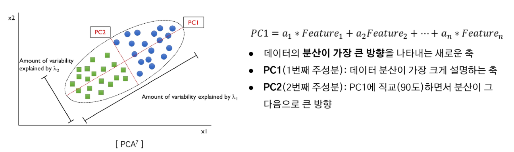

# 2024년 12월 6일(금) 수업 내용 정리 - 데이터 품질 평가

## Feature Engineering 중요성, 모델 성능에 영향을 미치는 주요 Features, Feature Engineering 및 Feature 중요도 적용

- Feature Engineering의 중요성

  - Feature Engineering 정의, 필요성, 중요성
  - Feature Engineering 기법

- 모델 성능에 영향을 미치는 주요 Feature

  - 모델 해석의 중요성
  - Feature 선택 및 중요도 평가

- Feature Engineering 및 Feature 중요도 실습

  - 실제 데이터로 실습 진행

### 01 Feature Engineering의 중요성

- 학습 목표

  - Feature Engineering의 기본 개념과 중요성, 다양한 기법을 배운다
  - 데이터 전처리 및 모델 개발 과정에서 효율적인 Feature Engineering을 적용할 수 있는 역량을 키운다

#### Feature Engineering

- 데이터의 Feature을 **분석해 적합한 Feature로 변환**하거나 **새로운 Feature를 생성**하는 과정

  

  

#### Feature Engineering - 필요성

- 최근 많은 분야의 데이터들은 변수의 수가 **매우 많은 고차원 데이터(High demensional data)의 특징**을 가지고 있음

  

- **차원의 저주(Curse of Dimensionality)** : 고차원 공간에서 데이터가 희소해지고 거리 개념이 왜곡되어 알고리즘 성능이 저하되는 현상
- 동등한 설명력을 갖기 위해서는 변수가 증가할 때 필요한 개체의 수는 기하급수적으로 증가함
- 실제 데이터의 차원은 매우 크더라도 **내재된 차원은 원래 차원의 수보다 낮은 경우**가 대부분임

  

  

#### Feature Engineering - 중요성

#### Feature Engineeering - 기법

(1) Feature 생성

- 도메인 지식과 창의성을 바탕으로 **기존 Feature들을 재조합하여 새로운 Feature를 만드는 과정**
- 모델이 더 잘 학습할 수 있도록 **데이터의 유용한 정보**를 추가로 제공

  

(2) Feature 변환

- 기존 Feature의 값을 **수학적으로 변환**하여 데이터의 특성을 변경
- 데이터를 **모델이 더 잘 이해할 수 있는 형태로 변환**하는 과정

  

(3) Feature Encoding

- **범주형 데이터**를 모델이 처리할 수 있는 **수치형 데이터로 변환**하는 과정
- 모델은 범주형 데이터를 직접 처리하지 못하기 때문에, 인코딩하여 모델 입력에 적합하게 만드는 것이 필수적

  

**※ Feature 생성 및 변환 후 원래 Feature 삭제 여부를 결정하는 기준**

(4) Feature 선택

① 전역 탐색법(Exhaustive Search)

- 가능한 모든 경우의 조합에 대해 모델을 구축한 뒤 **최적의 Feature 조합**을 찾는 방식
- **변수 선택을 위한 모델 평가 기준** : 회귀 및 분류에서 사용하는 **성능 평가 지표**를 주로 사용함
- 예. 선형회귀분석 - AIC(Akaike Information Criteria), BIC(Bayesian Information Criteria), adjusted R-sqaured
- 그러나, 현실적으로 전역 탐색법은 **탐색 소요 시간이 오래 걸려 유효한 방법이 아님**

  

② 전진 선택법(Forward Selection)

- 설명변수가 하나도 없는 모델에서부터 시작하여 **가장 유의미한 변수를 하나씩 추가**해 나가는 방법
- 한번 **선택된 변수는 제거**되지 않음

  

③ 후진 소거법(Backward Elimination)

- 모든 변수를 사용하여 구축한 모델에서 **유의미하지 않은 변수를 하나씩 제거**해 나가는 방법
- 한번 **제거된 변수는 다시 선택될 가능성이 없음**

  
  

④ 단계적 선택법(Stepwise Selection)

- **전진 선택법과 후진 소거법을 번갈아** 가면서 수행하는 변수 선택 기법
- 한번 선택된 변수가 이후 과정에서 제거되거나, 제거된 변수가 이후 과정에서 **재선택**될 수 있음

  

⑤ 유전 알고리즘(Genetic Algorithm)

- 앞서 전진 선택, 후진 소거, 단계적 선택은 전역 탐색에 비해 매우 효율적이나 **최적 변수 집합을 찾을 가능성은 낮아짐**
- 기존 휴리스틱 기법을 보다 **더 많은 시간을 사용해 최적 변수 집합을 찾을 가능성**을 높이는 것이 목표

  

- **진화론적 개념(자연 선택 및 유전)**에서 영감을 받아 최적화를 수행하는 **메타 휴리스틱(Meta-Heuristic) 알고리즘**
- 메타 휴리스틱 기법이란, 닫힌 해(solution)가 존재하지 않는 복잡한 문제에 대해서 시행착오를 줄이는 효율적인 해 탐색 기법
- 우수한 유전자(해)는 생식을 통해 다음 세대에서도 잘 발현될 수 있도록 권장

  

A. 핵심 단계

  

B. 유전 알고리즘 절차

  

(5) Feature(차원) 축소

① 주성분 분석(PCA, Principal Component Analysis)

  A. PCA 정의 및 목적

  - 고차원 데이터를 저차원으로 축소하면서 **데이터의 분산(정보)를 최대한 보존**하는 선형 차원 축소 기법
  - 이는 데이터를 새로운 좌표계로 변환하여 데이터의 주요 패턴을 찾고, 불필요한 차원을 제거하는 데 사용
  - 예. 3차원의 데이터를 2차원의 주성분 공간으로 사영(projection)시키면 원래 데이터가 가지고 있는 특정의 대부분이 보존

    

B. PCA의 원리

- 주성분(Principal Component)

  

- 공분산 행렬(Covariance Matrix)

  

C. PCA의 과정

② t-SNE(t-Distributed Stochastic Neighbor Embedding)

A. t-SNE 정의

- 고차원 공간에서 가까운 것은 저차원에서도 가깝게, 고차원에서 먼 것은 저차원에서도 멀게 유지하는 것
- 즉, 고차원 데이터에서 데이터 포인트 간의 관계를 유지하면서 저차원으로 변환
- **비선형 차원 축소 기법**으로, 비선형 변환을 사용하여 복잡한 데이터 구조를 효과적으로 표현
- 데이터 간의 유사성(Similiarity)에 중점을 두며, 글로벌 구조(Global Structure)보다는 **로컬 구조(Local Structure)를 더 잘 반영함**

  

B. t-SNE 작동 원리 및 특징

- **로컬 구조(Local Structure) 보존** : 가까운 데이터 포인트 간의 관계를 최대한 유지하며, 저차원에서도 local 군집 유지됨
- **글로벌 구조(Global Structure) 표현에 약함** : 멀리 떨어진 데이터 포인트 간의 관계는 왜곡될 가능성이 있음
- **계산 비용이 높음** : 고차원 데이터가 계산량이 많고 학습 시간이 오래 걸림
- **해석이 어려움** : 결과로 나온 저차원 데이터가 원래 데이터의 실제 분포를 완벽히 반영하지 않음

### 02 모델 성능에 영향을 미치는 주요 Feature

- 학습 목표

  - 모델 해석이 왜 중요한지 이해하고, 실무에서 해석 가능한 모델이 요구되는 이유를 설명할 수 있다
  - 모델 성능에 따라 직접적인 영향을 미치는 주요 Feature를 이해한다

#### 모델 해석의 중요성

#### Feature 선택 및 중요도 평가

(1) Feature Importance(특성 중요도)

① 특징

- 모델이 학습하는 과정에서 **각 Feature가 예측에 얼마나 기여했는지**를 평가함
- 주로 **트리 기반 모델**(예 : RandomForest, XGBoost)에 주로 사용됨
- 각 Feature가 노드 분할에 얼마나 자주 사용되었는지, 분할로 인해 감소된 불순도(Gini impurity, Entropy 등) 기준으로 계산
- **Feature의 중요도를 상대적인 값**으로 제공

② 장점

- **빠른 계산** : 모델 학습 과정에서 Feature Importance를 자동으로 계산
- **직관적 해석** : 중요도가 높은 Feature를 바로 식별

③ 단점

- **Feature 상관성 문제** : 서로 상관관계가 높은 Feature가 있을 경우, 중요도가 왜곡될 수 있음(예 : 중복된 Feature가 높은 중요도를 나누어 가지는 경우)
- **특정 모델에 의존** : 선형 모델이나 트리 기반 모델이 아닌 경우 직접 계산이 불가

  

(2) Drop-Column Importance

① 특징

- **각 Feature를 하나씩 제거**하고 모델 성능에 미치는 영향을 측정하여 중요도를 평가하는 방식
- 모델 학습 및 예측에서 해당 Feature가 기여하는 정도를 직접적으로 확인하기 때문에 매우 직관적이고 정확한 방법

  

② 장점

- **모델의 독립성** : 모델의 유형에 상관없이 적용 가능
- **정확한 중요도 계산** : 각 Feature의 정확도를 직접 측정하기 때문에 가장 신뢰도가 높은 평가 방법

③ 단점

- **높은 계산 비용** : 각 Feature마다 모델을 재학습해야 하므로, Feature 개수가 많으면 모델 학습 시간이 오래 걸림
- **데이터 의존성** : 데이터세트가 작은 경우, Feature를 제거할 때 성능 변화가 과대 또는 과소 평가될 가능성이 있음

(3) Permutation Importance

① 특징

- 모델 학습 후 **Feature 값을 섞어(permute) 모델 성능이 얼마나 저하되는지를 측정**하여 각 Feature 중요도를 평가하는 방법
- 한 번에 한 **Feature의 값을 랜덤하게 섞어** 모델 예측 성능의 변화를 측정함
- 성능 변화가 클수록 해당 Feature의 중요도가 높다고 평가

  

② 장점

- **모델 독립성, 쉽고 직관적임**
- **상관성 문제 완화** : 상관성이 없는 Feature들에 대해 독립적으로 중요도를 평가하므로, 일부 상관성 문제를 해결함

③ 단점

- **계산 비용** : 모델을 여러 번 재평가해야 하므로, 데이터와 모델 크기에 따라 시간이 오래 걸릴 수 있음
- **랜덤성** : 데이터가 섞기가 랜덤이라, 중요도가 약간 변동될 수 있음(해결법 : 여러 번 반복 후 평균 계산)

  

(4) SHAP(SHapley Additive exPlanations)

① 특징

- 기계 학습 모델의 예측을 설명하기 위한 **해석 가능한 인공지능(Explainable AI) 기법**
- 게임 이론의 **Shapley 값을 기반**으로 각 Feature가 모델의 예측에 미친 영향을 정량적으로 평가함
- **특정 Feature를 포함했을 때와 포함하지 않았을 때의 모델 출력 변화를 계산**하여 기여도를 평가함
- 모든 Feature 조합에 대해 반복적으로 평가하며, 결과적으로 Feature의 평균적 기여도를 계산

  

② 장점

- **모델 불가지론(Model-agnostic)** : 어떤 모델에도 적용 가능함
- **정확한 기여도 계산** : Feature의 상호작용을 고려하여 공정하게 계산
- **글로벌(Global) 해석** : 모델 전체에서 어떤 Feature가 중요한지 확인
- **로컬(Local) 해석** : 특정 예측값에 대해 각 Feature가 얼마나 기여했는지 분석

  

③ 단점

- **계산 비용** : Shapley 값 계산은 조합을 반복적으로 평가해야 하므로 계산 비용이 높음
- **데이터 스케일링** : 모델에 따라 Feature 스케일링이 필요한 경우 SHAP 값 해석 전에 이를 고려해야 함
- **Feature 상호작용** : SHAP은 Feature 간 상호작용을 분석할 수 있지만, 해석이 복잡할 수 있음

### 03 Feature Engineering 및 Feature 중요도 실습

- 학습 목표

  - 앞서 배운 내용을 기반으로 실제 데이터를 활용하여 실습을 진행한다
  - 데이터를 효과적으로 처리하고 변환하는 Feature Engineering의 중요성을 학습한다
  - 모델 성능에 영향을 미치는 Feature들의 중요도를 분석하고 이해한다

#### 실습 - 데이터 설명

- **실습 데이터 설명** : 미국 인구 조사 데이터로 소득 데이터셋
- **종속(목표) 변수** : income(연간 소득, ≤550K 또는 >50K)
- **데이터 크기** : 32561행 X 15열
- 수치형(int) 컬럼 6개, 범주형(object) 컬럼 9개 존재

  

#### 실습 - EDA(Exploratory Data Analysis, 탐색적 데이터 분석)

(1) 결측값 확인 및 대체

- Null 값은 없지만, **'?' 표시된 결측값**이 존재함(workclass, occupation, native.country) → **Null 값으로 대체**

  

- Null 값을 각 데이터의 **최빈값(mode)로 대체**해줌

  

(2) 수치형 이상치 확인

- 이상치가 존재하지만, **데이터 도메인에 따라 이상치가 아닌 경우**가 존재
- 이번 데이터는 사람 관련 데이터로, 각 개인의 특성이 다르며 특정 값이 이상치로 보이더라도 이를 비정상적이라고 단정할 수 없음
- 사람마다 고유한 특성이 있어 데이터의 도메인 특성상 정확히 특정 값을 이상치로 간주하기 어려움
- 따라서, **데이터의 다양성과 특성을 보존하기 위해 이상치를 제거하지 않고 진행함**

#### 실습 - 데이터 Split

- 종속변수(income)을 제외하고 모든 변수를 독립변수로 둠

  

- 훈련 데이터(training set)와 테스트 데이터(test set)으로 **7:3 비율**로 나눔

  

#### 실습 -Feature Engineering

(1) Feature Encoding

- **범주형 데이터**를 모델이 처리할 수 있는 **수치형 데이터로 변환**하는 과정
- Label Encoder를 사용해 각 범주형 변수를 정수로 변환함

  

(2) Feature Scaling

- 데이터의 변수들이 서로 다른 범위나 단위를 가지는 경우, 값의 크기가 큰 변수가 모델 학습에 더 큰 영향을 미칠 수 있어 모델이 왜곡될 가능성이 있음
- 데이터 범위를 **표준화(Standardization)를 통해 평균을 0, 분산을 1로 맞춤으로써 동일한 스케일로 변환**

  

(3) Feature 축소 - PCA

