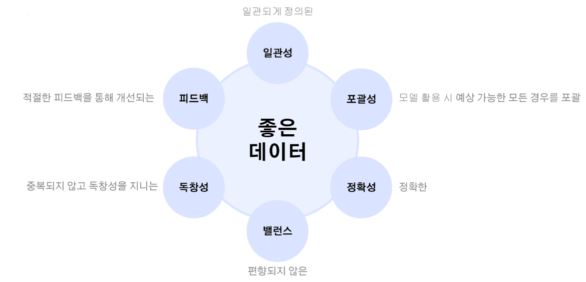

# 2024년 12월 6일(금) 수업 내용 정리 - 데이터 품질 평가

## 데이터 품질 평가의 필요성, 데이터 품질의 주요 평가 기준 및 Wrap Up

- 데이터 품질 평가의 필요성

  - 좋은 AI에는 좋은 데이터가 필요하다

- 데이터 품질의 주요 평가 기준

  - 좋은 데이터의 품질 기준

- 총 복습

### 01 데이터 품질 평가의 필요성

- 학습 목표

  - 데이터 품질 평가의 필요성을 이해한다
  - 데이터 중심 AI에서 데이터 품질 관리를 왜 우선 시 해야 하는 지 체감할 수 있다

#### 좋은 AI에는 좋은 데이터가 필요하다

- 앤드류 응(Andrew Ng) 스탠포드 대학교 겸임교수는 **"좋은 데이터를 수집하고 가공하는 것이 인공지능을 만드는 과정의 80%를 차지하는데, 이는 데이터가 인공지능의 핵심적인 부분임을 의미한다"** 라고 말함

  

- 인공지능 개발자들이 코드 수정을 통한 모델 하이퍼파라미터 변경에 매몰되지 않고 좋은 데이터를 확보하고 유지하려는 노력을 해야 함
- 다량의 데이터를 실시간으로 원활하게 확보하는 것은 인공지능 모델 개발 뿐 아니라 기업의 의사결정에도 빼놓을 수 없는 필수적인 요소
- ASW와 MS Azure, 그리고 Snowflake 등 각종 데이터 플랫폼들은 클라우드 컴퓨팅을 통해 방대한 양의 데이터를 편리하게 실시간(real-time)으로 확보하는 것에 초점

- 단순히 학습 데이터의 양을 기하급수적으로 늘리기만 해서는 인공지능 모델의 성능 향상 혹은 더 나은 의사결정으로 연결시킬 수 없다. **데이터의 양만큼이나 중요한 것이 데이터의 품질**
- **'Garbage in, garbage out(쓰레기가 들어가면 쓰레기가 나온다)'라는 말처럼 질 낮은 데이터는 아무리 양이 많아도 좋은 결과를 낼 수 없음**

### 02 데이터 품질의 주요 평가 기준

- 학습 목표

  - 데이터 품질의 주요 평가 기준을 학습자가 이해한다
  - 데이터의 문제점을 진단하고 해결 방안을 모색할 수 있다

#### 좋은 데이터의 품질 기준

(1) 일관성(Cosistency)

- 데이터의 표현 방식, 단위, 형식 등이 통일되어 있어야 함
- 예시

  - 숫자 표현 : 100,000 또는 십만 등 표현 방식이 섞여 있으면 분석 어려움
  - 날짜 형식 : YYYY-MM-DD와 MM/DD/YYYY 형식 혼합 시 데이터 정리 필요
  - 제품 가격 : 하나의 통화 단위(예 : KRW, USD)로 통일

(2) 포괄성(Coverage)

- 인공지능 모델이 예측하지 못하는 영역을 줄이기 위해 다양한 데이터를 포함해야 함
- 포괄적인 데이터는 모델의 성능 유지와 일반화(generalization)를 가능하게 함
- 모델이 특정 조건에서만 잘 작동하는 현상을 방지하며, 현실 세계와 더 가까운 예측 결과를 제공
- 예시

  - 음성인식 데이터셋 : 신조어, 유행어, 지역 방언 등을 추가하여 최신 언어 반영
  - 자율주행차 데이터 : 다양한 날씨, 도로 조건, 교통 상황 데이터를 포함하여 예측 오류 최소화

(3) 피드백(Feedback)

- 데이터는 지속적인 모니터링과 피드백을 통해 개선되어야 함
- 기존 데이터셋을 분석 결과와 비교하고, 부족한 부분을 보완
- **피드백 루프**는 모델이 편향되지 않고 강력해질 수 있는 핵심 메커니즘
- 예시

  - 추천 시스템 : 사용자의 클릭/미클릭 데이터를 피드백하여 추천 알고리즘 개선
  - 의료 데이터 : 새롭게 발견된 질병 사례 데이터를 추가하여 모델 업데이트

  

(4) 독창성(Uniqueness)

- 데이터는 중복되지 않고 고유해야 하며, 불필요한 중복 데이터는 제거해야 함
- 중복 데이터는 분석 효율성을 낮추고 모델 성능을 왜곡시킬 수 있음
- 예시

  - 고객 데이터 : 동일 고객의 정보가 여러 데이터베이스에 중복되어 있다면 정리 필요
  - 제품 리뷰 데이터 : 동일 리뷰가 여러 번 수집되었을 경우 하나만 남기고 제거

(5) 밸런스(Balance)

- 데이터가 특정 그룹이나 범주에 편향되지 않아야 함
- 학습 데이터가 편향되면 모델이 전체를 잘 반영하지 못하고 특정 그룹에 치우친 결과를 낼 수 있음
- 예시

  - 얼굴 인식 데이터 : 특정 인종이나 성별에 치우치지 않고 다양한 인구 집단을 포함해야 함
  - 금융 데이터 : 부유한 고객과 중저소득 고객 데이터를 균형 있게 포함하여 편향 제거

(6) 정확성(Accuracy)

- 데이터가 현실을 얼마나 정확하게 반영하는지
- 데이터의 오탈자, 잘못된 값 등은 분석 결과를 왜곡할 수 있음
- 예시

  - 주소 데이터 : 실제 주소와 일치하지 않는 고객 데이터는 배송 오류를 유발
  - 금융 데이터 : 거래 금액이 정확하지 않으면 부정확한 예측 결과 도출

### SUMMARY

1. 데이터 품질 평가의 필요성

    - 좋은 AI에는 좋은 데이터가 필요

2. 데이터 품질의 주요 평가 기준

    - 좋은 데이터의 품질 기준
    - 일관성, 포괄성, 피드백, 독창성, 밸런스, 정확성

