# 2024년 12월 23일(월) 수업 내용 정리 - Introduction to LLM and setup

## LM 부터 LLM 까지의 발달 과정

- 언어모델(LM)이란?

- LLM의 개념 및 발달 과정

### 1. 언어모델(LM)이란?

#### 컴퓨터가 이해하는 텍스트

- 자연어(Natural Language)란?

  - 사람이 읽고 이해하며 일상적으로 쓰는 언어
  - 이를 컴퓨터가 이해할 수 있도록 '임베딩/인코딩'하는 작업을 거쳐야 함

    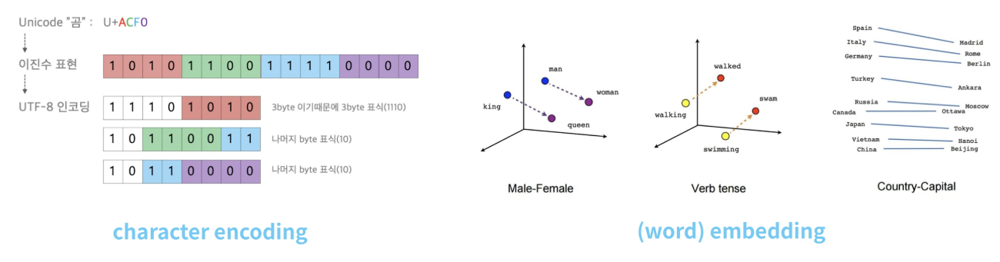

#### 텍스트를 좋은 숫자로 표현하는 것

- 언어모델이란?

  - 자연어, 텍스트 데이터를 컴퓨터가 이해할 수 있는 좋은 숫자로 표현하는 것

    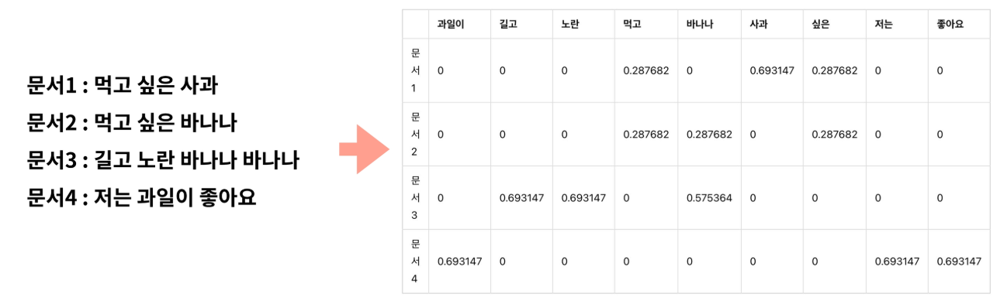

### 2. LLM의 개념 및 발달과정

#### SLM : Statistical Language Model

- Markov assumption을 가정하여, 이전 단어의 등장 확률이 이후 단어의 등장 확률을 결정한다는 방법론

- N-gram 모델이 대표적

- 단어의 길이가 길어지면, 확률 계산이 복잡해지며 모델의 capacity가 작음

  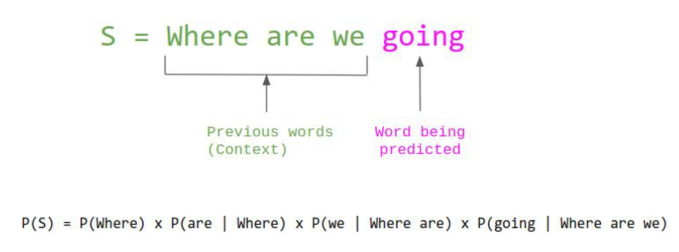

#### NNLM : Neural Network-based Language Model

  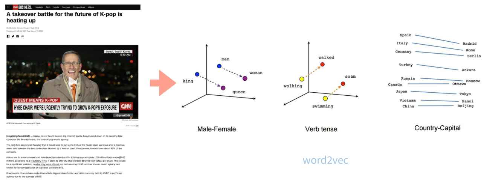

  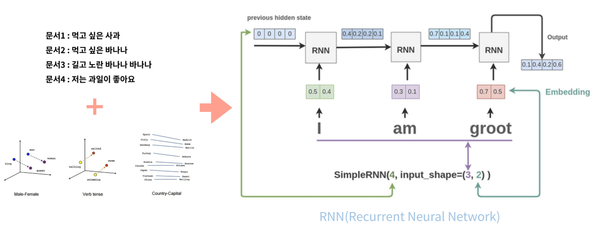

#### PLM : Pretrained Language Model

  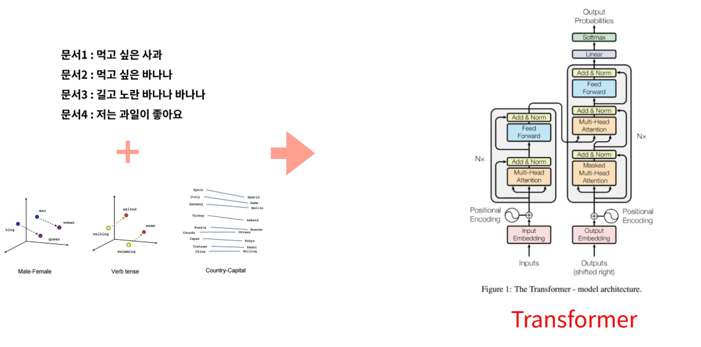

  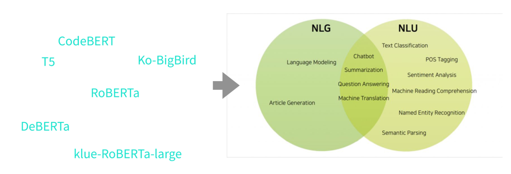

#### PLM : BERT

  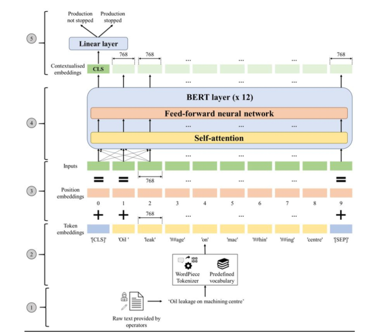

  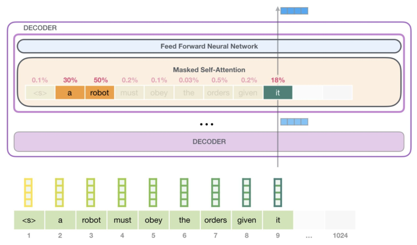

#### BERT vs GPT

- GPT-3가 등장하기 이전까진, BERT를 확장만 여러 encoder 기반 모델들이 PLM의 형태로 사용됨

- GPT-3가 2020년 중순에 발표되고, Hyper-Scale AI의 시대가 탄생함. 이때 175B이나 되는 큰 사이즈의 모델을 사용하면 다양한 작업을 하나의 모델로 처리할 수 있음을 보임

- NLP의 여러 downstream task가 모두 next token prediction 문제로 정의가 가능하다는 것이 입증되었지만, 성능이 애매했음

- 2021년 Google의 FLAN의 등장 이후 Instruction Tuning이라는 기법과 함께 텍스트 생성 결과가 여러 downstream task 성능에 직접적인 영향을 줌

- InstructGPT, Chinchilla 등의 논문들과 함께 여러 LLM의 모델들의 성능을 올리기 위한 효과적인 방법론들이 제시되기 시작

- 22년 말 ChatGPT의 등장으로 텍스트 생성으로 많은 작업들을 대체할 수 있는 실효성 있는 서비스가 등장하며 시장을 개혁

- **GPT WINs!**

#### Scaling Law

  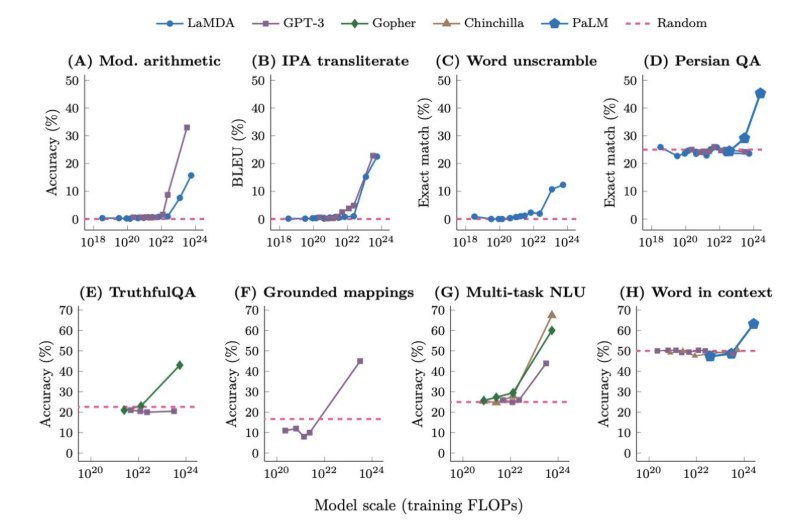

#### 모든 문제를 LLM으로 해결해보자!

  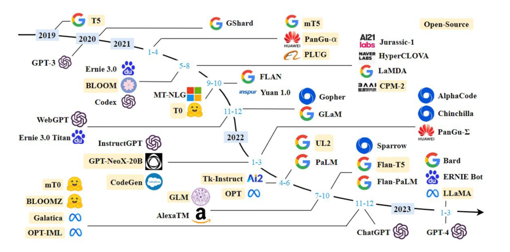

#### 모든 task를 Next Token Prediction으로!

  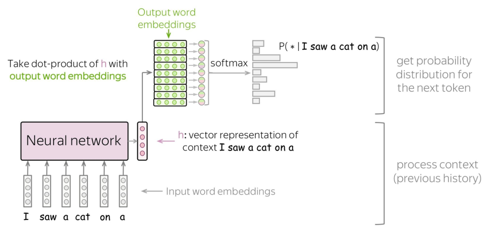

#### Neural Language Modeling in Auto-Regressive manner

  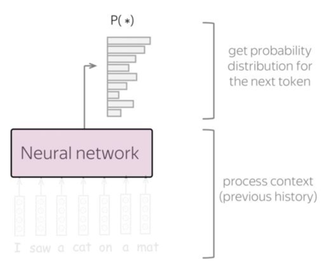

