# 2024년 12월 23일(월) 수업 내용 정리 - Introduction to LLM and setup

## LLM의 구성요소와 Transformer

- Transformer in Detail

- LLM 제작 프로세스

- LLM의 구성요소 및 한계점

### 1. Transformer in Detail

#### NNLM to PLM

- RNNLM으로 Machine Traslation과 같은 여러 task를 수행하기엔 성능이 부족했음

- RNN 자체 모델의 한계 때문에, 긴 텍스트에서 성능이 떨어지고 많은 텍스트를 학습하기 힘듦

- 이를 보완하기 위해 RNN 2개를 연결하여 Encoder-Decoder 구조를 제안하고 attention 연산을 추가하여 성능을 향상시킨 기법이 등장함

#### RNN-based LM : Seq2Seq

  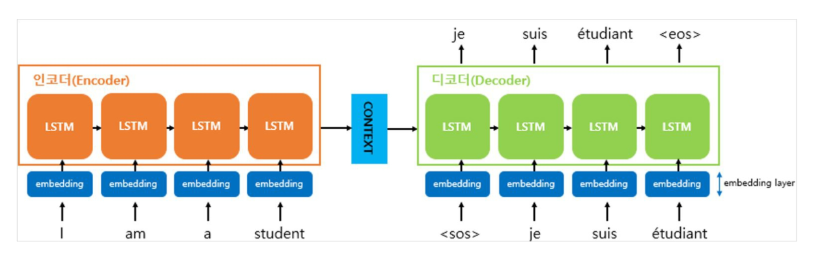

#### Attention

  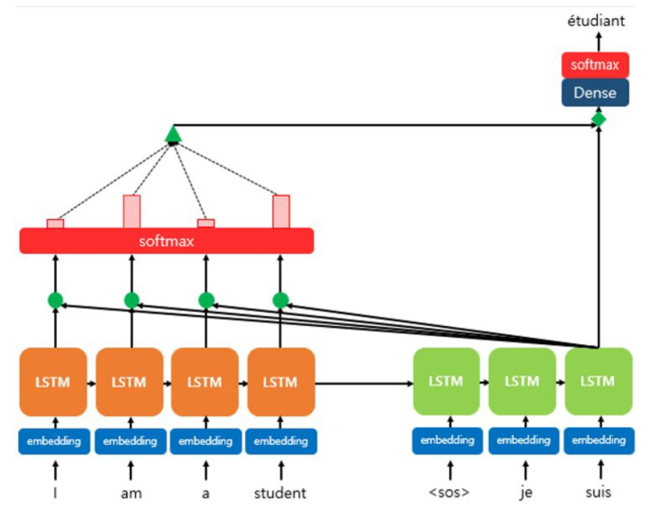

#### Transformer : Attention is All you Need

- RNN을 아예 없애고, Attention으로 모든 연산을 구현한 최초의 모델

  - **paradigm shift**

- Attention 구조가 sequential 정보를 반영 못하는 점을 positional encoding으로 해결함

- 기존 RNNLM처럼 Encoder-Decoder Attention 뿐만 아니라 Encoder/Decoder내의 self-attention 연산도 추가함

  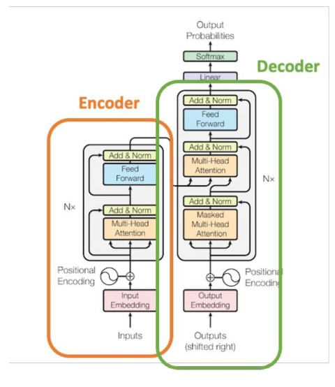

  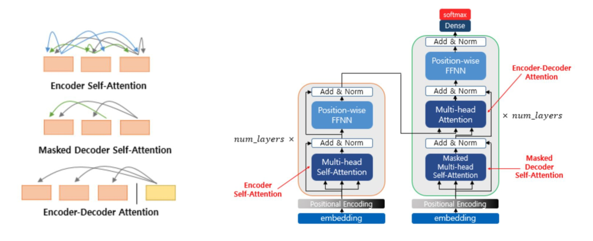

#### Transformer가 가져온 것

- Attention을 활용한 구조로 더 많은 데이터와 더 많은 파라미터를 사용할 수 있게 됨

- RNNLM은 병렬 연산을 사용할 파트가 적었는데, Transformer는 병렬 연산이 가능한 구조라 GPU를 충분히 활용할 수 있게 됨

  - **Scalability UP**

- RNNLM보다 더 긴 문장/문서에 대해서도 충분히 맥락을 학습할 수 있게 됨

- 이 모든 것을 더해져 BERT, GPT, Music Transformer, Vision Transformer가 나옴

  - 이 중 Transformer Decoder 구조가 모든 LLM의 근간이 됨

### 2. LLM 제작 프로세스

#### LLM의 재료

- Infra

  - Hyper Scale Cloud, Super Computing, Hyper Scale Data Center

  - 운영 환경(하드웨어)

  - AI + 클라우드를 중심으로 비즈니스 패러다임이 이동할 것

- Backbone Model

  - ChatGPT의 여러 모델들도 결국 GPT 3.5, GPT 4, GPT-o1 기반

  - Perplexity.ai의 Sonar 405B도 Llama 3.1 405B 기반

  - Pretrained LLM의 기반 모델로 중요해짐

- Tuning(비용 효율적인 백본 튜닝 기술)

  - 어떻게 경량화 할 것인가?

  - 반도체 기술(행렬 연산 최적화)

- Data(고품질 & 다량의 학습 데이터)

  - Prompt, Instruction

- Human Preference(유저가 좋아하는 것)

  - 유저가 좋아하는 답변을 어떻게 정의할 것인가?

  - 플랫폼 + 활성화된 유저를 어떻게 모을 것인가?

  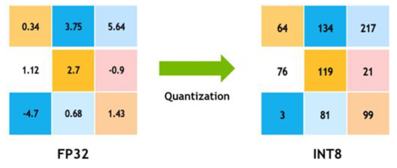

#### LLM을 만들기 위해 알아야 하는 것들

- Dataset

  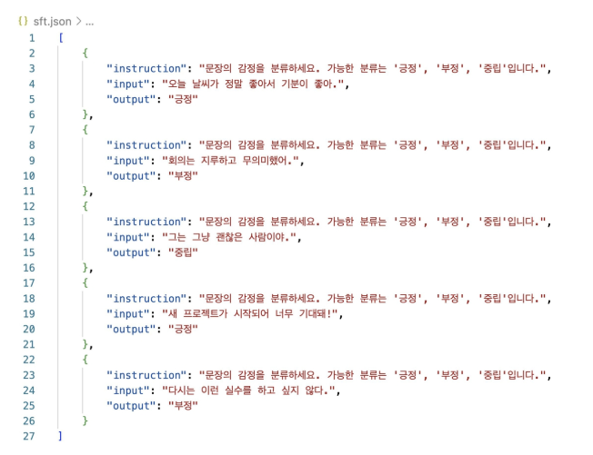

  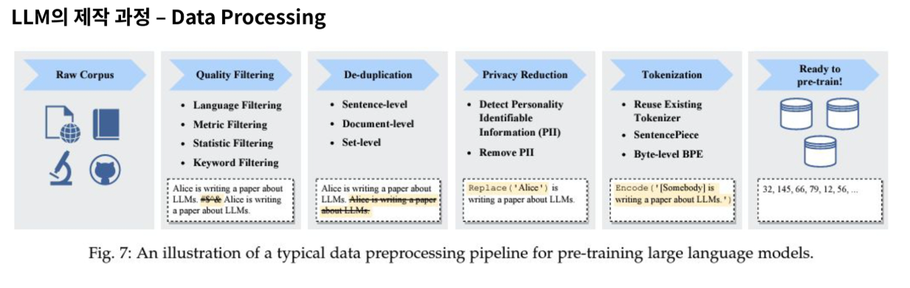

- LLM architecture

  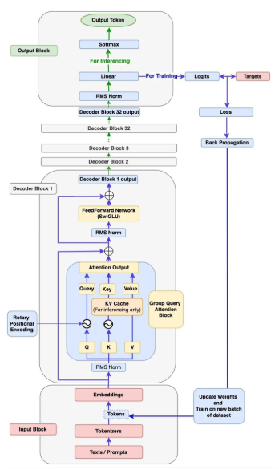

- Pre-training

  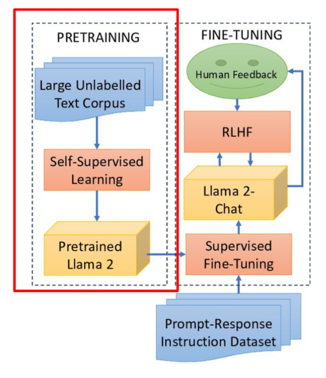

  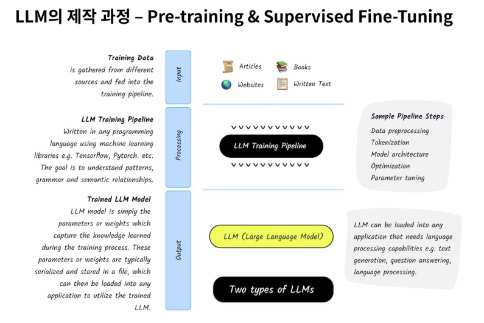

- Post-training

  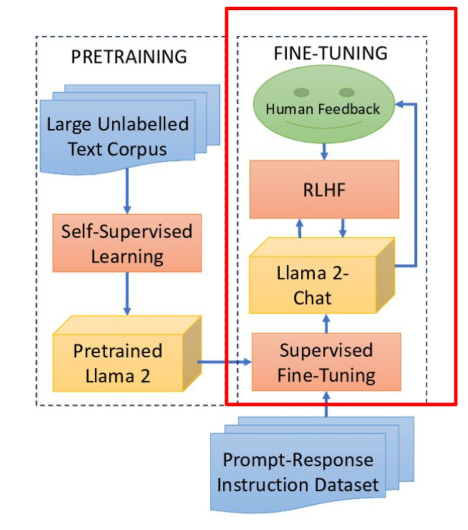

  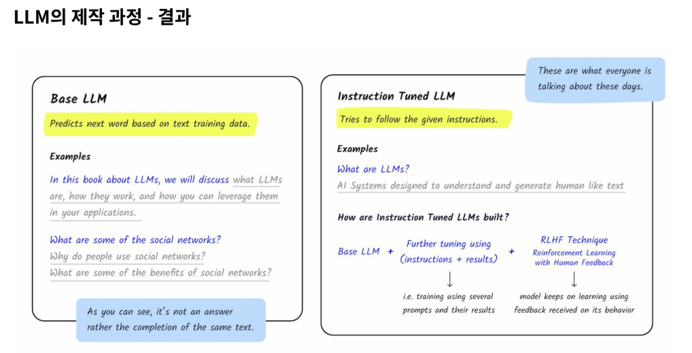

- Evaluation

  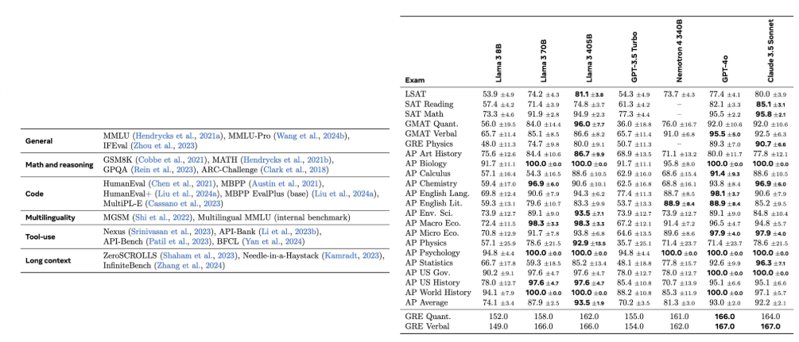

### 3. LLM 구성요소 및 한계점

#### LLM 구성요소

- User Input

  - LLM에게 보낼 질문 또는 입력

- Prompt
  - AI 모델에게 Input 질문과 함께 제공하는 "**지시사항(intruction)**"

  - 혹은 답변 생성을 위해 도움을 주는 예제들

- Output

  - LLM이 생성해내는 "**답변**"

  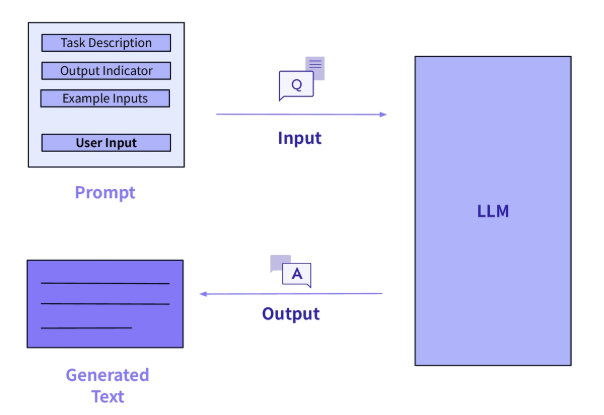

#### LLM의 한계

- Hallucination

  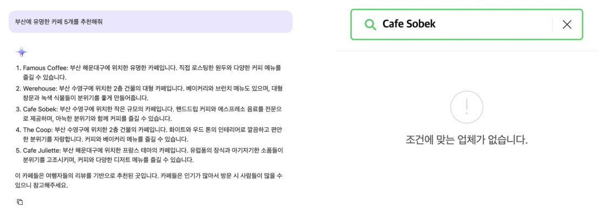

  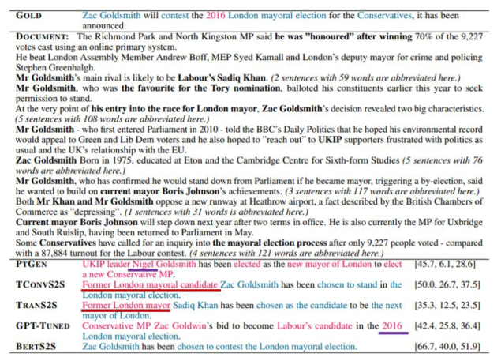

  - Hallucination : 모델이 사실과 무관하거나 존재하지 않는 정보를 생성하거나, 확인할 수 없는 정보를 생성하는 현상

  - Intrinsic Hallucination

    - Source에 있는 정보들을 사용해서 합성된 잘못된 정보가 결과로 나온 경우

  - Extrinsic Hallucination

    - Source에서 찾을 수 없는 정보가 등장한 경우 **Hallucination은 대부분 생성모델에서 발생**

- Knowledge Cutoff

  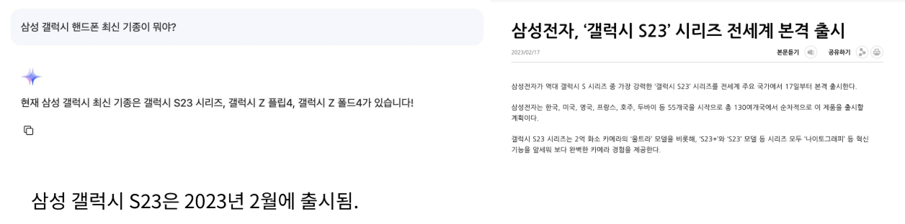

#### 기존 한계점을 해결하는 기술, RAG

- RAG(Retrieval-Augmented Generation) : 검색 엔진과 LLM을 결합한 것

  - RAG를 쓰면, Hallucination과 Knowledge Cutoff 문제를 모두 완화할 수 있음!

    