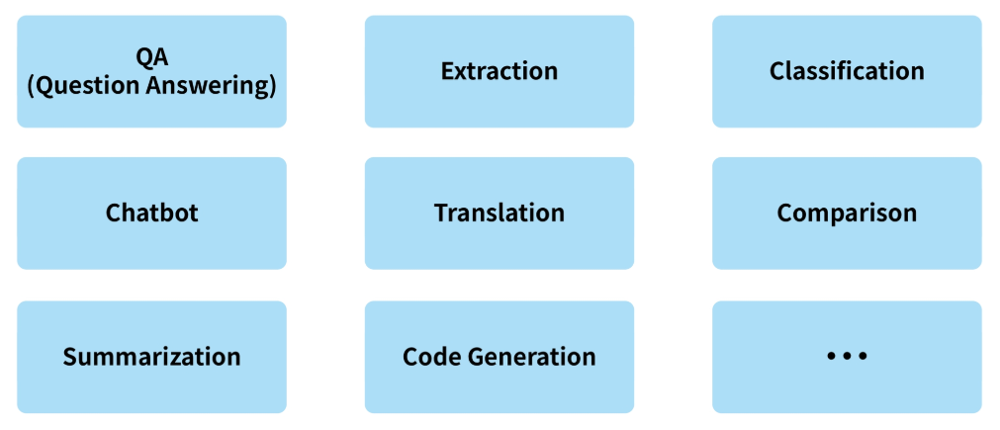
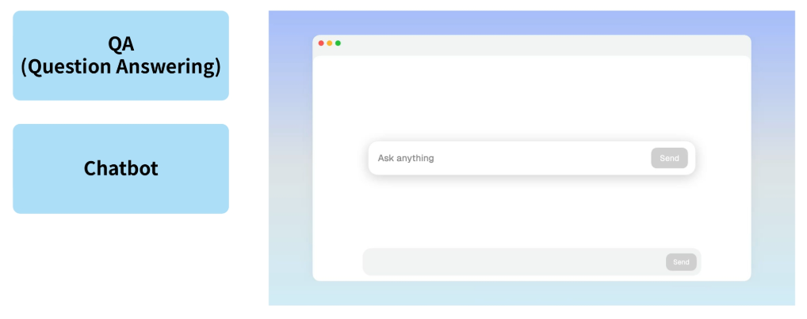
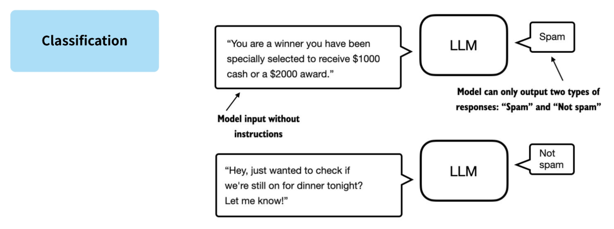
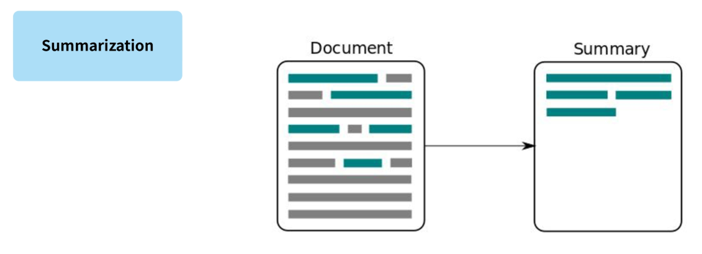
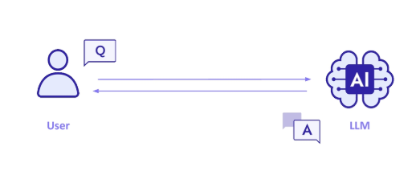
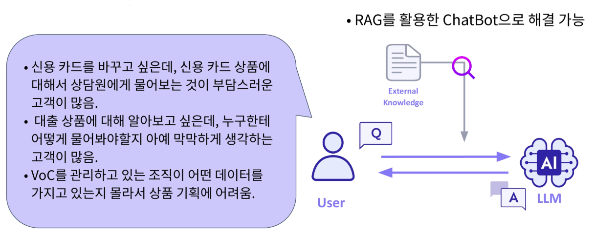
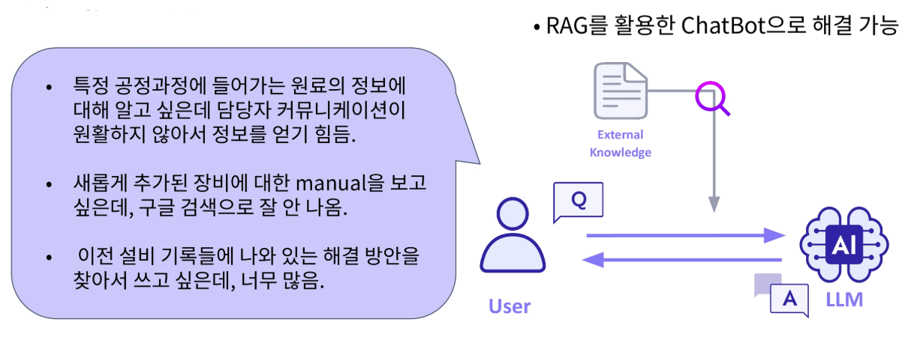
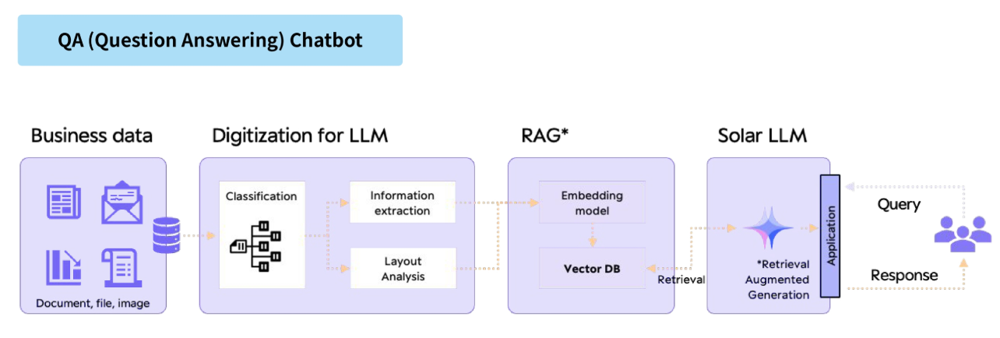

# 2024년 12월 23일(월) 수업 내용 정리 - Introduction to LLM and setup

## LLM의 구성요소와 Transformer

- LLM Use Case Study

- Prompt Engineering

### 1. LLM Use Case Study

#### LLM 서비스의 가치

- LLM 서비스의 가치

  - 기존 오픈소스 API를 가져다가 쓰기만 한다면 새로운 서비스로서의 가치를 창출하기 어려움.

  1. 서비스의 관점에서 사용자가 느끼기에 편리한 UX를 제공

  2. 서비스의 **품질을 개선**

  > 이 중 서비스의 '품질을 개선'하기 위해서는 LLM의 한계점들을 극복해나가는 것이 중요함

- (Recap.) LLM의 한계

  - Hallucination : LLM이 거짓된 정보를 생성하는 현상

  - Knowledge Cutoff : LLM이 최신 정보를 반영하여 답변을 생성하지 못하는 현상

#### 다양한 LLM Task

  

  

  

  

#### 산업에서 적용되는 LLM 기반 서비스

- (Most Common) 도메인 특화 QA ChatBot 서비스

  

  - 현재까지의 질의응답 모델을 챗봇 형태로 수정

  - 담당자들끼지 소통을 할 때 생기는 딜레이나 전달 오류를 개선할 수 있음

  - LLM의 한계 중 하나인 Hallucination이 발생할 수 있으므로 정확한 지식 체계를 갖춰서 답변하는 게 중요함

  > RAG를 활용하여 외부 지식을 검색해서 넣어주는 기능이 필요함

- (예시) 금융 도메인

  

- (예시) 제조 도메인

  

- 결론

  - 그 외에도, 각 도메인마다 사용되는 모든 자연어 task들 즉, "**사람이 읽는 자연어에서 패턴이 있는 대량의 지적 행동**"을 대체할 수단이 됨

  - 큰 규모로 대체되면 상당한 기술적 효용성을 가져올 수 있음

  - 단, LLM의 한계를 극복하고 정확한 정보를 제공하는 것이 LLM 기반 서비스에서의 핵심

### 2. Prompt Engineering

