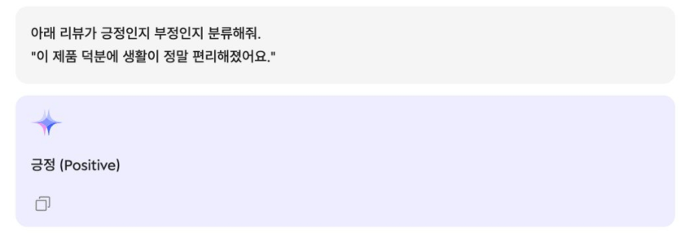
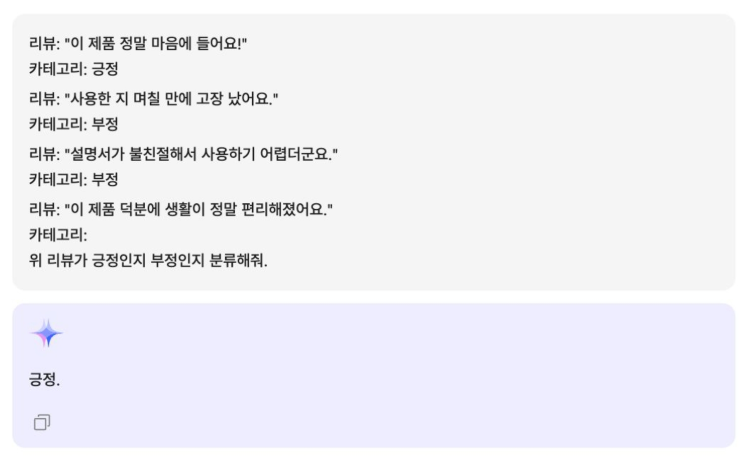
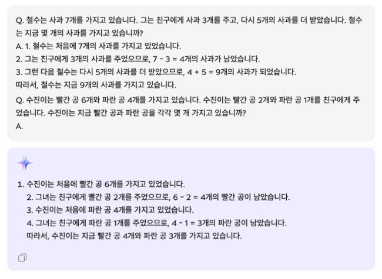
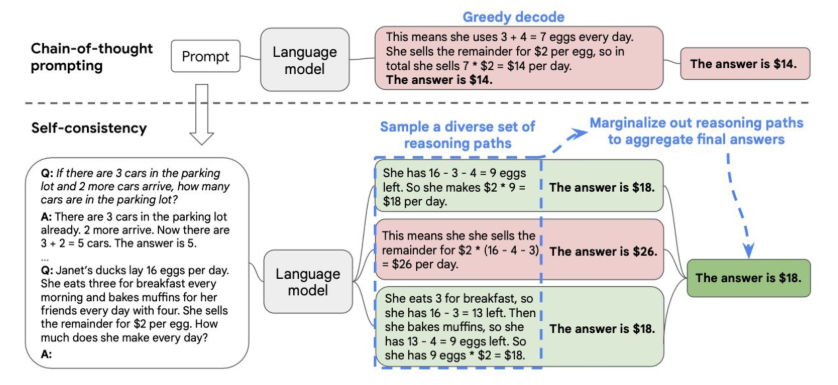

# 2024년 12월 23일(월) 수업 내용 정리 - Introduction to LLM and setup

## LLM의 구성요소와 Transformer

- LLM Use Case Study

- Prompt Engineering

### 1. LLM Use Case Study

#### LLM 서비스의 가치

- LLM 서비스의 가치

  - 기존 오픈소스 API를 가져다가 쓰기만 한다면 새로운 서비스로서의 가치를 창출하기 어려움.

  1. 서비스의 관점에서 사용자가 느끼기에 편리한 UX를 제공

  2. 서비스의 **품질을 개선**

  > 이 중 서비스의 '품질을 개선'하기 위해서는 LLM의 한계점들을 극복해나가는 것이 중요함

- (Recap.) LLM의 한계

  - Hallucination : LLM이 거짓된 정보를 생성하는 현상

  - Knowledge Cutoff : LLM이 최신 정보를 반영하여 답변을 생성하지 못하는 현상

#### 다양한 LLM Task

  

  

  

  

#### 산업에서 적용되는 LLM 기반 서비스

- (Most Common) 도메인 특화 QA ChatBot 서비스

  

  - 현재까지의 질의응답 모델을 챗봇 형태로 수정

  - 담당자들끼지 소통을 할 때 생기는 딜레이나 전달 오류를 개선할 수 있음

  - LLM의 한계 중 하나인 Hallucination이 발생할 수 있으므로 정확한 지식 체계를 갖춰서 답변하는 게 중요함

  > RAG를 활용하여 외부 지식을 검색해서 넣어주는 기능이 필요함

- (예시) 금융 도메인

  

- (예시) 제조 도메인

  

- 결론

  - 그 외에도, 각 도메인마다 사용되는 모든 자연어 task들 즉, "**사람이 읽는 자연어에서 패턴이 있는 대량의 지적 행동**"을 대체할 수단이 됨

  - 큰 규모로 대체되면 상당한 기술적 효용성을 가져올 수 있음

  - 단, LLM의 한계를 극복하고 정확한 정보를 제공하는 것이 LLM 기반 서비스에서의 핵심

### 2. Prompt Engineering

#### AI와 즐겁게 대화하는 법

- Prompt Engineering

  - Prompt란?

    - LLM으로부터 사용자가 원하는 결과를 도출하기 위한 Input

    - 쉽게 표현하자면 AI 모델에게 내리는 지시사항이나 대화 시작의 물꼬라고 할 수 있습니다.

  - Prompt Engineering

    - LLM이 생성하는 결과물의 품질을 높일 수 있는 **Prompt 입력값들의 최적의 조합**을 찾는 작업

    - 즉, 거대 언어 모델을 효율적으로 사용할 수 있도록 프롬프트를 개발하고 최적화하는 방법을 연구하는 분야

    - Prompt Engineering 기술은 LLM이 쿼리를 더 잘 이해하고 답변하도록 도와주는 역할

    - Prompt Engineering의 대전제 : **절대 LLM 기반 서비스를 어렵게 대하지 말 것**

    - 질문을 완벽하게 다듬어 제출하기보다는 빠르게 피드백을 받고 수정하는 방식이 더 효과적

    - 예시. "이런 답변은 못하겠지?" 또는 "어떻게 질문해야 할까?" 등을 고민하기보다는 일단 질문을 던지고, 피드백을 통해 보완하는 것이 좋음

    - LLM을 **똑똑하고 편리한 친구**처럼 생각하며, 부담 없이 대화하듯 활용

(1) Zero-shot Prompting

- 그냥 바로 물어보는 것. 예시가 없는 케이스를 말함

  

(2) Few-shot Prompting

- 예제 몇 개와 함께 물어보는 것

  

(3) Chain of Thought(CoT)

- 마치 사람의 뇌가 단계적으로 계산을 하는 과정처럼 여러 단계의 추론 과정을 LLM에게 학습시켜 LLM의 추론 능력을 향상시키는 기법

  

(4) Self-consistency Prompting

- CoT prompting을 발전시킨 방법으로, 여러 추론경로를 만들어서 일관된 답변을 채택하는 방식

  

(5) 다양한 이전 Prompt Design 방법론들

- 팁을 주면 더 잘한다
- 한글보다 영어로 질문하면 더 잘한다
- 확실한 보상을 제시하면 더 잘한다
- 확실한 명시와 가이드를 제시하면 더 확실하게 답변한다

- 하지만

  

- ChatGPT-o1, o1-pro가 unlimited로 공개된 이후 스스로 생각하여 답변하는 agentic한 움직임이 더 커졌다.

- 여전히 Prompt Engineering은 중요하지만, 개개인의 사용 스타일에 맞는 prompt를 직접 디자인하고 많이 써보는 "경험"이 제일 중요하다

- 이를 산업에 적용하기 위해선 어떤 pain-point를 해결할 수 있는 LLM 서비스를 비용 효율적으로 구축할 수 있는지에 대한 고민이 중요하다!

