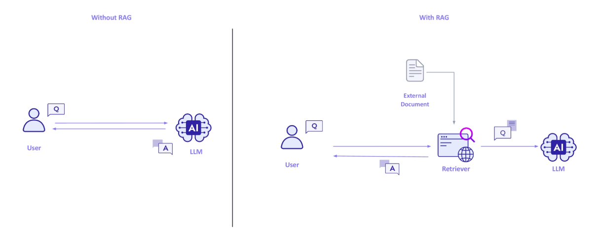
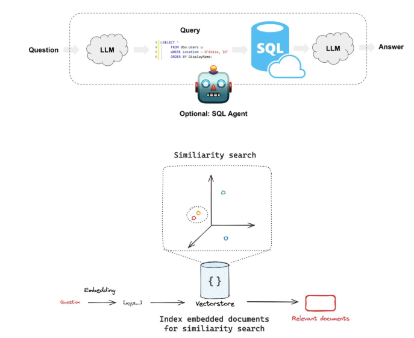
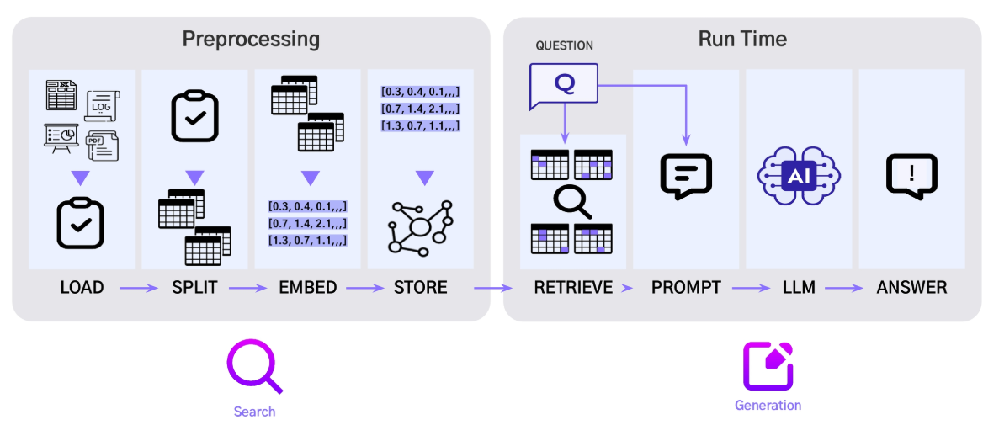
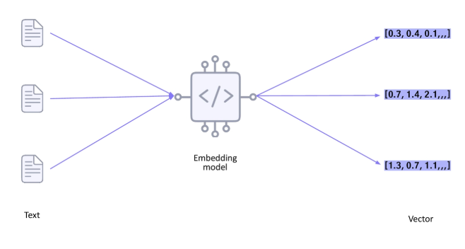
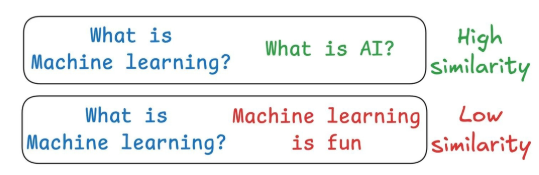

# 2024년 12월 24일(화) 수업 내용 정리 - Introduction to RAG

## RAG의 기본 개념 및 동작 원리

- RAG 정의 및 구성요소

- RAG Pipeline 소개

### 1. RAG 정의 및 구성요소

#### Retrieval Augmented Generation

#### Retrieval System + LLM

- 사용자의 질문(Question)에 대한 답변을 미리 저장해둔 정보들(Knowledge)에서 찾고(Retrieve) 찾은 내용을 합쳐서(Augmented) LLM으로 답변을 생성(Generate)하는 방법

- RAG의 성능 조건

  ① 목적에 맞는 질문(Question)을 잘 하고
  
  ② 외부 Knowledge를 잘 구축하고
  
  ③ 외부 Knowledge 중 Quesetion에 맞는 내용을 잘 검색하고(Retrieve)
  
  ④ 이를 바탕으로 LLM이 답변을 잘 생성(Generation) 해야 함
  

- LLM의 지속적인 발전으로 Question, Generation 보다 외부 Knowledge 구축과 Retrieve를 잘 하는 것이 RAG의 큰 challenge임

(1) Retrieval System

- Knowledge는 사용자의 질문에 대해 정확한 답변을 제공하기 위한 용도로 구축된다

- Knowledge를 구축할 때는 Database를 사용하며, 어떤 정보를 처리할 것이냐에 따라 RDBMS or Vector Store를 사용한다

- RDBMS는 테이블 데이터를 다루는 용도로 사용되며, Text2SQL을 거쳐서 사용된다

- Vector Store는 이미지/텍스트를 주로 다루는 용도로 사용되며, 이미지/텍스트를 embedding vector로 변환하여 저장하는 용도로 사용된다

- Knowledge Base(KB) : 검색을 위한 데이터 베이스 구축

  - Knowledge가 저장된 Database를 의미함
  - KB를 잘 구축하여야 Retrieval의 성능이 올라감
  - 즉, **검색이 될 자료**가 있어야 함

- Retrieval : 사용자 질문에 도움이 되는 정보를 찾는 검색기

  - 질문과 유사성이 높은 자료를 찾는 것이 중요함
  - 질문과 관련된 자료를 잘 검색하여 찾는다

    - 질문과 "유사도가 높은 자료" 중 top 순위를 Ranking하여 가지고 온다

- 구조화 될 수 있는 정형데이터(ex. tabular data)의 경우, LLM으로 SQL을 생성하여 RDBMS에 접근함

- 이미지/텍스트 같은 비정형 데이터의 경우, 질문을 벡터화한 후 Vector Store에 접근하여 유사도가 높은 문서를 top-K개 추출함

  

(2) LLM

- LLM이 RAG에서 답변을 잘 생성하기 위해선 LLM의 pre-training 성능이 중요하다

- 주로, 많은 token을 학습시킨 모델의 pre-training 성능이 높은 편이다(SOTA)

- 하지만, LLM은 knowledge-cutoff 문제가 있어, 항상 최신 데이터를 학습할 수 있다.(대부분의 주요 LLM들이 23년 12월에 cut-off 되어 있음)

- 이러한 한계점을 Knowledge Base에 최신 데이터를 추가하여 극복할 수 있음

### 2. RAG Pipeline 소개

#### RAG를 구축하는 순서

(1) Document Loading

- KB(Knowledge Base)에서 데이터를 가져오는 작업

- 파일의 종류에 따라 langchain_community.document_loaders에 존재하는 구현체가 나뉨

- e.g. PyPDFLoader, JsonOutputParserm Upstage Document Parse ...

(2) Text Splitting

- 가져온 텍스트를 chunk로 나누는 작업

- 어떤 단위로 나누냐에 따라 여러 구현체를 사용함

- e.g. RecursiveCharacterTextSplitter, SemanticChunker, ...

(3) Embedding

- 임베딩(Embedding)이란?

  - 가져온 텍스트 데이터를 컴퓨터가 이해할 수 있는 숫자(벡터)로 변환 즉, 벡터 공간에 이식하는 작업

    

- 이 작업을 거쳐야 질문 - 지식 간의 유사성 계산이 가능함

- embedding은 주로 pre-trained embedding model을 사용함

- e.g. OpenAIEmbeddings, HuggingFaceEmbeddings, Upstage Solar Embeddings, ...

(4) Vector Store(= Indexing)

- 저장한 embedding vector들을 빠르게 계산하기 위해서 Index를 만드는 작업

- Index를 만들어두면, 매번 검색할 때 전탐색을 수행할 필요가 없이 빠르게 필요한 영역만 탐색이 가능

- 어떤 Indexing 방식을 쓰느냐에 따라 다양한 구현체가 존재함

- e.g. Chroma, FAISS, Milvus, ...

(5) Retrieving

- 벡터스토어에서 사용자의 질문과 유사한 자료를 검색하는 과정

  > LLM이 응답을 생성할 때 필요한 정보를 제공

- Retriever 유형

  ① Sparse Retriever(키워드 검색)

  - 사용자의 질문을 키워드 벡터로 전환하여 **키워드 기반 검색**을 진행
  - 특정 도메인 지식(e.g. 의학, 법률) 등을 검색할 때 유의
    > 대표 알고리즘 : TF-IDF, BM25
  
  ② Dense Retriever(의미 검색)

  - 사용자의 질문과 관련 있는 embedding vector(자료)를 찾는 과정
  - 요청한 K개의 유사성이 높은 vector를 찾고 해당 vector의 원본 텍스트를 반환

    

  - Embedding Quality에 따라 성능이 큰 영향을 받음!

(6) Generating

- 추가로 찾은 텍스트와 원본 질문을 함께 미리 디자인해둔 System **Prompt의 형태로 LLM에 입력**으로 제공

- Retrieval된 문서가 많은 수록, 문서의 길이가 길수록 input prompt가 길어지기 때문에 생성되는 답변에 큰 영향을 줌

- 사용하는 LLM의 token length도 고려해야 함!