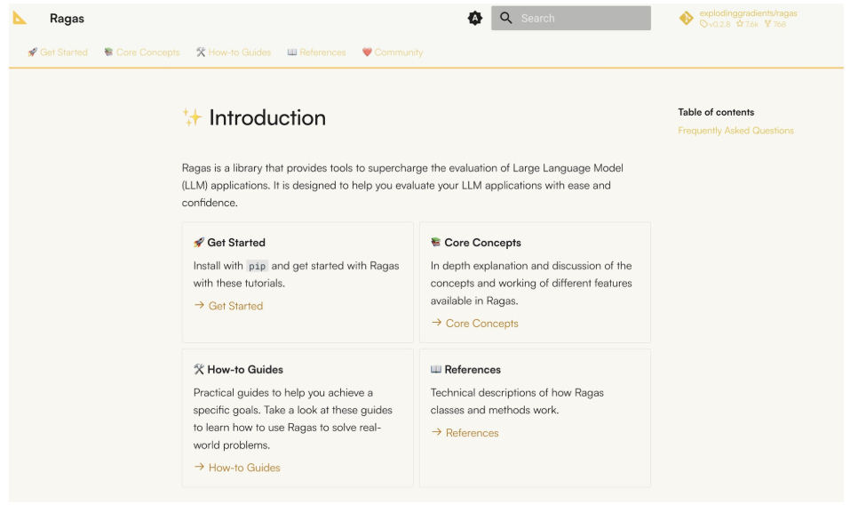

# 2024년 12월 24일(화) 수업 내용 정리 - Introduction to RAG

## RAG 평가 시스템

- RAG 평가 시스템

- Evaluation Open-source Tools

### 1. RAG 평가 시스템

#### Evaluation Metirc

- RAG를 사용해서 LLM이 생성한 답변이 실제로 얼마나 좋은 답변인지를 평가하는 것은 매우 어려움. 실제 사람이 작성한 텍스트의 품질을 평가하는 것도 쉽지 않음

- 주관적 해석이 많이 포함되고, 도메인에 따라 당연히 중요도가 달라지지만 대세를 결정하는 주요 지표들을 소개

- RAG를 잘 사용한 것과 LLM이 답변을 잘 생성ㅎ안 것은 조금 다름. "**얼마나 검색된 정보를 잘 사용했느냐**"를 판단하는 것이 RAG 평가 지표의 핵심임

- 기존 정보 검색에서 많이 사용하는 Ranking Metric들을 RAG의 특성에 맞게 변형하여 사용함

- 기존에 NLP에서 텍스트 생성을 평가하던, BLEU, ROUGE-N 등의 점수는 잘 사용하지 않음

  - 이유 : 기존 텍스트 생성 평가지표(BLEU, ROUGE) 등은 생성된 token이 같은지 다른지만 체크함

  - 하지만 이는 문맥적 의미나 문장 구조 등을 평가에 반영하지 못함

    

- RAG를 평가해야하기 때문에 Gounrd Truth(정답)의 영향을 많이 받을 수 밖에 없음

(1) Context Precision

- 수식의 의미는 검색한 문서 중에서 진짜로 관련된 문서가 차지하는 비율

  

(2) Context Recall

- 수식의 의미는 실제로 관련된 문서 중에 얼마나 많이 Retrieval에 성공했는지

  

(3) Faithfulness

- 수식의 의미는 생성된 답변이 가지고 있는 지식으로 얼마나 뒷받침되는지에 대한 비율

  

(4) Answer Relevancy

- 수식의 의미는 생성된 답변이 주어진 질문과 얼마나 관련성이 있는지에 대한 비율

  

### 2. Evaluation Open-source Tools

#### Evaluation Metric tool : Ragas

- Ragas는 LLM의 성능 평가를 쉽게 구현해줄 수 있는 오픈소스 라이브러리

- Langchain과 굉장히 쉽게 호환이 되며, 사용성이 편리하여 평가 지표 구현이 쉬움

  

- Ragas에는 RAG를 평가할 때 쓰이는 지표들 뿐만 아니라, AI Agent, Natural Language Compression, SQL 등을 평가하는 지표들도 제공

- 평가 시, Ground Truth를 제작하여 비교하는 것이 핵심

  > 즉, 평가를 잘하기 위해서는 동의가 된 Ground Truth들이 필요

- Ground Truth는 사람이 만드는게 정석이지만, 간접적인 여러 가지 추가 방법론들도 존재한다.(예시) LLM-as-a-Judge

#### Upstage Groundness Check

- 생성된 응답이 검색된 문서에 기반하고 있는지를 확인하는 과정으로 생성된 답변의 품질을 보장하기 위해 진행

- 작동 방식

  ① **컨텍스트와 응답 비교** : 생성된 답변을 검색된 문서나 주어진 컨텍스트와 비교합니다. 이 과정에서 출력이 참조 문서의 내용과 얼마나 일치하는지를 검토함
  
  ② **유효성 평가** : 주어진 응답이 문서에 명확하게 기반하고 있는지를 확인 및 결과 반환

