# 2024년 12월 26일(목) 수업 내용 정리 - Enhancing RAG System

## 벡터 데이터베이스 검색 정확도 향상 기법

- 데이터 최적화

- Vector DB 선택하기

- Retriever 최적화

### 1. 데이터 최적화

#### Data Chunking

- Chunking이란?

  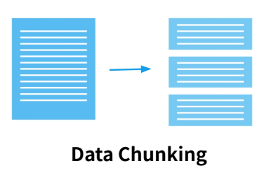

  - Embedding의 단위가 되는 텍스트를 정하는 작업

  - Retrieve 대상의 단위

  - 단순히 길이를 기준으로 자르는 경우

    - 의미가 담기는 단위 : 단어 / 구 / 절 / 문장 / 문단

    - 단순히 길이를 기준으로 자르는 것은 좋지 않음

  - Semantic Chunking : 의미가 비슷한 문장들을 묶을 수 있음

    - Langchain의 구현체는 Hierarchical Clustering을 사용

- Recursive Text Splitter

  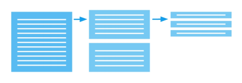

  - 가장 대표적으로 사용되는 Chunking 방법론 중 하나

  - 텍스트 분할 방식 : '\n\n' > '\n' > '' > '' 순서대로 token을 적용

    - 큰 단위부터 순서대로 텍스트들을 분할하여 주어진 chunk size를 넘지않게 함

  - 파라미터

    - chunk_size : 하나의 chunk 크기

    - chunk_overlap을 적용하여 어느정도 겹쳐서 나눔으로써 문장이 부자연스럽게 나뉠 가능성을 낮춤

  - 위 두 개의 값을 잘 조정해서 문맥을 잃지 않으면서 적당한 단위로 나누는 것이 목표

- Semantic Chunker

  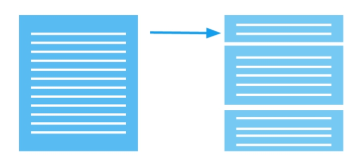

  - 문장을 의미 단위로 분할하는 방법론

  - 텍스트 청킹 방식 : 임베팅 모델을 활용하여 문장을 임베딩 한 후, 백분위수, 표준편차 등의 분할 기준점에 따라 의미가 유사한 문장들을 병합

#### Metadata

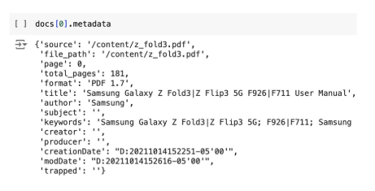

- 검색 대상의 external information을 추가하여 filtering이나 reranking에 활용

- Ex. 논문-키워드, 저자, 소속기관, 출판연도 등
- Ex. 뉴스기사-키워드, 작성자, 발행일시, 발행기관 등

  - 직접적인 데이터 정보로 연관성이 있는 정보 체크

#### Preprocessing

- 데이터 전처리

  - 원본 텍스트의 퀄리티가 Embedding 성능에 영향을 미침

  - 데이터 전처리 방법론

    - 데이터 노이즈 제거 : 의미없는 특수문자, 비문 등을 제거하는 것이 좋음

    - 텍스트 정제 : 오타, 띄어쓰기 수정

    - 표현 통합 : 같은 의미를 가지지만 다르게 표현된 표현들은 하나의 형태로 통합하면 성능 향상에 도움

    - 언어 통일 : multilingual corpus의 경우 번역기를 이용해서 하나의 언어로 통일하는 방법도 가능

#### Embedding Model

- Embedding Model : 오픈소스로 공개되어 있는 pretrained model을 사용

- Embedding Model 선택 시 기준

  ① 해당 임베딩 모델이 어떤 텍스트를 학습했는 지
  
  ② (특히 지원하는 언어의) 성능을 확인하는 것이 중요함
  
  ③ 일반적으로 임베딩 공간의 크기가 클수록 성능이 뛰어나며 대신에 inference 속도가 느림
  
  ④ 대부분 최신에 나온 임베딩 모델일수록 성능이 높은 편

- 대표적인 임베딩 및 플랫폼

  - OpenAIEmbeddings : 가장 많이 활용됨

  - HuggingfaceEmbeddings : 공개된 embedding model을 사용할 수 있는 플랫폼

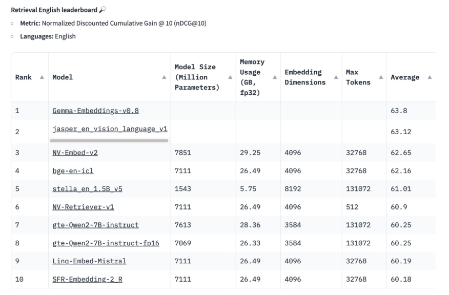

- Upstage Solar Embeddings

  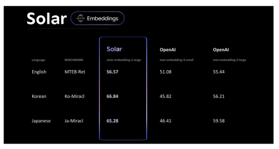

  - 긴 텍스트와 문맥 정보를 효과적으로 처리하며, 높은 검색 정확도를 제공

  - **우수한 다국어 성능** : OpenAI의 text-embedding-3-large를 능가하며 영어, 한국어, 일본어 등 다양한 언어에서 뛰어난 성능 발휘

  - **벤치마크 성과** : MTEB 및 MIRACL에서 우수한 성과를 기록, 특히 까다로운 작업에서도 높은 성능 보장

### 2. Vector DB 선택하기

#### Vector Store

- Vector DB 선택 시 고려사항

  - 각 Vector Store(= Vector Index) 마다 지원하는 방식과 구현 상의 차이가 있음

  - 각 방식마다 개발된 목적이 다르기 때문에 서비스 상황에 맞는 것을 골라서 사용해야 함

  - 특히, 벡터 데이터베이스마다 지원하는 검색 알고리즘이 다름

  - 대표적인 벡터 데이터베이스 : FAISS, ChromaDB, Milvus, Pinecone, Qdrant, Redis

- 로컬 vs 클라우드 데이터베이스

  - 로컬(Local)

    - 장점 : 데이터에 대한 완전하 제어권을 유지할 수 있고, 네트워크 의존성이 낮음

    - 단점 : 데이터 양이 많을수록 레이턴시 증가함

    - 예시. Chroma, FAISS

  - 클라우드(Cloud)

    - 장점 : 확장성이 우수하고, 대용량 데이터에서도 빠른 성능을 제공함

    - 단점 : 네트워크 의존성이 있음

    - 예시. Pinecone, Weaviate

- FAISS
  
  - 2019년 Meta에서 개발된 CPU/GPU를 지원하는 벡터 인덱싱 기법

  - 주요 component들이 C++로 구현되어 있으며, 가장 오랫동안 개발되어 다양한 기능 제공

  - 대규모 임베딩 벡터의 인덱싱용으로 개발되었으며, GPU-Acceleration을 지원하기 때문에 엄청나게 빠른 속도

  - 목적에 따라 IndexFlatL2, IndexIVFFlat, IndexHNSW, IndexPQ 등 다양한 인덱싱 기법 지원

- FAISS 인덱싱 비교

  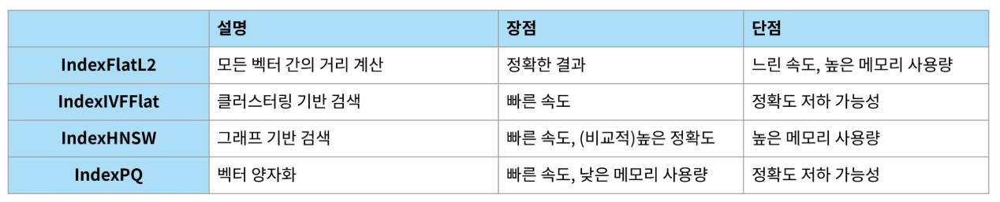

#### 여러 벡터 데이터베이스 비교하기

  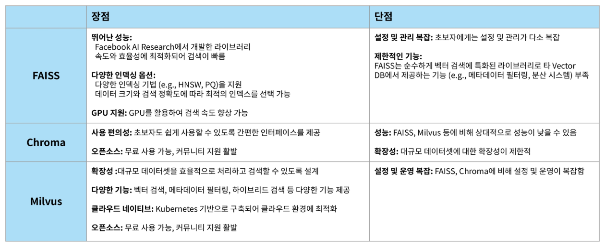

  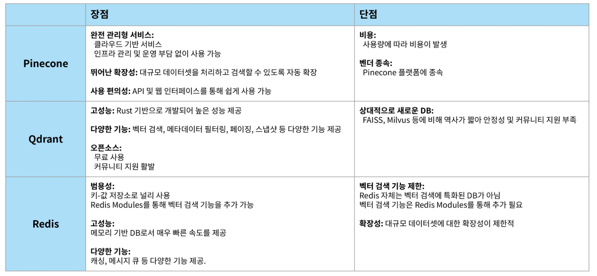

### 3. Retriever 최적화

#### Retriever

- Vector Store에 저장된 벡터들과 user question 사이의 연관성을 찾기 위해서 kNN 수행

- Retriever 방식에 따라 저장된 데이터를 기준으로 검색하는 방식 상이

- Retriever 유형

  - Sparse Retriever : 주로 키워드들 위주의 검색이 필요할 때 효율이 높음

    - 적용 사례 : 의료, 법률 등 특정 도메인 용어가 있을 때 용이함
    
    - (예시) TF-IDF, BM25

  - Dense Retriever : 임베딩 모델로 벡터화 후 유사도 검색

    - 문맥 위주의 검색이 필요할 때 사용, 주로 Sparse Retriever보다 성능이 높은 편

    - (예시) SentenceBERT

#### Sparse Retriever : TF-IDF

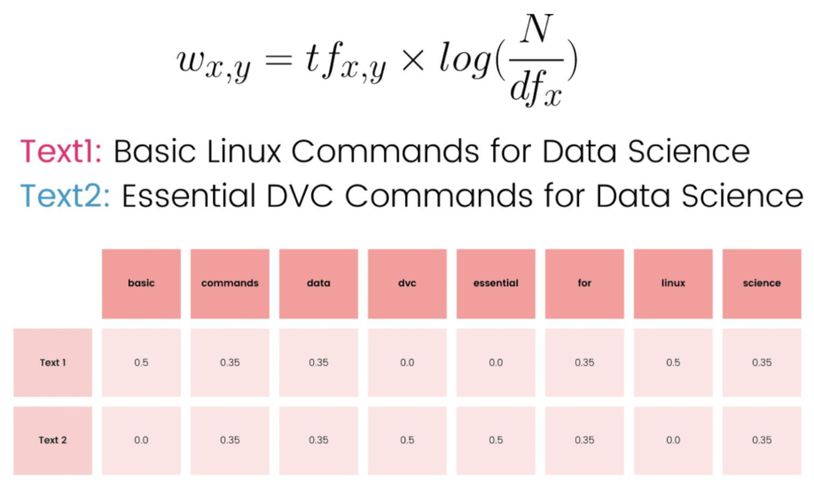

#### Dense Retriever : SentenceBERT

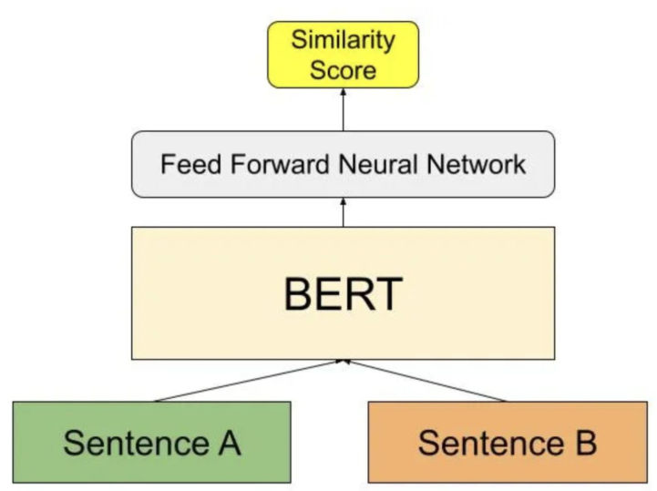

#### Retriever 특징 정리

- Sparse Retriever

  - 메모리 적게 사용하며 연산이 빠르지만, 문맥을 파악하기 힘들어 성능이 떨어질 수 있음

- Dense Retriever

  - 대부분 GPU를 필요로 하며 리소스가 더 많이 필요함

- 효율성을 극대화하기 위해서 두 방법의 장점을 합친 모델을 생각해볼 수 있음

#### Ensemble Retriever

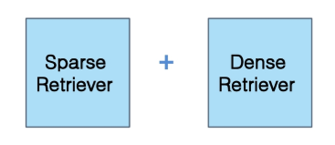

- Ensemble Retriever : Sparse Retriever와 Dense Retriever와 결과를 합치는 방식

- 단순하게 하자면, 각 Retriever마다 뽑은 K개의 문서들을 모두 RAG에 사용할 수 있음

- 일반적으로 Reranking 방식을 사용하여 각 Retriever들의 결과를 종합하여 사용

  - (예시) Reciprocal Rank Fusion(RRF)

#### Reranking

- 이전 검색 결과들을 질의에 적합하고 유용한 순서로 재정렬하는 방식

- 검색 결과와 metadata의 결합 등으로 기존에 정의 계산 방식으로 score를 계산

- Learning to Rank, Neural Reranking model 등을 사용하기도 함

- Ensemble Retriever를 사용할 경우, Sparse Retriever의 결과와 Dense Retriever의 결과를 RRF를 사용해서 재정렬

  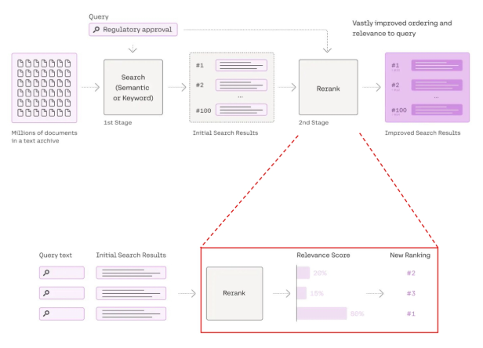

#### Reranking : Reciprocal Rank Fusion

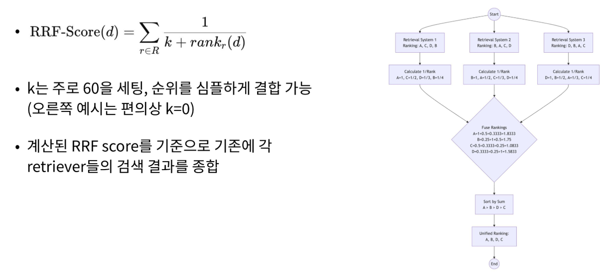

#### SUMMARY

- 데이터 최적화

  - 검색 정확도를 올리기 위해서는 Embedding Quality가 중요

  - 이를 위해서는 텍스트를 잘 정제하고 (Preprocessing), 잘 나눠서(Chunking)하고, 좋은 임베딩 모델을 사용해야 함

- 벡터 데이터베이스

  - 로컬 vs 클라우드 차이점을 이해하고, 각자 원하는 특징에 따라 올바른 벡터 데이터베이스 선택 필요

- Retriever

  - 성능 보완을 위해 Sparse, Dense의 장점을 결합한 Reranking 방식의 Ensemble Retriever를 사용할 수 있음

