# 2024년 12월 27일(금) 수업 내용 정리 - Recent Trends and Real-Time RAG 시스템

## 최근 RAG 트렌드 소개

- 최근 RAG 트렌드 소개

### 1. 최근 RAG 트렌드 소개

#### RAG Trend

- 2020년 NeurlPS에 처음으로 발표되었던 최초의 RAG가 제안됨

- 2020년 ChatGPT 등장 이후로 많은 LLM 서비스가 성능 향상을 위해서는 RAG를 도입하였으나 실서비스 도입을 위해선 더 발전된 방법들이 필요

- 기본 RAG(Naive RAG)가 서비스 상에서 가지는 한계들을 극복한 다양한 기법들인 Modular RAG, Advanced RAG 등으로 발전

- Naive RAG → Advanced RAG → Modular RAG 순으로 발전

#### Advanced RAG

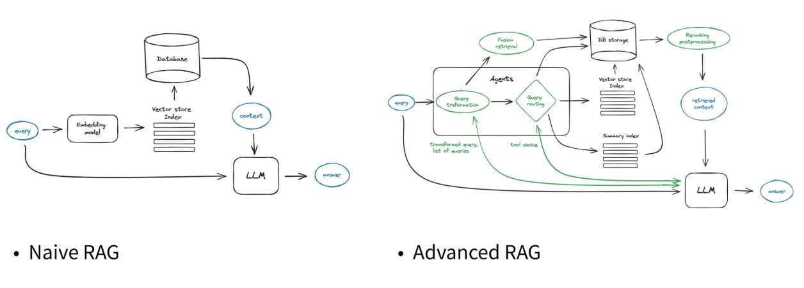

- Naive RAG의 여러 단점들을 보완하기 위해 OpenAI DevDay 2023에서 제안된 RAG 기법

- Naive RAG는 단순히 user query와 Knowledge 간의 유사성 비교로 정보를 검색 → 이 방식으로는 복잡한 여러 질문들을 처리하기엔 부족

- 이를 극복하기 위해서는 Advanced RAG에서는 user query를 발전시키는 방법, Knowledge Base에서 검색 성능을 올리는 방법을 중점적으로 기법을 발전

(1) Query transformation

(2) Query routing

(3) Fusion Retrieval

(4) Reranking

  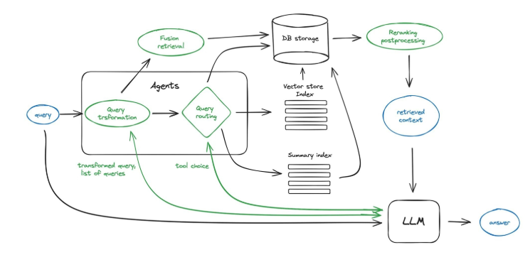

#### Advanced RAG : Query Transformation

- Query transformation 단계에선 LLM을 이용해서 user query를 조금 더 구체적인 방향으로 발전

- 절차 수정, 약어 & 동의어 통일, 불용어 제거, Re-paraphrasing을 LLM으로 수행

- 자체적인 System prompt로 이 과정을 수행을 하며 해당 과정에는 CoT prompting 등이 사용

- 그 외에도 CoT를 더 잘 할 수 있게 원본 Query를 더 자세한 여러 단계로 나누는 방식, HyDE(Hypothetical Document Embedding) 같은 가상의 이상적인 답변을 생성하여 쿼리를 발전시키는 방식 등이 있음

  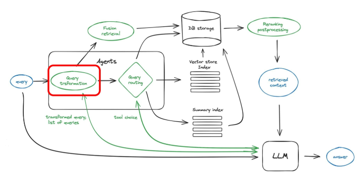

#### Advanced RAG : Query Routing

- Query Routing에선 지금 들어온(또는 만들어진) 쿼리를 어떤 index로 보낼지를 선택하는 기법

- 입력된 Query의 성격으 ㄹ보고 Knowledge 전체가 저장되어있는 Vector Store에서 질의를 처리할 수도 있고, 데이터가 요약되어 있는 Summary Index에서 질의를 처리할 수 있음

- 그 외에 쿼리의 타입에 따라 외부 서비스 API를(e.g. Wolfram Alpha API, Google Maps API 등) 사용할 수 있음

  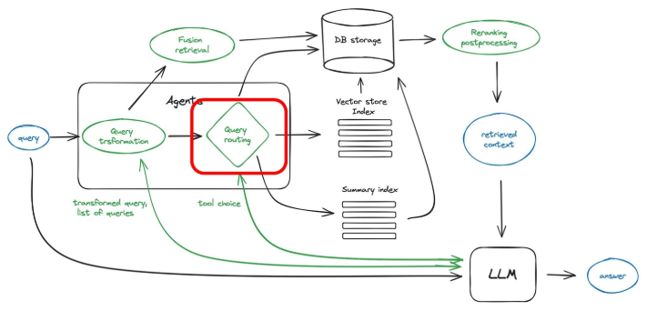

#### Advanced RAG : Fusion Retrieval

- Fusion Retrieval에서는 검색 성능 향상을 위해서 앞에서 배웠던 Sparse Retirever + Dense Retriever를 합쳐서 쓰는 전략을 사용

- Reciprocal Rank Fusion(RRF)를 사용하는 Ensemble Retriever를 통해서 구현 가능

  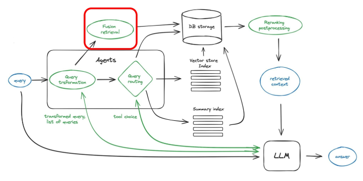

#### Advanced RAG : Reranking

- Fusion Retrieval로 나온 결과를 질의 의도에 맞게 재정렬하는 단계

- Reranking용으로 tuning된 다른 LLM을 사용할 수도 있음
  
  - e.g. Cohere, bge-reranker 등

- LLM을 사용해서 원본 질의를 다시 제공하고, reranking을 수행하기도 함

- safety check를 포함하여 질의 결과로 나온 것들 중 user query의 의도와 상관없거나 서비스 레벨에서 나오면 안되는 결과들을 filtering 하는 과정도 포함

  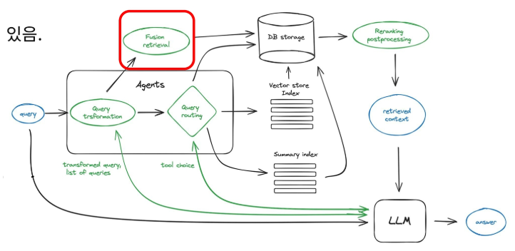

#### Modular RAG

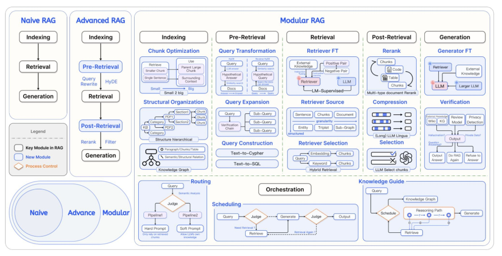

- 기존 Advanced RAG로 성능은 향상되었지만, RAG를 서비스에 적용해서 사용하기엔 여러 가지 한계가 존재

- embedding model을 바꾸면, 기존 RAG pipeline에선 모든 과정에서의 업데이트가 필요

- Modular RAG는 각 시스템의 구성요소들은 LEOG 블록처럼 필요에 따라 변경 가능하게 설계하여 시스템의 다양한 요구사항을 유연하게 관리할 수 있음

- 특히나 RAG 분야에서 계속해서 새롭게 추가되는 여러 연구들이나 구현체들을 쉽게 업데이트해서 시도해볼 수 있는 장점이 큼!

- Indexing

- Pre-Retrieval

- Retrieval

- Post-Retrieval

- Generation

- Orchestration

#### Modular RAG : Indexing Module

- Chunk Optimization

  - Chunk size, Chunk overlap에 따라 만들어지는 작은 chunk를 생성

  - chunk에 페이지 번호, 파일명, 저자 등 metadata 정보를 추가

  - small chunk에 해당하는 데이터의 문맥 정보를 활용하기 위해 bigger size chunk를 생성하는 small 2 big 전략을 사용

- Structure hierarchical

  - 전체 문서 구조에 대한 정보를 계층 정보로 저장

  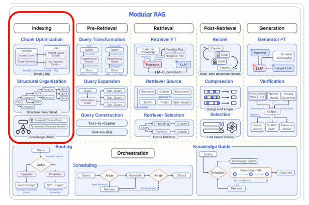

#### Modular RAG : Pre-Retrieval

- Query Transformation

  - HyDE를 사용해서 이상적인 답변 문서를 생성하여 답변가 유사한 문서 필터링

  - Reverse-HyDE로 문서에서 생성할 법한 query를 생성하여 query와 비교

- Query Expansion

  - Query에 해당하는 정보들을 하위 Sub-Query로 나눔

- Query Construction

  - 테이블 데이터 활용을 위한 Text2SQL 수행

  

#### Modular RAG : Retrieval

- Retriever Fine-Tuning

  - Contrastive Learning 방식으로 임베딩 모듈을 학습

- Retriever Selection

  - Sparse Retriever, Dense Retriever 중에 어떤 retriever가 좋을지 선택

  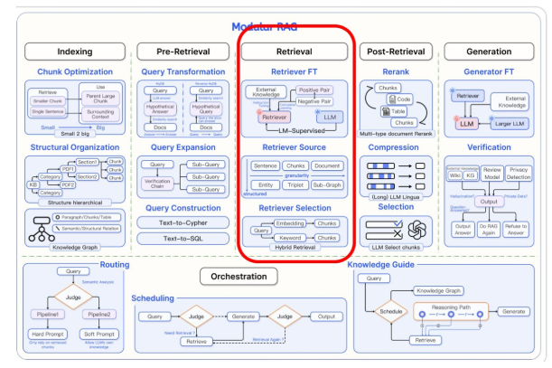

#### Modular RAG : Post-Retrieval

- Rerank

  - Retrieval 결과를 그대로 사용하는게 아니라 여러 소스들과 함께 더 좋은 결과를 재정렬하여 사용

- Compression

  - 대규모 RAG에서는 모든 원문을 그대로 Generation에 사용하면 불필요한 정보가 많이 포함되므로 SLM으로 중요한 정보만 추출하는 LLM Lingua 작업을 수행

- Selection

  - 쓸모없다고 판단되는 chunk나 safety에 적합하지 않은 텍스트 제거

  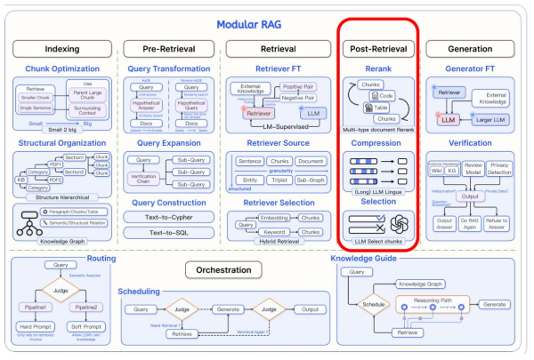

#### Modular RAG : Generation

- Generator Fine-Tuning

  - 성능이 좋은 LLM을 평가 모델로 사용하여 Reinforcement Learning, Instruction Tuning을 수행

- Verification

  - 생성 결과가 맞는지 구축해둔 Knowledge Graph나 Wikipedia source 등을 통해서 확인

  - 평가를 위한 SLM을 구축해두고 해당 모델을 통해서 판별

  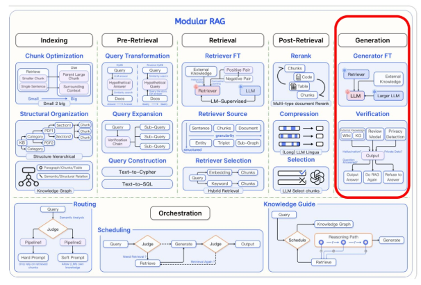

#### Modular RAG : Orchestration

- Routing

  - Query를 보고 query의 의도를 찾아서, 맞는 RAG workflow를 실행

  - 예를 들어, 의학 관련된 질문이 들어왔다고 하면 의학 관련 지식이 담긴 DB와 해당 지식이 사전학습된 LLM을 RAG에 사용

- Scheduling

  - 현재 RAG의 workflow 상에서 생성되고 있는 답변들이 잘 나오고 있는지 체크하여 재검색이 필요한지 체크

- Knowledge Guide

  - 구축해둔 Knowledge Graph를 이용해서 현재 생성되고 있는 답변의 scheduling을 판단

  - KG는 Reasoning Path를 알 수 있으므로 Reasoning Path를 통해 현재 Retrieve 단계의 생성 결과가 올바른지 확인 가능

  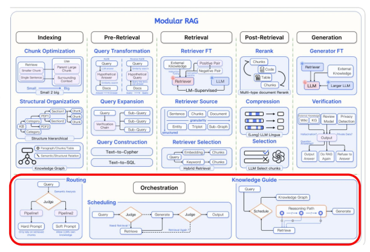

#### RAG Trend

- 구현 기법들 외에도 새롭게 등장한 개념인 Agentic RAG, GraphRAG 등이 존재

- Agentic RAG는 LangGraph 같은 도구와 함께 사용되며 AI Agent 구현에 사용되는 RAG 기법

- Agent RAG는 가지고 있는 KB에만 의존하는게 아니라 Agent가 검색이나 코드 실행 등의 추가적인 여러 작업을 통해서 RAG를 능동적으로 수행할 수 있음

- Agent의 System Prompt가 상당히 중요하며, System Prompt의 디자인이 큰 틀의 instruction으로 활용됨

#### Agentic RAG

- Agent는 실행되고 있는 workflow를 state로 관리하여, 어떤 작업을 이후에 실행해야하는지 관리

- 코드 실행이 필요한 입력이 들어온 경우 code 실행이 가능한 editor에 미리 정해둔 template code를 싥행하는 등의 사전에 정의된 여러 작업을 실행

- 해당 작업들이 완료되면 해당 state를 마무리하고 다음 state로 진행

- 이 과정을 모두 그래프로 관리

  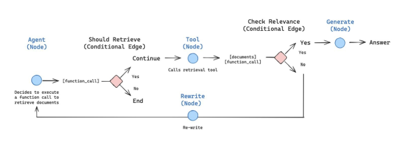

#### GraphRAG

- 기존의 RAG 기법들도 모두 Knowledge Graph(KG)를 활용하는 프로세스가 있듯, KG를 사용하면 reasoning 성능이 개선됨

- 이를 적극적으로 사용해서 Microsoft에선 GraphRAG라는 새로운 기법들 제안

- RAG의 프로세스에 메인이 되는 데이터가 Graph가 되며 RAG에서 Retrieve되는 대상이 텍스트 뿐만 아니라, 정의되어 있는 Graph도 사용

- Graph의 정의가 잘 되어 있다면 LLM만 단독으로 사용할 때보다 훨씬 효율적인 inference 처리가 가능

  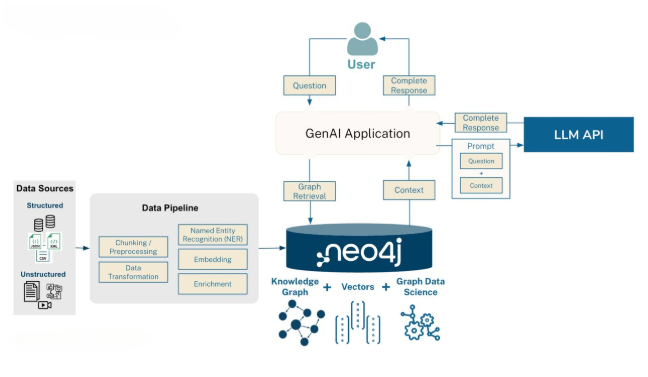

#### SUMMARY

- **Naive RAG** : 사용자 쿼리와 지식의 유사성을 비교하여 정보를 검색하는 기본적인 방법

- **Advanced RAG** : 쿼리 변환, 라우팅, 복합 검색, 재정렬 등의 기법을 통해 검색 및 생성 성능을 향상시킨 고급 방법

- **Modular RAG** : 시스템을 모듈화하여 각 구성 요소를 유연하게 교체 및 조합할 수 있도록 설계된 방법

- **Agentic RAG** : AI Agent를 활용하여 능동적으로 작업을 수행하고, 시스템 프롬프트와 워크플로를 통해 동적인 지식 검색을 가능하게 하는 방법

- **Graph RAG** : 지식 그래프를 활용하여 추론의 효율성과 정확성을 극대화한 RAG 기법
