# 2024년 10월 10일(목) 수업 내용 정리 - SQL

- Database

- Relational Database

  - RDMBS

- Single Table Queries

  - Querying data
  - Sorting data
  - Filtering data
  - Grouping data

- Managing Tables

  - Create a table
  - Modifying table fields
  - Delete a table

- Modifying Data

  - Insert data
  - Update data
  - Delete data

- Multi table queries

  - Join
  - Joining tables

## Database

- 데이터베이스

  - 체계적인 데이터 모음

- 데이터

  - 저장이나 처리에 효율적인 형태로 변환된 정보

- 증가하는 데이터 사용량

      - 배달의 민족 국낸 주문 건수 6억 8천만 건(2020)

      - 구독자 2억 3840만명이 1000억 시간 넷플릭스 시청(2023 1~6월)

      - 전세계 모든 데이터의 약 90%는 2015년 이후 생산된 것(IBM)

- 데이터 센터의 성장

      - 네이버 - 제2데이터센터에 6500억 투자(2020)

      - 카카오 - 제1데이터센터와 제2데이터센터에 1.5조 투자(2022)

      - 전 세계 데이터 센터 시장 2022년부터 2026년까지 연평균 20% 이상 성장 예정

#### 데이터를 저장하고 잘 관리하여 활용할 수 있는 기술이 중요해짐

  - 우리가 알고 있는 데이터 저장 방식은 어떤 것이 있을까?

- 기존의 데이터 저장 방식

      1. 파일(File) 이용

      2. 스프레드 시트(Spreadsheet) 이용

1. 파일을 이용한 데이터 관리

  - 어디에서나 쉽게 사용 가능

  - 데이터를 구조적으로 관리하기 어려움

    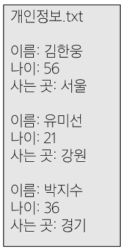

2. 스프레드 시트를 이용한 데이터 관리

  - 테이블의 열과 행을 사용해데이터를 구조적으로 관리 가능

    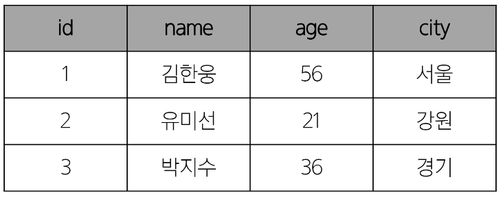

- 스프레드 시트의 한계

  - 크기

    - 일반적으로 약 100만 행까지만 저장가능

  - 보안

    - 단순히 파일이나 링크 소유 여부에 따른 단순한 접근 권한 기능 제공

  - 정확성

    - 만약 공식적으로 "강원"의 지명이 "강언"으로 바뀌었다고 가정한다면?

    - 이 변경으로 인해 테이블 모든 위치에서 해당 값을 업데이트 해야 함

    - 찾기 및 바꾸기 기능을 사용해 바꿀 수 있지만 만약 데이터가 여러 시트에 분산되어 있다면 변경에 누락이 생기거나 추가 문제가 발생할 수 있음

      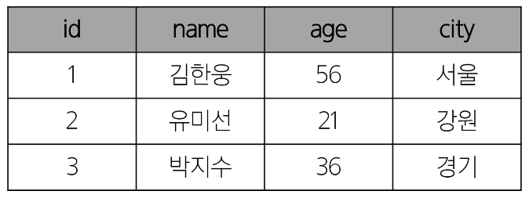

- 데이터베이스 역할

  - 데이터를 저장하고 조작(CRUD)

## Relational Database

- 데이터베이스 역할

  - 데이터를 **저장(구조적 저장)** 하고 조작(CRUD)

- 관계형 데이터베이스

  - 데이터 간에 **관계**가 있는 데이터 항목들의 모음

- 관계형 데이터베이스

  - 테이블, 행, 열의 정보를 구조화하는 방식

  - **서로 관련된 데이터 포인터를 저장**하고 이에 대한 **액세스**를 제공

    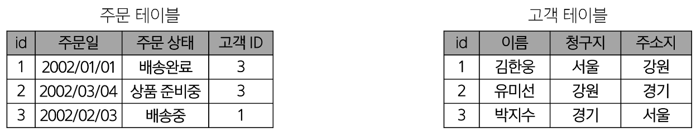

    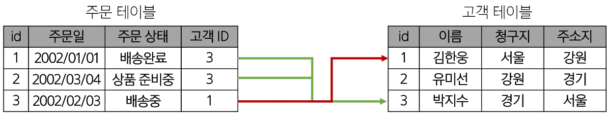

- 관계

  - 여러 테이블 간의 (논리적) 연결

- 관계로 할 수 있는 것

  - 이 관계로 인해 두 테이블을 사용하여 데이터를 다양한 형식으로 조회할 수 있음

    - 특정 날짜에 구매한 모든 고객 조회

    - 지난 달에 배송일이 지연된 고객 조회 등

      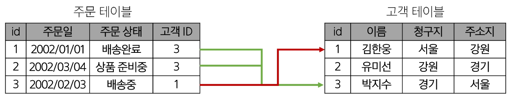

- 관계형 데이터베이스 예시1

  - 다음과 같이 고객 데이터가 테이블에 저장되어 있다고 가정

  - 고객 데이터 간 비교를 위해서는 어떤 값을 활용해야 할까?

    - 이름? 주소? 만약 동명이인이나 같은 주소지가 있다면?

      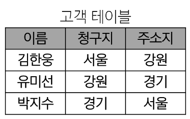

    - 각 데이터에 고유한 식별 값을 부여하기 **(기본 키, Primary Key)**

      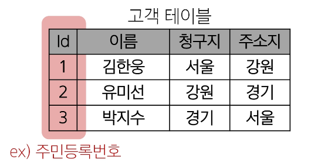

- 관계형 데이터베이스 예시2

  - 다음과 같이 각 고객이 주문한 주문데이터가 테이블에 저장되어 있다고 가정

  - 누가 어떤 주문을 했는지 어떻게 식별할 수 있을까?

    - 고객 이름? 마찬가지로 동명이인이 있다면?

      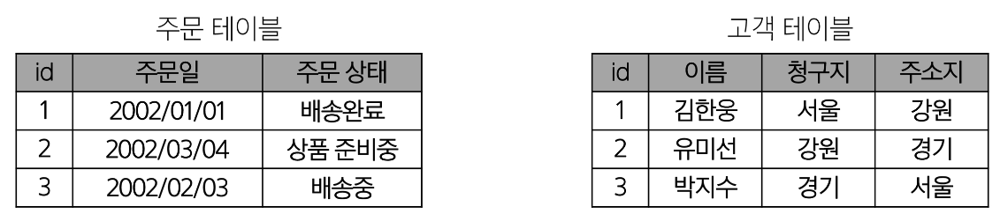

    - 주문 정보에 고객의 고유한 식별 값을 저장하기 **(외래 키, Foreign Key)**

      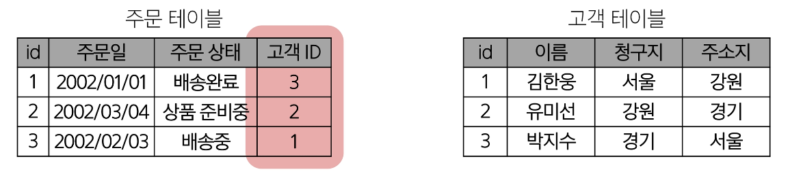

- 관계형 데이터베이스 관련 키워드

  1. Table (aka Relation)

    - 데이터를 기록하는 곳

      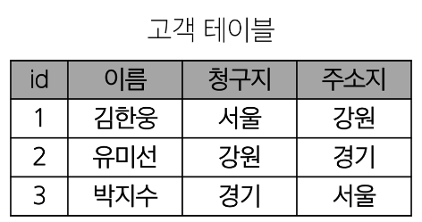

  2. Field (aka Column, Attribute)

    - 각 필드에는 고유한 데이터 형식(타입)이 지정됨

      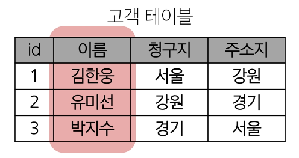

  3. Record (aka Row, Tuple)

    - 각 레코드에는 구체적인 데이터 값이 저장됨

      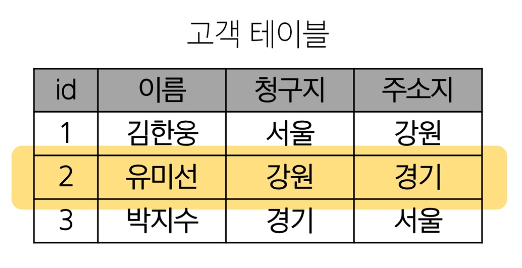

  4. Database (aka Schema)

    - 테이블의 집합

      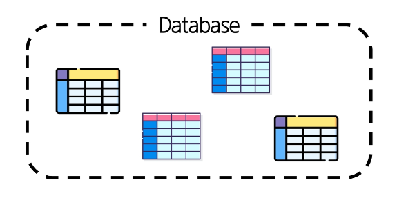

### RDMBS

## Single Table Queries
### Querying data
### Sorting data
### Filtering data
### Grouping data

## Managing Tables
### Create a table
### Modifying table fields
### Delete a table

## Modifying Data
### Insert data
### Update data
### Delete data

## Multi table queries
### Join
### Joining tables