# 2024년 10월 11일(금) 수업 내용 정리 - Many to one relationship 2

- Many to one relationships 2

- Article & User

  - 모델 관계 설정
  - 게시글 CREATE
  - 게시글 READ
  - 게시글 UPDATE
  - 게시글 DELETE

- Comment & User

  - 모델 관계 설정
  - 댓글 CREATE
  - 댓글 READ
  - 댓글 DELETE

- View decorators

  - Allowed HTTP methods

- ERD

  - ERD 구성 요소
  - ERD 제작 사이트

- 참고

  - 추가 기능 구현

## Many to one relationships 2

- User와 다른 모델 간의 모델 관계 설정

      1. User & Article

      2. User & Comment

- Article(N) - User(1)

  - 0개 이상의 게시글은 1명의 회원에 의해 작성 될 수 있다.

- Comment(N) - User(1)

  - 0개 이상의 댓글은 1명의 회원에 의해 작성 될 수 있다.

## Article & User

### 모델 관계 설정

- Article - User 모델 관계 설정

  - User 외래 키 정의

    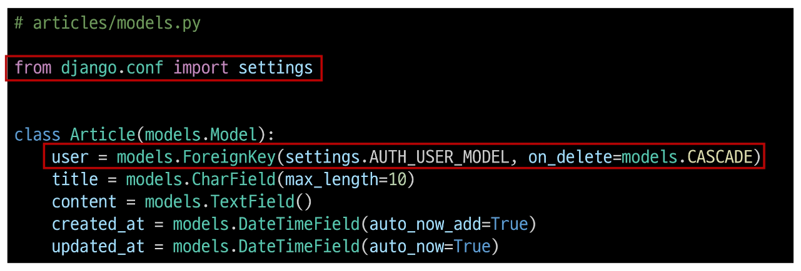

- User 모델을 참조하는 2가지 방법

  - django 프로젝트 '내부적인 구동 순서'와 '반환 값'에 따른 이유

  - 기억해야 할 것은 **User 모델은 직접 참조하지 않는다는 것**

    ||get_user_model()|settings.AUTH_USER_MODEL|
    |:--:|:--:|:--:|
    |반환 값|User Object (객체)|'accounts.User' (문자열)|
    |사용 위치|**models.py가 아닌** **다른 모든 위치**|**models.py**|
     

- Migration

  - 기존에 테이블이 있는 상황에서 필드를 추가 하려하기 때문에 발생하는 과정

  - 기본적으로 모든 필드에는 NOT NULL 제약조건이 있기 때문에 데이터가 없이는 새로운 필드가 추가되지 못함

  - '1'을 입력하고 Enter 진행 (다음 화면에서 직접 기본 값 입력)

    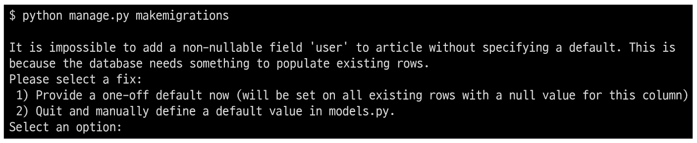

  - 추가하는 외래 키 필드에 어떤 데이터를 넣을 것인지 직접 입력해야 함

  - 마찬가지로 '1'을 입력하고 Enter 진행

  - 기존에 작성된 게시글이 있다면 모두 1번 회원이 작성한 것으로 처리됨

    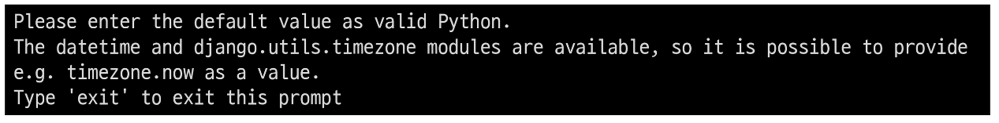

  - migrations 파일 생성 후 migrate 진행

    

  - articles_article 테이블에 user_id 필드 생성 확인

    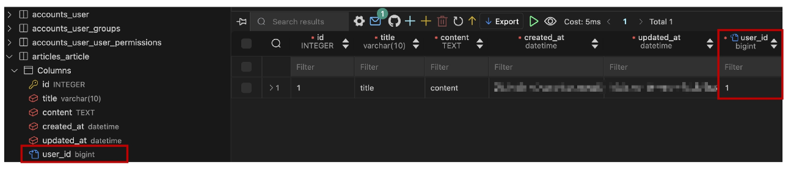

    

### 게시글 CREATE

- 게시글 CREATE

  - 기존 ArticleForm 출력 변화 확인

  - User 모델에 대한 외래 키 데이터 입력을 위해 불필요한 input이 출력됨

    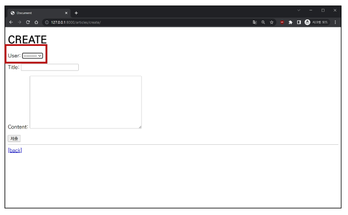

  - ArticleForm 출력 필드 수정

    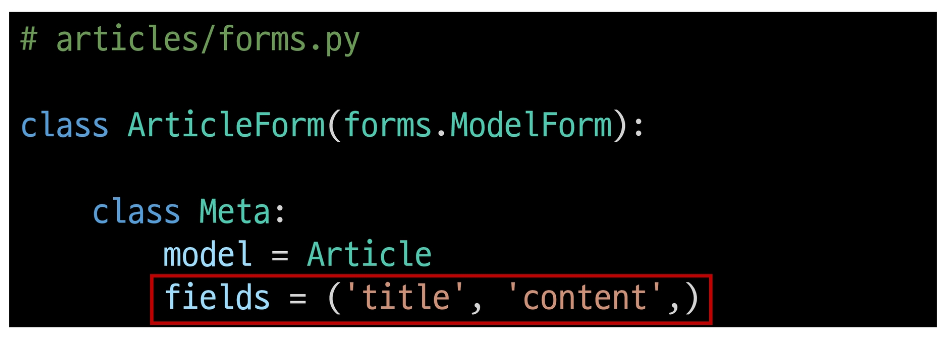

  - 게시글 작성 시 에러 발생

  - user_id 필드 데이터가 누락되었기 때문

    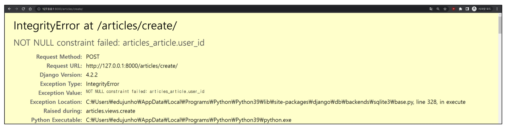

  - 게시글 작성 시 작성자 정보가 함께 저장될 수 있도록 save의 commit 옵션 활용

    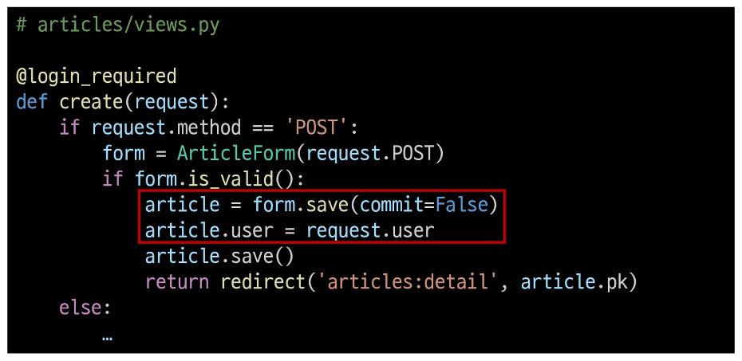

  - 게시글 작성 후 테이블 확인

    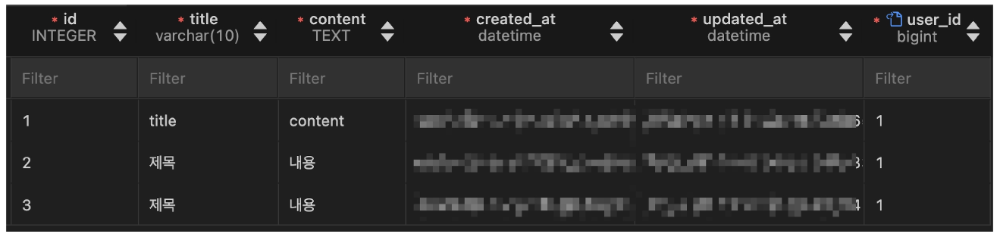

### 게시글 READ

- 게시글 READ

  - 각 게시글의 작성자 이름 출력

    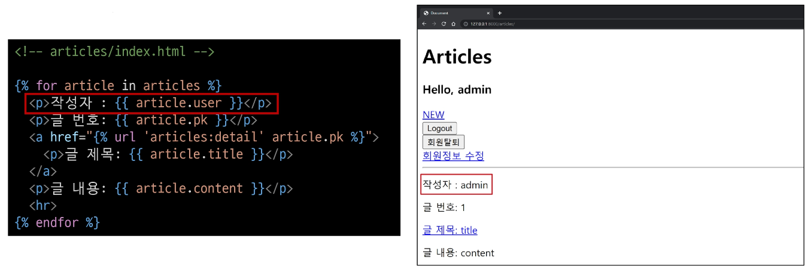

    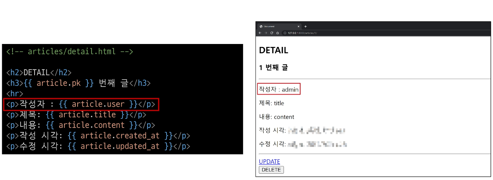

### 게시글 UPDATE

- 게시글 UPDATE

  - 게시글 수정 요청 사용자와 게시글 작성 사용자를 비교하여 본인의 게시글만 수정 할 수 있도록 하기

    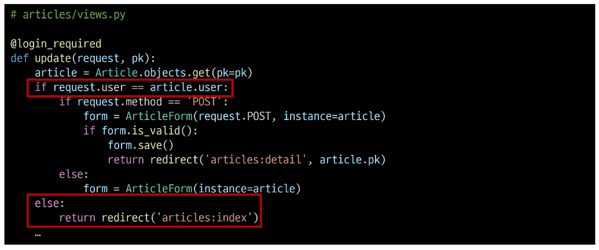

  - 해당 게시글의 작성자가 아니라면, 수정/삭제 버튼을 출력하지 않도록 하기

    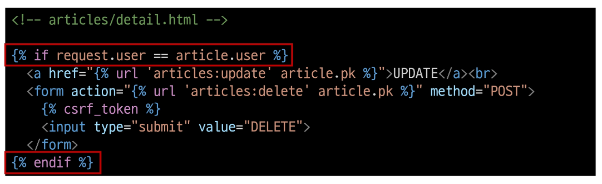

### 게시글 DELETE

- 게시글 DELETE

  - 삭제를 요청하려는 사람과 게시글을 작성한 사람을 비교하여 본인의 게시글만 삭제할 수 있도록 하기

    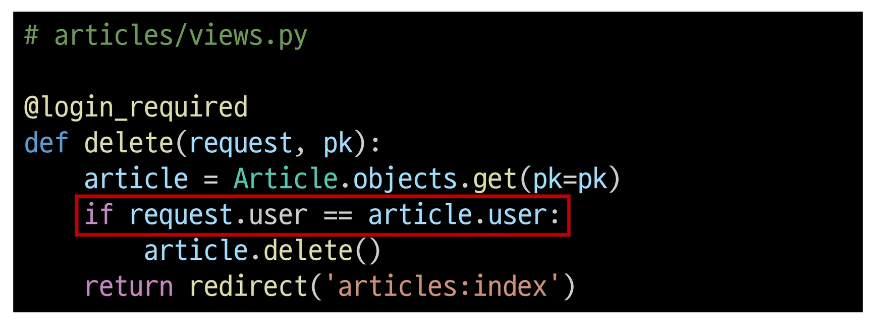

## Comment & User

### 모델 관계 설정

- Comment - User 모델 관계 설정

  - User 외래 키 정의

    

- Migration

  - 이전에 Article와 User 모델 관계 설정 때와 동일한 상황

  - 기존 Comment 테이블에 새로운 필드가 빈 값으로 추가 될 수 없기 때문에 기본 값 설정 과정이 필요

    

  - Migration 후 articles_comment 테이블에 user_id 필드 확인

    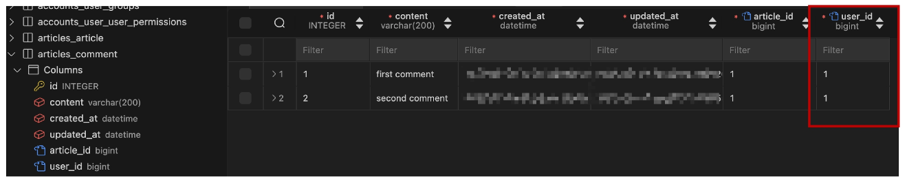

### 댓글 CREATE

- 댓글 CREATE

  - 댓글 작성 시 이전에 게시글 작성 할 때와 동일한 에러 발생

  - 댓글의 user_id 필드 데이터가 누락되었기 때문

    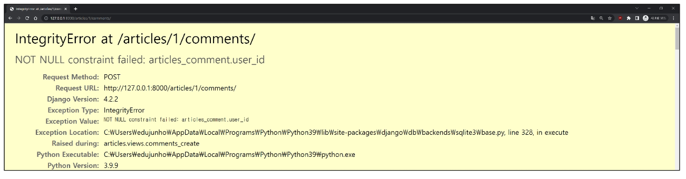

  - 댓글 작성 시 작성자 정보가 함께 저장할 수 있도록 작성

    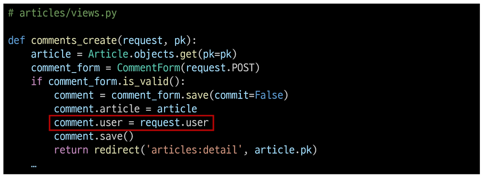

  - 댓글 작성 후 테이블 확인

    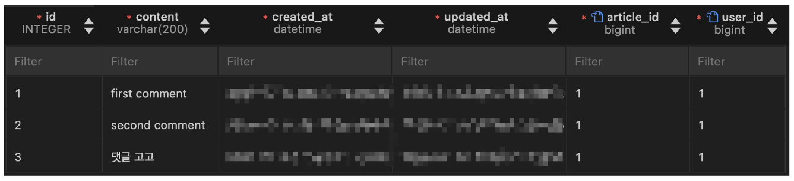

### 댓글 READ

- 댓글 READ

  - 댓글 출력 시 댓글 작성자와 함께 출력

    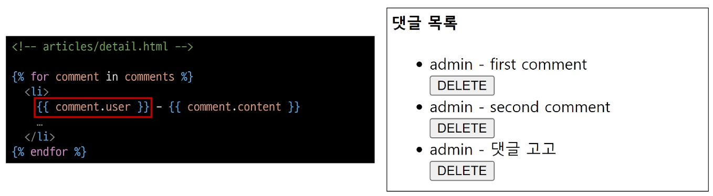

### 댓글 DELETE

- 댓글 DELETE

  - 댓글 삭제 요청 사용자와 댓글 작성 사용자를 비교하여 본인의 댓글만 삭제할 수 있도록 하기

    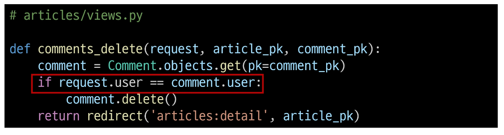

  - 해당 댓글의 작성자가 아니라면, 댓글 삭제 버튼을 출력하지 않도록 함

    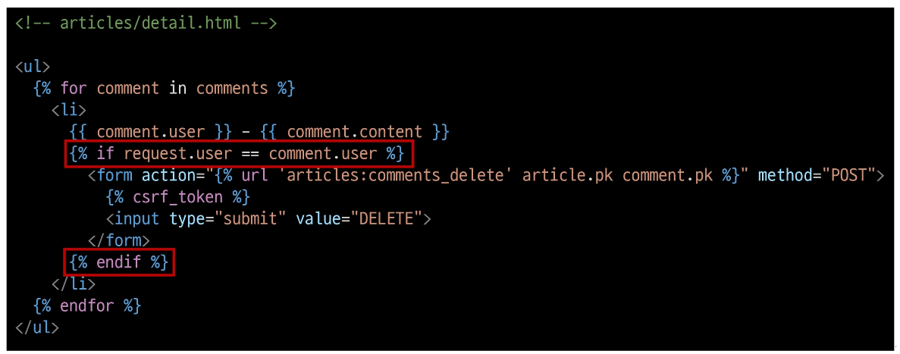

## View decorators

- View decorators

      - View 함수의 동작을 수정하거나 추가 기능을 제공하는 데 사용되는 Python 데코레이터

      - 코드의 재사용성을 높이고 뷰 로직을 간결하게 유지

- View decorators 종류

      - Allowed HTTP methods

      - Conditional view processing

      - GZip Compression

      - ...

### Allowed HTTP methods

- Allowed HTTP methods

  - 특정 HTTP method로만 View 함수에 접근할 수 있도록 제한하는 데코레이터

- 주요 Allowed HTTP methods

      1. require_http_methods(["METHOD1", "METHODS2", ...])

        - 지정된 HTTP method만 허용

      2. require_safe()

        - GET과 HEAD method만 허용

      3. require_POST()

        - POST method만 허용

- require_http_methods()

  - 지정된 HTTP method만 허용

    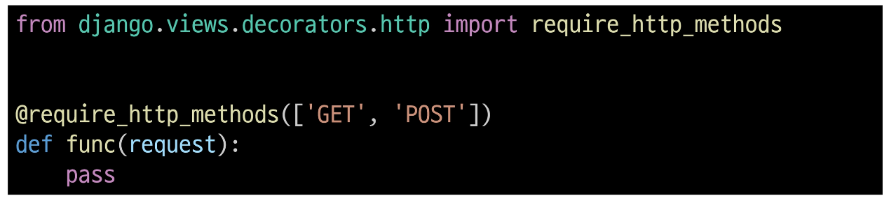

- require_safe()

  - GET과 HEAD method만 허용

    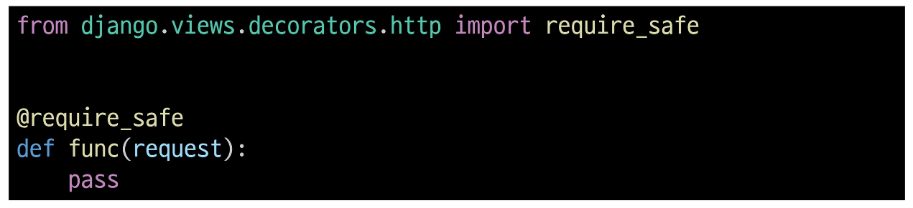

- require_POST()

  - POST method만 허용

    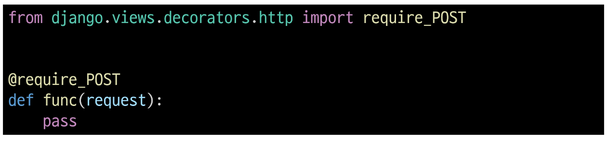

- Allowed HTTP methods 주요 특징

      - 지정되지 않은 HTTP method로 요청이 들어오면
        HtttpResponseNotAllowed (405)를 반환

      - 대문자로 HTTP method를 지정

- require_GET 대신 require_safe를 권장하는 주요 이유

      - 웹 표준 준수

        - GET과 HEAD는 "안전한(safe)" 메소드로 간주됨

      - 호환성

        - 일부 소프트웨어는 HEAD 요청에 의존

      ⇨ 웹 표준을 준수하고, 더 넓은 범위의 클라이언트와 호환되며,
        안전한 HTTP 메소드만을 허용하는 view 함수를 구현할 수 있음

## ERD

- ERD

      - "Entity-Relationship Diagram"

      - 데이터베이스의 구조를 시각적으로 표현하는 도구

      - Entity(개체), 속성, 그리고 엔티티 간의 관계를 그래픽 형태로 나타내어
        시스템의 논리적 구조를 모델링하는 다이어그램

  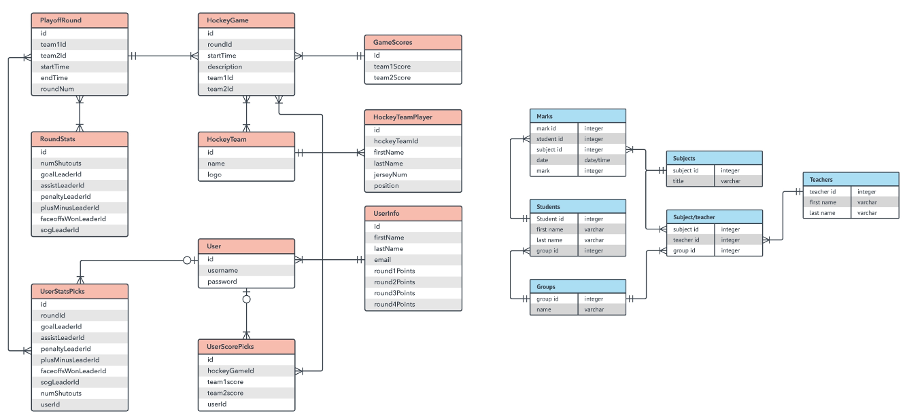

### ERD 구성 요소

- ERD의 구성 요소

      1. 엔티티(Entity)

        - 데이터베이스에 저장되는 객체나 개념

        - ex) 고객, 주문, 제품

      2. 속성(Attribute)

        - 엔티티의 특성이나 성질

        - ex) 고객(이름, 주소, 전화번호)

      3. 관계(Relationship)

        - 엔티티 간의 연관성

        - ex) 고객이 '주문'한 제품

- 개체와 속성

  - 개체 : 회원(User)

  - 속성 : 회원번호(id), 이름(name), 주소(address) 등

    - 개체가 지닌 속성 및 속성의 데이터 타입

      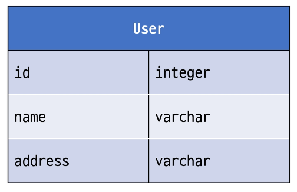

- 관계

  - 관계 : 회원과 댓글 간의 관계

    - 회원이 "작성"한 댓글

      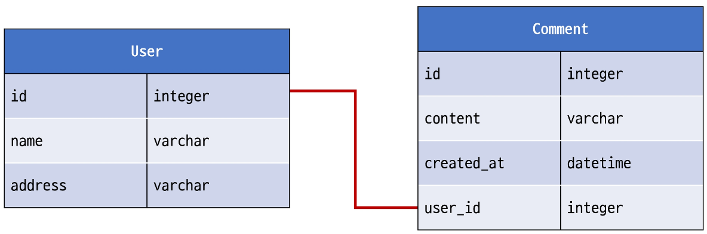

- Cardinality

  - 한 엔티티와 다른 엔티티 간의 수적 관계를 나타내는 표현

  - 주요 유형

    1. 일대일(one-to-one, 1:1)

    2. 다대일(many-to-one, N:1)

    3. 다대다(many-to-many, M:N)

- Cardinality 표현

  - 선의 끝부분에 표시되면 일반적으로 숫자나 기호(까마귀 발)로 표현됨

    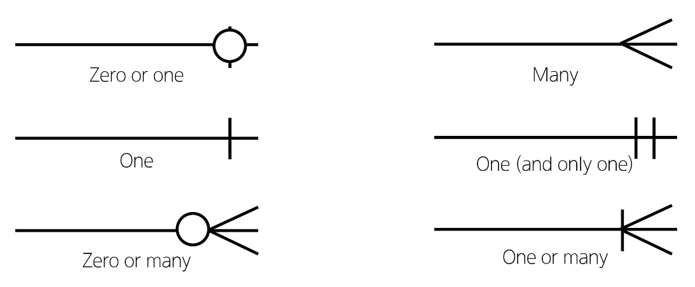

- Cardinallity 적용

  - 회원은 여러 댓글을 작성한다.

  - 각 댓글은 하나의 회원만 존재한다.

    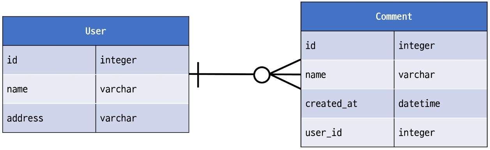

- ERD의 중요성

      - 데이터베이스 설계의 핵심 도구

      - 시각적 모델링으로 효과적인 의사소통 지원

      - 실제 시스템 개발 전 데이터 구조 최적화에 중요

### ERD 제작 사이트

- 무료 ERD 제작 사이트

      - Draw.io

        - 별도의 회원가입 없이 바로 사용 가능

        - 다양한 다이어그램 템플릿 제공

        - https://app.diagrams.net/

      - ERDCloud

        - 실시간 협업 기능 지원

        - https://www.erdcloud.com/

## 참고

### 추가 기능 구현

- 인증된 사용자만 댓글 작성 및 삭제

  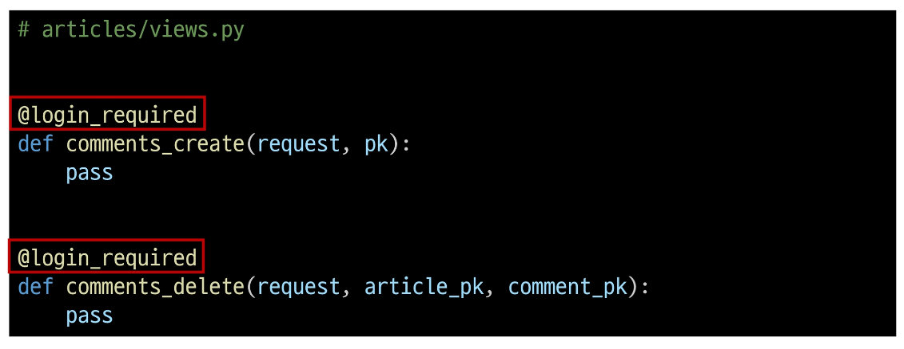