# 2024년 10월 14일(월) 수업 내용 정리 - Many to many relationships 1

- Many to many relationships

  - N:1의 한계
  - 중개 모델
  - ManyToManyField
  - 'through' argument

- ManyToManyField

- 좋아요 기능 구현

  - 모델 관계 설정
  - 기능 구현

## Many to many relationships

- Many to many relationships(N:M or M:N)

  - 한 테이블의 0개 이상의 레코드가 다른 테이블의 0개 이상의 레코드와 관련된 경우

  - **양 쪽 모두에서 N:1 관계를 가짐**

- M:N 관계의 역할과 필요성 이해하기

      - '병원 진료 시스템 모델 관계'를 만들며 M:N 관계의 역할과 필요성 이해하기
      
      - 환자와 의사 2개의 모델을 사용하여 모델 구조 구상하기

      ⇨ 제공된 '99-mtn-practice' 프로젝트를 기반으로 진행

### N:1의 한계

- 의사와 환자 간 모델 관계 설정

  - 한 명의 의사에게 여러 환자가 예약할 수 있도록 설계

    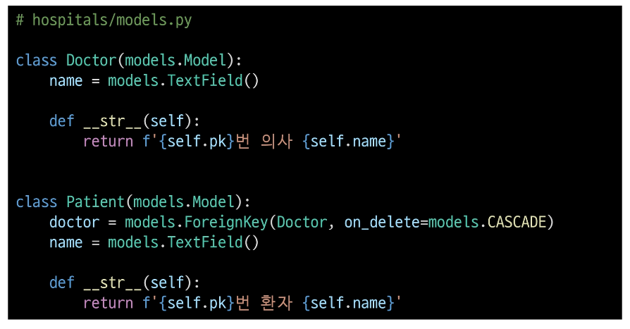

- 의사와 환자 데이터 생성

  - 2명의 의사와 환자를 생성하고 환자는 서로 다른 의사에게 예약

    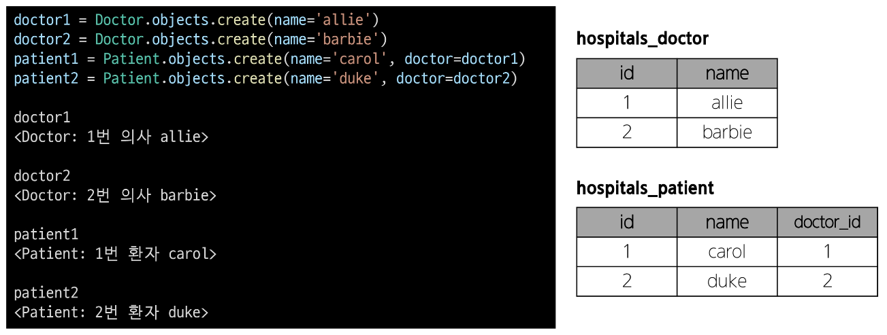

- N:1의 한계 상황

  - 1번 환자(carol)가 두 의사 모두에게 진료를 받고자 한다면 환자 테이블에 1번 환자 데이터가 중복으로 입력될 수 밖에 없음

    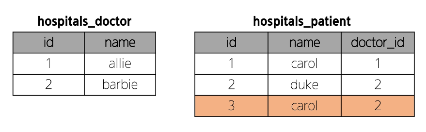

  - 동시에 예약을 남길 수는 없을까?

    

      - 동일한 환자지만 다른 의사에게도 진료 받기 위해 예약하기 위해서는
        객체를 하나 더 만들어 진행해야 함

      - 외래 키 컬럼에 '1, 2' 형태로 저장하는 것은 DB 타입 문제로 불가능

      ⇨ "예약 테이블을 따로 만들자"

### 중개 모델

1. 예약 모델 생성

  - 환자 모델의 외래 키를 삭제하고 별도의 예약 모델을 새로 생성

  - 예약 모델은 의사와 환자에 각각 N:1 관계를 가짐

    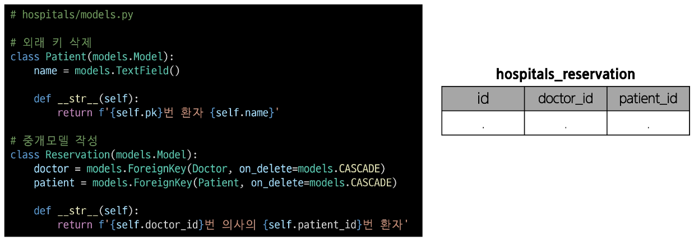

2. 예약 데이터 생성

  - 데이터베이스 초기화 후 Migration 진행 및 shell_plus 실행

  - 의사와 환자 생성 후 예약 만들기

    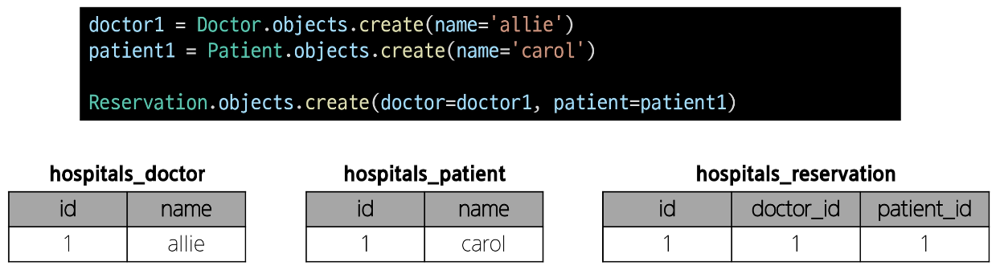

3. 예약 정보 조회

  - 의사와 환자가 예약 모델을 통해 각각 본인의 진료 내역 확인

    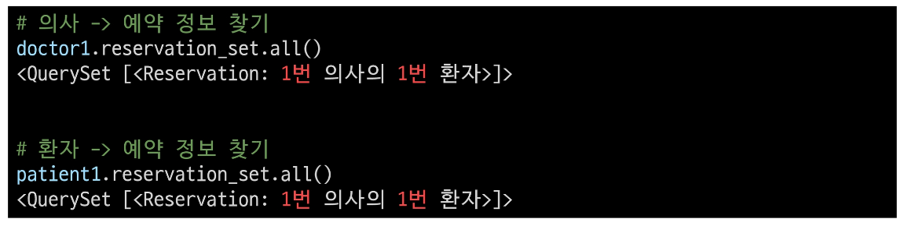

4. 추가 예약 생성

  - 1번 의사에게 새로운 환자 예약 생성

    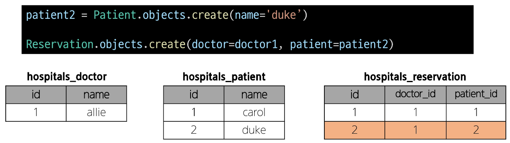

5. 예약 정보 조회

  - 1번 의사의 예약 정보 조회

    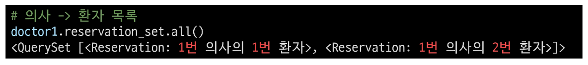

#### Django에서는 'ManyToManyField'로 중개 모델을 자동으로 생성

### ManyToMany Field

- ManyToManyField()

  - M:N 관계 설정 모델 필드

- Django ManyToManyField

  - 환자 모델에 ManyToManyField 작성

    - 의사 모델에 작성해도 상관 없으며 참조/역참조 관계만 잘 기억할 것

    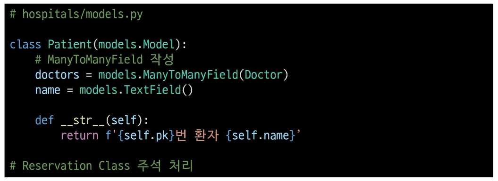

  - 데이터베이스 초기화 후 Migration 진행 및 shell_plus 실행

  - 생성된 중개 테이블 hospitals_patient_doctors 확인

    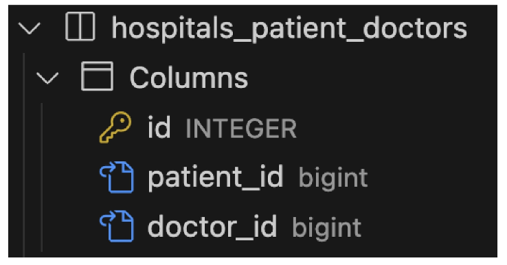

  - 의사 1명과 환자 2명 생성

    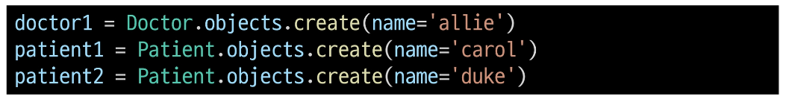

  - 예약 생성 (환자가 예약)

    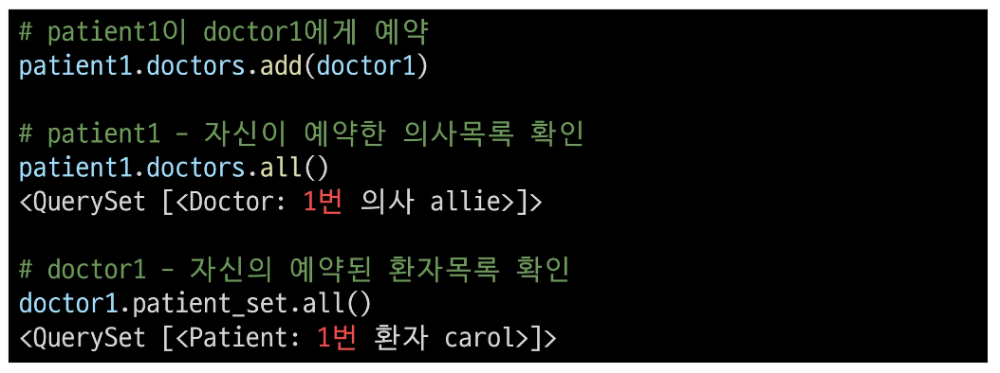

  - 예약 생성 (의사가 예약)

    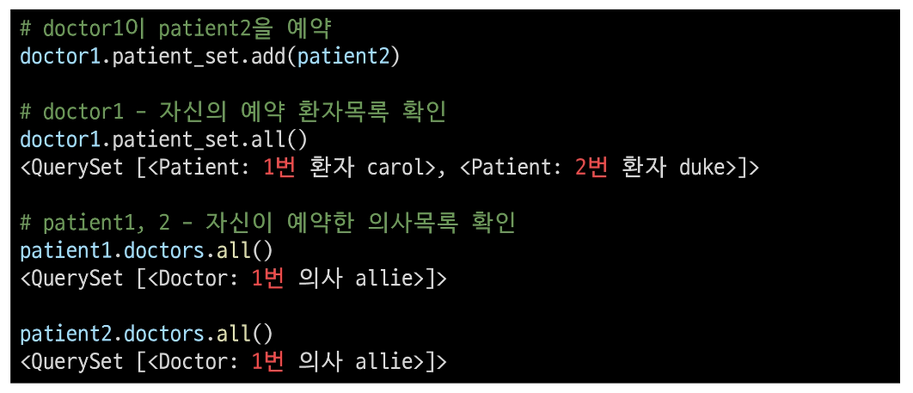

  - 중개 테이블에서 예약 현황 확인

    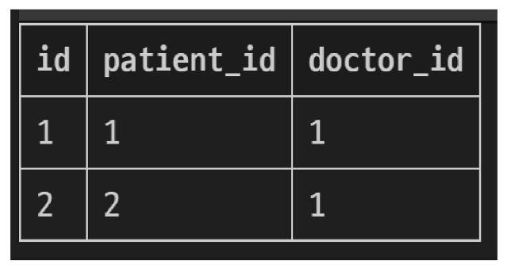

  - 예약 취소하기 (삭제)

  - 이전에는 Reservation을 찾아서 지워야 했다면, 이제는 .remove()로 삭제 가능

    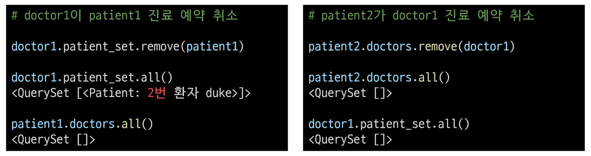

#### 만약 예약 정보에 병의 증상, 예약일 등 추가 정보가 포함되어야 한다면?

### 'through' argument

- 'through' argument
  
  - 중개 테이블에 **'추가 데이터'**를 사용해 M:N 관계를 형성하려는 경우에 사용

- 'through' argument

  - Reservation Class 재작성 및 through 설정

    - 이제는 예약 정보에 "증상"과 "예약일"이라는 추가 데이터가 생김

  - 데이터베이스 초기화 후 Migration 진행 및 shell_plus 실행

  - 의사 1명과 환자 2명 생성

## ManyToManyField

## 좋아요 기능 구현

### 모델 관계 설정

### 기능 구현