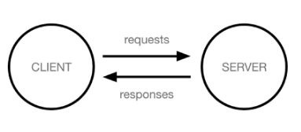
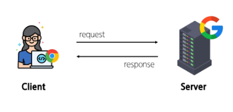

# Intro & Design Pattern

    - Web Application

        - 클라이언트와 서버
        - Frontend & Backend

    - Framework

        - Web Framework
        - Django Framework
        - 가상 환경
        - Django 프로젝트

    - Django Design Pattern

        - Design Pattern
        - Project & App

    - 요청과 응답

        - Django에서의 요청과 응답

    - 참고

        - 가상환경 생성 루틴
        - Django 관련
        - render 함수
        - MTV 디자인 패턴 정리
        - 프레임워크의 규칙 및 설계 철학

## Web Apllication
### 개요
- Web application (web service) 개발
    - 인터넷을 통해 사용자에게 제공되는 소프트웨어 프로그램을 구축하는 과정
    - 다양한 디바이스(모바일, 태블릿, PC 등)에서 웹 브라우저를 통해 접근하고 사용할 수 있음

### 클라이언트와 서버
- 웹의 동작 방식
    - 우리가 컴퓨터 혹은 모바일 기기로 웹 페이지를 보게 될 때까지 무슨 일이 일어날까?

    
    - '클라이언트-서버' 구조

    

- Client(클라이언트)
    - 서비스를 요청하는 주체(웹 사용자의 인터넷이 연결된 장치, 웹 브라우저)

- Server(서버)
    - 클라이언트의 요청에 응답하는 주체(웹 페이지, 앱을 저장하는 컴퓨터)

- 우리가 웹 페이지를 보게 되는 과정

    
    1. 웹 브라우저(클라이언트)에서 'google.com'을 입력 후 엔터
    2. 웹 브라우저는 인터넷에 연결된 전세계 어딘 가에 있는 구글 컴퓨터(서버)에게 '메인 홈페이지.html' 파일을 달라고 요청
    3. 요청을 받은 구글 컴퓨터는 데이터베이스에서 '메인 홈페이지.html' 파일을 찾아 응답
    4. 웹 브라우저는 전달받은 '메인 홈페이지.html' 파일을 사람이 볼 수 있도록 해석해주고 사용자는 구글의 메인 페이지를 보게 됨

### Frontend & Backend
- 웹 개발에서의 Frontend와 Backend
    - Frontend(프론트엔드)
        - 사용자 인터페이스(UI)를 구성하고, 사용자가 애플리케이션과 상호작용할 수 있도록 함
        - HTML, CSS, JavaScript, 프론트엔트 프레임워크 등
    
    - Backend(백엔드)
        - 서버 측에서 동작하며, 클라이언트의 요청에 대한 처리와 데이터베이스와의 상호작용 등을 담당
        - 서버 언어(Python, Java 등) 및 백엔드 프레임워크, 데이터베이스, API, 보안 등

- Frontend와 Backend

## Framework

### Web Framework
- '웹 서비스 개발'에는 무엇이 필요할까?
    - 웹 서비스 개발에 필요한 다양한 기술
        - 로그인/로그아웃, 회원관리, 데이터베이스. 보안 등
    
    - 모든 기능을 직접 개발하기에는 현실적 어려움 존재

    - 현대 웹 개발의 핵심
        - 잘 만들어진 도구를 효과적으로 활용하는 능력

    - "거인의 어깨 위에서 프로그래밍하기"
