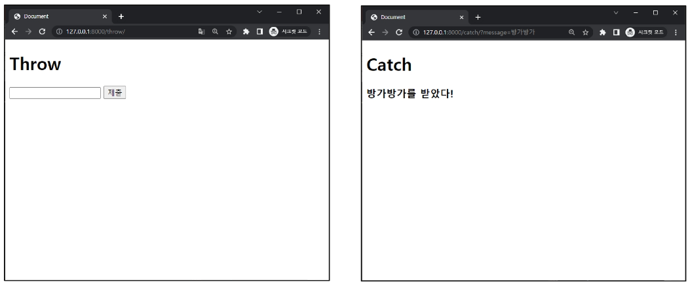
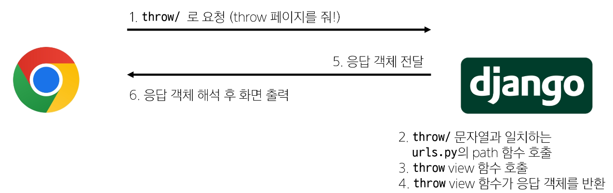

# 2024년 9월 19일(목) 수업 내용 정리 - Template & URLs

- Template System

  - Django Template system
  - Django Template Language

- 템플릿 상속

  - 상속 관련 DTL 태그

- HTML form

  - 요청과 응답
  - form 활용

- Django URLs

  - Variable Routing
  - App과 URL

- URL 이름 지정

  - Naming URL patterns
  - DTL URL tag

- URL 이름 공간

  - app_name 속성

- 참고

  - 추가 템플릿 경로
  - DTL 주의사항
  - Trailing Slahes


## Template System

### Django Template system

- Django Template system : 데이터 **표현**을 제어하면서, **표현**과 관련된 부분을 담당


- HTML의 콘첸츠를 변수 값에 따라 변경하기
  ```HTML
  <!-- articles/index.html -->

  <body>
    <h1>Hello, django!</h1>
  </body>
  ```
  


  


### Django Template Language

- Django Template Language(DTL) : Template에서 조건, 반복, 변수 등의 프로그래밍적 기능을 제공하는 시스템


- DTL Syntax
  1. Variable - 변수
  2. Filters
  3. Tags
  4. Comments - 주석


1. Variable
  - render 함수의 세 번째 인자로 **딕셔너리 데이터**를 사용
  - **딕셔너리 key**에 해당하는 문자열이 template에서 사용 가능한 변수명이 됨
  - dot(',')를 사용하여 변수 속성에 접근할 수 있음

    


2. Filters
  - 표시할 변수를 수정할 때 사용(변수 + '|' + 필터)
  - chained(연결)이 가능하며 일부 필터는 인자를 받기도 함
  - 약 60개의 built-in template filters를 제공
  
    


3. Tags
  - 반복 또는 논리를 수행하여 제어 흐름을 만듦
  - 일부 태그는 시작과 종료 태그가 필요
  - 약 24개의 built-in template tags를 제공

    


4. Comments
  - DTL에서의 주석

    


- DTL 예시

  

  

  

  
  


## 템플릿 상속

- 기본 템플릿 구조의 한계
  - 만약 모든 템플릿에 bootstrap을 적용하려면?
    - 모든 템플릿에 bootstrap CDN을 작성해야 할까?


- 템플릿 상속(Template inheritance)
  1. **페이지의 공통요소를 포함**하고
  2. **하위 템플릿이 재정의 할 수 있는 공간**을 정의하는 기본 'skeleton' 템플릿을 작성하여 상속 구조를 구축


- 상속 구조 만들기
  - skeleton 역할을 하게 되는 상위 템플릿(base.html) 작성
  
    

  - 기존 하위 템플릿의 변화

    


### 상속 관련 DTL 태그

- 'extends' **tage**

  

  - 자식(하위) 템플릿이 부모 템플릿을 확장한다는 것을 알림
    - **반드시 자식 템플릿이 최상단에 작성되어야 함(2개 이상 사용 불가)**


- 'block' **tag**

  

  - 하위 템플릿에서 재정의 할 수 있는 블록을 정의(상위 템플릿에 작성하며 하위 템플릿이 작성할 수 있는 공간을 지정하는 것)


- 하위 템플릿이 재정의 할 수 있는 block 영역

  


## HTML form

### 요청과 응답

- 데이터를 보내고 가져오기(Sending and Retrieving form data)
  - HTML **'form'** element를 통해 사용자와 애플리케이션 간의 상호작용 이해하기

  - 사용자 입력이 들어가는 부분은 form 태그를 이용한다.


- HTML 'form'은 HTTP 요청을 서버에 보내는 가장 편리한 방법

  

  


- 실제 웹 서비스에서 form이 사용되는 예시
  - 네이버 & 구글의 로그인 화면에서 사용하는 HTML form 요소

    


- 'form' **element**
  - 사용자로부터 할당된 데이터를 서버로 전송
    - 웹에서 사용자 정보를 입력하는 여러 방식(text, password, checkbox 등)을 제공

    - input name : 사용자 입력 데이터의 key를 사용


- fake Naver 실습

  

  - input에 hello를 입력하고 제출 버튼을 누른 후 브라우저의 URL 변화 확인

    

  - 실제 Naver에서 검색 후 URL 확인

    

    


- 'action' & 'method'(form의 핵심 속성 2가지)
  - "데이터를 어디(**action**)로 어떤 방식(**method**)으로 요청할지"


- action과 method

  - action
    - 입력 데이터가 전송될 URL을 지정(목적지, URL의 ? 앞부분)
    - 만약 이 속성을 지정하지 않으면 데이터는 현재 form이 있는 페이지의 URL로 보내짐

  - method
    - 데이터를 어떤 방식으로 보낼 것인지 정의
    - 데이터의 HTTP request methods (GET, POST)를 지정
      - GET : 기본값(써주는 것을 권장)
      - POST : 로그인(URL에 노출되지 않도록)


- 'input' **element**
  - 사용자의 데이터를 입력 받을 수 있는 요소(type 속성 값에 따라 다양한 유형의 입력 데이터를 받음)
    - 핵심 속성 - 'name'

  
- 'name' **attribute**
  - input의 핵심 속성
  - 사용자가 입력한 데이터에 붙이는 이름(key)
  - 데이터를 제출했을 때 서버는 name 속성에 설정된 값을 통해서만 사용자가 입력한 데이터에 접근할 수 있음


- Query String Parameters

  - 사용자의 입력 데이터를 URL 주소에 파라미터를 통해 서버로 보내는 방법

  - 문자열은 앰퍼샌드('&')로 연결된 key=value 쌍으로 구성되며, 기본 URL과는 **물음표('?')로 구분됨**
- 
  - 예시
    


### form 활용

- 사용자 입력 데이터를 받아 그대로 출력하는 서버 만들기
  - view 함수는 몇 개가 필요할까?

    


1. throw 로직 작성

  


2. catch 로직 작성
  - throw 페이지에서 요청한 사용자 입력 데이터는 어떻게 가져와야 할까?

    


  - HTTP request 객체
    - form으로 전송한 데이터 뿐만 아니라 Django로 들어오는 모든 요청 관련 데이터가 담겨 있음(view 함수의 첫번째 인자로 전달됨)


  - request 객체 살펴보기

    


  - request 객체에서 form 데이터 추출

    


3. catch 로직 마무리

  


- throw - catch 간 요청과 응답 정리

  

  


## Django URLs

- 요청과 응답에서 Django URLs의 역할

  


- URL dispatcher(운항 관리자, 분배기)
  - URL 패턴을 정의하고 해당 패턴이 일치하는 요청을 처리할 view 함수를 연결(매핑)


### Variable Routing

- 현재 URL 관리의 문제점
  - 템플릿의 많은 부분이 중복되고, URL의 일부만 변경되는 상황이라면 계속해서 비슷한 URL과 템플릿을 작성해 나가야 할까?

    


- Variable Routing
  - URL 일부에 변수를 포함시키는 것(변수는 view 함수의 인자로 전달 할 수 있음)


- Variable routing 작성법

  


- Path converters
  - URL 변수의 타입을 지정(str, int 등 5가지 타입 지원)


- Variable routing 실습

  

  


### App과 URL

- App URL mapping
  - 각 앱에 URL을 정의하는 것
    - 프로젝트와 각 앱이 URL을 나누어 관리를 편하게 하기 위함


- 2번째 앱 pages 생성 후 발생할 수 있는 문제
  - view 함수 이름이 같거나 같은 패턴의 URL 주소를 사용하게 되는 경우
  - 아래 코드와 같이 해결해 볼 수 있으나 더 좋은 방법이 필요
  - **"URL을 각자 app에서 관리하자"**
  
    


- 기존 url 구조

  


- 변경된 url 구조

  


- url 구조 변화

  


- include()
  - 프로젝트 내부 앱들의 URL을 참조할 수 있도록 매핑하는 함수
    - URL의 일치하는 부분까지 잘라내고, 남은 문자열 부분은 후속 처리를 위해 include된 URL로 전달


- include 적용
  - 변경된 프로젝트의 urls.py

    


## URL 이름 지정

### Naming URL patterns

- url 구조 변경에 따른 문제점
  - 기존 'articles/' 주소가 'articles/index/'로 변겸됨에 따라 해당 url을 사용하는 모든 위치를 찾아가 변경해야 함
  - **"URL에 이름을 지어주면 이름만 기억하면 되지 않을까?"**

    


- Naming URL patterns
  - URL에 이름을 지정하는 것(path 함수의 name 인자를 정의해서 사용)


- Naming URL patterns 적용
  - path 함수의 name 키워드 인자를 정의

    


- URL 표기 변화
  - url을 작성하는 모든 곳에서 변경(a 태그의 href 속성 값 뿐만 아니라 form의 action 속성 등도 포함)

    


### DTL URL tag

- 'url' **tag**

  

  - 주어진 URL 패턴의 이름과 일치하는 절대 경로 주소를 반환


- url tag 적용 후 브라우저 출력 확인

  


## URL 이름 공간

### app_name 속성

- URL 이름 지정 후 남은 문제
  - articles 앱의 url 이름과 pages 앱의 url 이름이 같은 상황
  - 단순이 이름만으로는 완벽하게 분리할 수 없음
  - **"이름에 성(key)을 붙이자"**

    


- 'app_name' 속성 지정
  - app_name 변수 값 설정

    


- URL tag의 최종 변화
  - 마지막으로 url 태그가 사용하는 모든 곳의 표기 변경하기

    


## 참고

### 추가 템플릿 경로

- 추가 템플릿 경로 지정
  - 템플릿 기본 경로 외 커스텀 경로 추가하기

    

  - 새로운 템플릿 경로 생성

   

  - 각 하위 템플릿에서 extends 경로가 수정됨

    


- BASE_DIR
  - settings에서 경로지정을 편하게 하기 위해 최상단 지점을 지정해 둔 변수

    


### DTL 주의사항

- DTL 주의사항
  - Python처럼 일부 프로그래밍 구조(if, for 등)를 사용할 수 있지만 명칭을 그렇게 설계 했을 뿐이지 **Python 코드로 실행되는 것이 아니며 Python과는 관련 없음**
  - 프로그래밍적 로직이 아니라 표현을 위한 것임을 명심하기
  - 프로그래밍적 로직은 되도록 view 함수에서 작성 및 처리할 것
  - 공식문서를 참고해 다양한 태그와 필터 사용해보기
    - [https://docs.djangoproject.com/en/4.2/ref/templates/builtins/](https://docs.djangoproject.com/en/4.2/ref/templates/builtins/)


### Trailing Slashes

- URL의 Trailing Slashes
  - Django는 URL 끝에 '/'가 없다면 자동으로 붙임
  - "기술적인 측면에서, foo.com/bar와 foo.com/bar/는 서로 다른 URL"
    - 검색 엔진 로봇이나 웹 트래픽 분석 도구에서는 이 두 주소를 서로 다른 페이지로 보기 때문
  - 그래서 Django는 검색 엔진이 혼동하지 않게 하기 위해 무조건 붙이는 것을 선택한 것
  - 그러나 모든 프레임워크가 이렇게 동작하는 것은 아니니 주의


---
1. urls.py 작업
  - 프로젝트 urls.py와 앱 urls.py 따로 작업
  
2. views.py 함수 작업
  - return할 html파일의 함수 작성

3. templates안에 html 파일 생성
  - extends 태그를 통한 상속으로 간단하게 작성 가능
  - 가장 최상단 폴더에 base.html을 만들었다면
    - 프로젝트 settings.py에 존재하는 TEMPLATES 에서 DIRS를 고쳐줘야 base.html 위치를 찾을 수 있음

      ```python
      TEMPLATES = [
      {
        'BACKEND': 'django.template.backends.django.DjangoTemplates',
        # 이제 templates 찾을 때, 여기도 찾도록
        'DIRS': [BASE_DIR/ 'templates'],
        'APP_DIRS': True,
        'OPTIONS': {
            'context_processors': [
                'django.template.context_processors.debug',
                'django.template.context_processors.request',
                'django.contrib.auth.context_processors.auth',
                'django.contrib.messages.context_processors.  messages',
              ],
          },
        },
      ]

      ```