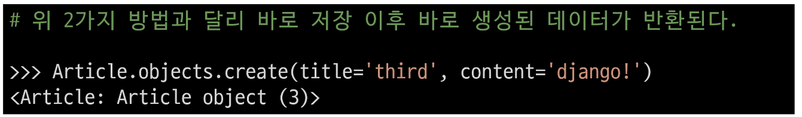
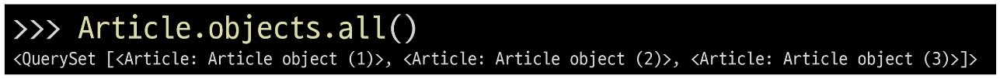
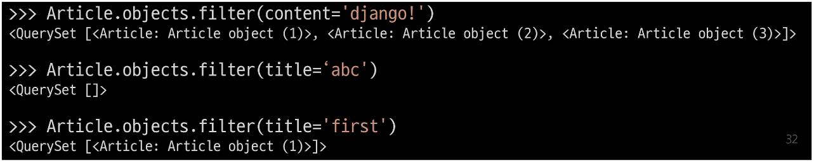
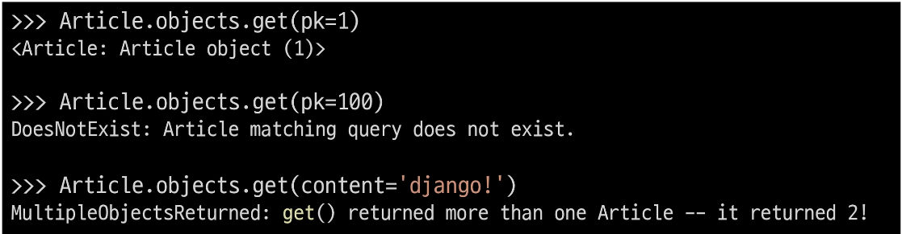
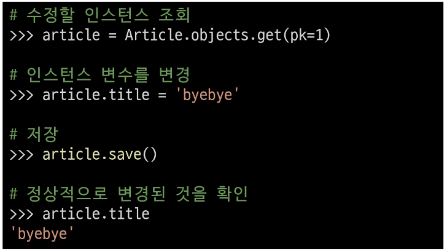
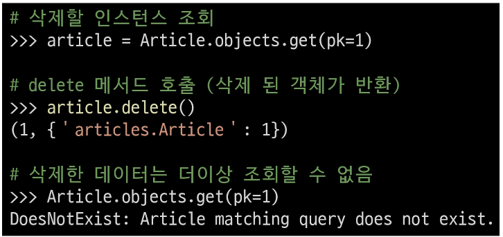
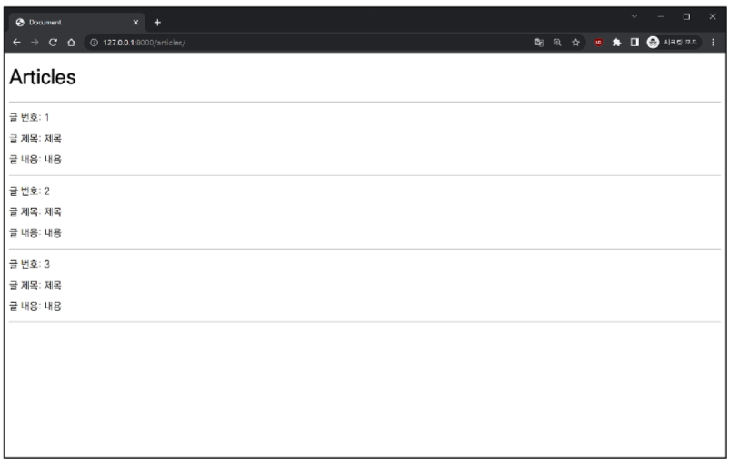
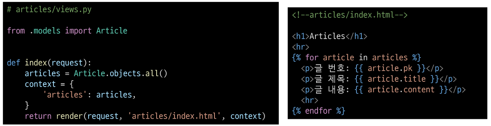
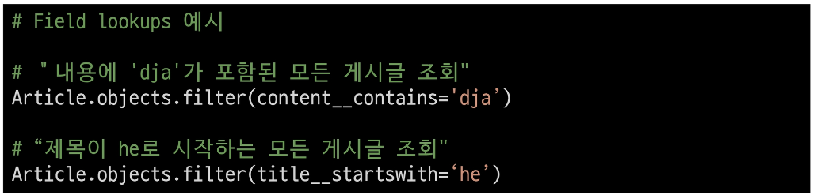

# 2024년 9월 23일(월) 수업 내용 정리 - ORM

- ORM


- QuerySet API


- QuerySet API 실습

  - Create
  - Read
  - Update
  - Delete


- ORM with view

  - 전체 게시글 조회


- 참고

  - Field lookups
  - ORM, QuerySet API를 사용하는 이유


## ORM

- ORM(Object-Relational-Mapping)

  - 객체 지향 프로그래밍 언어를 사용하여 호환되지 않는 유형의 시스템 간에 데이터를 변환하는 기술


- ORM의 역할

  - Django와 DB간에 사용하는 언어가 다르기 때문에 소통 불가

    

  - Django에 내장된 ORM이 중간에서 이를 해석

    


## QuerySet API

- QuerySet API

  - ORM에서 데이터를 검색, 필터링, 정렬 및 그룹화 하는 데 사용하는 도구

    - API를 사용하여 SQL이 아닌 Python 코드로 데이터를 처리

    


- QuerySet API 구문

  


- QuerySet API 구문 동작 예시

  


- Query

      - 데이터베이스에 특정한 데이터를 보여 달라는 요청
      
      - "쿼리문을 작성한다."

        - "원하는 데이터를 얻기 위해 데이터베이스에 요청을 보낼 코드를 작성한다."

      - 파이썬으로 작성한 코드가 ORM에 의해 SQL로 변환되어 데이터베이스에 전달되며, 데이터베이스의 응답 데이터를 ORM이 QuerySet이라는 자료 형태로 변환하여 우리에게 전달


- QuerySet

      - 데이터 베이스에게서 전달 받은 객체 목록(데이터 모음)

        - 순회가 가능한 데이터로써 1개 이상의 데이터를 불러와 사용할 수 있음

      - Django ORM을 통해 만들어진 자료형

      - 단, 데이터베이스가 단일한 객체를 반환할 때는 QuerySet이 아닌 모델(Class)의 인스턴스로 변환됨


- QuerySet API는

  - python의 모델 클래스와 인스턴스를 활용해 DB에 데이터를 저장, 조회, 수정, 삭제하는 것


- CRUD

  - 소프트웨어가 가지는 기본적인 데이터 처리 가능

    |Create|Read|Update|Delete|
    |:--:|:--:|:--:|:--:|
    |저장|조회|갱신|삭제|
    <br>


## QuerySet API 실습

### Create

- QuerySet API 실습 사전 준비

  - 외부 라이브러리 설치 및 설정

    


- Django shell 실행

  


- Django shell

  - Django 환경 안에서 실행되는 python shell

  - 입력하는 QuerySet API 구문이 Django 프로젝트에 영향을 미침


- 데이터 객체를 만드는(생성하는) 3가지 방법

  - 첫번째 방법

    

    

    

  
  - 두번째 방법

    - save 메서드를 호출해야 비로소 DB에 데이터가 저장됨

    - 테이블에 한 행(레코드)이 쓰여진 것

      


  - 세번째 방법

    - QuerySet API 중 create() 메서드 활용

      


- save()

  - 객체를 데이터베이스에 저장하는 인스턴스 메서드


### Read

- 대표적인 조회 메서드

  ```markdown
  - Return new QuerySets

    - all()

    - filter()

  - Do not return QuerySets

    - get()
  ```


- all()

  - 전체 데이터 조회

    


- filter()

  - 주어진 매개변수와 일치하는 객체를 포함하는 QuerySet 반환

    


- get()

  - 주어진 매개변수와 일치하는 객체를 반환

    


- get() 특징

  ```markdown
  - 객체를 찾을 수 없으면 DoesNotExis 예외를 발생시키고, 둘 이상의 객체를 찾으면 MultipleObjectsReturned 예외를 발생시킴

  - 위와 같은 특징을 가지고 있기 때문에 primary key와 같이 고유성(uniqueness)을 보장하는 조회에서 사용해야 함
  ```


### Update

- 데이터 수정

  - 인스턴스 변수를 변경 후 save 메서드 호출

    

### Delete

- 데이터 삭제

  - 삭제하려는 데이터 조회 후 delete 메서드 호출

    


## ORM with view

- Django shell에서 연습했던 QuerySet API를 직접 view 함수에서 사용하기


### 전체 게시글 조회

- 2가지 Read(조회)

  ```markdown
  1. 전체 게시글 조회

  2. 단일 게시글 조회
  ```

- 전체 게시글 조회

  

  


## 참고

### Field lookups

- Field lookups

  ```markdown
  - Query에서 조건을 구성하는 방법

  - QuerySet 메서드 filter(), exclude() 및 get()에 대한 키워드 인자로 지정됨

    
  ```


### ORM, QuerySet API를 사용하는 이유

- ORM, QuerySet API를 사용하는 이유

  ```markdown
  1. 데이터베이스 추상화

    - 개발자는 특정 데이터베이스 시스템에 종속되지 않고 일관된 방식으로 데이터를 다룰 수 있음

  2. 생산성 향상

    - 복잡한 SQL 쿼리를 직접 작성하는 대신 Python 코드로 데이터베이스 작업을 수행할 수 있음

  3. 객체 지향적 접근

    - 데이터베이스 테이블을 Python 객체로 다룰 수 있어 객체 지향 프로그래밍의 이점을 활용할 수 있음
  ```


- QuerySet API 관련 문서

  - [https://docs.djangoproject.com/en/4.2/ref/models/querysets/](https://docs.djangoproject.com/en/4.2/ref/models/querysets/)

  - [https://docs.djangoproject.com/en/4.2/topics/db/queries](https://docs.djangoproject.com/en/4.2/topics/db/queries)